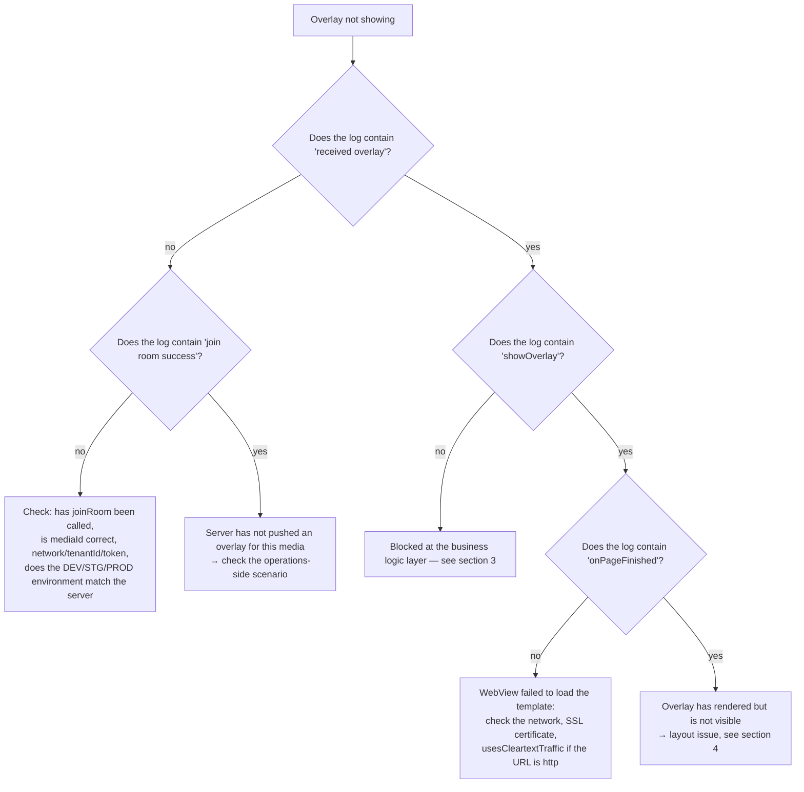

# 06 — Common errors & diagnosis

[← Back to table of contents](README.md)

---

## 1. Enabling SDK logs

The SDK logs via the `logcat {}` function — this only works when **the AAR is built with buildType `debug`**
(`BuildConfig.DEBUG = true` of the `:interactive` module). Default tag: `Interactive`.

```bash
adb logcat -s System.out | grep Interactive
```

Notable log strings:

| Log | Meaning |
|---|---|
| `overlay manager: Khởi tạo mới Innteractive` (constructor initialized — note: literal SDK log string, kept as-is) | Constructor runs |
| `socket io management initialization: socketUrl = ...` | Preparing connection |
| `overlay manager socket: connected socket` / `join room success` | Successfully joined room |
| `socket io management addEvents: received overlay` | Overlay received from server |
| `<-- check point: showOverlay -->` | Starting to build WebView |
| `VLive: Website onPageFinished url: ...` | Template finished loading |
| `overlay web view manager: add caches` | Overlay deferred because `isVisible = false` |
| `socket io management prevent ex-overlay: user answered` | Blocked because user already answered |

---

## 2. Overlay not showing — diagnosis tree



---

## 3. Blocked at the business logic layer

Compare the log against the reason table (details in [05 — Tracking](05-tracking-emit-ack.md#5-bảng-lý-do-huỷ-cancelreason)):

| Symptom | Cause | Resolution |
|---|---|---|
| `user haven't logged in yet` | Tenant `vtvlive`, `initToken` not called yet, overlay does not allow anonymous | Call `initToken()` after logging in |
| `timelineId not found` | Payload is missing `timelineId` | Report to the server side |
| `socket is not connect` | Socket dropped right during processing | Check the network; the SDK will auto-reconnect after 5s |
| `duplicate predict overlay` / `duplicate miniGame overlay` | Duplicate `timelineId` with an overlay already being shown | Expected behavior by design |
| `prevent ex-overlay: user answered` | Already answered this checkpoint (pref `ex_*`) | Clear the app data if you want to test again |
| `ex-overlay duration < 10s` | Compensatory overlay duration too short | Expected behavior by design |
| Cancel `target_mismatch` | `targets` does not match `DEVICE_TYPE` | Build the correct flavor (`androidmobile` / `androidtv`) or fix the scenario |
| Cancel `expired_duration` | Overlay duration has expired, counted from `missTime` | Expected behavior by design |
| `add caches` shown but overlay not visible | `isVisible = false` (not yet `Connected`) | Overlay will show once the socket connects; if it never connects → see section 5 |

---

## 4. Overlay renders but is not visible / positioned incorrectly

| Cause | Symptom | Resolution |
|---|---|---|
| `OverlayView` has size `0` | Render log is normal, but the screen is blank | Set explicit `layout_width/height` constraints; verify by temporarily setting `setBackgroundColor(Color.YELLOW)` |
| `OverlayView` is drawn over by the player | Overlay "flickers" then disappears | Declare `OverlayView` **after** the player in the layout, or increase `elevation`/`translationZ` |
| `OverlayView` is larger than the video frame | Overlay spills outside the video area | Constrain `OverlayView` to exactly match the player's 16:9 frame |
| `OverlayView` is `INVISIBLE` | After losing connection | The SDK calls `temporaryLock()` on disconnect; it will call `visible()` again once reconnected |
| Overlay is covered by a `SurfaceView` player over the WebView | Only happens with certain players | Use `TextureView` for the player, or place `OverlayView` in a separate ViewGroup on top |

---

## 5. Socket fails to connect

Checklist:

1. **Environment**: `EnvInteractive` must match the server system (DEV/STG/PROD) — the URL comes from native and cannot be changed from the app.
2. **`tenantId`**: wrong tenant → the server rejects the room.
3. **Permissions**: missing `INTERNET` permission → no clear error log, only a `connect error` is seen.
4. **Expired token**: incorrect `Authorization` header → may be rejected depending on server configuration.
5. **`liboverlay.so` stripped out**: if the app uses `abiFilters` or split ABIs missing an architecture, `Utils` will throw `UnsatisfiedLinkError` right at initialization → `INTERACTIVE_SOCKET_URL` ends up empty.
   Check with `unzip -l app-release.apk | grep liboverlay`.

The log `socket io management initialization: url value uninitialized` is exactly the sign of case 5.

---

## 6. Build/runtime errors after integrating the AAR

| Error | Cause | Resolution |
|---|---|---|
| `NoClassDefFoundError: io/socket/client/IO` | Missing transitive dependency | Declare all the required libraries as listed in [02 §3](02-cai-dat-va-tich-hop.md#3-khai-báo-phụ-thuộc) |
| `ClassCastException` / crash when opening a dialog | Activity is not a `FragmentActivity` | Use `AppCompatActivity` |
| Dialog does not open, log shows `showPredictDialog error` | `activity as? FragmentActivity` returns `null` | Same as above |
| No callback received from WebView when R8 is enabled | JS interface got obfuscated | Add the `@JavascriptInterface` rule as in [02 §14](02-cai-dat-va-tich-hop.md#14-proguard--r8) |
| Overlay does not receive data (`GET_DATA_INTERACTIVE`) | Template has not sent `LOADED_OVERLAY` | Coordinate with the web template team |
| `UnsatisfiedLinkError: liboverlay.so` | Missing ABI | Check `ndk.abiFilters`, do not strip the native library |

---

## 7. VOD: overlay does not appear at the right checkpoint

| Cause | Resolution |
|---|---|
| App does not call `receiveTrackingTime()` | Add a 1-second loop after `joinRoom(type = 2)` |
| Wrong unit fed in (milliseconds instead of seconds) | Divide `player.currentPosition` by 1000 |
| User seeks past the checkpoint | The SDK matches by **exact second**; the checkpoint's overlay is skipped — this is a current limitation |
| Not logged in, overlay does not `allowAnonymous` | `checkShowQuestion` skips it; log in then call `joinRoom` again |
| Scenario returns empty | Check the log `response vod failed`, confirm `mediaId` and token |

---

## 8. Frequently asked questions

**Does the SDK automatically track the Activity lifecycle?**
No. `LifecycleOverlay` is currently empty. The app must call `releaseAll()` itself. However, the socket's
LiveData is observed according to `LifecycleOwner`, so it automatically stops emitting when the Activity
is not in the active state.

**Can multiple overlays be shown at the same time?**
No. `OverlayView.addViewCommon*` calls `clearViews()` before adding a new one → there is always only one
WebView overlay. The Predict/Lucky buttons are separate views, so they can exist alongside the overlay
(the SDK actively hides them when a mini game appears).

**What happens if the account is switched mid-session?**
Call `initToken(newToken, newUserId)`. If Live is currently active, the SDK will automatically rejoin
the room with the new token.

**Is the viewer count accurate?**
`onHandleLiveViews` returns `count + 230` (a constant added in the current code). If the raw number is
needed, the app must subtract it back out itself.

**Is `releaseAll()` required before every `joinRoom()`?**
No — `joinRoom()` already calls `cleanUp()` internally.

**Does rotating the screen lose the overlay?**
No, as long as the Activity declares `configChanges="orientation|screenSize"`. If the Activity gets
recreated, `OverlayManager` must be rebuilt and `joinRoom()` called again.

**Does the SDK use the system WebView?**
Yes — `OverlayWebView` extends `android.webkit.WebView`, with JavaScript and DOM storage enabled,
a transparent background, `cacheMode = LOAD_NO_CACHE`, and it blocks external navigation
(`shouldOverrideUrlLoading` returns `true`).

---

[← Tracking emit-ack](05-tracking-emit-ack.md) · [Back to table of contents](README.md)
