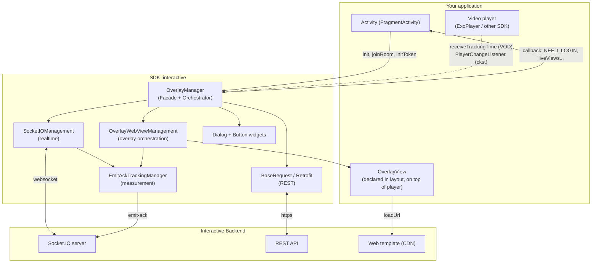
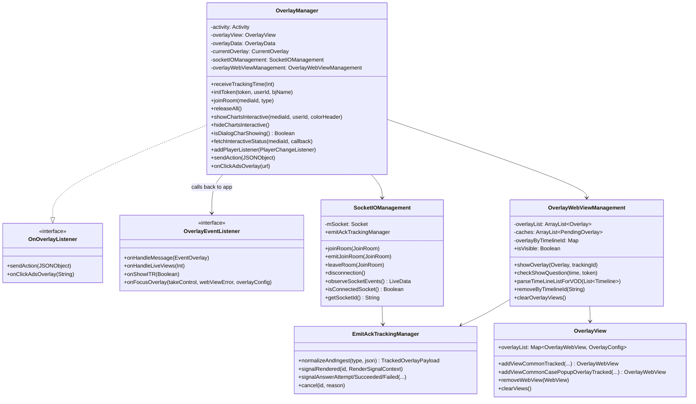
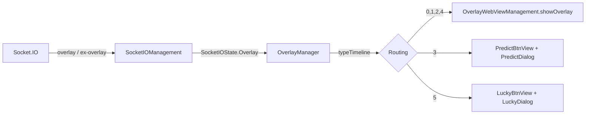
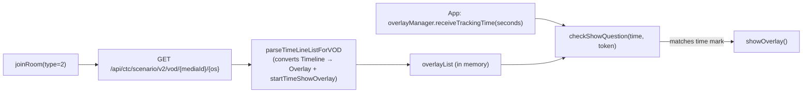
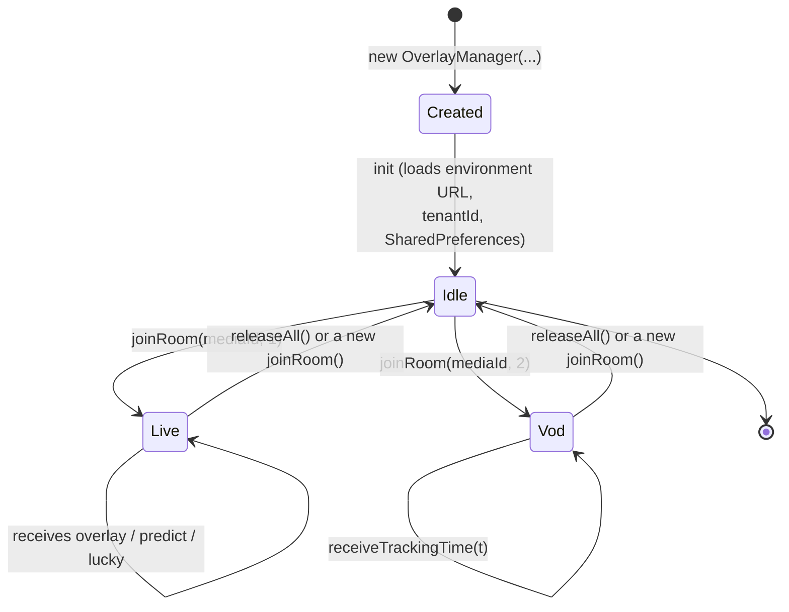
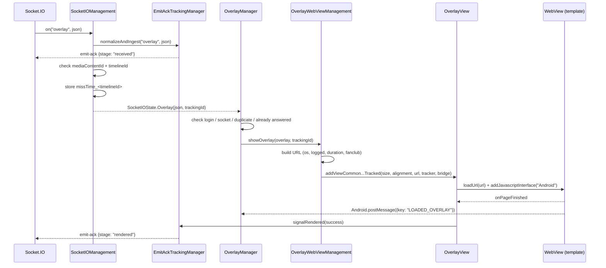
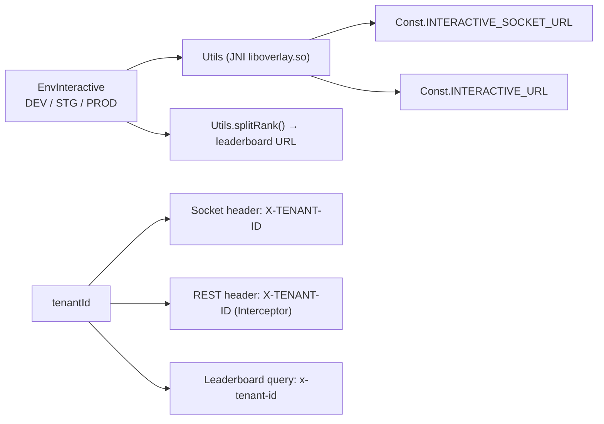

# Interactive Overlay SDK Architecture

[← Back to index](README.md)

---

## 1. Big picture

The SDK is an **Android library (AAR)** that packages 3 main responsibilities:

1. **Realtime connection** to the Interactive server via Socket.IO (Live scenario).
2. **Display orchestration** of interactive content (built with web) inside transparent `WebView`s.
3. **Forwarding user actions** to the server via REST and calling back events to the app.

---

## 2. Layers and responsibilities

| Layer | Component | Responsibility |
|---|---|---|
| **Facade** | `OverlayManager` | The app's single entry point. Receives commands (`joinRoom`, `initToken`, `releaseAll`…), listens to socket state, decides overlay type, handles the response flow |
| **Realtime transport** | `SocketIOManagement` | Creates/destroys the socket, registers events, normalizes payloads, emits `SocketIOState` via LiveData |
| **REST transport** | `BaseRequest` + the `*Request` classes + `OverlayService` | Retrofit client, attaches the `X-TENANT-ID` header, calls the scenario/action/vip/interactive-status APIs |
| **Presentation** | `OverlayWebViewManagement`, `OverlayView`, `OverlayWebView` | Builds the overlay URL, creates the WebView, binds position/size according to `metadata`, cleans up views |
| **Secondary presentation** | `PredictDialog`, `LuckyDialog`, `SuggestDialog`, `DialogChartsInteractive`, `PredictBtnView`, `LuckyBtnView` | Specialized UI forms (full-screen dialogs, floating buttons) |
| **Bridge** | `OverlayWebViewCallBack`, `PostMessageListener` | JavaScript ⇄ Kotlin bridge (`@JavascriptInterface postMessage`) |
| **Observability** | `tracking/*` | Measures overlay lifecycle and sends `emit-ack` to the server |
| **Infrastructure** | `Const`, `WSK`, `Utils`, `Ext`, `NPreferenceUtils`, `QueuedMutableLiveData` | Constants, JNI environment URL retrieval, extensions, local storage |

### Design principles reflected in the code

- **One facade, no internal leakage**: the app only touches `OverlayManager`, `OverlayView`, `OverlayData`,
  `EnvInteractive`, `OverlayEventListener`. All tracking classes are `internal`.
- **State-driven**: the socket doesn't call the UI directly but emits `SocketIOState` (sealed class) via
  `QueuedMutableLiveData`; `OverlayManager` observes according to the Activity lifecycle.
- **Interactive content is web-based**: the SDK doesn't draw the question UI itself, it only loads a
  template URL and exchanges data via `postMessage`. This means changing the interactive UI doesn't
  require rebuilding the app.
- **The environment URL is hidden in native code**: `Utils` calls `System.loadLibrary("overlay")` and
  invokes the JNI functions `socketDEV/STG/PRD`, `interactiveDEV/STG/PRD` — the URL doesn't exist as a
  string in Kotlin/DEX.

---

## 3. Simplified class diagram

---

## 4. Two operating modes

### 4.1. LIVE (`type = 1`) — server-driven

The server actively pushes overlays in real time. Display conditions (remaining duration, whether
already answered, fanclub membership…) are checked directly on the client.

### 4.2. VOD (`type = 2`) — playback-progress-driven

No socket. The SDK preloads the entire scenario, then **the app must feed playback time** into the
SDK every second:

> `startTimeShowOverlay` is derived from `Timeline.time` in `"mm:ss"` format (function
> `String.toSecond()`), so the unit fed into `receiveTrackingTime` is **seconds**.

---

## 5. Threading model

| Task | Thread | Note |
|---|---|---|
| Socket.IO events | Socket client's thread | Pushed into `QueuedMutableLiveData.postValue` |
| Observing `SocketIOState` | **Main thread** | Via `LiveData.observe(LifecycleOwner)` |
| Building/destroying WebView | **Main thread** | `showOverlayForVod` wraps `GlobalScope.launch(Dispatchers.Main)` |
| Parsing VOD scenario | `Dispatchers.IO` | `GlobalScope.launch(Dispatchers.IO)` inside `parseTimeLineListForVOD` |
| Calling REST | OkHttp's thread, callback on main | Uses `Call.enqueue` |
| Emit-ack tracking | `@Synchronized` on `EmitAckTrackingManager` | Render timer runs on `Handler(Looper.getMainLooper())` |
| Cleaning up tracking sessions | Daemon thread `EmitAckTrackingCleanup` | `ScheduledExecutorService`, 5-minute cycle |

`QueuedMutableLiveData` is worth noting: it **queues** states instead of letting `postValue` overwrite
one another — necessary because two overlay events can arrive close together and neither may be lost.

---

## 6. Object lifecycle

Key points in the code:

- **The constructor doesn't open a connection.** `init {}` only loads the URL according to the
  environment, sets `tenantId` for Retrofit, attaches a listener to `OverlayView`, initializes
  `NPreferenceUtils`.
- **`joinRoom()` always calls `cleanUp()` first** → closes the old socket, removes WebViews,
  cancels pending tracking. This makes calling `joinRoom` repeatedly safe.
- **A new `SocketIOManagement` is created for every Live session**, not reused.
- **`initToken()` while watching Live automatically calls `joinRoom()` again** so the socket
  carries the new token.

---

## 7. Data flow for one overlay (Live)

For a detailed look at each branch (including blocking points) see [03 — Operational Flow](03-luong-hoat-dong.md).

---

## 8. WebView bridge protocol

The SDK attaches a JS interface named **`Android`** (`Const.JS_INTERFACE_NAME`).

**Web → SDK** (`Android.postMessage(jsonString)`):

| Field | Value | Meaning |
|---|---|---|
| `key` | `LOADED_OVERLAY` | Template is ready → the SDK pushes data down, and also finalizes `rendered` |
| `type` | `INTERACTIVE_SHOW_ANALYTICS` | Overlay has been shown (logs behavior) |
| `type` | `INTERACTIVE_HIDE_ANALYTICS` | Overlay closed → the SDK removes the WebView, re-enables predict/lucky |
| `type` | `INTERACTIVE_ACTION_REPORT` | User answered / tapped an ad |
| `type` | `INTERACTIVE_OPEN_ANALYTICS` | Opens the predict/lucky dialog |
| `type` | `INTERACTIVE_CLOSE_ANALYTICS` | Closes the predict/lucky dialog |

**SDK → Web** (`window.postMessage(...)` via `evaluateJavascript`):

| `key` | When | Function |
|---|---|---|
| `GET_DATA_INTERACTIVE` | After `LOADED_OVERLAY` | `OverlayWebView.loadData()` / `*Dialog.loadData()` |
| `UPDATE_DATA_INTERACTIVE` | Socket `update-result` | `OverlayWebView.updateResult()` |
| `UPDATE_CONFIRM` | Answer succeeded (mini game/predict) | `updateConfirm()` |
| `UPDATE_COUTER` | Socket `predict-result` | `PredictDialog.updateResult()` |
| `UPDATE_NUMBER_LUCKY` | API returns lucky result | `LuckyDialog.updateResult(data)` |

---

## 9. Environment & tenant configuration

- `EnvInteractive.DEV | STG | PROD` determines both the socket URL and the REST URL.
- `tenantId` distinguishes products (e.g. `vtvlive`, `VTVprime`, `onlive`…). The `vtvlive` tenant
  in particular has a special rule: **overlays without `allowAnonymous` are skipped if the user
  isn't logged in**.
- `BuildConfig.DEVICE_TYPE` (`androidmobile` / `androidtv`) goes into the `os` header, the `os=`
  query of the template URL, and the `targets` filter condition.

---

## 10. Local storage

SharedPreferences is used across two different files (intentional in the current code):

| Key | File | Purpose |
|---|---|---|
| `missTime_<timelineId>` | `interactive_vlive` | Time overlay was received, used to compute remaining `duration` when shown late |
| `ex_<userId or deviceId>` | `INTERACTIVE` | Records the `timelineId` of mini games already answered so they aren't shown again |
| `timelineId`, `currentTime` | `interactive_vlive` | Trace of the most recently accepted overlay |

---

[← Back to index](README.md) · [Next: Setup & Integration →](02-cai-dat-va-tich-hop.md)
