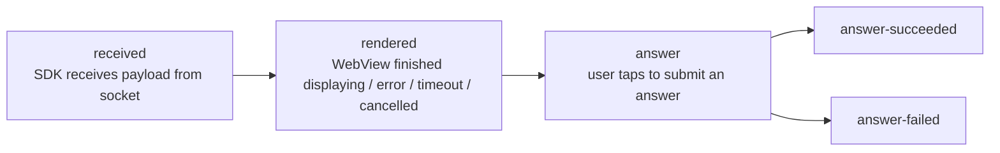
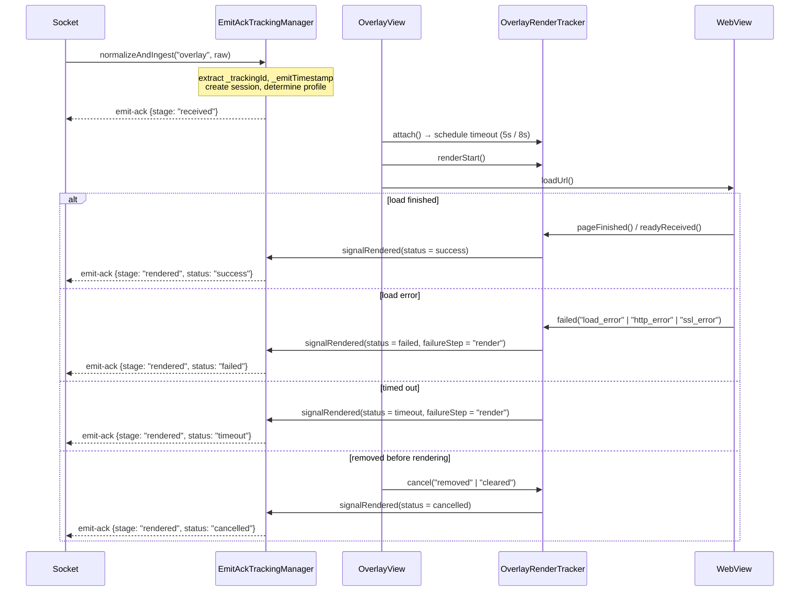
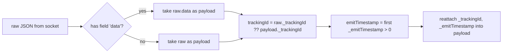

# 05 — Tracking emit-ack (overlay lifecycle measurement)

[← Back to table of contents](README.md)

This mechanism answers a question from the operations side: *"Did the overlay pushed by the server
actually reach the user's device, did it render, and did the user answer?"* — measured on the
client itself, sent back to the server via the `emit-ack` socket event.

> Enabled/disabled via the build flag `FEATURE_TRACKING_ACK_OVERLAY` in
> [interactive/build.gradle](../interactive/build.gradle) (currently `true`).
> The entire tracking layer is `internal` — the app does not interact with it directly.

---

## 1. Stages



| Stage | Meaning | Ends session? |
|---|---|---|
| `received` | Valid payload has entered the SDK | No |
| `rendered` | Final display result, with `status` | Yes, if `status != success` |
| `answer` | Started sending an answer | No |
| `answer-succeeded` | API returned `success = true` | Yes |
| `answer-failed` | API error / rejected / network error | Yes |

`status` of `rendered`: `success` | `failed` | `timeout` | `cancelled`.

Each stage is sent **only once** per `trackingId` (`emittedStages` is a `Set`); if `emit` throws an
error, the stage is removed from the set so it can be retried on the next trigger.

---

## 2. Payload structure sent to the server

```jsonc
// emit("emit-ack", payload)
{
  "trackingId": "<_trackingId taken from the overlay payload>",
  "event": "overlay",
  "stage": "received | rendered | answer | answer-succeeded | answer-failed",
  "deviceId": "<android-id>",
  "clientContext": { /* see below */ }
}
```

### `clientContext` — common part

| Field | Source |
|---|---|
| `profile` | `overlay.legacyIframe` or `overlay.wsInteractive` |
| `transportMode` | `legacyIframe` / `wsInteractive` |
| `overlayType` | `metadata.type` → `typeTimeline` → `type` |
| `duration` | overlay's `duration` (seconds) |
| `sdkVersion` | `versionName.versionCode` (e.g. `1.2.18`) |
| `platform` | `tv` if `DEVICE_TYPE` contains "tv", otherwise `android` |
| `os` | `"Android <release>"` |
| `deviceClass` | `tv` / `tablet` / `mobile_large` / `mobile` / `mobile_small` |
| `viewportWidth`, `viewportHeight` | `displayMetrics` |

### Per stage

| Stage | Additional fields |
|---|---|
| `received` | `emitTimestamp`, `receiveTimestamp`, `receiveLatencyMs`, `ackLatencyMs`, `timeline{received, ackSent}` |
| `rendered` | `status`, `receiveLatencyMs`, `renderLatencyMs`, `ackLatencyMs`, `timeline{attached, renderStart, loadComplete, readyReceived, ackSent}`, `failureReason?`, `failureStep?`, `custom.cancelReason?` |
| `answer*` | `actionType` (`answer_submit`), `actionResult` (`attempted`/`success`/`failure`), `actionLatencyMs`, `occurrenceId` (= `timelineId`), `failureReason?`, `failureStep?`, `custom{timelineId, typeTimeline, mediaId, apiMessage?, apiDescription?, error?}` |

---

## 3. Two profiles and timeout thresholds

`EmitAckTrackingManager.resolveProfile()` examines the overlay's `src` URL:

| Condition | Profile | Render timeout | `rendered` finalization point |
|---|---|---|---|
| `src` contains `?ws=1` or `&ws=1` | `overlay.wsInteractive` | **8000 ms** | Only when the web page sends `LOADED_OVERLAY` (`readyReceived`) |
| otherwise | `overlay.legacyIframe` | **5000 ms** | `onPageFinished` **or** `LOADED_OVERLAY`, whichever comes first |

This means the newer template type (`ws=1`) must actively signal readiness, while the legacy
template only needs to finish loading the page.

---

## 4. Measurement flow for a single overlay



`OverlayRenderTracker` runs on `Handler(Looper.getMainLooper())`, using the `terminalSent` flag to
ensure only **one** terminal signal is emitted, even when timeout and `pageFinished` happen close
together.

---

## 5. Cancellation reason table (`cancelReason`)

This is the complete list of points where the SDK **intentionally does not display** the overlay —
very useful when investigating "why didn't the overlay show":

| `cancelReason` | Where it originates | Cause |
|---|---|---|
| `invalid_payload` | Socket / OverlayManager | Missing `mediaContentId`/`timelineId`, or JSON could not be parsed into `Overlay` |
| `short_duration` | Socket (`ex-overlay`) | `duration <= 10` seconds |
| `login_required` | OverlayManager | Tenant `vtvlive`, not logged in, overlay is not `allowAnonymous` |
| `socket_not_connected` | OverlayManager | Socket had already dropped at processing time |
| `missing_timeline_id` | OverlayManager | `timelineId` is empty |
| `duplicate_overlay` | OverlayManager | Duplicate `timelineId` with an overlay/predict/lucky/headline currently being displayed |
| `already_answered` | OverlayManager | Pref `ex_<userId\|deviceId>` has already recorded this `timelineId` |
| `target_mismatch` | WebViewManagement | `targets` does not contain `all` and does not contain the current platform |
| `invalid_layout` | WebViewManagement / OverlayView | Could not infer `alignment` from `metadata.pos` |
| `expired_duration` | WebViewManagement | `duration - (now - missTime) <= 0` |
| `superseded_cache` | WebViewManagement | Old overlay in cache replaced by a new overlay upon unlock |
| `removed`, `cleared` | OverlayView | WebView removed / entirely cleared |
| `socket_disconnected`, `sdk_disconnect`, `leave_room`, `clear_all`, `destroy` | Socket / Manager | Session ended |

---

## 6. Tracking session memory management

| Parameter | Value |
|---|---|
| Max number of sessions | **256** (once exceeded, the oldest session is evicted — `LinkedHashMap` access-order) |
| TTL per session | **30 minutes** |
| Background cleanup cycle | **5 minutes** (daemon thread `EmitAckTrackingCleanup`) |

A session is removed immediately when: `rendered` with a status other than `success`,
`answer-succeeded`, `answer-failed`, or `finish()`/`cancelAll()` when leaving the room / socket
disconnects.

---

## 7. Payload normalization (`TrackingPayloadNormalizer`)



Thanks to this step, the rest of the SDK always works with an "unwrapped" payload, while still
retaining tracking metadata.

---

## 8. Impact on integrating apps

- Tracking **does not** add any permissions, and does not call a separate API — it uses the socket
  that's already open.
- In **VOD mode there is no tracking** (no socket to emit through).
- If the app wants to disable it entirely: change `FEATURE_TRACKING_ACK_OVERLAY` to `false` and
  rebuild the AAR.

---

[← API Reference](04-api-reference.md) · [Back to table of contents](README.md) · [Next: Common errors →](06-loi-thuong-gap.md)
