# 03 — Detailed Workflow

[← Back to table of contents](README.md)

This document describes **each business flow** of the SDK, along with sequence diagrams and branch
conditions exactly as they exist in the current source code.

## List of flows

1. [SDK initialization](#1-sdk-initialization)
2. [Login / logout](#2-login--logout)
3. [Joining a LIVE room](#3-joining-a-live-room)
4. [Receiving and routing overlays (LIVE)](#4-receiving-and-routing-overlays-live)
5. [Rendering an overlay on screen](#5-rendering-an-overlay-on-screen)
6. [Lifecycle of an overlay WebView](#6-lifecycle-of-an-overlay-webview)
7. [Answering a question (mini game)](#7-answering-a-question-mini-game)
8. [Predict (`typeTimeline = 3`)](#8-predict-typetimeline--3)
9. [Lucky spin (`typeTimeline = 5`)](#9-lucky-spin-typetimeline--5)
10. [Headline (`typeTimeline = 4`)](#10-headline-typetimeline--4)
11. [Overlay recall — overlay-recall](#11-overlay-recall--overlay-recall)
12. [Auxiliary events: liveviews, fan-club, ckst](#12-auxiliary-events-liveviews-fan-club-ckst)
13. [VOD flow](#13-vod-flow)
14. [Disconnection and recovery](#14-disconnection-and-recovery)
15. [Resource release](#15-resource-release)

---

## 1. SDK initialization

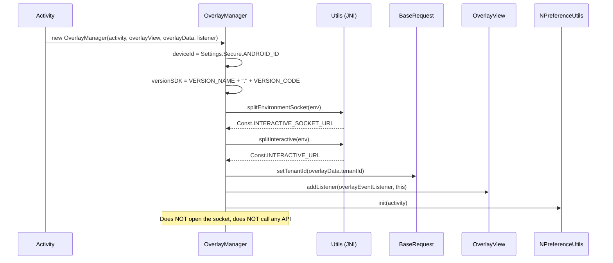

After this step, the SDK is in the **Idle** state: it knows the environment and tenant, and has a
place to render — but is not yet attached to any content.

---

## 2. Login / logout

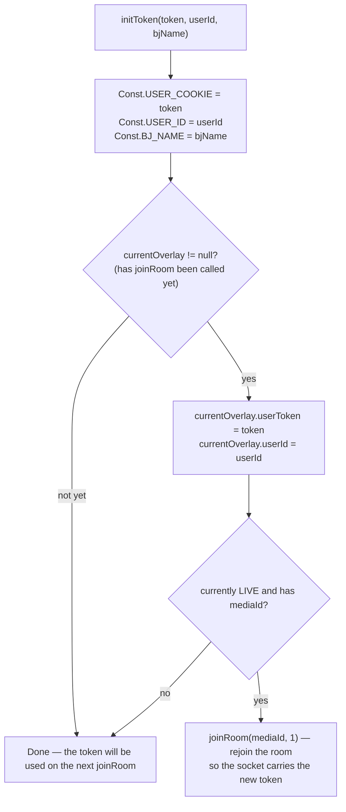

Practical meaning:

- **Logging in while watching Live** → the SDK automatically reconnects; the currently displayed
  overlay is cleaned up (`cleanUp()` inside `joinRoom`).
- **Logout** = `initToken("", "")`; if currently Live, it will also rejoin the room in an anonymous
  state.
- `Authorization` header: if the token starts with `"ey"` (JWT) → `"Bearer <token>"`, otherwise sent
  as-is.

---

## 3. Joining a LIVE room

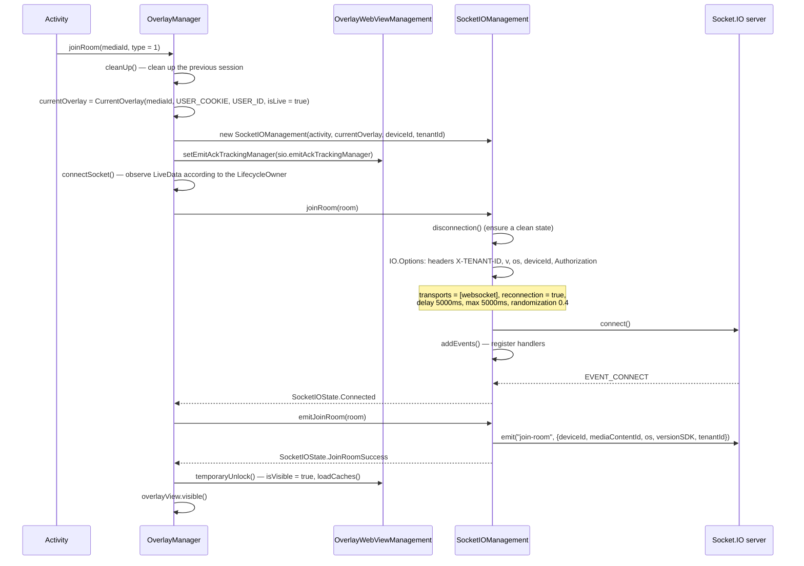

Key points to remember:

- The `emit("join-room")` command **only happens after the socket has connected successfully**, not
  immediately when `joinRoom()` is called.
- Before `Connected`, `OverlayWebViewManagement.isVisible = false` → any overlay arriving early is
  **put into the cache** instead of being displayed.
- `overlayView` is only made `visible()` inside `temporaryUnlock()`.

---

## 4. Receiving and routing overlays (LIVE)

### 4.1. Socket-layer pre-filtering

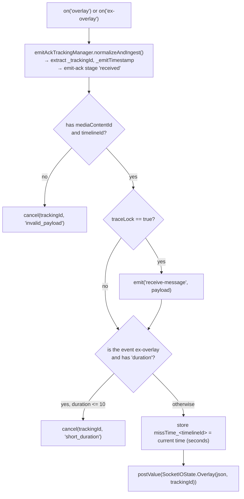

### 4.2. `OverlayManager` business-logic layer

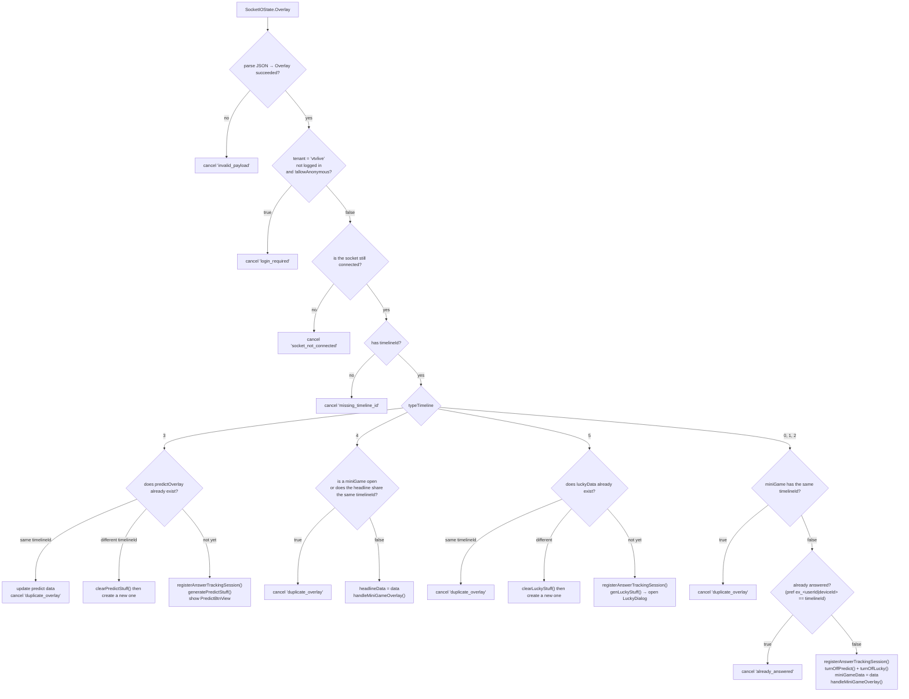

> The `ex_...` key uses `userId` when logged in; if not logged in but the overlay allows anonymous
> access, it uses `deviceId` instead.

---

## 5. Rendering an overlay on screen

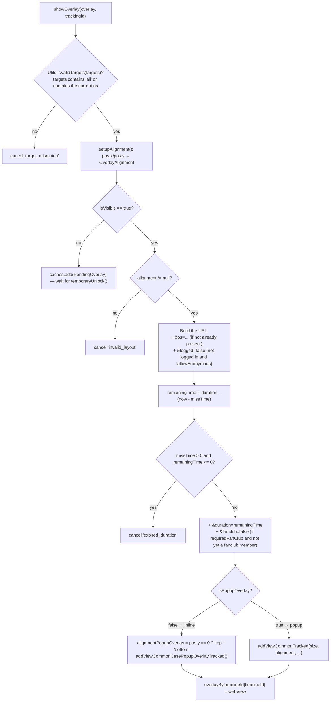

**Geometric constraints** in `OverlayView`:

- `addViewCommonTracked`: width/height as a percentage (`constrainPercentWidth/Height`), anchored at
  one of 9 positions (`LeftTop` … `RightBottom`) derived from `metadata.pos`.
- `addViewCommonCasePopupOverlayTracked`: width `WRAP_CONTENT`, height as a percentage, anchored
  top/bottom/left/right according to `alignmentPopupOverlay`.
- Both call `clearViews()` before adding → **at any given moment there is only one overlay
  WebView**.

---

## 6. Lifecycle of an overlay WebView

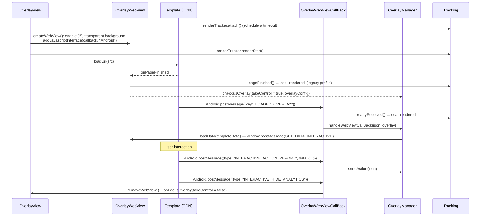

Page-load errors (`onReceivedError`, `onReceivedHttpError`, `onReceivedSslError`) all result in:
`renderTracker.failed(...)` → hide the WebView → `onFocusOverlay(webViewError = true)`.

---

## 7. Answering a question (mini game)

This is the most complex flow, with 4 layers of checks before the API is called.

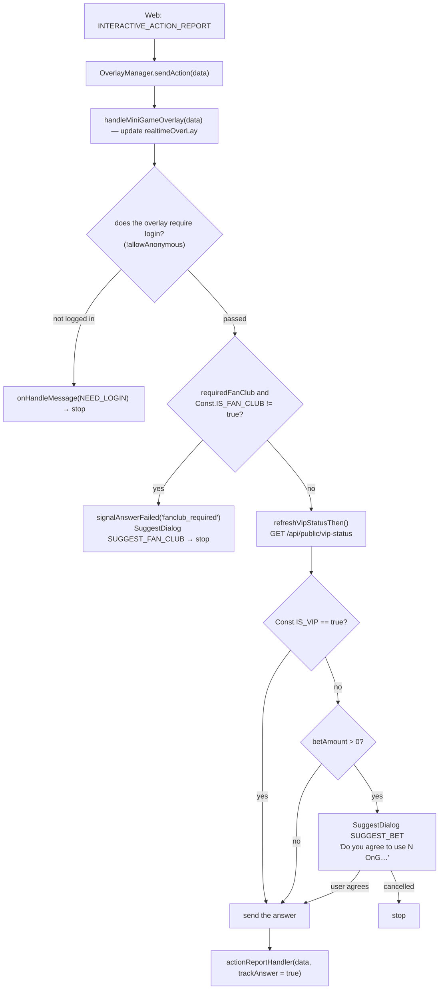

### 7.1. `actionReportHandler` — sending the API request

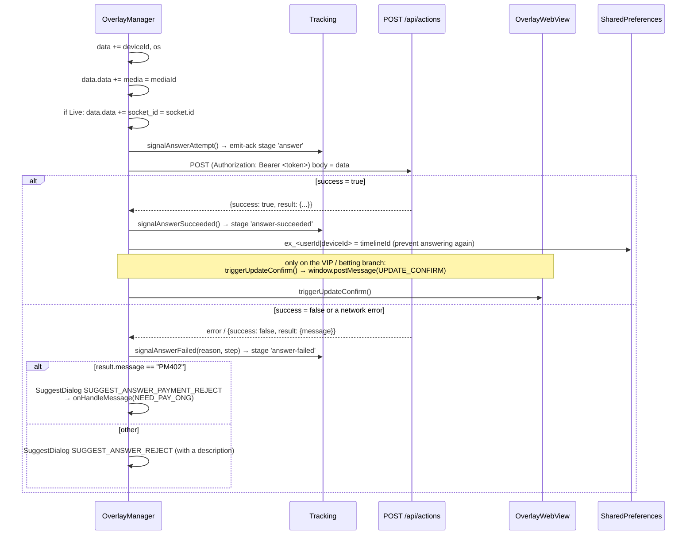

Error code → `failureReason` mapping in tracking (`AnswerTrackingMapper`):

| `result.message` | `failureReason` | `failureStep` |
|---|---|---|
| `EX400` | `api_EX400` | `api_response` |
| `TL404` | `api_TL404` | `api_response` |
| `PM402` | `api_PM402` | `api_response` |
| other, `success = false` | `api_false` | `api_response` |
| network error | `network_error` | `network` |
| empty body / cannot be parsed | `unknown_response` | `unknown_response` |

### 7.2. Other `type` values in `sendAction`

| `type` | Behavior |
|---|---|
| `INTERACTIVE_SHOW_ANALYTICS` | `onShowITR(true)` + record the action via `/api/actions` |
| `INTERACTIVE_HIDE_ANALYTICS` | Record it, clear `overlay`/`miniGameData`, **re-enable** predict and lucky |
| `INTERACTIVE_OPEN_ANALYTICS` | `onShowITR(true)` + record (predict/lucky) |
| `INTERACTIVE_CLOSE_ANALYTICS` | Record (predict/lucky) |
| `action = CLICK_ADS` + has `url` | No API call, opens an external browser via `onClickAdsOverlay(url)` |

---

## 8. Predict (`typeTimeline = 3`)

```mermaid
sequenceDiagram
    participant WS as Socket
    participant OM as OverlayManager
    participant BTN as PredictBtnView
    participant DLG as PredictDialog
    participant API as /api/actions

    WS-->>OM: overlay (typeTimeline = 3)
    OM->>BTN: create the floating button (normal/power images from the payload,<br/>fallback to a default image on the CDN)
    OM->>DLG: PredictDialog.getInstance(payload)
    OM->>BTN: onAttach() — show the button, after 5s reduce alpha to 0.5

    Note over WS,OM: realtime control event "predict-timeline"
    WS-->>OM: {type: "ACTIVE"} → activePredict() → show the button
    WS-->>OM: {type: "INACTIVE"} → inactivePredict() → hide the button, close the dialog
    WS-->>OM: {type: "POWER"} → button switches to the power image for 5 seconds
    WS-->>OM: {type: "END"} → SuggestDialog "Prediction has ended" + clean up everything

    BTN->>OM: user taps the button
    alt not logged in
        OM-->>OM: onHandleMessage(NEED_LOGIN), show the button again
    else logged in
        OM->>DLG: show() (full screen, transparent background)
        DLG->>DLG: WebView loads src + &u=<userId> (+ &logged=false if not logged in)
        DLG-->>OM: LOADED_OVERLAY → loadData()
        DLG->>OM: INTERACTIVE_ACTION_REPORT → answer flow (section 7)
        OM->>API: POST /api/actions
        API-->>OM: success → updateConfirm(); failure → SuggestDialog
    end

    WS-->>OM: "predict-result" → update answer1/answer2 → DLG.updateResult()
```

Status flags controlling button visibility:

| Flag | Meaning | Who changes it |
|---|---|---|
| `isPredictOn` | Whether it is allowed to be shown (turned off when a mini game occupies the screen) | `turnOnPredict()` / `turnOffPredict()` |
| `isPredictActive` | Whether the server allows interaction | `ACTIVE` / `INACTIVE` events |
| `isPredictDialogOn` | Whether the dialog is open | `showPredictDialog()` / `hidePredictDialog()` |

The button is only shown when `isPredictOn && isPredictActive`.

---

## 9. Lucky spin (`typeTimeline = 5`)

Structurally similar to Predict (`LuckyBtnView` + `LuckyDialog`, socket event `lucky-event` with
`ACTIVE/INACTIVE/POWER/END`), with **one important difference**:

```kotlin
// OverlayManager.genLuckyStuff() — last line
showLuckyDialog()
```

→ The lucky overlay **opens its dialog automatically as soon as it is received**, without waiting
for the user to tap a button.

The result returned from the API is pushed down to the web via `UPDATE_NUMBER_LUCKY`:

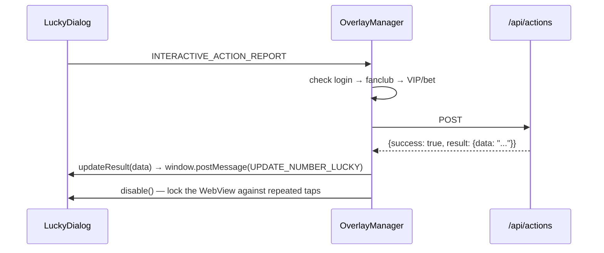

---

## 10. Headline (`typeTimeline = 4`)

- Shares the same rendering path as mini game (`handleMiniGameOverlay`).
- Skipped if **a mini game is currently open** (`miniGameData != null`) or if it shares the same
  `timelineId` with the current headline.
- Only accepts two behavior `type` values: `INTERACTIVE_SHOW_ANALYTICS` and
  `INTERACTIVE_HIDE_ANALYTICS` (no answer flow).

---

## 11. Overlay recall — overlay-recall

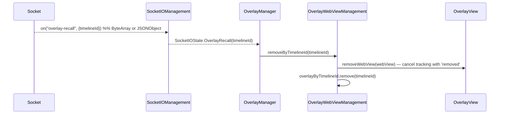

Used when an editor removes an overlay that is currently being broadcast system-wide.

---

## 12. Auxiliary events: liveviews, fan-club, ckst

| Socket event | Handling |
|---|---|
| `liveviews` | Parse `OverlayLiveViews.count`, **add 230**, call `onHandleLiveViews(count)` |
| `data` (fan-club) | If `mediaId` matches the media currently being watched (comparing the part before the `_`) → update `Const.IS_FAN_CLUB`; otherwise set it to `false` |
| `ckst` | The server asks for the player state → the SDK re-emits `ckst` with `{action: "CHECK_PLAYER_STATUS", sessionId, data: {deviceId, os, mediaContentId, playerStatus}}` |
| `update-result` | `OverlayWebView.updateResult(data)` → `window.postMessage(UPDATE_DATA_INTERACTIVE)` |
| `predict-result` | Update `answer1`/`answer2` in `predictOverlay`, call `PredictDialog.updateResult()` |

> Adding 230 to `liveViews` is intentional behavior in the current source code
> ([OverlayManager.kt:435](../interactive/src/main/java/vn/interactive/OverlayManager.kt:435)) —
> if the app needs the raw number, it must subtract it back out on its side.

`playerStatus` is only non-empty once the app has called `addPlayerListener(...)`.

---

## 13. VOD flow

```mermaid
sequenceDiagram
    participant APP as Activity
    participant OM as OverlayManager
    participant API as GET /api/ctc/scenario/v2/vod/{mediaId}/{os}
    participant WVM as OverlayWebViewManagement
    participant OV as OverlayView

    APP->>OM: joinRoom(mediaId, type = 2)
    OM->>OM: cleanUp(); isLive = false
    OM->>WVM: isVisible = true
    OM->>API: GetScenarioRequest(token = USER_COOKIE, mediaId, os)
    API-->>OM: ScenarioDTO {data.timelines[]}
    OM->>WVM: parseTimeLineListForVOD(timelines)
    WVM->>WVM: for each Timeline.interactive → Overlay:<br/>src + ?timelineId&tenantId&deviceType&os<br/>startTimeShowOverlay = time("mm:ss") → seconds

    loop every second (driven by the app)
        APP->>OM: receiveTrackingTime(seconds)
        OM->>WVM: checkShowQuestion(seconds, userToken)
        WVM->>WVM: find the overlay with the smallest startTimeShowOverlay that is still >= seconds
        alt startTimeShowOverlay == seconds
            WVM->>WVM: if !allowAnonymous and not logged in → skip
            WVM->>WVM: store missTime_<timelineId>
            WVM->>OV: showOverlay() on the Main thread
            WVM->>WVM: remove overlays sharing the same time mark from the list
        end
    end
```

Differences compared to LIVE:

| | LIVE | VOD |
|---|---|---|
| Overlay source | Pushed via Socket.IO | The entire scenario is loaded upfront via REST |
| Display trigger | Realtime event | `receiveTrackingTime(seconds)` fed by the app |
| `socketIOManagement` | Present | **null** (all socket calls are safely ignored) |
| `socket_id` in the action | Present | Absent |
| Emit-ack tracking | Present | Absent (no socket to emit through) |
| Predict / Lucky / liveviews | Present | Absent |

---

## 14. Disconnection and recovery

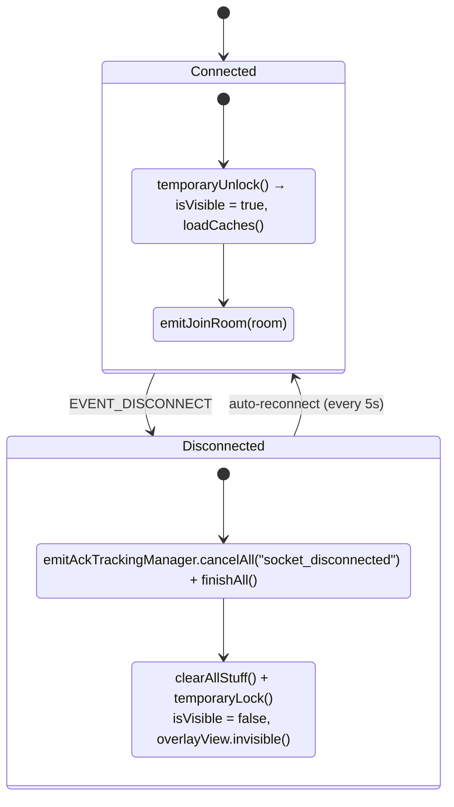

- **Overlay cache**: when `isVisible = false`, new overlays go into the `caches`. Once unlocked,
  `loadCaches()` only displays **the last item**; earlier items have their tracking cancelled with
  the reason `superseded_cache`.
- **`missTime`**: thanks to the stored timestamp, an overlay that reappears after a disconnection
  has its `duration` reduced by the elapsed time; if it has expired it is discarded
  (`expired_duration`).
- The `EVENT_CONNECT_ERROR` event → `SocketIOState.Error` → `clearAllStuff()`.

---

## 15. Resource release

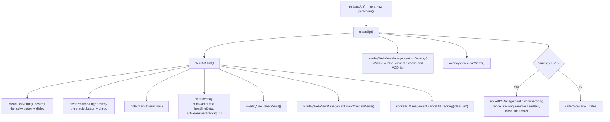

`releaseAll()` is called in:

- `onDestroy()` of the Activity containing the player,
- when the user exits the content (closes the player, goes back to a list),
- before switching to a different `mediaId` **if** `joinRoom()` is not called immediately after
  (since `joinRoom` already cleans up on its own).

---

[← Installation & Integration](02-cai-dat-va-tich-hop.md) · [Back to table of contents](README.md) · [Next: API Reference →](04-api-reference.md)
