# 03 — Detailed Workflow

[← Back to table of contents](README.md)

This document describes **each business flow** of the iOS SDK, along with sequence diagrams and
branch conditions exactly as they exist in the current source code
(`InteractiveControllerView.swift`, `OverlayManagementImpl.swift`, `PredictManagementImpl.swift`,
`SocketIOManagementImpl.swift`).

## List of flows

1. [Initialization & configuration](#1-initialization--configuration)
2. [Login / logout](#2-login--logout)
3. [Joining a LIVE room](#3-joining-a-live-room)
4. [Receiving and routing overlays (LIVE)](#4-receiving-and-routing-overlays-live)
5. [Rendering a mini game overlay](#5-rendering-a-mini-game-overlay)
6. [Answering a mini game question (login → fanclub → VIP/bet)](#6-answering-a-mini-game-question)
7. [Predict (`typeTimeline = 3`)](#7-predict-typetimeline--3)
8. [Lucky number (`typeTimeline = 5`)](#8-lucky-number-typetimeline--5)
9. [Overlay recall — overlay-recall](#9-overlay-recall--overlay-recall)
10. [Auxiliary events: liveviews, fanclub, ckst, update-result](#10-auxiliary-events)
11. [VOD flow](#11-vod-flow)
12. [Disconnection and recovery](#12-disconnection-and-recovery)
13. [Resource release](#13-resource-release)

---

## 1. Initialization & configuration

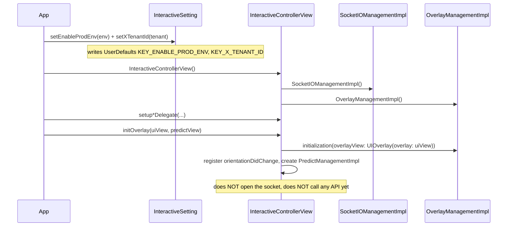

After this step the SDK is **ready**: it knows the environment and tenant, and has 2 views to
render into — but it is not yet attached to any content.

---

## 2. Login / logout

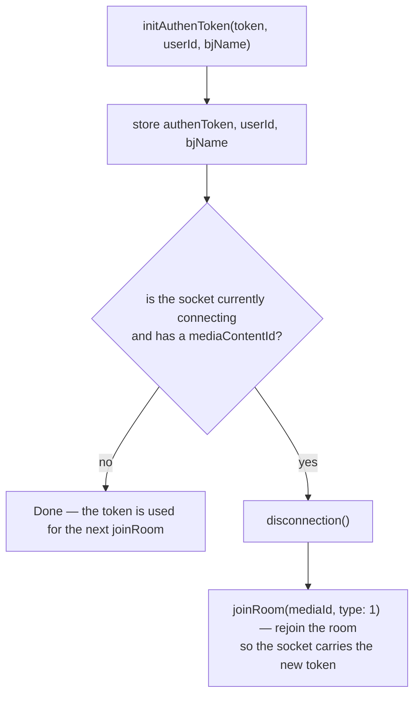

Meaning:

- **Logging in while watching Live** → the SDK automatically disconnects and rejoins the room; the
  currently displayed overlay is cleaned up.
- **Logout** = `initAuthenToken("", "", "")`.
- The token goes into the socket's `Authorization` header **verbatim**; for REST, a JWT (starting
  with `"ey"`) has the prefix `Bearer ` added.

---

## 3. Joining a LIVE room

```mermaid
sequenceDiagram
    participant APP as App
    participant ICV as InteractiveControllerView
    participant SIO as SocketIOManagementImpl
    participant WS as Socket.IO server

    APP->>ICV: joinRoom(mediaId, type: 1)
    ICV->>ICV: if the media differs → leaveRoom() the previous room
    ICV->>SIO: if currently connecting → disconnection()
    ICV->>ICV: removeAllView(); mediaContentId = mediaId
    ICV->>ICV: handleEventsSocket() — attach the callback BEFORE connecting
    ICV->>SIO: connectSocket() → connection(url, authenToken)
    SIO->>SIO: buildSocket() — guard tenantId & env (must not be empty)
    Note over SIO: headers x-tenant-id, v, os=iphone, deviceId, Authorization<br/>forceWebsockets, reconnectWait 5, randomization 0.4
    SIO->>SIO: addEvents() (register handlers)
    SIO->>WS: socket.connect()
    WS-->>SIO: clientEvent .connect
    SIO-->>ICV: callback CONNECTED
    ICV->>SIO: joinRoom(JoinRoomData(mediaContentId))
    SIO->>WS: emit("join-room", {deviceId, mediaContentId, os, tenantId, versionSDK})
```

Key points to remember:

- `emit("join-room")` **only happens after the socket has connected successfully** (inside the
  `SocketEvents.CONNECTED` branch), not immediately when `joinRoom()` is called.
- `handleEventsSocket()` is called **before** `connectSocket()` so the `CONNECTED` event is not
  missed.
- `buildSocket()` will **stop** if `KEY_X_TENANT_ID` is empty; `connectSocket()` stops if the env or
  tenant is empty.

---

## 4. Receiving and routing overlays (LIVE)

### 4.1. Socket-layer pre-filtering (`SocketIOManagementImpl`)

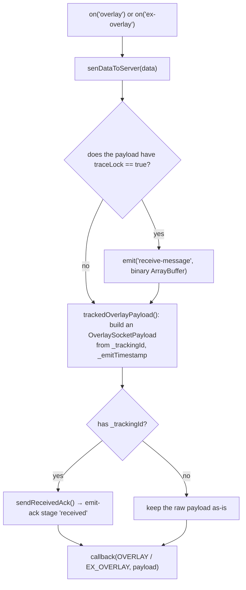

### 4.2. `InteractiveControllerView` layer (`startShowLiveOverlayWithDataReceived`)

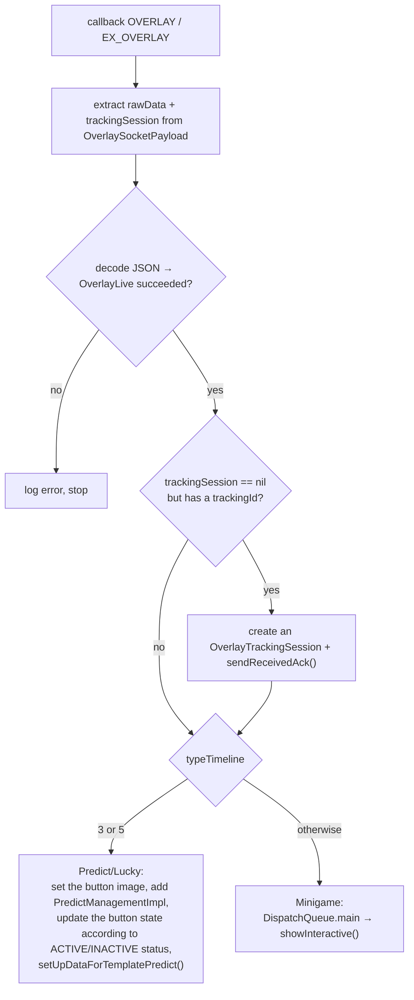

Inside `showInteractive()`:

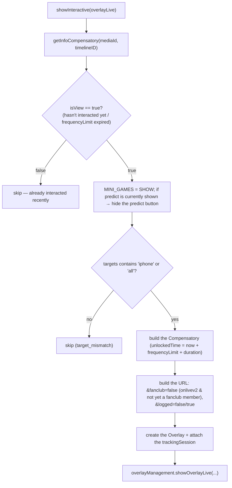

> `getInfoCompensatory` reads `UserDefaults(suiteName: INTERACTIVE_<userId|DEFAULT>)` keyed by
> `mediaId`: if that mark has already been interacted with and is still within `frequencyLimit`, it
> returns `false` (do not show again).

---

## 5. Rendering a mini game overlay

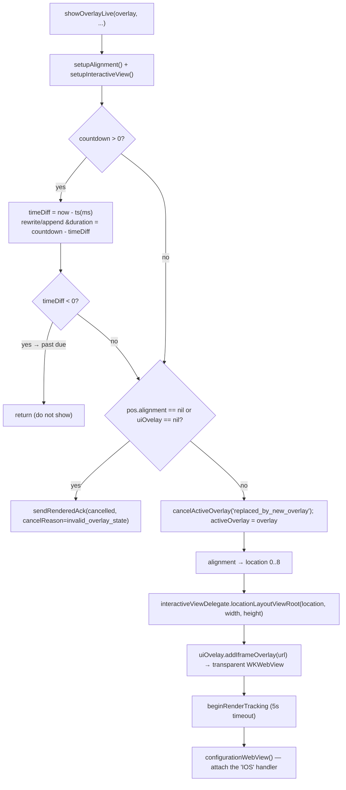

**Geometric constraints**: `location` (0..8) is derived from `OverlayPosition.pos.x`/`pos.y` (each
axis 0/1/2), mapped to 9 positions (`LeftTop`…`RightBottom`). The `size.w/size.h` dimensions are
**ratios** relative to the frame. Actual positioning is handled by the app in
`locationLayoutViewRoot(location:width:height:)`; the WebView is placed to cover the root frame.

**Only one mini game overlay at a time**: `showOverlayLive` calls `cancelActiveOverlay` +
`uiOvelay?.onStop()` before adding a new overlay.

---

## 6. Answering a mini game question

Triggered when the WebView sends `IOS.postMessage({type: INTERACTIVE_ACTION_REPORT, data})`.
There is a **Live** branch (`handleWebViewCallBack`) and a **VOD** branch
(`handleWebViewCallBackVod`).

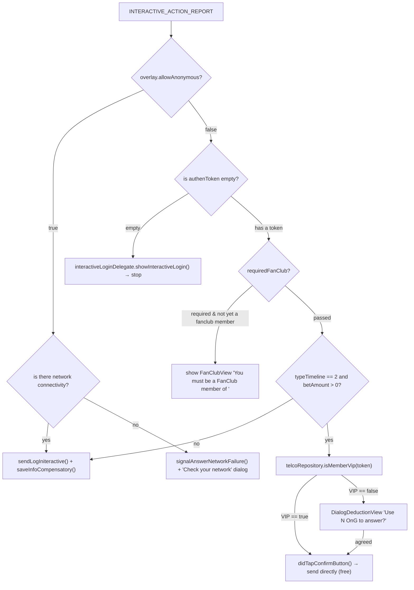

### 6.1. `sendLogIniteractive` — calling the `/api/actions` API

```mermaid
sequenceDiagram
    participant OMI as OverlayManagementImpl
    participant TRK as OverlayTrackingSession
    participant API as POST /api/actions
    participant WV as WKWebView

    OMI->>OMI: if action == CLICK_ADS → open urlLinkAds via Safari, do NOT call the API
    OMI->>OMI: data += media, socket_id, versionSDK; params += deviceId, type, os=iphone
    OMI->>TRK: sendAnswerAttempt() → emit-ack stage 'answer'
    OMI->>API: POST (Authorization Bearer if the token starts with 'ey', X-TENANT-ID)
    alt success == true
        API-->>OMI: {success: true, result}
        OMI->>TRK: sendAnswerSucceeded() → stage 'answer-succeeded'
        Note over OMI,WV: on the isReturnData branch (bet/VIP): postMessage UPDATE_CONFIRM
        OMI->>OMI: saveInfoCompensatory()
    else success == false / error
        API-->>OMI: {success: false, result{message, description}} or a network error
        OMI->>TRK: sendAnswerFailed(reason, step) → stage 'answer-failed'
        OMI->>OMI: showDialogDedution according to result.message
    end
```

Error code → `failureReason` mapping (`OverlayTrackingFailure.answerFailureReason`):

| `result.message` | `failureReason` | `failureStep` |
|---|---|---|
| `EX400` | `api_EX400` | `api_response` |
| `TL404` | `api_TL404` | `api_response` |
| `PM402` | `api_PM402` | `api_response` |
| other, `success == false` | `api_false` | `api_response` |
| network error | `network_error` | `network` |
| body cannot be parsed | `unknown_response` | `unknown_response` |

Suggestion dialog (`showDialogDedution`) according to `result.message`:

| `message` | Content |
|---|---|
| `PM402` | "Please top up OnG" → triggers `showSubscibeView` / `NEED_PAY` |
| `EX400` | "You have already answered this question" |
| `answerSuccess` | "You answered the question successfully" |
| other | "Failed to answer the question" |

---

## 7. Predict (`typeTimeline = 3`)

```mermaid
sequenceDiagram
    participant WS as Socket
    participant ICV as InteractiveControllerView
    participant PMI as PredictManagementImpl
    participant DLG as DialogLuckyNumberView (shared)
    participant API as /api/actions

    WS-->>ICV: overlay (typeTimeline = 3)
    ICV->>PMI: set the button image (idle/power from the payload, fallback to CDN_PREDICT_*)
    ICV->>PMI: addSubview the button; update its state according to status
    ICV->>PMI: setUpDataForTemplatePredict() → setUrlWebView + setDataForPredict

    Note over WS,ICV: realtime event 'predict-timeline' (DataButtonPredict)
    WS-->>ICV: {type: ACTIVE} → show the button, PREDICT = SHOW
    WS-->>ICV: {type: INACTIVE} → hide the button, remove the dialog, PREDICT = HIDE_CMS
    WS-->>ICV: {type: POWER} → button switches to the power image, alpha 1 → 0.5 after 5s
    WS-->>ICV: {type: END} → clear the cached result, hide the button, hideLayoutViewPredictRoot, PREDICT = END

    PMI->>PMI: user taps the button (didButtonClick)
    alt authenToken is empty
        PMI->>PMI: DialogConfirmView → showInteractiveLogin()
    else has a token
        PMI->>DLG: embededInteractiveContentView() → load the URL, handler 'IOS'
        DLG->>PMI: INTERACTIVE_ACTION_REPORT → answer flow (login/fanclub/VIP)
        PMI->>API: POST /api/actions (isReturnData = true)
        API-->>PMI: success → UPDATE_CONFIRM; failure → showDialogDedution
    end

    WS-->>ICV: 'predict-result' → answer1/answer2 → UPDATE_COUTER (postMessage)
```

Status flags controlling the button (stored in `UserDefaults`, constants in `TypeInteractive`):

| Key | Meaning |
|---|---|
| `MINI_GAMES` | Whether a mini game is currently occupying the screen (`SHOW`/`HIDE`) |
| `PREDICT` | Predict button state (`SHOW`/`HIDE`/`HIDE_CMS`/`END`) |
| `POPUP_PREDICT` | Whether the predict dialog is open (`SHOW`/`HIDE`) |
| `INTERACTIVE_TYPE_TIMELINE` | `3` for predict, `5` for lucky, `0` for none |

Button image: predict uses an **animated GIF** (`CDN_PREDICT_IDLE/POWER`), lucky uses a **static
PNG** (`CDN_LUCKY_IDLE/POWER`); distinguished by the `.gif` extension.

> ⚠️ The entire `predict-timeline` / `lucky-event` flow **is skipped** for the tenants `vtvlive`,
> `onlivetv`, `VTVprime` (early return in `receiveDataActionButtonPredict`).

---

## 8. Lucky number (`typeTimeline = 5`)

Structurally similar to Predict (shares `DialogLuckyNumberView`), with the following differences:

- The URL has `&u=<userId>` appended (lucky only).
- The default images are `CDN_LUCKY_IDLE/POWER` (PNG).
- The result returned from the API is pushed down to the web via **`UPDATE_NUMBER_LUCKY`**:

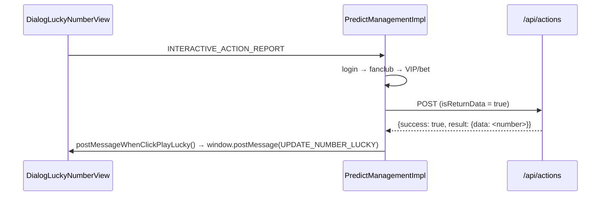

---

## 9. Overlay recall — overlay-recall

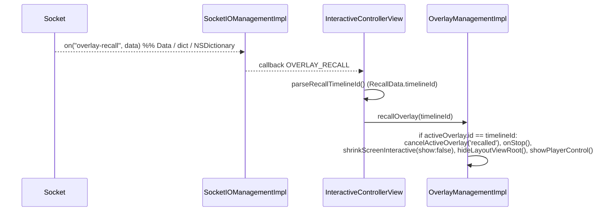

Used when an editor removes an overlay that is currently being broadcast system-wide. It is only
removed if `timelineId` matches the overlay currently being displayed.

---

## 10. Auxiliary events

| Socket event | Handling |
|---|---|
| `liveviews` | Parse `LiveViewDto.count`, call `showLiveView(liveView: 230 + count)` (**add 230**) |
| `data` (fanclub) | Decode `FanClub`; if `mediaId` matches the part before the `_` of the media currently being watched and `isFanClub` is true → set `KEY_FAN_CLUB = true`, otherwise `false` |
| `ckst` | Decode `CkstResponse`; get `getPlayerState()` from the delegate → re-emit `ckst` with `CkstData(action: "CHECK_PLAYER_STATUS", sessionId, data: Ckst{deviceId, os, mediaContentId, playerStatus, tenantId})` |
| `update-result` | `sendMessageResultinteractive()` → `window.postMessage(UPDATE_DATA_INTERACTIVE)` |
| `predict-result` | Update `answer1`/`answer2`, cache into `DATA_RESULT_PREDICT`, push `UPDATE_COUTER` |
| `branching` | Decode `Branching`; based on `action` (`START/PLAY_MINIGAME/END_VIDEO_BRANCHING`) calls `BranchingSocketIODelegate` (preload / show / end branching video) |

> `liveViews + 230` is intentional behavior in the current source code (`showCCU`). If the raw
> number is needed, the app must subtract it back out itself.
>
> In the `ckst` payload emitted upward, the `data` field is mapped to the **JSON key `"os"`**
> (per the `CodingKeys` of `CkstData`) — worth noting when comparing against the backend.

---

## 11. VOD flow

```mermaid
sequenceDiagram
    participant APP as App
    participant ICV as InteractiveControllerView
    participant API as GET /api/ctc/scenario/v2/vod/{mediaId}/{os}
    participant OMI as OverlayManagementImpl

    APP->>ICV: joinRoom(mediaId, type: 2)
    ICV->>ICV: if currently connecting → disconnection(); removeAllView()
    ICV->>API: callApiScenarioForVod(header X-TENANT-ID)
    API-->>ICV: VODOverlayData {data.timelines[]}
    ICV->>ICV: convertVodInteractive(): filter showStatus == ACTIVE,<br/>sort by timeShow (seconds)

    loop every second (fed by the app)
        APP->>ICV: getTimeVideo(time: seconds)
        ICV->>ICV: find the timeline with timeShow == Int(time)
        alt exact second match
            ICV->>ICV: showInteractiveVod(): check allowAnonymous/token
            ICV->>ICV: build the URL (timelineId, tenantId, deviceType=IOS)
            ICV->>OMI: showOverlayVod(overlay, token, mediaId)
            ICV->>ICV: remove the timeline from the list (do not show again)
        end
    end
```

Differences compared to LIVE:

| | LIVE | VOD |
|---|---|---|
| Overlay source | Pushed via Socket.IO | The entire scenario is loaded upfront via REST |
| Display trigger | Realtime event | `getTimeVideo(seconds)` fed by the app |
| `socketIO` | Connected | Disconnected (all socket calls are safely ignored) |
| `socket_id` in the action | Present | Absent |
| Emit-ack tracking | Present | **Absent** (`showOverlayVod` does not call `beginRenderTracking`) |
| Predict / Lucky / liveviews / ckst | Present | Absent |
| Display condition | full login/fanclub/VIP checks | only `allowAnonymous` or has a token |

---

## 12. Disconnection and recovery

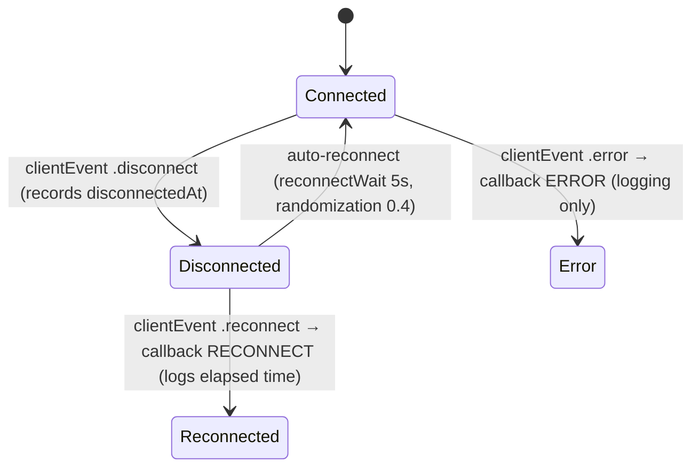

- The Socket.IO client automatically reconnects (`.reconnects(true)`, `reconnectWait 5`). When
  `.connect` fires again, the `CONNECTED` callback runs → if there is a `mediaContentId` it will
  **emit `join-room`** again.
- `isConnected()` returns `true` even when `status == .connecting` or `reconnects == true` — so it
  should be treated as "connecting/will connect," not only "already connected."
- `disconnection()` removes **all** client + app handlers, calls `disconnect()`, and sets
  `socketManager = nil`.

---

## 13. Resource release

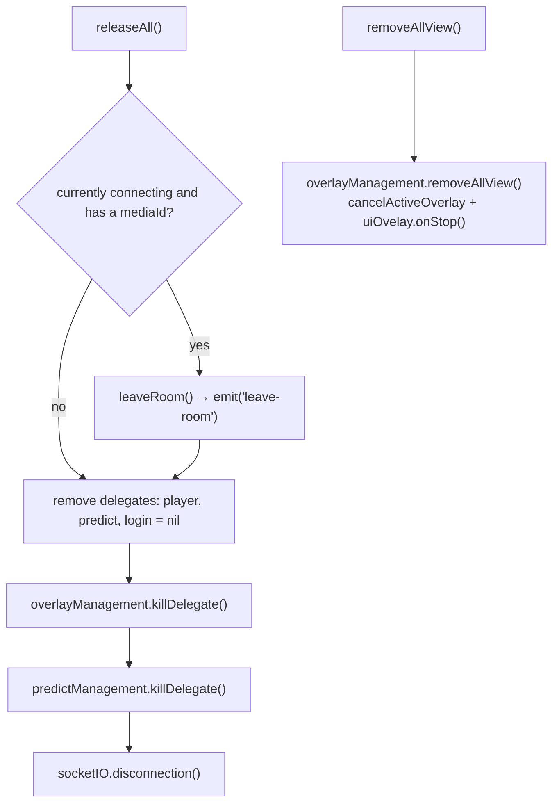

`releaseAll()` is called when:

- Leaving the player screen (`viewWillDisappear`/`deinit`),
- The user leaves the content,
- Before switching to a different `mediaId` **if** `joinRoom()` is not called immediately after
  (since `joinRoom` already calls `removeAllView()` and handles the socket on its own).

---

[← Installation & Integration](02-cai-dat-va-tich-hop.md) · [Back to table of contents](README.md) · [Next: API Reference →](04-api-reference.md)
