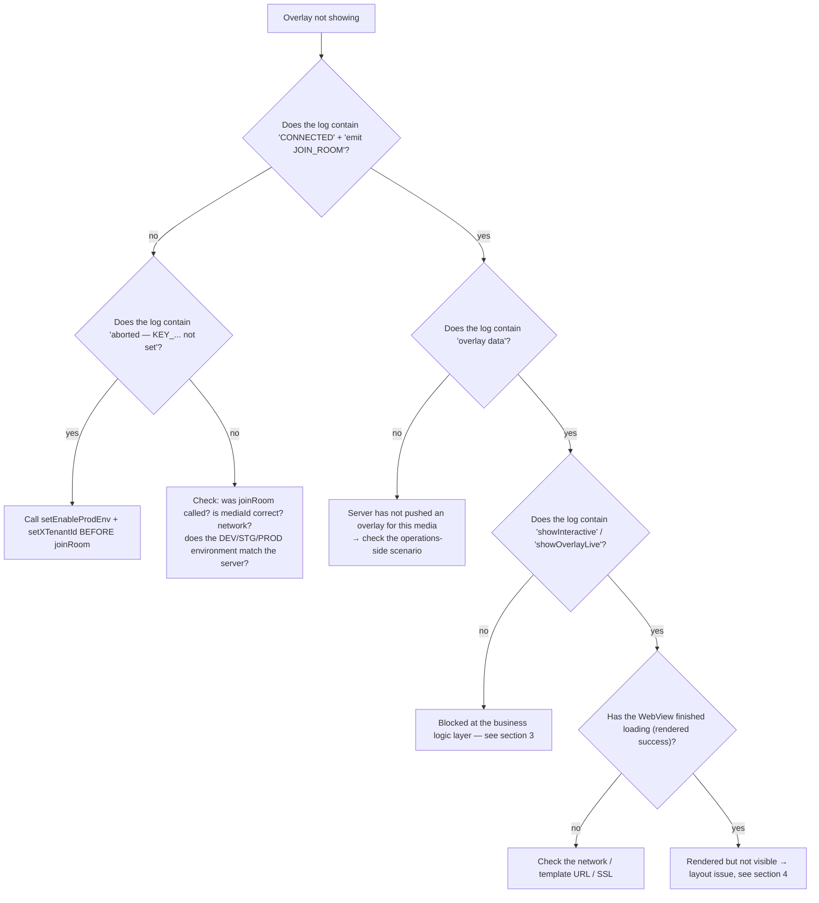

# 06 — Common errors & diagnosis

[← Back to table of contents](README.md)

---

## 1. Enabling SDK logs

The SDK logs via the `logLine(...)` function (`Const/PrintLog.swift`) — always `print`s with the prefix
**`Interactive:`**. View it in the Xcode Console or filter it:

```bash
# When running via Console.app / log stream
log stream --predicate 'eventMessage CONTAINS "Interactive:"'
```

Notable log strings (prefix `Interactive:`):

| Log | Meaning |
|---|---|
| `[Socket] connectSocket() — env: ...` | Starting to prepare the connection |
| `[Socket] ❌ connectSocket() aborted — KEY_X_TENANT_ID not set` | `setXTenantId` has not been called |
| `[Socket] ❌ connectSocket() aborted — KEY_ENABLE_PROD_ENV not set` | `setEnableProdEnv` has not been called |
| `[Socket] ✅ CONNECTED — sid: ...` | Socket has connected |
| `[Socket] emit JOIN_ROOM — mediaContentId: ...` | Room joined |
| `Interactive-socket overlay data` | Overlay received from server |
| `startShowLiveOverlayWithDataReceived` | Started processing the overlay |
| `1 showInteractive isView : false` | Overlay blocked due to `Compensatory` (already interacted with) |
| `quá giờ trả lời` (answer window expired — literal SDK log string, kept as-is) | Overlay's `duration` (counted from `ts`) has expired |
| `[Socket] 🔌 DISCONNECTED` / `🔄 RECONNECT` | Connection lost/restored |

---

## 2. Overlay not showing — diagnosis tree



---

## 3. Blocked at the business logic layer

| Symptom | Cause | Resolution |
|---|---|---|
| `showInteractive isView : false` | `Compensatory` — checkpoint already interacted with, still within `frequencyLimit` | Expected design. To test again: clear the `INTERACTIVE_<userId>` / `INTERACTIVE_DEFAULT` suite |
| `quá giờ trả lời` (answer window expired) | Overlay's `duration` (counted from `ts`) has expired | Expected design |
| Overlay not showing, `targets` mismatch | `targets` contains neither `iphone` nor `all` | Fix the scenario so `targets` includes `iphone`/`all` |
| Predict/lucky button not showing for OnPlus/OnLiveTV/SeeNow | `receiveDataActionButtonPredict` returns early for tenant `vtvlive`/`onlivetv`/`VTVprime` | Current expected design; if you want to enable it, change the tenant condition in the SDK |
| User taps to answer but nothing happens | `!allowAnonymous` and not logged in | Make sure `InteractiveLoginDelegate.showInteractiveLogin()` is implemented and call `initAuthenToken` after login |
| Dialog "You must be a FanClub member of …" appears | `requiredFanClub` and `KEY_FAN_CLUB == false` | Expected design; need to join the fanclub (wait for the socket `data` event to update) |
| Dialog "Use N OnG to answer?" appears | `typeTimeline == 2`, `betAmount > 0`, not VIP | Expected design (telco VIP flow) |

---

## 4. Overlay renders but is not visible / positioned incorrectly

| Cause | Symptom | Resolution |
|---|---|---|
| `uiView` (overlay container) has size 0 | Render log is normal, but the screen is blank | Constrain `uiView` to correctly cover the video frame before calling `initOverlay` |
| `uiView` is drawn over by the player | Overlay "flickers" then disappears | Add `uiView` **after** the player (subview order), or increase `zPosition` |
| `predictView` positioned incorrectly | Predict/lucky button is misaligned | Update the `predictView` frame in `showLayoutViewPredictRoot()` (see the `updateLayoutPredict` demo) |
| `resizeVideoView` not called when the frame changes | Overlay does not scale with the fullscreen player | Call `interactive.resizeVideoView(width:height:)` when the video frame changes |
| `locationLayoutViewRoot` not handled | Overlay always stays in one place | Implement `InteractiveViewDelegate.locationLayoutViewRoot(location:width:height:)` to position it according to `location` 0..8 |

The WebView overlay is a **transparent** `WKWebView` (`isOpaque = false`, `.clear` background, no
scrolling). If a black/white background is covering the video, check whether the web template has
a transparent background.

---

## 5. Socket fails to connect

Checklist:

1. **Not configured yet**: log shows `aborted — KEY_X_TENANT_ID not set` / `KEY_ENABLE_PROD_ENV not set`.
   → Call `InteractiveSetting().setXTenantId(...)` and `setEnableProdEnv(...)` at startup.
2. **Wrong environment**: `Enviroment` must match the server system (DEV/STG/PROD) — the URL is derived from the env.
3. **Wrong tenant**: the server may reject the room.
4. **Token**: the socket's `Authorization` header is sent **verbatim** (it does not automatically add `Bearer`). If the backend
   requires `Bearer` for the socket, the string with the prefix already attached must be passed into `initAuthenToken`.
5. **`isConnected()` returns `true` but it is actually still connecting**: the function returns `true` even during
   `.connecting`/reconnects — do not rely on it entirely to confirm the connection is actually online.

---

## 6. Crashes after integration

| Error | Cause | Resolution |
|---|---|---|
| Crash `Unexpectedly found nil` right when calling joinRoom / an API | Force-unwrap of `UserDefaults.string(forKey: KEY_X_TENANT_ID)!` / `KEY_ENABLE_PROD_ENV!` when not configured yet | **Always** call `setEnableProdEnv` + `setXTenantId` first (this is the cause of the `[fixbug] crash` commit) |
| Missing symbol at link time (Alamofire / SocketIO / SwiftyJSON) | The static XCFramework does not carry its dependencies | Re-declare the pod in the app target |
| Missing RxSwift/RxCocoa symbol | The Rx `*.xcframework` files have not been embedded | Embed `RxSwift/RxCocoa/RxRelay.xcframework` (Embed & Sign) |
| WebView does not receive callbacks | Template calls the wrong interface name | The interface must be **`IOS`** (`window.webkit.messageHandlers.IOS.postMessage(...)`) |

---

## 7. VOD: overlay does not appear at the right checkpoint

| Cause | Resolution |
|---|---|
| App does not call `getTimeVideo()` | Add a 1-second loop/observer after `joinRoom(type: 2)` |
| Wrong unit fed in (milliseconds instead of seconds) | `getTimeVideo` expects **seconds** (matching `timeShow`) |
| User seeks past the checkpoint | The SDK matches by **exact second** (`timeShow == Int(time)`); the checkpoint is skipped — a current limitation |
| Not logged in, overlay does not `allowAnonymous` | `showInteractiveVod` skips it; log in then call `joinRoom` again |
| Scenario returns empty | Check `callApiScenarioForVod` (env, `X-TENANT-ID`, `mediaId`); `convertVodInteractive` only picks up `showStatus == "ACTIVE"` |

---

## 8. Technical notes to know for maintenance

Points in the current code that are easy to get confused by, worth noting:

- **`liveViews + 230`**: `showCCU` hardcodes an addition of 230 to the viewer count before calling `showLiveView`. If
  the raw number is needed, the app must subtract it back out itself.
- **`CkstData.data` maps the JSON key `"os"`**: the `ckst` payload emitted has a nested field named `os` (not
  `data`). Cross-check with the backend if there is a mismatch.
- **`UPDATE_COUTER`** (missing the letter N) and **`PredictResult.timlineId`** (missing the letter e) are **verbatim**
  in the code — the web template must match this exact spelling.
- **`DialogLuckyNumberView` is shared between both predict and lucky** at runtime; `DialogPredictView` is
  almost never used.
- **`LiveCompensatoryShotImpl.loadScenarioLive`** returns **synchronously** before the Alamofire request
  completes → it almost always returns `nil`. Only `fetchOverlayStatus` (used for `fetchInteractiveStatus`) works
  correctly. Be careful if reusing this function.
- **Two casing styles for the tenant header**: the socket uses `x-tenant-id` (lowercase), REST uses `X-TENANT-ID` (uppercase).
- **Sentry has been disabled**: both `SentryInteractor` and `InteractiveSetting.startSentry` are commented out.
- **`addCallback` has a single slot**: calling it again overwrites the previous callback — do not attach multiple listeners.

---

## 9. Frequently asked questions

**Does the SDK automatically track the `UIViewController` lifecycle?**
No. The app must call `releaseAll()` itself when leaving the screen. The SDK only listens automatically to
`orientationDidChange` to reposition the predict button.

**Can multiple minigame overlays be shown at the same time?**
No. `showOverlayLive` calls `cancelActiveOverlay` + `onStop()` before adding a new one → there is always only
one minigame overlay. The predict/lucky button is a separate view, so it exists in parallel (the SDK auto-hides
the button when a minigame takes over the screen).

**What happens if the account is switched mid-session?**
Call `initAuthenToken(newToken, newUserId, "")`. If Live is currently active, the SDK will automatically rejoin
the room with the new token.

**Is `releaseAll()` required before every `joinRoom()`?**
No — `joinRoom()` already calls `removeAllView()` and handles the socket itself. Only call `releaseAll()` when
actually leaving.

**Does rotating the screen lose the overlay?**
The server-driven minigame overlay will be re-pushed if it is still valid; the predict button is repositioned via
`orientationDidChange`. Layout controlled by the app goes through `InteractiveViewDelegate`.

**Which WebView does the SDK use?**
`WKWebView` (some dialogs use `NoZoomWKWebView` to block pinch-zoom). JavaScript is enabled, the background is
transparent, and scrolling is disabled.

---

[← Tracking emit-ack](05-tracking-emit-ack.md) · [Back to table of contents](README.md)
