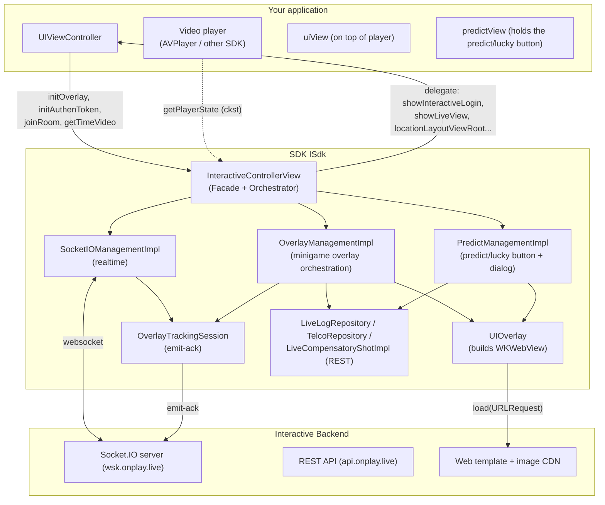
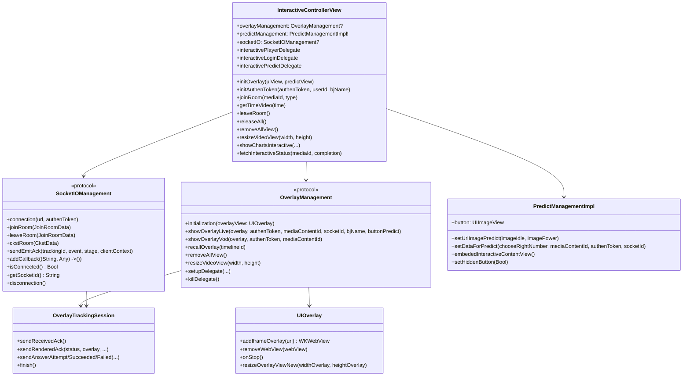
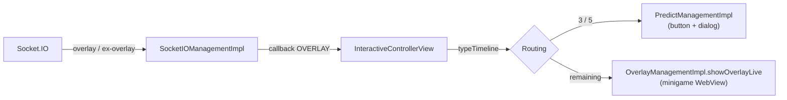
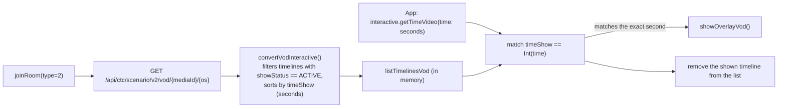
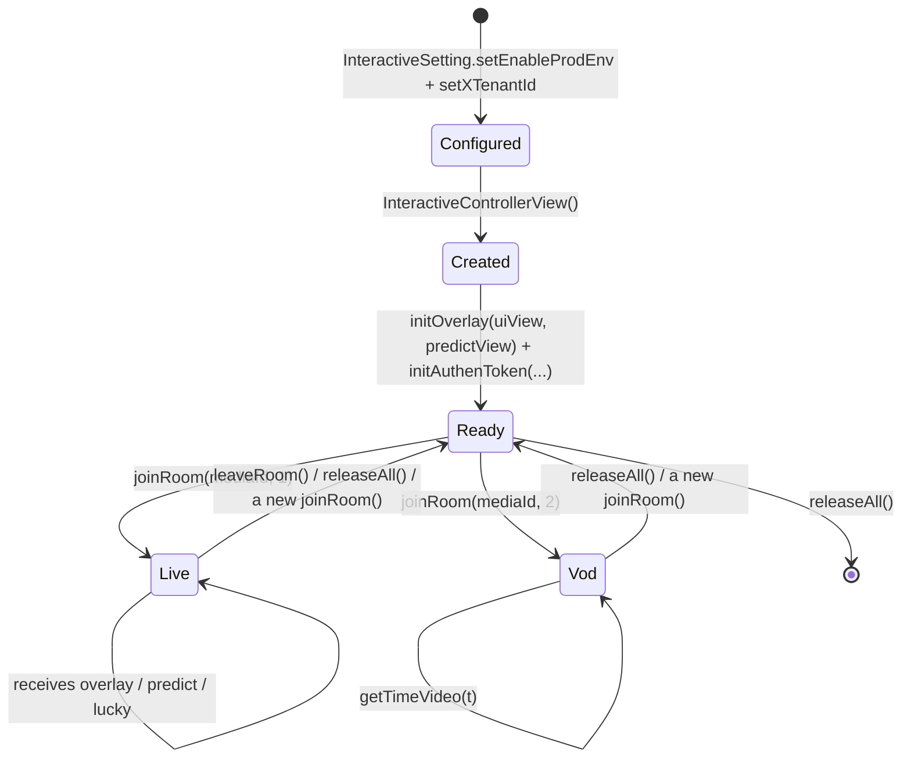
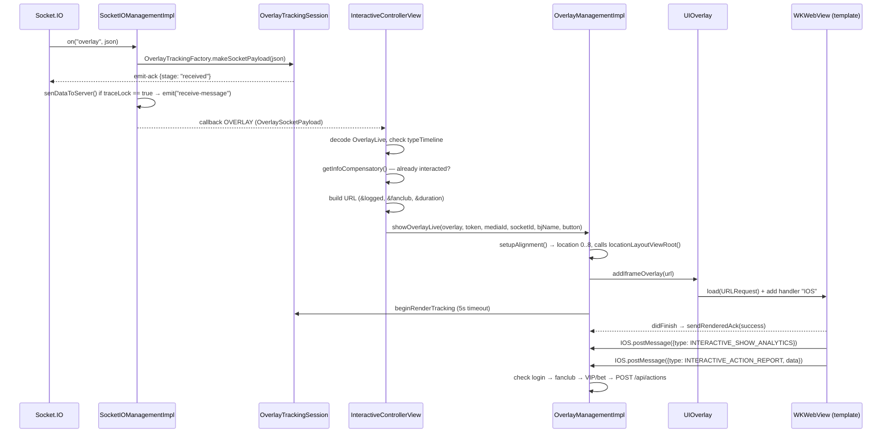
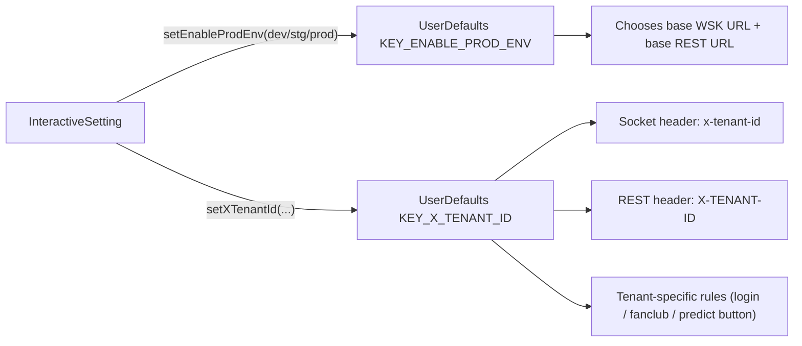

# Interactive SDK Architecture (iOS)

[← Back to index](README.md)

---

## 1. Big picture

The SDK is an **iOS library (XCFramework `ISdk`)** that packages 3 main responsibilities:

1. **Realtime connection** to the Interactive server via Socket.IO (Live scenario).
2. **Display orchestration** of interactive content (built with web) inside transparent `WKWebView`s.
3. **Forwarding user actions** to the server via REST and **calling back** the app through delegates.

---

## 2. Layers and responsibilities

| Layer | Component (file) | Responsibility |
|---|---|---|
| **Facade / Orchestrator** | `InteractiveControllerView` | The app's single entry point. Receives commands (`joinRoom`, `initAuthenToken`, `getTimeVideo`, `releaseAll`…), listens to socket events, decides overlay type (minigame / predict / lucky), coordinates the managers |
| **Configuration** | `InteractiveSetting` | Writes environment (`KEY_ENABLE_PROD_ENV`) and tenant (`KEY_X_TENANT_ID`) into `UserDefaults` |
| **Realtime transport** | `SocketIOManagementImpl` (`SocketIOManagement`) | Creates/destroys the socket, registers events, normalizes payloads, sends emit-ack |
| **Overlay orchestration** | `OverlayManagementImpl` (`OverlayManagement`) | Builds minigame overlays, handles the answer flow (login → fanclub → VIP/bet → API call), tracking |
| **Predict/lucky orchestration** | `PredictManagementImpl` | Floating GIF button, prediction/lucky-number dialog, its own answer flow |
| **WebView presentation** | `UIOverlay`, `ConfigureWebView` (`NoZoomWKWebView`) | Creates a transparent `WKWebView`, attaches/removes it according to overlay lifecycle |
| **Secondary presentation** | `DialogLuckyNumberView`, `DialogPredictView`, `DialogConfirmView`, `DialogDeductionView`, `FanClubView`, `LeaderboardView` | Full-screen dialogs / floating buttons / leaderboard |
| **Bridge** | `OverlayWebViewCallBack`, `PredictWebViewCallBack` | JavaScript ⇄ Swift bridge (`WKScriptMessageHandler`, interface name `IOS`) |
| **REST** | `LiveLogRepository` (`/api/actions`), `TelcoRepository` (`/api/public/vip-status`), `LiveCompensatoryShotImpl` (`interactive-status`), the `OverlayVod*` classes (VOD) | API calls via Alamofire |
| **Observability** | `OverlayTracking.swift` (`OverlayTrackingSession`, `OverlayTrackingFactory`) | Measures overlay lifecycle and sends `emit-ack` |
| **Infrastructure** | `ApiConst`, `TypeInteractive`, `SocketEvents`, `Utils`, `PrintLog`, various `Codable` models | Constants, utilities, data models |

### Design principles reflected in the code

- **A single facade for the app**: the app mainly touches `InteractiveControllerView` +
  `InteractiveSetting` + the delegate `protocol`s. The child managers are still `public` but
  usually don't need to be called directly.
- **Events flow through a single callback**: the socket pushes back to the SDK via a closure
  `(String, Any) -> ()` attached through `addCallback` (single-slot);
  `InteractiveControllerView.handleEventsSocket()` `switch`es on the event name.
- **Interactive content is web-based**: the SDK doesn't draw the question UI itself, it only loads
  a template URL into `WKWebView` and exchanges data via `postMessage`. Changing the interactive UI
  doesn't require rebuilding the app.
- **Configuration lives in `UserDefaults`**: environment and tenant are read back everywhere
  (socket headers, choosing the REST base URL…). This is also the source of several **force-unwrap
  crashes** when not configured beforehand.

---

## 3. Simplified class diagram

---

## 4. Two operating modes

### 4.1. LIVE (`type = 1`, `ApiConst.TYPE_LIVE`) — server-driven

The server actively pushes overlays via Socket.IO. Display/answer conditions (login, fanclub,
VIP/bet, whether already answered) are checked directly on the client.

### 4.2. VOD (`type = 2`, `ApiConst.TYPE_VOD`) — playback-progress-driven

No socket. The SDK preloads the entire scenario via REST, then **the app must feed playback time**:

> `timeShow` is derived from `Timelines.time` (format `"SS"`, `"MM:SS"` or `"HH:MM:SS"`, function
> `parseTimeToSeconds`), so the unit fed into `getTimeVideo` is **seconds**.

---

## 5. Threading model

| Task | Thread | Note |
|---|---|---|
| Socket.IO events | Socket.IO client's thread | Delivered into the `addCallback` closure |
| Building/destroying WebView | **Main thread** | `showInteractive`/`setUpDataForTemplatePredict` called inside `DispatchQueue.main.async` |
| Calling REST | Alamofire's thread, callback on main | `AF.request(...).response*` |
| Emit-ack tracking | Synchronized inside `OverlayTrackingSession` (`emittedStages`, `finished` flags) | Render timer uses `Timer` on main |
| Predict button image/alpha change | Main (`Timer.scheduledTimer`) | Fades alpha to 0.5 after **5 seconds** |

> Unlike the Android version, iOS **does not** have `QueuedMutableLiveData` — overlay events are
> processed sequentially right inside the callback. `addCallback` is **a single slot**, calling it
> again overwrites the previous one.

---

## 6. Object lifecycle

Key points in the code:

- **The `InteractiveControllerView()` constructor only creates `SocketIOManagementImpl` and
  `OverlayManagementImpl`** — no connection opened yet, no API called yet.
- **`joinRoom(type: 1)`** leaves the old room (if it's a different media), disconnects the old
  socket, calls `removeAllView()`, reattaches the socket callback, then `connectSocket()`.
  `emit("join-room")` only happens **after the socket connects successfully** (in the
  `SocketEvents.CONNECTED` branch).
- **`joinRoom(type: 2)`** disconnects the socket (if open), calls `removeAllView()`, calls the REST
  API to load the VOD scenario.
- **`initAuthenToken()` while connected with an active media** → disconnects the socket and calls
  `joinRoom(type: 1)` again so the socket carries the new token.
- **`releaseAll()`** calls `leaveRoom()` (if connected), removes all delegates, and
  `disconnection()`.

---

## 7. Data flow for one minigame overlay (Live)

For a detailed look at each branch (including blocking points) see [03 — Operational Flow](03-luong-hoat-dong.md).

---

## 8. WebView bridge protocol

The SDK attaches a `WKScriptMessageHandler` named **`IOS`** (`userContentController.add(callBack, name: "IOS")`).

**Web → SDK** (`window.webkit.messageHandlers.IOS.postMessage(jsonString)`) — decoded into
`OverlayDataCallback { data, type }`:

| `type` (`TypeInteractive` constant) | Meaning |
|---|---|
| `INTERACTIVE_SHOW_ANALYTICS` | Overlay has been shown → `showLayoutViewRoot()`, hides player controls |
| `INTERACTIVE_HIDE_ANALYTICS` | Overlay closed → removes the WebView, clears tracking, shows player controls again |
| `INTERACTIVE_ACTION_REPORT` | User answered / tapped an ad (`action = CLICK_ADS`) |
| `INTERACTIVE_OPEN_ANALYTICS` / `INTERACTIVE_CLOSE_ANALYTICS` | Opens/closes the predict/lucky dialog (handled in `PredictManagementImpl`) |
| `INTERACTIVE_PING_ANALYTICS` | Used only for filtering, not logged |

**SDK → Web** (`webView.evaluateJavaScript("window.postMessage('<json>', '*')")`):

| `key` | When | Where emitted |
|---|---|---|
| `UPDATE_DATA_INTERACTIVE` | Socket `update-result` | `sendMessageResultinteractive()` |
| `UPDATE_COUTER` *(sic — missing an N)* | Socket `predict-result` → `answer1/answer2` | `receiveDataResultPredict()` + when reopening the dialog |
| `UPDATE_NUMBER_LUCKY` | API returns lucky result | `postMessageWhenClickPlayLucky()` |
| `UPDATE_CONFIRM` | Answer succeeded (bet/VIP branch) | `postMessageWhenAnswerSuccess()` |

> ⚠️ Unlike the Android version, iOS **does not** use the `LOADED_OVERLAY` / `GET_DATA_INTERACTIVE`
> keys. The iOS template is loaded directly with a URL that already carries its parameters;
> additional data (results) is only pushed down later via the keys above.

---

## 9. Environment & tenant configuration

- `Enviroment` = `DEV` (`"dev"`) / `STG` (`"stg"`) / `PROD` (`"prod"`) — chooses both the socket URL
  (`*.onplay.live` WSK) and the REST URL and the leaderboard URL.
- `TenantIdType`: `vtvlive` (OnPlus), `onlivev2` = `onliveLiveStream` (SOOP), `onlivetv` = `onliveTV`
  (OnLive TV), `VTVprime` (SeeNow). Some tenant-specific rules in the current code:
  - **The predict/lucky button is skipped** for tenants `vtvlive`, `onlivetv`, `VTVprime`
    (`receiveDataActionButtonPredict` returns early).
  - **Only the `onlivev2` tenant** applies the `&fanclub=false` parameter when the user isn't a
    fanclub member.
- `ApiConst.OS = "iphone"` goes into the socket `os` header, the `os` field of the
  `/api/actions` body, the `os` parameter of the VOD scenario URL, and the overlay's `targets`
  filter condition (`targets.contains("iphone")` or `"all"`).

---

## 10. Local storage (`UserDefaults`)

| Key / suite | Purpose |
|---|---|
| `KEY_ENABLE_PROD_ENV`, `KEY_X_TENANT_ID` | Environment + tenant (must be configured beforehand) |
| `KEY_MEDIA_CONTENT_ID` | Most recently joined media |
| `MINI_GAMES`, `PREDICT`, `POPUP_PREDICT`, `INTERACTIVE_TYPE_TIMELINE` | Display state machine (`SHOW`/`HIDE`/`HIDE_CMS`/`END`) |
| `KEY_FAN_CLUB` | Whether the user is a fanclub member of the media being watched |
| suite `INTERACTIVE_<userId>` / `INTERACTIVE_DEFAULT`, key = `mediaId` | `Compensatory` — prevents showing/answering a time mark again |
| suite `DATA_RESULT_PREDICT`, key = `timelineId` | Cache of predict results (`answer1`/`answer2`) to push again when reopening the dialog |

---

[← Back to index](README.md) · [Next: Setup & Integration →](02-cai-dat-va-tich-hop.md)
