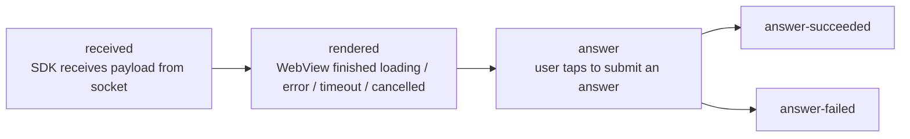
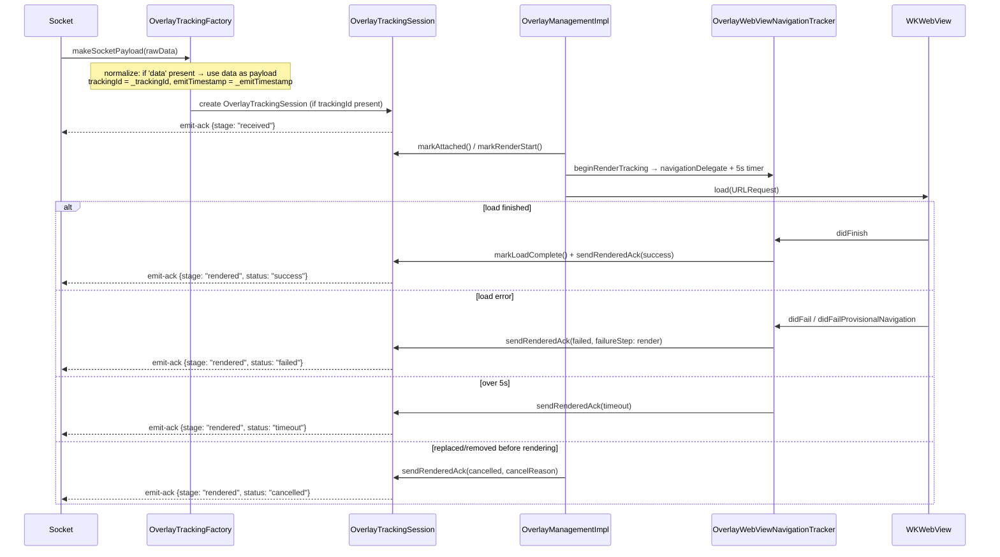
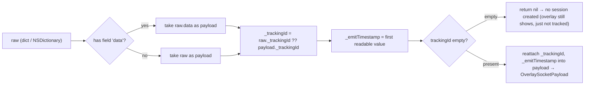

# 05 — Tracking emit-ack (overlay lifecycle measurement)

[← Back to table of contents](README.md)

This mechanism answers a question from the operations side: *"Did the overlay pushed by the server
actually reach the user's device, did it render, and did the user answer?"* — measured on the
client itself, sent back to the server via the **`emit-ack`** socket event.

> The entire tracking layer resides in `Libraries/Overlay/Tracking/OverlayTracking.swift`. The app
> does **not** interact with it directly — the SDK measures and sends everything itself over the
> socket that's already open.
>
> ⚠️ Tracking **only runs in LIVE mode**. `showOverlayVod` does not call `beginRenderTracking`, and
> VOD has no socket to emit through.

---

## 1. Stages



| Stage (`OverlayTrackingStage`) | Meaning | Ends session? |
|---|---|---|
| `received` | Valid payload has entered the SDK | No |
| `rendered` | Final display result with `status` | Yes, if `status != success` |
| `answer` | Started sending an answer | No |
| `answer-succeeded` | API returned `success == true` | Yes |
| `answer-failed` | API error / rejected / network error | Yes |

`status` of `rendered` (`OverlayTrackingStatus`): `success` | `failed` | `timeout` | `cancelled`.

Each stage is sent **only once** per session (`emittedStages` is a `Set`). After the session
`finish()`, any subsequent `emitStage` is ignored.

---

## 2. Payload structure sent to the server

```jsonc
// socket.emit("emit-ack", payload)
{
  "trackingId": "<_trackingId taken from the overlay payload>",
  "event": "overlay",
  "stage": "received | rendered | answer | answer-succeeded | answer-failed",
  "deviceId": "<identifierForVendor>",
  "clientContext": { /* see below */ }
}
```

### `clientContext` — common part

| Field | Source |
|---|---|
| `profile` | `"overlay.legacyIframe"` (fixed constant, iOS has only 1 profile) |
| `transportMode` | `"legacyIframe"` |
| `sdkVersion` | `ApiConst.VERSION_SDK` (`"2025-05-25"`) |
| `platform` | `"ios"` |
| `os` | `UIDevice.systemName + " " + systemVersion` (e.g. `"iOS 17.5"`) |
| `deviceClass` | `"tablet"` if iPad, otherwise `"mobile"` |
| `viewportWidth`, `viewportHeight` | `UIScreen.main.bounds` |

### Per stage

| Stage | Additional fields |
|---|---|
| `received` | `emitTimestamp`, `receiveTimestamp`, `receiveLatencyMs`, `ackLatencyMs`, `timeline{received, ackSent}` |
| `rendered` | `status`, `receiveLatencyMs`, `renderLatencyMs`, `ackLatencyMs`, `timeline{attached, renderStart, loadComplete, readyReceived, ackSent}`, `duration?`, `overlayType?`, `failureReason?`, `failureStep?`, `custom.cancelReason?` |
| `answer*` | `actionType` (`answer_submit`), `actionResult` (`attempted`/`success`/`failure`), `actionLatencyMs`, `occurrenceId` (= `timelineId`), `overlayType?`, `failureReason?`, `failureStep?`, `custom{…}`, `timeline` |

> Difference from the Android version: iOS has **only one profile**, `overlay.legacyIframe`, with a
> **fixed render timeout of 5000 ms** (`OverlayTrackingConstants.renderTimeoutMs = 5.0`). There is no
> `ws=1` / `wsInteractive` branch, and `readyReceived` in the timeline is always `NSNull()` (iOS
> finalizes `rendered` based on the WebView's `didFinish`, without waiting for the template to
> report `LOADED_OVERLAY`).

---

## 3. Measurement flow for a single overlay (Live)



`OverlayTrackingSession` uses the `renderedAckSent` flag to ensure `rendered` is only emitted
**once**, even when timeout and `didFinish` happen close together.

---

## 4. Payload normalization (`OverlayTrackingFactory`)



Thanks to this step, the rest of the SDK works with an "unwrapped" payload (`data`), while still
retaining tracking metadata (`_trackingId`, `_emitTimestamp`).

There are **two paths for creating a session**:
1. In `SocketIOManagementImpl.trackedOverlayPayload()` — when receiving `overlay`/`ex-overlay`,
   create a session and send `received` immediately.
2. Fallback in `InteractiveControllerView.startShowLiveOverlayWithDataReceived()` — if the payload
   doesn't yet carry a session but `OverlayLive.trackingId` is not empty, create a new session and
   send `received`.

---

## 5. Cancellation reasons (`cancelReason` / `failureReason`)

The list of points where the SDK **intentionally does not display / cancels tracking** for the
overlay — useful when investigating "why didn't the overlay show":

| Value | Where it originates | Cause |
|---|---|---|
| `invalid_overlay_state` | `showOverlayLive` | `pos.alignment == nil` or `uiOvelay == nil` |
| `replaced_by_new_overlay` | `showOverlayLive` | A new overlay replaces the one currently displayed |
| `recalled` | `recallOverlay` | Server recalls the overlay by `timelineId` |
| `remove_all_view` | `removeAllView` | Clearing all views (rejoining / leaving the room) |
| `interactive_hide` | `INTERACTIVE_HIDE_ANALYTICS` | Web page reports overlay closed |
| `load_error` / `render` | Navigation delegate | WebView failed to load |
| `timeout` | 5s timer | WebView did not finish loading within 5 seconds |
| `api_EX400` / `api_TL404` / `api_PM402` / `api_false` | `/api/actions` API | Server rejected the answer |
| `network_error` (`network`) | No network when answering | `Connectivity.isConnectedToInternet == false` |
| `unknown_response` | Could not parse response | API response body malformed |

---

## 6. Latency calculations

`OverlayTrackingSession` uses millisecond timestamps (`Date().timeIntervalSince1970 * 1000`):

- `receiveLatencyMs = receiveTimestamp - emitTimestamp` — server→client network latency.
- `renderLatencyMs = loadComplete - receiveTimestamp` — WebView rendering time.
- `ackLatencyMs` — ack send latency.
- `actionLatencyMs = actionTimestamp - (readyReceived ?? loadComplete ?? renderStart ?? receive)` —
  time from render until the user answers.

---

## 7. Impact on integrating apps

- Tracking **does not** add any permissions, and does not call a separate API — it uses the socket
  that's already open.
- In **VOD mode there is no tracking**.
- If the overlay has no `_trackingId` (server did not attach one), the overlay still displays
  normally but **does not** emit an emit-ack.
- The app does not need to do anything; this is a monitoring tool for the operations/backend team.

---

[← API Reference](04-api-reference.md) · [Back to table of contents](README.md) · [Next: Common errors →](06-loi-thuong-gap.md)
