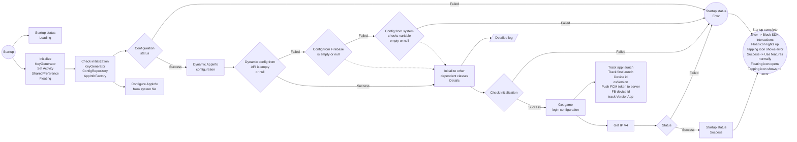
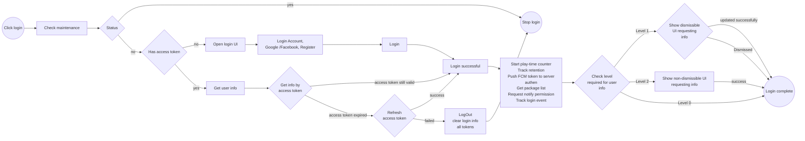
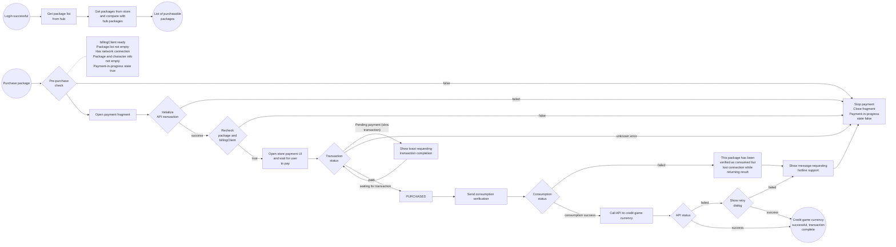
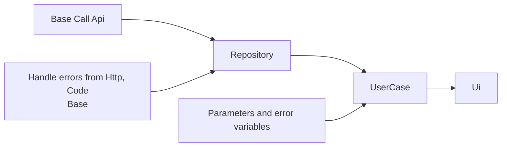
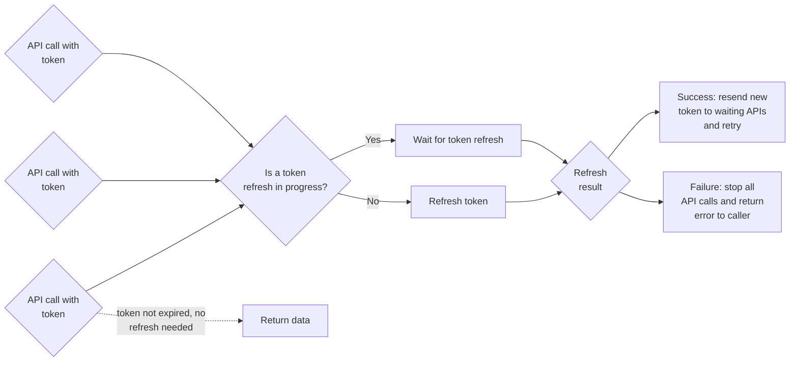
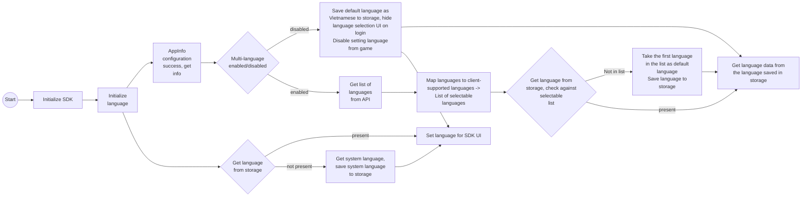
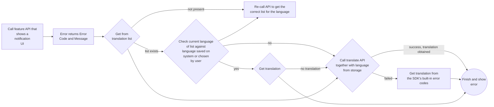
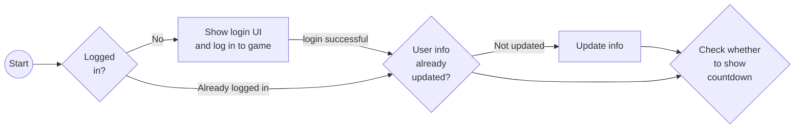

# SDK Features

# I. Overview

VLiveSDK provides the following main feature groups:


```markmap
# VLiveSDK
## OIDC v2
### Login
#### Vlive account
- username/password
#### SNS
- Facebook
- Google
- Apple
- Zalo
#### Quick login
#### VLive OpenID
### Logout
### Registration
### Forget password
### Profile
- user name
- birthday
- sex
- avatar
### Link user accounts
### Deactive account
## Floating button
- Drag/drop
- Show/hide
- Dimming (reduce opacity)
## Permission Manager
- Nomal permissions
- Runtime permissions
## Log Manager
- Intergration log
## Push notification
- Firebase Messaging
## Tracking
- Appflyer
- Facebook
- Firebase
## Payment
- other payment methods (Momo, Zalopay,...)
### In-App Purchase
- List Product
## Configuration
### Environment configs
- dev
- staging
- prod
### general configs
### UI configs
- enable
- disable
### configs tracking
- press 10 times on logo to show all configs
```

## 1. Libraries used

| Library | Verison | Inventory |
| --- | --- | --- |
| retrofit2 | 2.9.0 | |
| billingclient | 8.0.0 | |
| play-services-base | 18.5.0 | |
| play-services-auth | 21.3.0 | |
| firebase-bom | 33.0.0 | |
| game-tracking | 1.0.5 | |
| app-update | 2.1.0 | |
| glide | 4.15.1 | |
| browser | 1.8.0 | |
| facebook-android-sdk | 17.0.0 | |
| af-android-sdk | 6.16.0 | |
| installreferrer | 2.2 | |
| play:review | 2.0.2 | |
| okhttp3:logging-interceptor | 4.11.0 | |
| recaptcha:recaptcha | 18.6.0 | |
| tiktok-business-android-sdk | 1.5.0 | |
| lifecycle-process | 2.3.1 | |
| browser | 1.8.0 | |

## 2. Version notes

| Version | CommitID | Release date | Change logs |
| --- | --- | --- | --- |
| 1.0.10 | 4e39208430a7d7d59857cf66602fc4e445504ec1 | 11-May | First release |
| 1.0.11 | 5dfedc2c5b9e4c83898071c928c147d3add73266 | 13/11 | Added tracking with parameters |
| 1.0.12 | ed667303992bfc75a906f89bc819535d98a0141c | 26/11 | Changed default environment to prod |
| 1.1.0 | f06324243f69940a8165db8930b28f1e91c95e80 | 1111/12 | Countdown feature, check SDK version at build time |
| 1.1.1 | afaccbcfeea2925aad3cc791d65e0f415c39260c | 23/12 | Added automatic default language switching when set from the game while... |
| 1.2.0 | 01edfe4996597c5a0d0aa582e48234740ab0a828 | 24/12 | Feature to update gift-receiving information |
| 1.2.1 | 2eb3a17e14ace99c395fafa4c9b984c0258bd7ce | 6/1 | Added vtvlive as an account that auto-disables the countdown |
| 1.2.2 | 9836e819580880028532d537dca9f4e4f9aeb714 | 8/1 | Fixed crash when closing the game while removing network listener |
| 1.2.3 | 66bd2071d8a803539d40cda09bac8504381c5338 | 9/1 | Upgraded tracking SDK to 1.0.6 |
| 1.3.0 | | 12/1 | Added play-now button configurable via appler |
| 1.3.1 | | 5/2 | Fixed hidden Google login issue |
| 1.3.2 | | 6/2 | Upgraded tracking SDK to 1.0.8, fixed crash |
| 1.3.3 | | 9/4 | Fixed back-from-registration bug |
| 1.3.4 | | 10/4 | Low-probability crash on screen rotation |
| 1.3.5 | | 13/4 | Updated new tracking flow and events |
| 1.3.8 | | 9.5 | Fixed back-from-registration bug, tested new events |

# II. Feature details

Android Refactor SDK Game

| Feature | Sub-feature | Status | Notes |
| --- | --- | --- | --- |
| Startup process check | Game startup configuration includes dynamic config, initial config, domains from dynamic domains. Cannot log in until configuration is complete. Reports an error if configuration fails or is still in progress | Done | |
| Dynamic configuration | | Done | |
| Auth on login | | Done | |
| Initial game configuration | | Done | |
| Google Play review | | Done | |
| Payment | | Done | |
| Login | Vlive account | Done | |
| | Google | Done | |
| | Facebook | Done | |
| | Login check | Done | |
| Registration | | Done | |
| Forgot password | | Done | |
| Logout | | Done | |
| Update info by level | | Done | |
| Floating | Drag & drop and click | Done | |
| | SDK startup status | Done | |
| Tracking Event | First game install | Done | |
| | Game launch | Done | |
| | After successful login | Done | |
| | Login, close, register, forgot password, login with Google/Facebook taps | Done | |
| | Play time | Done | |
| Dashboard | Profile | Done | |
| | Change password | Done | |
| | Change email | Done | |
| | Change date of birth | Done | |
| | Delete account | Done | |
| | Logout | Done | |
| Notification | Receive notification | Done | |
| | Track notification when dismissed | Done | |
| Developer feature | Enable developer feature on prod environment when needed. Requires 5 hidden actions: 1. Tap the password icon at the password field 10 times 2. Tap the remember-password checkbox 10 times 3. Tap the policy checkbox 10 times 4. Tap the remember-password text 10 times 5. Enter vtvlive as username on the hidden login. Notifies when developer feature is enabled | Done | |
| Tiktok tracking | | Done | |
| Multi-language | | Done | |
| Vlive tracking | | Done | |
| Event countdown | | Done | |
| Dynamic floating button display | | Done | |

# III. Testing and verification

| Main feature | Feature comparison | Code check vs old | Real device Android 13+ | Real device Android 10 -> 12 | Ldplayer 9 emulator |
| --- | --- | --- | --- | --- | --- |
| Startup and SDK configuration | New | OK | OK | OK | OK |
| Login | Old | OK | OK | OK | OK |
| Registration | Old | OK | OK | OK | OK |
| Forgot password | Old | OK | OK | OK | OK |
| Change password | Old | OK | OK | OK | OK |
| Change email | Old | OK | OK | OK | OK |
| Change date of birth | Old | OK | OK | OK | OK |
| Delete account | Old | OK | OK | OK | OK |
| Logout | Old | OK | OK | OK | OK |
| Payment | Old | OK | OK | OK | OK |
| Change account | Old | OK | OK | OK | OK |
| Notification tracking | New | OK | OK | OK | OK |
| Developer feature | New | OK | OK | OK | OK |
| Tiktok tracking | Old | OK | OK | OK | OK |
| Vlive tracking | New | OK | OK | OK | OK |

# IV. Flow diagrams

1. Startup and configuration



Detailed log (dependent class initialization):


2. Login



C. Payment



D. API structure



E. API call structure with token



F. Multi-language





G. Show game-open countdown notification


