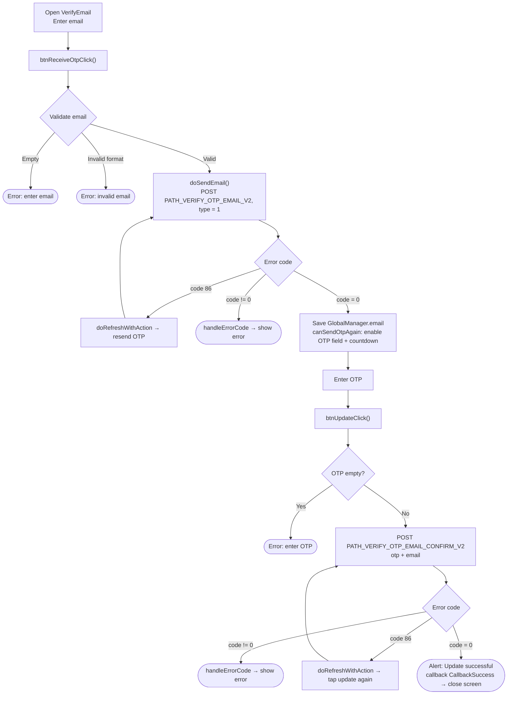
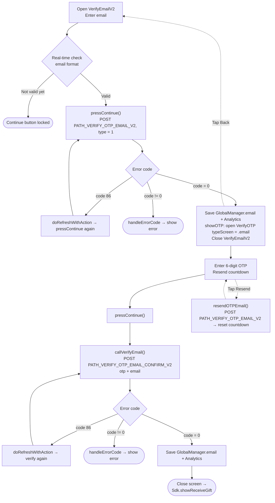

# Email Update Flow – iTapSdk (sdk-game-ios-v3)

This document describes the SDK's email update / verification flow, built from actual code.
Similar to the phone number flow, the project has **two screen variants**:

- **Approach 1 – `VerifyEmail`** (a single screen combining email input and OTP input; title *"CẬP NHẬT EMAIL"* / "UPDATE EMAIL"). Ends with `callback(CallbackSuccess)`.
- **Approach 2 – `VerifyEmailV2` → `VerifyOTP`** (newer version, split into two screens; title *"Thêm email"* / "Add email", tied into the gift-receiving flow `showReceiveGift`).

Both share 2 endpoints: `PATH_VERIFY_OTP_EMAIL_V2` (send OTP, `type = 1`) and
`PATH_VERIFY_OTP_EMAIL_CONFIRM_V2` (verify OTP). Every request attaches a Bearer accessToken.

## Approach 1 – `VerifyEmail` screen

### Description – Approach 1

1. **Enter email & send OTP** – `btnReceiveOtpClick()` checks that the email is not empty and
   matches the correct format (email regex), then `doSendEmail()` calls `PATH_VERIFY_OTP_EMAIL_V2` (`type = 1`).
   - `code = 0`: saves `GlobalManager.shared.email`, enables the OTP input field and starts the resend countdown.
   - `code = 86` (token expired): `doRefreshWithAction` refreshes the token then automatically resends.
   - other errors: `handleErrorCode`.
2. **Enter OTP & confirm** – `btnUpdateClick()` checks the OTP is not empty, calls
   `PATH_VERIFY_OTP_EMAIL_CONFIRM_V2` (`otp`, `email`).
   - `code = 0`: shows an "Update successful" alert, fires `callback(CallbackSuccess)` then closes the screen.
   - `code = 86`: refreshes the token then retries.
   - other errors: `handleErrorCode`.
3. **Resend OTP** – when the countdown reaches 0, the "Send code" button becomes active again to call `PATH_VERIFY_OTP_EMAIL_V2` again.

## Approach 2 – `VerifyEmailV2` → `VerifyOTP`

### Description – Approach 2

1. **`VerifyEmailV2`** – the email input field is validated in real time; when valid, the
   "Continue" button is enabled. `pressContinue()` calls `PATH_VERIFY_OTP_EMAIL_V2` (`type = 1`).
   - `code = 0`: saves `GlobalManager.shared.email` + Analytics, then `showOTP()` opens the
     `VerifyOTP` screen (`typeScreen = .email`, passing `email`, `serverId`, `characterId`)
     and closes the current screen.
   - `code = 86`: refreshes the token then calls again.
   - other errors: `handleErrorCode`.
2. **`VerifyOTP`** – enter the 6-digit OTP, shows the masked email (`maskedEmailFrom`) and a
   countdown for "Resend". `pressContinue()` → `callVerifyEmail()` calls
   `PATH_VERIFY_OTP_EMAIL_CONFIRM_V2` (`otp`, `email`).
   - `code = 0`: saves `GlobalManager.shared.email`, logs Analytics, closes the screen and
     calls `Sdk.showReceiveGift()`.
   - `code = 86`: refreshes the token then retries.
   - other errors: `handleErrorCode`.
   - **Resend OTP**: `resendOTPEmail()` calls `PATH_VERIFY_OTP_EMAIL_V2` again and restarts the countdown.
   - **Back**: returns to the `VerifyEmailV2` screen.

## Endpoints used

- `PATH_VERIFY_OTP_EMAIL_V2` – send OTP to email (POST, `type = 1`)
- `PATH_VERIFY_OTP_EMAIL_CONFIRM_V2` – verify OTP and update email (POST)

## Notes

- The `type = 1` parameter means *Verify Mail* (different from `type = 0` used by the phone number flow).
- Every request attaches an `accessToken` (Bearer). When `code = 86` (token expired) occurs,
  the SDK automatically calls `doRefreshWithAction` to refresh the token and repeat the pending action.
- On successful update, both flows save `GlobalManager.shared.email` and call
  `Analytics.initiateOnDeviceConversionMeasurement(emailAddress:)`.
- Ending difference: Approach 1 fires `callback(CallbackSuccess)` back to the caller that opened the screen;
  Approach 2 forwards to `Sdk.showReceiveGift()`.
- Endpoint difference compared to the phone flow: email uses the pair `PATH_VERIFY_OTP_EMAIL_V2`
  (send/resend) and `PATH_VERIFY_OTP_EMAIL_CONFIRM_V2` (verify); phone uses
  `PATH_OTP_PHONE_V2` and `PATH_VERIFY_OTP_PHONE_V2`.
