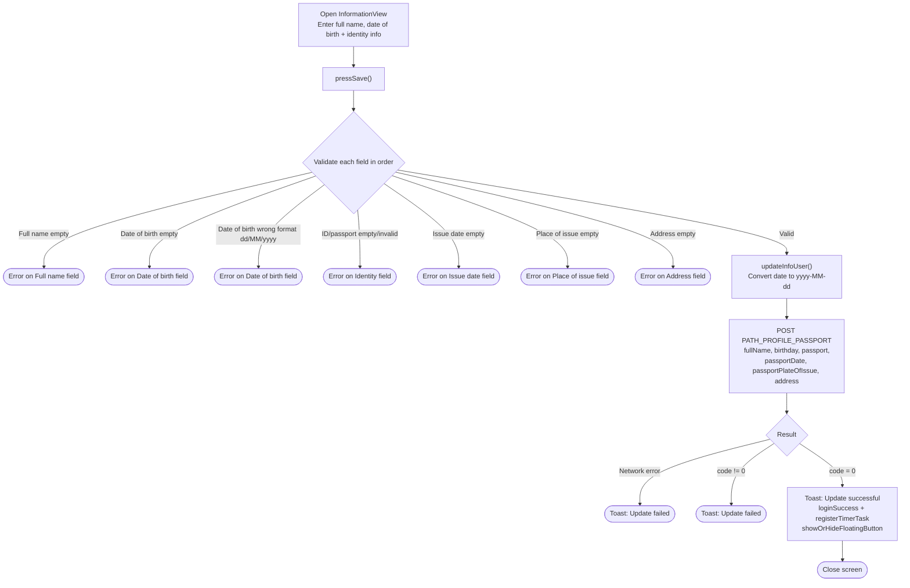
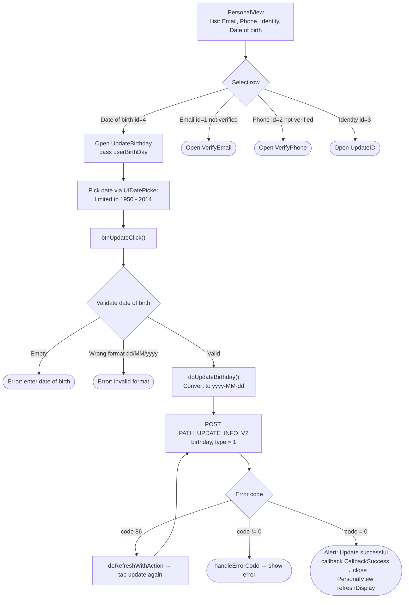

# Full Name & Date of Birth Update Flow – iTapSdk (sdk-game-ios-v3)

This document describes the SDK's full name and date of birth update flow, built from actual code.
The project has **two related screens**:

- **`InformationView`** – updates **full name + date of birth** together (along with identity
  info: ID card/passport number, issue date, place of issue, address) via the `PATH_PROFILE_PASSPORT`
  endpoint. This is the account/identity completion screen (`requireSecurityLevel`).
- **`UpdateBirthday`** – updates **only the date of birth** via the `PATH_UPDATE_INFO_V2` endpoint.
  Opened from the personal info screen `PersonalView` (there is no separate field to edit the full name
  here; the full name is only displayed as a title).

Both attach a Bearer accessToken and auto-refresh the token when `code = 86` occurs.

## Approach 1 – `InformationView` (full name + date of birth together)

### Description – Approach 1

The user enters the full name (`tfName`), date of birth (`tfBirthDay`, selected via UIDatePicker) and the
identity fields. When save is tapped, `pressSave()` checks in order:

- Full name must not be empty.
- Date of birth must not be empty and must match the format `dd/MM/yyyy`.
- ID/passport number must not be empty and must be valid (`^[0-9]{9,12}$` or passport `^[A-Z][0-9]{8}$`).
- Issue date, place of issue, and address must not be empty.

If valid → `updateInfoUser()` converts the date of birth (and issue date) to `yyyy-MM-dd` then calls
`PATH_PROFILE_PASSPORT` (POST) with `fullName`, `birthday`, `passport`, `passportDate`,
`passportPlateOfIssue`, `address` (along with `deviceId`, `os`, `osVersion`, `ip`).

- `code = 0`: shows the toast "Account information updated successfully", calls `loginSuccess()` (fires the
  `loginSuccess` delegate + `registerTimerTask`), `showOrHideFloatingButton()`, then closes the screen.
- Network error or `code != 0`: shows the toast "Failed to update account information!".

> Note: this screen updates **full name and date of birth together** in a single request, but requires
> all identity fields to be fully filled in before saving.

## Approach 2 – `UpdateBirthday` (date of birth only, opened from `PersonalView`)

### Description – Approach 2

`PersonalView` is a list-style personal info screen (Email, Phone number, Identity,
Date of birth, Logout). The account's full name is only shown in the title and cannot be edited here.
Selecting the **Date of birth** row (`id = 4`, type `.edit`) opens `UpdateBirthday` (passing the
current date of birth).

In `UpdateBirthday`, the user picks a date via `UIDatePicker` (limited from 01/01/1950 to
01/01/2014). `btnUpdateClick()` checks that the date of birth is not empty and matches the format
`dd/MM/yyyy`, then `doUpdateBirthday()` converts it to `yyyy-MM-dd` and calls `PATH_UPDATE_INFO_V2` (POST) with
`birthday`, `type = 1`.

- `code = 0`: shows an "Update successful" alert, fires `callback(CallbackSuccess)` → closes the screen;
  `PersonalView` receives the callback and calls `refreshDisplay()` to refresh the list.
- `code = 86` (token expired): `doRefreshWithAction` refreshes the token then automatically taps update again.
- other errors: `handleErrorCode`.

## Endpoints used

- `PATH_PROFILE_PASSPORT` – updates full name + date of birth + identity info (POST) – used in `InformationView`
- `PATH_UPDATE_INFO_V2` – updates date of birth (POST, `birthday`, `type = 1`) – used in `UpdateBirthday`

## Notes

- The date of birth is always entered/displayed as `dd/MM/yyyy` in the UI, but sent to the server as `yyyy-MM-dd`.
- `InformationView` is a combined update screen (requires all identity info) tied to the security
  completion flow (`requireSecurityLevel`); on success it continues the login via `loginSuccess()`.
- `UpdateBirthday` only changes the date of birth, auto-refreshes the token when `code = 86` occurs, and
  returns the result to `PersonalView` via callback to refresh the display.
- In the current SDK there is **no separate screen for editing "full name"**; the full name can only be
  updated together within `InformationView`.
