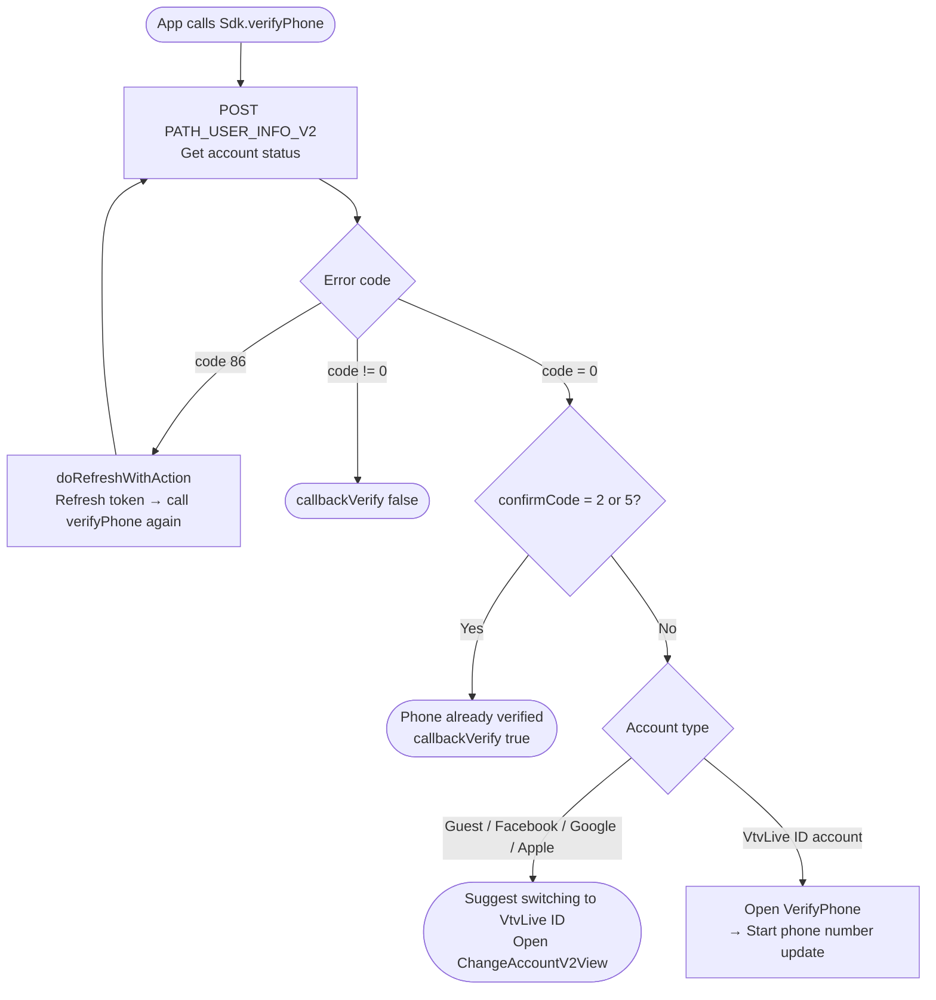
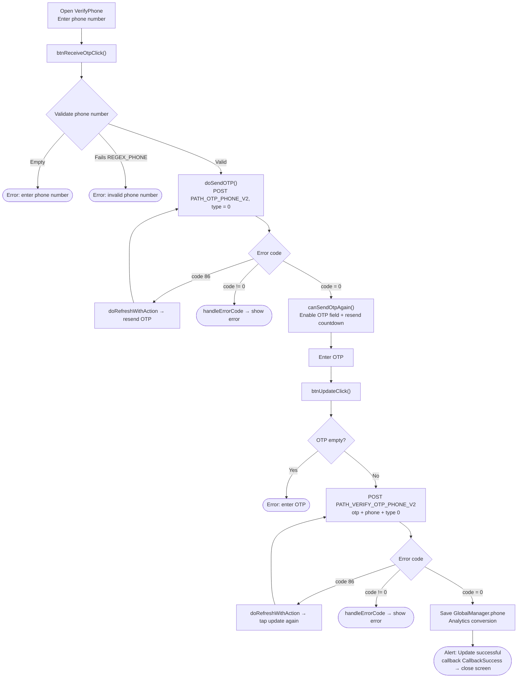
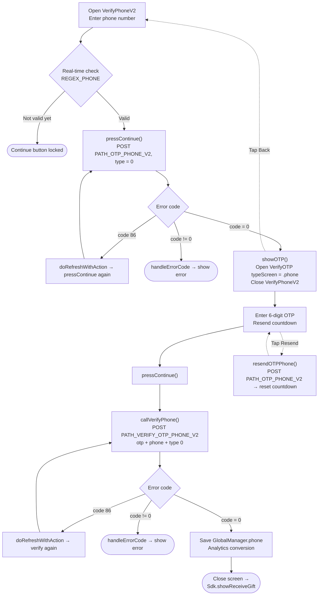

# Phone Number Update Flow – iTapSdk (sdk-game-ios-v3)

This document describes the SDK's phone number update / verification flow, built from actual code.
The project currently has **two screen variants**:

- **Approach 1 – `VerifyPhone`** (a single screen combining phone number input and OTP input; title *"CẬP NHẬT SỐ ĐIỆN THOẠI"* / "UPDATE PHONE NUMBER"). Invoked via `Sdk.verifyPhone(...)`.
- **Approach 2 – `VerifyPhoneV2` → `VerifyOTP`** (newer version, split into two screens; title *"Thêm số điện thoại"* / "Add phone number", tied into the gift-receiving flow `showReceiveGift`).

Both share 2 endpoints: `PATH_OTP_PHONE_V2` (send OTP) and `PATH_VERIFY_OTP_PHONE_V2` (verify OTP), with the parameter `type = 0` (Verify Phone) and headers carrying the Bearer accessToken.

## Entry condition – `Sdk.verifyPhone()`

Only VtvLive ID accounts that have not verified a phone number (`confirmCode` other than 2 and 5)
can open the phone number update screen; guest/social accounts are prompted to switch accounts first.

## Approach 1 – `VerifyPhone` screen

### Description – Approach 1

1. **Enter phone number & send OTP** – `btnReceiveOtpClick()` checks the phone number is not empty and matches
   `REGEX_PHONE`, then `doSendOTP()` calls `PATH_OTP_PHONE_V2` (`type = 0`, with Bearer token).
   - `code = 0`: enables the OTP input field and starts the resend countdown (`Constants.timeOutOtpAgain`).
   - `code = 86` (token expired): `doRefreshWithAction` refreshes the token then automatically resends.
   - other errors: `handleErrorCode`.
2. **Enter OTP & update** – `btnUpdateClick()` checks the OTP is not empty, calls
   `PATH_VERIFY_OTP_PHONE_V2` (`otp`, `phone`, `type = 0`).
   - `code = 0`: saves `GlobalManager.shared.phone`, logs Analytics, shows an alert
     "Update successful", fires `callback(CallbackSuccess)` then closes the screen.
   - `code = 86`: refreshes the token then retries.
   - other errors: `handleErrorCode`.
3. **Resend OTP** – when the countdown reaches 0, the "Send code" button becomes active again to call `PATH_OTP_PHONE_V2` again.

## Approach 2 – `VerifyPhoneV2` → `VerifyOTP`

### Description – Approach 2

1. **`VerifyPhoneV2`** – the phone number input field is validated in real time against `REGEX_PHONE`;
   when valid, the "Continue" button is enabled. `pressContinue()` calls `PATH_OTP_PHONE_V2` (`type = 0`).
   - `code = 0`: `showOTP()` opens the `VerifyOTP` screen (`typeScreen = .phone`, passing
     `phone`, `serverId`, `characterId`) and closes the current screen.
   - `code = 86`: refreshes the token then calls again.
   - other errors: `handleErrorCode`.
2. **`VerifyOTP`** – enter the 6-digit OTP, shows the masked phone number (`maskedPhoneFrom`) and a
   countdown for "Resend". `pressContinue()` → `callVerifyPhone()` calls
   `PATH_VERIFY_OTP_PHONE_V2` (`otp`, `phone`, `type = 0`).
   - `code = 0`: saves `GlobalManager.shared.phone`, logs Analytics, closes the screen and
     calls `Sdk.showReceiveGift()` (continues the gift-receiving flow).
   - `code = 86`: refreshes the token then retries.
   - other errors: `handleErrorCode`.
   - **Resend OTP**: `resendOTPPhone()` calls `PATH_OTP_PHONE_V2` again and restarts the countdown.
   - **Back**: returns to the `VerifyPhoneV2` screen.

## Endpoints used

- `PATH_USER_INFO_V2` – gets account verification status (in the `verifyPhone` entry condition step)
- `PATH_OTP_PHONE_V2` – sends OTP to the phone number (POST, `type = 0`)
- `PATH_VERIFY_OTP_PHONE_V2` – verifies OTP and updates the phone number (POST, `type = 0`)

## Notes

- The `type = 0` parameter means *Verify Phone*. Other values are used for email and other
  verification types (1 = mail, 2/3 = one-time authen, 4/5 = one-time transaction).
- Every request attaches an `accessToken` (Bearer). When `code = 86` (token expired) occurs,
  the SDK automatically calls `doRefreshWithAction` to refresh the token and repeat the pending action.
- On successful update, both flows save `GlobalManager.shared.phone` and call
  `Analytics.initiateOnDeviceConversionMeasurement(phoneNumber:)`.
- Ending difference: Approach 1 fires `callback(CallbackSuccess)` back to the caller that opened the screen;
  Approach 2 forwards to `Sdk.showReceiveGift()`.
