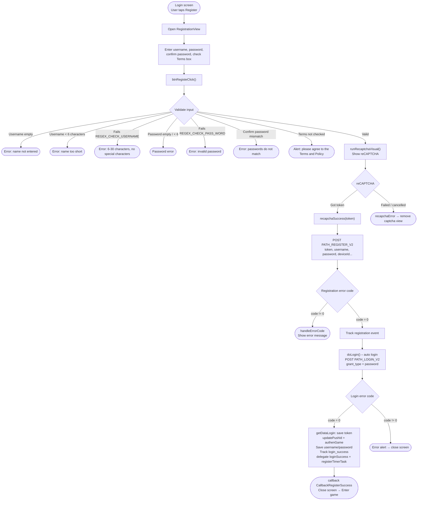

# Registration Flow – iTapSdk (sdk-game-ios-v3)

This document describes the SDK's account registration flow, built from actual code:
`RegistrationView.swift` (with `LoginViewNew.swift` being the screen that opens registration).

## Overview diagram

## Detailed description

### 1. Opening the registration screen

From the login screen (`LoginViewNew`), the user taps **Register** →
`RegistrationView` opens. The screen has fields for **username**, **password**,
**confirm password** and a checkbox to agree to the **Terms & Policy**.

### 2. Validating input – `btnRegisteClick()`

Before calling the API, the SDK checks in sequence (whichever error is hit first is shown and the check stops):

- Username must not be empty.
- Password must not be empty.
- Username must be at least 6 characters.
- Password must be at least 6 characters.
- Username must match `REGEX_CHECK_USERNAME` (6–30 characters, no special characters).
- Password must match `REGEX_CHECK_PASS_WORD`.
- The confirm password field must not be empty.
- Password and confirm password must match.
- The Terms & Policy checkbox must be checked (`isCheck`).

If all valid → calls `runRecaptchaVisual()`.

### 3. reCAPTCHA verification – `runRecaptchaVisual()`

Shows `RecaptchaVisual` with `apiKeyRecapcha` and `baseWebId`.
If a token is obtained → calls `recapchaSuccess(token)`; if failed/cancelled →
`recapchaError()` removes the captcha view.

### 4. Calling the registration API – `recapchaSuccess()`

Calls `PATH_REGISTER_V2` (POST) with the parameters:
`reCaptChaVer = ios-v2`, `token`, `username`, `password`, `rePassword`,
`deviceId`, `os`, `osVersion`, and `ip` (if available).

- `code = 0`: tracks the `registration` event (TikTok) → calls `doLogin()` to **automatically log in**.
- `code != 0`: `handleErrorCode` shows the error message.

### 5. Automatic login after registration – `doLogin()`

Calls `PATH_LOGIN_V2` (POST) with `grant_type = password`, using the username/password
that were just registered.

- `code = 0`:
  - `getDataLogin()` saves `accessToken` / `refreshToken`.
  - `updatePushId()`, `authenGame()`, `Utils.sayHi()`.
  - Saves the username/password to storage (`KeyUserName`, `KeyPassword`).
  - Tracks `login_success` (type `Username`), tracks TikTok `login`.
  - Calls the `loginSuccess(userInfo, accessToken, refreshToken)` delegate and `registerTimerTask()`.
  - Calls `callback(CallbackRegisterSuccess)` then closes the screen → enters the game.
- `code != 0`: shows an error alert then closes the screen.

## Endpoints used

- `PATH_REGISTER_V2` – register an account (POST)
- `PATH_LOGIN_V2` – automatic login after registration (POST, `grant_type = password`)
- `PATH_GAME_AUTH` – authenticate the game after login (`authenGame`)

## Notes

- After successful registration, the SDK **does not force the user to log in again**; instead it
  auto-logs in using the just-created credentials, then fires the `CallbackRegisterSuccess` callback.
- All username/password validity conditions are checked client-side first;
  reCAPTCHA is a required step before calling the registration API.
