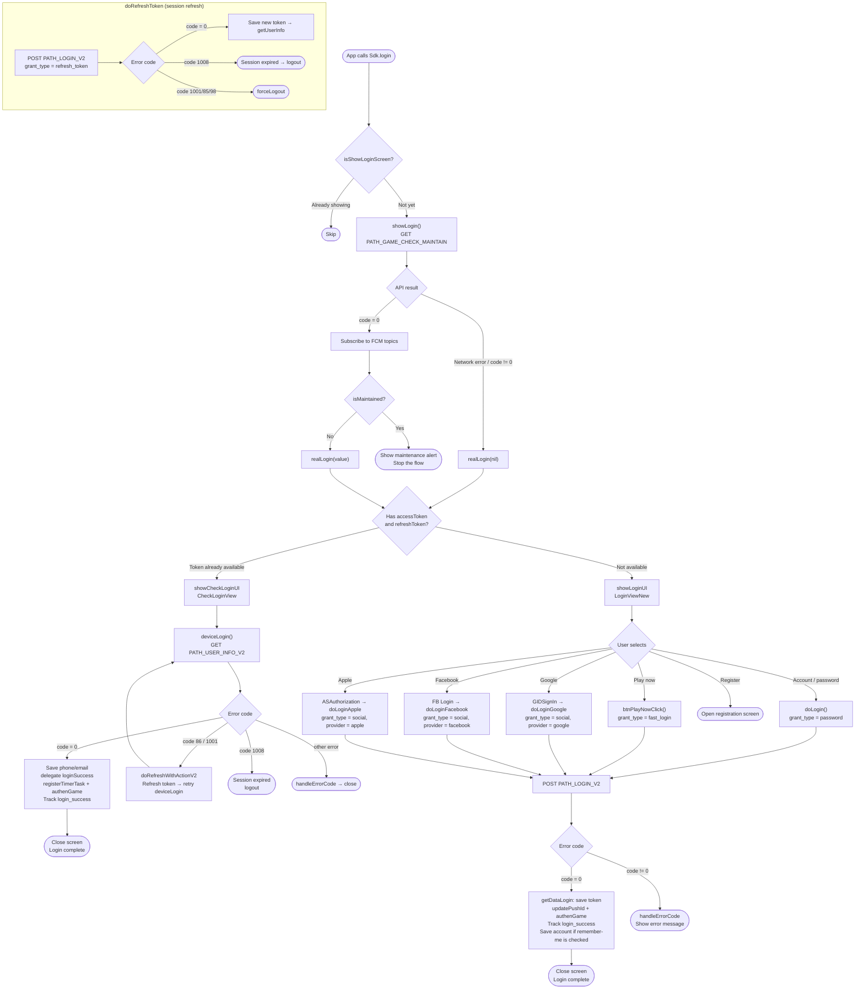

# Login Flow – iTapSdk (sdk-game-ios-v3)

This document describes the SDK's login flow, built from actual code:
`Sdk+Authentication.swift`, `CheckLoginView.swift`, `LoginViewNew.swift`, `LoginWrapper.swift`.

## Overview diagram

## Detailed description

### 1. Entry point – `login()` / `showLogin()`

When the app calls `Sdk.login()`, the SDK checks the `isShowLoginScreen` flag to avoid opening
a duplicate screen. If not yet shown, `showLogin()` calls the maintenance check API
`PATH_GAME_CHECK_MAINTAIN` (GET) with `packageId`, `channel`, `version`.

- If the API **errors** or returns `code != 0` → calls `realLogin(nil)` directly.
- If `code = 0` → subscribes to the returned FCM topics, then checks `isMaintained`:
  - `isMaintained = true` → shows a maintenance alert and **stops** the flow.
  - `isMaintained = false` → calls `realLogin(value)`.

### 2. Branching – `realLogin()`

Based on whether the device already has a saved token:

- **`accessToken` and `refreshToken` already available** → `showCheckLoginUI()` (opens `CheckLoginView`),
  logs back in automatically without any user action.
- **No token yet** → `showLoginUI()` (opens `LoginViewNew`) so the user can choose a login method.

### 3. Automatic re-login – `CheckLoginView.deviceLogin()`

Calls `PATH_USER_INFO_V2` (GET) with the Bearer accessToken:

- `code = 0`: saves `phone`/`email`, calls the `loginSuccess(userInfo, accessToken, refreshToken)` delegate,
  runs `registerTimerTask()`, `authenGame()`, `updatePushId()`, and tracks `login_success` (type `Refresh`).
- `code = 86` or `1001`: calls `doRefreshWithActionV2` to refresh the token then **retries** `deviceLogin()`.
- `code = 1008`: session expired → `Sdk.logout()`.
- Other errors: `handleErrorCode` shows a message then closes the screen.

### 4. Login screen – `LoginViewNew`

The user selects one of the methods, all of which call the shared `PATH_LOGIN_V2` (POST) endpoint:

| Method | Handler function | `grant_type` | Notes |
|---|---|---|---|
| Account / password | `doLogin()` | `password` | Has a remember-me option (password encrypted with AES-256) |
| Play now | `btnPlayNowClick()` | `fast_login` | Includes an extra random `nonce` |
| Google | `doLoginGoogle()` | `social` | `provider = google`, token obtained from `GIDSignIn` |
| Facebook | `doLoginFacebook()` | `social` | `provider = facebook` / `facebook_limited` |
| Apple | `doLoginApple()` | `social` | `provider = apple`, via `ASAuthorization` |
| Register | `btnRegisterClick()` | – | Opens the registration screen |

The Apple / Facebook / Google social buttons only appear when enabled in configuration
(`enableAppleLogin`, `enableFacebookLogin`, `enableGoogleLogin`), and their order is rearranged
based on the user's most recent login method.

When `PATH_LOGIN_V2` returns:

- `code = 0`: `getDataLogin()` saves the token, calls `updatePushId()`, `authenGame()`,
  tracks `login_success`, saves the account if the user checked "remember me", then closes the screen.
- `code != 0`: `handleErrorCode` shows the corresponding error message.

### 5. Session refresh – `doRefreshToken()`

Shared logic used when the token expires: calls `PATH_LOGIN_V2` with `grant_type = refresh_token`.

- `code = 0`: saves the new token set then calls `getUserInfo()`.
- `code = 1008`: shows a session-expired message → `logout()`.
- `code = 1001 / 85 / 98`: `forceLogout()`.

## Endpoints used

- `PATH_GAME_CHECK_MAINTAIN` – checks maintenance status (GET)
- `PATH_LOGIN_V2` – login / refresh token (POST, distinguished by `grant_type`)
- `PATH_USER_INFO_V2` – gets user information (GET)
- `PATH_GAME_AUTH` – authenticates the game after login (`authenGame`)
- `PATH_LOGOUT` – logout

## Important error codes

- `CODE_0` – success
- `CODE_86`, `CODE_1001` – token needs refreshing (try refresh then retry)
- `CODE_1008` – login session expired → logout
- `CODE_1001 / 85 / 98` – forced logout (`forceLogout`)
