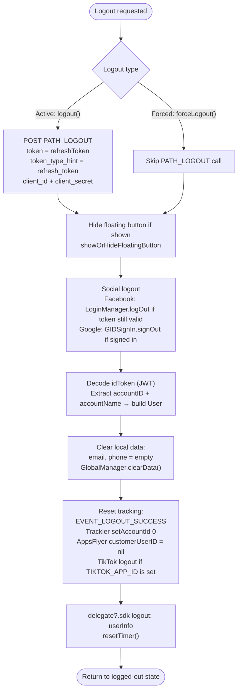

# Logout Flow – iTapSdk (sdk-game-ios-v3)

This document describes the SDK's logout flow, built from actual code in
`Sdk+Authentication.swift`. There are **two functions**:

- **`logout()`** – active logout (the user taps logout). Calls the `PATH_LOGOUT` API
  to revoke the refresh token on the server.
- **`forceLogout()`** – forced logout because the session has been invalidated (error code
  `1001 / 85 / 98`, or `1008` – session expired). **Does not** call the `PATH_LOGOUT` API, only clears local data.

Both return the user to a logged-out state and fire the `logout` delegate.

## Where logout is invoked

`logout()` is typically called from:
- `PersonalView` → `showSignOut()` (confirmation dialog) → `doSignOut()` → `Sdk.logout()`.
- `CheckLoginView` → `doSignOut()` when logout is needed.
- When the session expires (`code = 1008`) in `doRefreshToken` / `getUserInfo` → shows a message → `logout()`.

`forceLogout()` is called when the refresh token call returns `code = 1001 / 85 / 98` (account
locked / session revoked elsewhere).

## Overview diagram

## Detailed description

### Difference between `logout()` and `forceLogout()`

The **only functional difference**: `logout()` calls the `PATH_LOGOUT` API (POST) to revoke the
`refreshToken` on the server (fire-and-forget), while `forceLogout()` skips this step because the
session has already been invalidated server-side. The remaining cleanup steps are identical.

Body of `PATH_LOGOUT`:
`token = refreshToken`, `token_type_hint = "refresh_token"`, `client_id`, `client_secret`;
header `ServiceProcessor.createHeaderFieldType1()`.

### Shared cleanup steps

1. **Hide the floating button** – if currently shown, calls `showOrHideFloatingButton()`.
2. **Social logout**:
   - Facebook: if `AccessToken.current` is still valid → `LoginManager().logOut()`.
   - Google: if `GIDSignIn.hasPreviousSignIn()` → `GIDSignIn.sharedInstance.signOut()`.
3. **Build user info to return** – decodes the `idToken` (JWT), extracts `accountID` and
   `accountName` from the payload to create a `User` object (used for the delegate).
4. **Clear local data** – sets `email`, `phone` to empty and calls `GlobalManager.shared.clearData()`
   (clears the token and login state).
5. **Reset tracking / analytics**:
   - Sends the `EVENT_LOGOUT_SUCCESS` event.
   - `TrackierSdk.setAccountId(0, withAccountName: "")`.
   - `AppsFlyerLib.shared().customerUserID = nil`.
   - `TikTokBusiness.logout()` if `TIKTOK_APP_ID` is configured.
6. **Notify the app & reset timer**:
   - Calls the `delegate?.sdk?(self, logout: userInfo)` delegate so the app knows logout occurred.
   - `resetTimer()` stops the session countdown.

After these steps, the SDK is in a logged-out state; the next call to `Sdk.login()` will show the
login screen again.

## Endpoint used

- `PATH_LOGOUT` – revokes the refresh token on the server (POST, only used in `logout()`)

## Notes

- `forceLogout()` uses `getAccountNameInPayloadV2` to get the account name (unlike `logout()`
  which uses `getAccountNameInPayload`), but the cleanup and delegate steps are the same.
- Calling `PATH_LOGOUT` is fire-and-forget: the SDK does not wait for the server response before
  clearing local data, ensuring the user is always logged out on the client side.
- Logout always fires the `logout` delegate with a `User` (accountID, accountName) so the app can
  sync its state and handle the corresponding UI.
