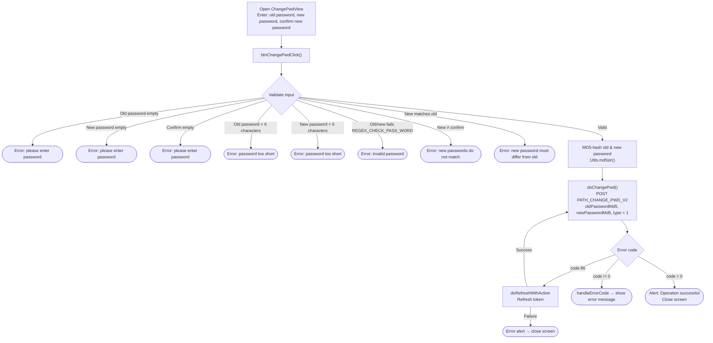

# Change Password Flow – iTapSdk (sdk-game-ios-v3)

This document describes the SDK's change password flow (when the user is **already logged in**), built from
actual code: `ChangePwdView.swift` (title *"ĐỔI MẬT KHẨU"* / "CHANGE PASSWORD").

> Distinction: this is **change password** (knows the old password, currently logged in) — different from
> **forgot password** (recovery via email/phone OTP).

## Overview diagram

## Detailed description

### 1. Input & validation – `btnChangePwdClick()`

The screen has 3 fields: **old password** (`txtPwd`), **new password** (`txtNewPwd`),
**confirm new password** (`txtConfirmNewPwd`). When "CHANGE PASSWORD" is tapped, the SDK checks
in order (whichever error is hit, the corresponding field is highlighted red and the check stops):

- Old password, new password, and confirm must all not be empty.
- Old password and new password must be at least 6 characters.
- Old password and new password must match `REGEX_CHECK_PASS_WORD`.
- New password and confirm must match.
- New password must differ from the old password.

### 2. Hashing & calling the API – `doChangePwd()`

If valid → the old and new passwords are **MD5-hashed** (`Utils.md5str`) before being sent. Calls
`PATH_CHANGE_PWD_V2` (POST) with `oldPasswordMd5`, `newPasswordMd5`, `type = 1`
(along with `deviceId`, `os`, `osVersion`, `ip`) and a Bearer accessToken header.

- `code = 0`: shows an "Operation successful" alert → closes the screen.
- `code = 86` (token expired): `doRefreshWithAction` refreshes the token; on success it
  **automatically calls** `doChangePwd()` again, on failure shows an error alert then closes the screen.
- other errors: `handleErrorCode` shows the error message.

## Endpoint used

- `PATH_CHANGE_PWD_V2` – change password while logged in (POST, `type = 1`)

## Notes

- Passwords are **never sent as plaintext**: both the old and new passwords are MD5-hashed on the client
  (`oldPasswordMd5`, `newPasswordMd5`) before being sent to the server.
- The entire operation requires an `accessToken` (Bearer). When `code = 86` occurs, the SDK auto-refreshes
  the token then repeats the pending change-password request.
- A successful password change **does not force a re-login** on this screen — it only shows a success
  message and closes the screen.
