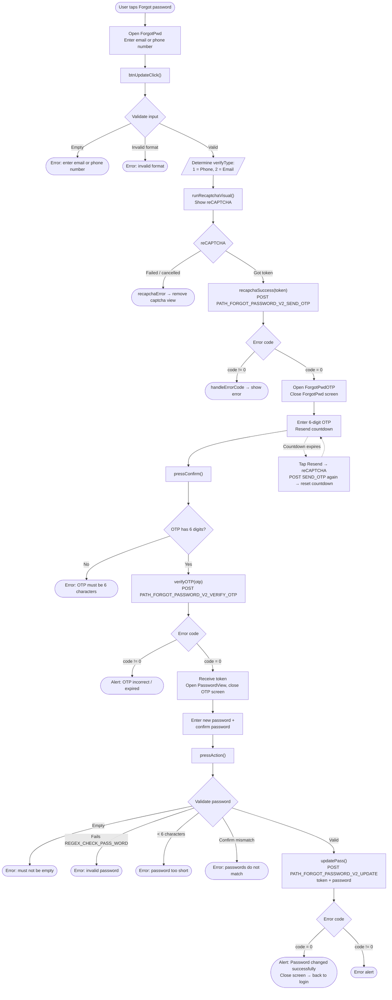

# Forgot Password Flow – iTapSdk (sdk-game-ios-v3)

This document describes the SDK's password recovery / reset flow, built from actual code:
`ForgotPwd.swift` (enter email/phone) → `ForgotPwdOTP.swift` (verify OTP) →
`PasswordView.swift` (set new password).

## Overview diagram

## Detailed description

### Step 1 – Enter email/phone (`ForgotPwd`)

The user enters an email or phone number. `btnUpdateClick()` checks:

- Must not be empty.
- Must have the correct format via `isValidPhoneOrEmail()`:
  - Matches `REGEX_PHONE` (Vietnamese phone number) → `verifyType = 1`.
  - Matches the email regex → `verifyType = 2`.
  - Matches neither → format error.

If valid → calls `runRecaptchaVisual()` to show reCAPTCHA. Once a token is obtained,
`recapchaSuccess()` calls `PATH_FORGOT_PASSWORD_V2_SEND_OTP` (POST) with
`reCaptChaVer`, `reCaptChaToken`, `verifyInfo`, `clientId`, `deviceId`, `os`, `osVersion`, `ip`.

- `code = 0`: opens the `ForgotPwdOTP` screen (passing `verifyInfo`, `verifyType`) and closes the current screen.
- `code != 0`: `handleErrorCode(99)` shows an error message.

### Step 2 – OTP verification (`ForgotPwdOTP`)

The screen shows a 6-digit OTP input field and a resend countdown (`Constants.timeOutOtpAgain`).

When confirm is tapped, `pressConfirm()` checks the OTP has 6 characters; if so, calls `verifyOTP()`
→ `PATH_FORGOT_PASSWORD_V2_VERIFY_OTP` (POST) with `verifyInfo`, `otp`, `clientId`, `deviceId`...

- `code = 0`: gets the `token` from the response (`ForgotPwdOTPJsonWrapper`), opens `PasswordView`
  (passing `token`) and closes the OTP screen.
- `code != 0`: shows an alert (OTP incorrect or expired).

**Resend code:** when the countdown reaches 0, the label changes to "Resend code". Tapping it re-runs
reCAPTCHA then calls `PATH_FORGOT_PASSWORD_V2_SEND_OTP` again; on success the countdown restarts,
on failure an error is shown.

### Step 3 – Set new password (`PasswordView`)

The user enters a new password and confirms it. `pressAction()` checks:

- Must not be empty.
- Matches `REGEX_CHECK_PASS_WORD`.
- At least 6 characters.
- Confirm must match.

If valid → `updatePass()` calls `PATH_FORGOT_PASSWORD_V2_UPDATE` (POST) with
`token` (received from the OTP step), `password`, `clientId`, `deviceId`, `os`, `osVersion`, `ip`.

- `code = 0`: alert "Password changed successfully" → closes the screen, the user returns to log in with the new password.
- `code != 0`: shows an error alert.

## Endpoints used

- `PATH_FORGOT_PASSWORD_V2_SEND_OTP` – sends OTP to email/phone (POST, requires reCAPTCHA)
- `PATH_FORGOT_PASSWORD_V2_VERIFY_OTP` – verifies OTP, returns a `token` (POST)
- `PATH_FORGOT_PASSWORD_V2_UPDATE` – sets a new password using the `token` (POST)

## Notes

- reCAPTCHA is a required step every time an OTP is sent (both first send and resend).
- The `token` received after OTP verification is what authorizes the final password change step;
  without a valid OTP, the token cannot be obtained.
- After a successful password change, the flow **does not auto-login** — instead it returns the user
  to the login screen to log in with the new password.
