# Delete Account Flow – iTapSdk (sdk-game-ios-v3)

This document describes the SDK's account deletion (deactivation) flow, built from actual code:
`DeactiveAccountView.swift`.

## Overview diagram

```mermaid
flowchart TD
    A["Open DeactiveAccountView<br/>Show 3 warnings Deactive_1/2/3"] --> B["btnDeactiveClick()"]
    B --> C{"Confirmation dialog<br/>Confirm account deletion"}
    C -- Cancel --> C1([Close dialog, do nothing])
    C -- Confirm --> D["doDeactive()<br/>POST PATH_DEACTIVE_V2"]

    D --> E{Error code}
    E -- Network error --> E1([handleError → show error])
    E -- code 86 --> E2["doRefreshWithAction<br/>Refresh token → call doDeactive again"]
    E2 --> D
    E -- code != 0 --> E3([handleErrorCode → show error])
    E -- code = 0 --> F["Success alert<br/>callback CallbackSuccess → close screen"]

    F --> G["Revoke social tokens"]
    G --> G1["POST PATH_APPLE_REVOKE<br/>client_id, client_secret,<br/>token = refreshTokenFaceBook,<br/>token_type_hint = refresh_token"]
    G --> G2["POST https://appleid.apple.com/auth/revoke<br/>x-www-form-urlencoded"]
    G1 --> H([Account deletion complete])
    G2 --> H
```

## Detailed description

### 1. Warning & confirmation screen

`DeactiveAccountView` shows 3 warning lines (`Deactive_1`, `Deactive_2`, `Deactive_3`)
about the consequences of deleting the account. When the delete button is tapped, `btnDeactiveClick()`
opens a two-button confirmation dialog ("Confirm account deletion"):

- **Cancel**: closes the dialog, does nothing.
- **Confirm**: calls `doDeactive()`.

### 2. Calling the delete account API – `doDeactive()`

Calls `PATH_DEACTIVE_V2` (POST) with `deviceId`, `os`, `osVersion`, `ip` and a Bearer
accessToken header.

- `code = 0`: shows an alert (using the `message` from the server, default "Update successful"),
  fires `callback(CallbackSuccess)` then closes the screen. Afterwards performs **social token
  revocation** (see section 3).
- `code = 86` (token expired): `doRefreshWithAction` refreshes the token then **automatically calls** `doDeactive()` again.
- other errors: `handleErrorCode` shows an error message.
- network error: `handleError`.

### 3. Revoking Facebook / Apple tokens

Immediately after the account is successfully deleted, the SDK revokes the stored social refresh token
(`GlobalManager.shared.refreshTokenFaceBook`) via two calls:

1. `PATH_APPLE_REVOKE` (POST, via `appleApiService`) with `client_id`, `client_secret`,
   `token = refreshTokenFaceBook`, `token_type_hint = "refresh_token"`.
2. A direct call to `https://appleid.apple.com/auth/revoke` (POST,
   `application/x-www-form-urlencoded`) with `client_id`, `client_secret`, `token`,
   `token_type_hint = "KeyRefreshToken"`.

Both are fire-and-forget (do not block the main flow).

## Endpoints used

- `PATH_DEACTIVE_V2` – delete/deactivate the account (POST, with Bearer accessToken)
- `PATH_APPLE_REVOKE` – revokes the social refresh token on the backend (POST)
- `https://appleid.apple.com/auth/revoke` – revokes the token directly with Apple (POST)

## Notes

- Account deletion has a **mandatory confirmation step** (two-button dialog) before calling the API.
- On success, in addition to deleting the account, social login tokens are also revoked to ensure
  no social login sessions remain active.
- When `code = 86` occurs, the SDK auto-refreshes the token then repeats the pending delete operation.
- This screen is typically opened from the settings/account info section (e.g. `PersonalView`).
