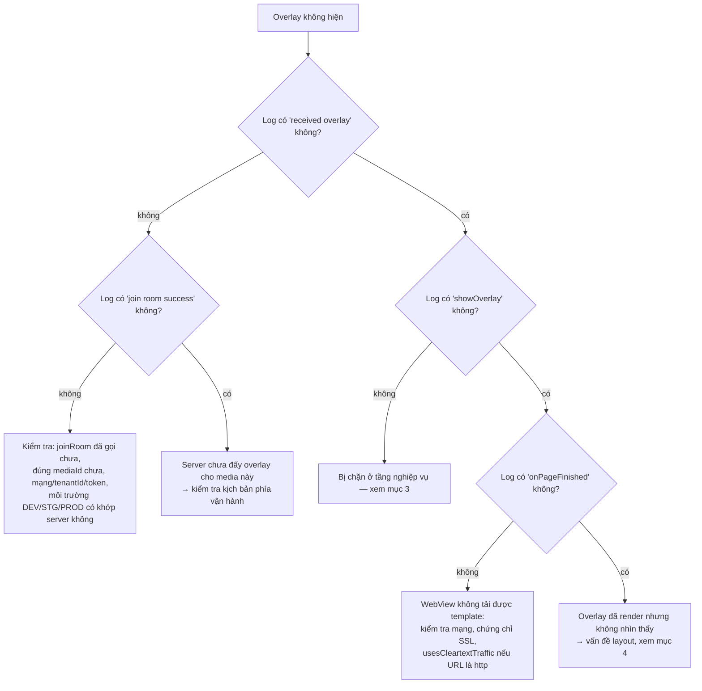

# 06 — Lỗi thường gặp & cách chẩn đoán

[← Về mục lục](README.md)

---

## 1. Bật log của SDK

SDK ghi log qua hàm `logcat {}` — chỉ hoạt động khi **AAR được build ở buildType `debug`**
(`BuildConfig.DEBUG = true` của module `:interactive`). Tag mặc định: `Interactive`.

```bash
adb logcat -s System.out | grep Interactive
```

Các chuỗi log đáng chú ý:

| Log | Ý nghĩa |
|---|---|
| `overlay manager: Khởi tạo mới Innteractive` | Constructor chạy |
| `socket io management initialization: socketUrl = ...` | Chuẩn bị kết nối |
| `overlay manager socket: connected socket` / `join room success` | Vào phòng thành công |
| `socket io management addEvents: received overlay` | Có overlay từ server |
| `<-- check point: showOverlay -->` | Bắt đầu dựng WebView |
| `VLive: Website onPageFinished url: ...` | Template tải xong |
| `overlay web view manager: add caches` | Overlay bị hoãn vì `isVisible = false` |
| `socket io management prevent ex-overlay: user answered` | Bị chặn do đã trả lời |

---

## 2. Overlay không hiển thị — cây chẩn đoán



---

## 3. Bị chặn ở tầng nghiệp vụ

Đối chiếu log với bảng lý do (chi tiết ở [05 — Tracking](05-tracking-emit-ack.md#5-bảng-lý-do-huỷ-cancelreason)):

| Triệu chứng | Nguyên nhân | Cách xử lý |
|---|---|---|
| `user haven't logged in yet` | Tenant `vtvlive`, chưa `initToken`, overlay không cho ẩn danh | Gọi `initToken()` sau khi đăng nhập |
| `timelineId not found` | Payload thiếu `timelineId` | Báo phía server |
| `socket is not connect` | Socket rớt ngay lúc xử lý | Kiểm tra mạng; SDK sẽ tự reconnect sau 5s |
| `duplicate predict overlay` / `duplicate miniGame overlay` | Trùng `timelineId` với overlay đang hiển thị | Hành vi đúng thiết kế |
| `prevent ex-overlay: user answered` | Đã trả lời mốc này (pref `ex_*`) | Xoá dữ liệu app nếu muốn test lại |
| `ex-overlay duration < 10s` | Overlay bù quá ngắn | Hành vi đúng thiết kế |
| Cancel `target_mismatch` | `targets` không khớp `DEVICE_TYPE` | Build đúng biến thể (`androidmobile` / `androidtv`) hoặc sửa kịch bản |
| Cancel `expired_duration` | Overlay đã hết thời lượng tính từ `missTime` | Hành vi đúng thiết kế |
| `add caches` mà không thấy hiện | `isVisible = false` (chưa `Connected`) | Overlay sẽ hiện khi socket connect; nếu không bao giờ connect → xem mục 5 |

---

## 4. Overlay render nhưng không nhìn thấy / sai vị trí

| Nguyên nhân | Dấu hiệu | Xử lý |
|---|---|---|
| `OverlayView` có kích thước `0` | Log render bình thường, màn hình trống | Đặt `layout_width/height` ràng buộc rõ ràng; kiểm tra bằng cách set tạm `setBackgroundColor(Color.YELLOW)` |
| `OverlayView` bị player vẽ đè | Overlay "nhấp nháy" rồi mất | Khai báo `OverlayView` **sau** player trong layout, hoặc tăng `elevation`/`translationZ` |
| `OverlayView` lớn hơn khung video | Overlay lệch ra ngoài vùng hình | Ràng buộc `OverlayView` trùng khít khung 16:9 của player |
| `OverlayView` đang `INVISIBLE` | Sau khi mất kết nối | SDK gọi `temporaryLock()` khi disconnect; sẽ `visible()` lại khi connect |
| Overlay là `SurfaceView` player che WebView | Chỉ xảy ra với một số player | Dùng `TextureView` cho player, hoặc đặt `OverlayView` trong ViewGroup riêng ở trên |

---

## 5. Socket không kết nối được

Danh sách kiểm tra:

1. **Môi trường**: `EnvInteractive` phải khớp hệ thống server (DEV/STG/PROD) — URL lấy từ native, không sửa được ở app.
2. **`tenantId`**: sai tenant → server từ chối phòng.
3. **Quyền**: thiếu `INTERNET` → không có log lỗi rõ ràng, chỉ thấy `connect error`.
4. **Token hết hạn**: header `Authorization` sai → có thể bị từ chối tuỳ cấu hình server.
5. **`liboverlay.so` bị loại bỏ**: nếu app dùng `abiFilters` hoặc split ABI mà thiếu kiến trúc, `Utils` sẽ ném `UnsatisfiedLinkError` ngay khi khởi tạo → `INTERACTIVE_SOCKET_URL` rỗng.
   Kiểm tra bằng `unzip -l app-release.apk | grep liboverlay`.

Log `socket io management initialization: url value uninitialized` chính là dấu hiệu của trường hợp 5.

---

## 6. Lỗi biên dịch / chạy sau khi tích hợp AAR

| Lỗi | Nguyên nhân | Xử lý |
|---|---|---|
| `NoClassDefFoundError: io/socket/client/IO` | Thiếu dependency bắc cầu | Khai báo đủ các thư viện ở [02 §3](02-cai-dat-va-tich-hop.md#3-khai-báo-phụ-thuộc) |
| `ClassCastException` / crash khi mở dialog | Activity không phải `FragmentActivity` | Dùng `AppCompatActivity` |
| Dialog không mở, log `showPredictDialog error` | `activity as? FragmentActivity` trả `null` | Như trên |
| Không nhận được callback từ WebView khi bật R8 | JS interface bị obfuscate | Thêm rule `@JavascriptInterface` ở [02 §14](02-cai-dat-va-tich-hop.md#14-proguard--r8) |
| Overlay không nhận dữ liệu (`GET_DATA_INTERACTIVE`) | Template chưa gửi `LOADED_OVERLAY` | Phối hợp với đội web template |
| `UnsatisfiedLinkError: liboverlay.so` | Thiếu ABI | Kiểm tra `ndk.abiFilters`, không loại bỏ thư viện native |

---

## 7. VOD: overlay không xuất hiện đúng mốc

| Nguyên nhân | Xử lý |
|---|---|
| App không gọi `receiveTrackingTime()` | Thêm vòng lặp 1 giây sau `joinRoom(type = 2)` |
| Bơm sai đơn vị (mili-giây thay vì giây) | Chia `player.currentPosition` cho 1000 |
| Người dùng tua qua mốc | SDK so khớp **đúng giây**; overlay của mốc bị bỏ qua — đây là giới hạn hiện tại |
| Chưa đăng nhập, overlay không `allowAnonymous` | `checkShowQuestion` bỏ qua; đăng nhập rồi `joinRoom` lại |
| Kịch bản trả về rỗng | Kiểm tra log `response vod failed`, xác nhận `mediaId` và token |

---

## 8. Câu hỏi thường gặp

**SDK có tự bám vòng đời Activity không?**
Không. `LifecycleOverlay` hiện rỗng. App phải tự gọi `releaseAll()`. Riêng LiveData của socket được
observe theo `LifecycleOwner` nên tự dừng phát khi Activity không ở trạng thái active.

**Có thể hiện nhiều overlay cùng lúc không?**
Không. `OverlayView.addViewCommon*` gọi `clearViews()` trước khi thêm → luôn chỉ một WebView overlay.
Nút Predict/Lucky là view riêng nên có thể tồn tại song song với overlay (SDK chủ động tắt chúng khi
mini game xuất hiện).

**Đổi tài khoản giữa chừng thì sao?**
Gọi `initToken(tokenMới, userIdMới)`. Nếu đang Live, SDK tự vào lại phòng với token mới.

**Số người xem có chính xác không?**
`onHandleLiveViews` trả về `count + 230` (hằng số cộng thêm trong mã hiện tại). Nếu cần số thô, app
tự trừ lại.

**Có cần gọi `releaseAll()` trước mỗi `joinRoom()` không?**
Không cần — `joinRoom()` đã tự `cleanUp()`.

**Xoay màn hình có mất overlay không?**
Không, nếu Activity khai báo `configChanges="orientation|screenSize"`. Nếu Activity bị recreate,
phải dựng lại `OverlayManager` và `joinRoom()` lại.

**SDK dùng WebView của hệ thống?**
Có — `OverlayWebView` kế thừa `android.webkit.WebView`, bật JavaScript và DOM storage, nền trong
suốt, `cacheMode = LOAD_NO_CACHE`, chặn điều hướng ngoài (`shouldOverrideUrlLoading` trả `true`).

---

[← Tracking emit-ack](05-tracking-emit-ack.md) · [Về mục lục](README.md)
