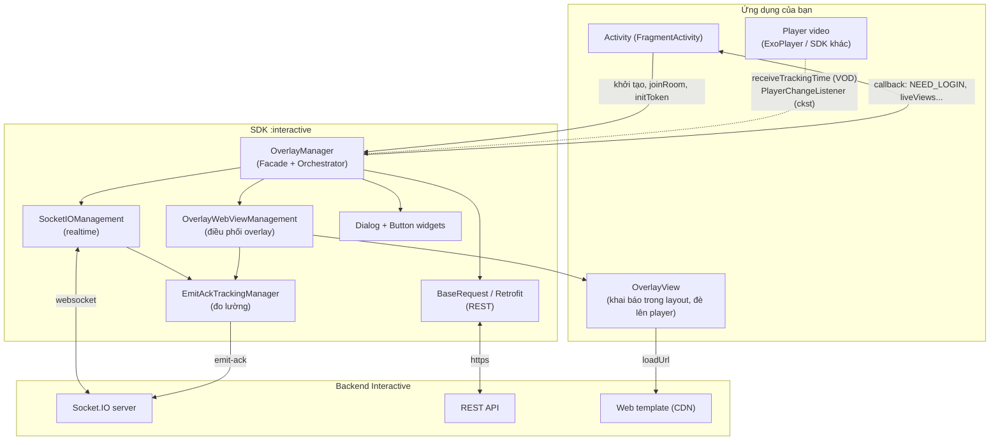
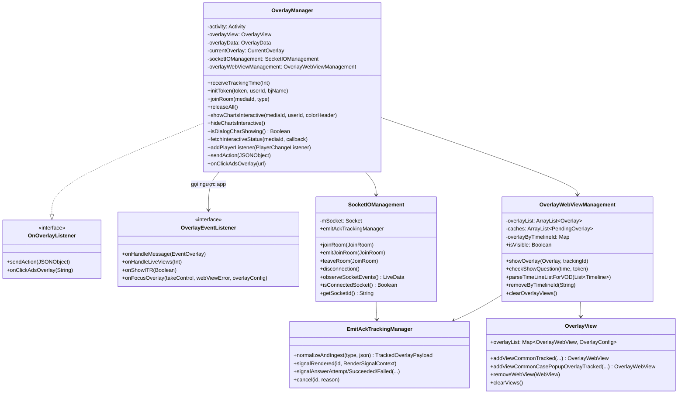
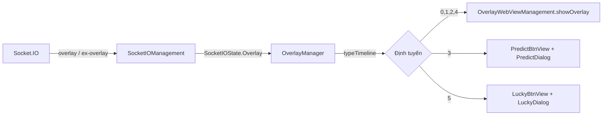
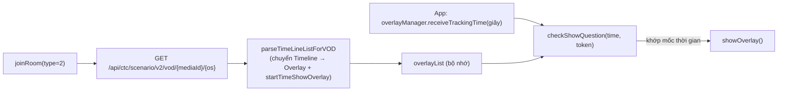
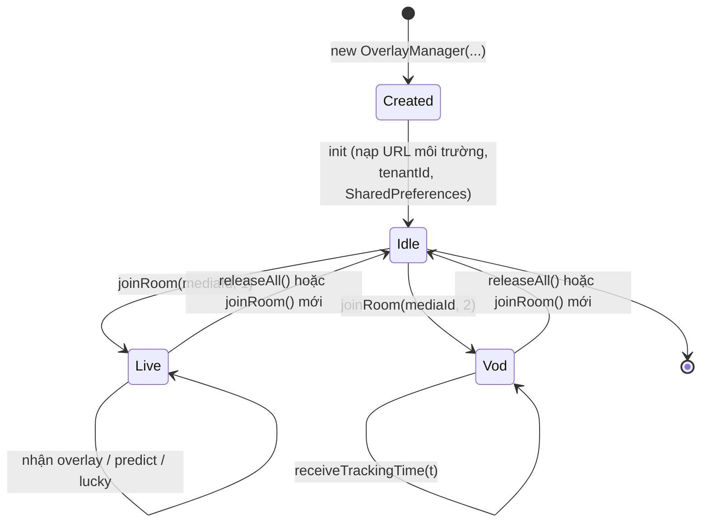
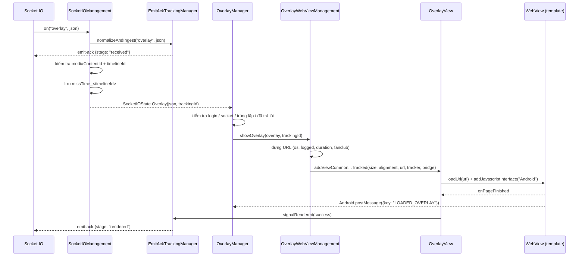
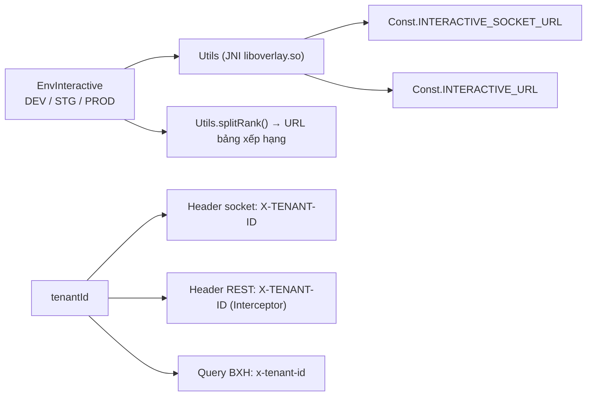

# Kiến trúc SDK Interactive Overlay

## 1. Góc nhìn tổng thể

SDK là một **thư viện Android (AAR)** đóng gói 3 trách nhiệm chính:

1. **Kết nối realtime** với server Interactive qua Socket.IO (kịch bản Live).
2. **Điều phối hiển thị** nội dung tương tác (được viết bằng web) trong các `WebView` trong suốt.
3. **Chuyển tiếp hành động** của người dùng về server qua REST và báo sự kiện ngược cho app.

---

## 2. Phân lớp và trách nhiệm

| Lớp | Thành phần | Trách nhiệm |
|---|---|---|
| **Facade** | `OverlayManager` | Điểm vào duy nhất của app. Nhận lệnh (`joinRoom`, `initToken`, `releaseAll`…), lắng nghe state socket, quyết định loại overlay, xử lý luồng trả lời |
| **Transport realtime** | `SocketIOManagement` | Tạo/huỷ socket, đăng ký sự kiện, chuẩn hoá payload, phát `SocketIOState` qua LiveData |
| **Transport REST** | `BaseRequest` + các `*Request` + `OverlayService` | Retrofit client, gắn header `X-TENANT-ID`, gọi API scenario/action/vip/interactive-status |
| **Presentation** | `OverlayWebViewManagement`, `OverlayView`, `OverlayWebView` | Dựng URL overlay, tạo WebView, ràng buộc vị trí/kích thước theo `metadata`, dọn view |
| **Presentation phụ** | `PredictDialog`, `LuckyDialog`, `SuggestDialog`, `DialogChartsInteractive`, `PredictBtnView`, `LuckyBtnView` | Các dạng UI đặc thù (dialog toàn màn hình, nút nổi) |
| **Bridge** | `OverlayWebViewCallBack`, `PostMessageListener` | Cầu nối JavaScript ⇄ Kotlin (`@JavascriptInterface postMessage`) |
| **Observability** | `tracking/*` | Đo vòng đời overlay và gửi `emit-ack` về server |
| **Hạ tầng** | `Const`, `WSK`, `Utils`, `Ext`, `NPreferenceUtils`, `QueuedMutableLiveData` | Hằng số, JNI lấy URL môi trường, extension, lưu trữ cục bộ |

### Nguyên tắc thiết kế thể hiện trong mã

- **Một facade, không rò rỉ nội bộ**: app chỉ chạm `OverlayManager`, `OverlayView`, `OverlayData`,
  `EnvInteractive`, `OverlayEventListener`. Các lớp tracking đều `internal`.
- **State-driven**: socket không gọi trực tiếp UI mà phát `SocketIOState` (sealed class) qua
  `QueuedMutableLiveData`; `OverlayManager` observe theo vòng đời Activity.
- **Nội dung tương tác là web**: SDK không vẽ giao diện câu hỏi, chỉ nạp URL template và trao đổi
  bằng `postMessage`. Nhờ vậy đổi giao diện tương tác không cần build lại app.
- **URL môi trường được giấu trong native**: `Utils` `System.loadLibrary("overlay")` và gọi các hàm
  JNI `socketDEV/STG/PRD`, `interactiveDEV/STG/PRD` — URL không nằm dạng chuỗi trong Kotlin/DEX.

---

## 3. Sơ đồ lớp rút gọn

---

## 4. Hai chế độ hoạt động

### 4.1. LIVE

(`type = 1`) — điều khiển bởi server

Server chủ động đẩy overlay theo thời gian thực. Điều kiện hiển thị (thời lượng còn lại, đã trả lời
chưa, có trong fanclub không…) được kiểm tra ngay tại client.

### 4.2. VOD

(`type = 2`) — điều khiển bởi tiến độ phát

Không có socket. SDK tải trước toàn bộ kịch bản, sau đó **app phải bơm thời gian phát** vào SDK mỗi giây:

> `startTimeShowOverlay` được suy ra từ `Timeline.time` dạng `"mm:ss"` (hàm `String.toSecond()`),
> nên đơn vị bơm vào `receiveTrackingTime` là **giây**.

---

## 5. Mô hình luồng (threading)

| Việc | Thread | Ghi chú |
|---|---|---|
| Sự kiện Socket.IO | Thread của socket client | Đẩy vào `QueuedMutableLiveData.postValue` |
| Observe `SocketIOState` | **Main thread** | Qua `LiveData.observe(LifecycleOwner)` |
| Dựng/huỷ WebView | **Main thread** | `showOverlayForVod` bọc `GlobalScope.launch(Dispatchers.Main)` |
| Parse kịch bản VOD | `Dispatchers.IO` | `GlobalScope.launch(Dispatchers.IO)` trong `parseTimeLineListForVOD` |
| Gọi REST | Thread của OkHttp, callback về main | Dùng `Call.enqueue` |
| Tracking emit-ack | `@Synchronized` trên `EmitAckTrackingManager` | Timer render chạy trên `Handler(Looper.getMainLooper())` |
| Dọn session tracking | Thread daemon `EmitAckTrackingCleanup` | `ScheduledExecutorService`, chu kỳ 5 phút |

`QueuedMutableLiveData` là điểm đáng chú ý: nó **xếp hàng** các state thay vì để `postValue` ghi đè
nhau — cần thiết vì hai sự kiện overlay có thể đến sát nhau và không được phép mất.

---

## 6. Vòng đời đối tượng

Điểm quan trọng trong mã:

- **Constructor không mở kết nối.** `init {}` chỉ nạp URL theo môi trường, set `tenantId` cho
  Retrofit, gắn listener vào `OverlayView`, khởi tạo `NPreferenceUtils`.
- **`joinRoom()` luôn `cleanUp()` trước** → đóng socket cũ, xoá WebView, huỷ tracking đang treo.
  Nhờ vậy gọi `joinRoom` liên tiếp là an toàn.
- **`SocketIOManagement` được tạo mới cho mỗi phiên Live**, không tái sử dụng.
- **`initToken()` khi đang xem Live sẽ tự `joinRoom()` lại** để socket mang token mới.

---

## 7. Luồng dữ liệu của một overlay (Live)

Chi tiết từng nhánh (bao gồm các điểm bị chặn) xem [03 — Luồng hoạt động](03-luong-hoat-dong.md).

---

## 8. Giao thức cầu nối WebView

SDK gắn JS interface tên **`Android`** (`Const.JS_INTERFACE_NAME`).

**Web → SDK** (`Android.postMessage(jsonString)`):

| Trường | Giá trị | Ý nghĩa |
|---|---|---|
| `key` | `LOADED_OVERLAY` | Template đã sẵn sàng → SDK đẩy dữ liệu xuống, đồng thời chốt `rendered` |
| `type` | `INTERACTIVE_SHOW_ANALYTICS` | Overlay đã hiển thị (ghi log hành vi) |
| `type` | `INTERACTIVE_HIDE_ANALYTICS` | Overlay đóng → SDK gỡ WebView, mở lại predict/lucky |
| `type` | `INTERACTIVE_ACTION_REPORT` | Người dùng trả lời / bấm quảng cáo |
| `type` | `INTERACTIVE_OPEN_ANALYTICS` | Mở dialog predict/lucky |
| `type` | `INTERACTIVE_CLOSE_ANALYTICS` | Đóng dialog predict/lucky |

**SDK → Web** (`window.postMessage(...)` qua `evaluateJavascript`):

| `key` | Khi nào | Hàm |
|---|---|---|
| `GET_DATA_INTERACTIVE` | Sau `LOADED_OVERLAY` | `OverlayWebView.loadData()` / `*Dialog.loadData()` |
| `UPDATE_DATA_INTERACTIVE` | Socket `update-result` | `OverlayWebView.updateResult()` |
| `UPDATE_CONFIRM` | Trả lời thành công (mini game/predict) | `updateConfirm()` |
| `UPDATE_COUTER` | Socket `predict-result` | `PredictDialog.updateResult()` |
| `UPDATE_NUMBER_LUCKY` | API trả kết quả lucky | `LuckyDialog.updateResult(data)` |

---

## 9. Cấu hình môi trường & tenant

- `EnvInteractive.DEV | STG | PROD` quyết định cả URL socket lẫn URL REST.
- `tenantId` phân biệt sản phẩm (ví dụ `vtvlive`, `VTVprime`, `onlive`…). Riêng tenant `vtvlive`
  có luật đặc thù: **overlay không `allowAnonymous` sẽ bị bỏ qua nếu người dùng chưa đăng nhập**.
- `BuildConfig.DEVICE_TYPE` (`androidmobile` / `androidtv`) đi vào header `os`, query `os=` của URL
  template và điều kiện lọc `targets`.

---

## 10. Lưu trữ cục bộ

SharedPreferences được dùng ở hai file khác nhau (chủ ý của mã hiện tại):

| Khoá | File | Mục đích |
|---|---|---|
| `missTime_<timelineId>` | `interactive_vlive` | Mốc nhận overlay, dùng tính `duration` còn lại khi hiển thị muộn |
| `ex_<userId hoặc deviceId>` | `INTERACTIVE` | Ghi `timelineId` mini game đã trả lời để không hiện lại |
| `timelineId`, `currentTime` | `interactive_vlive` | Dấu vết overlay được chấp nhận gần nhất |