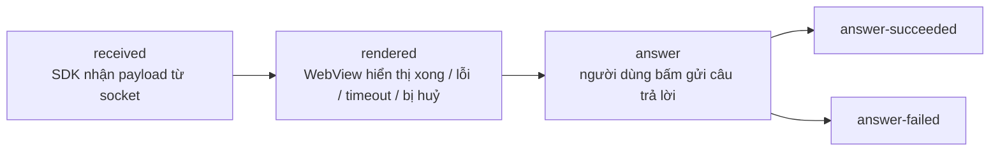
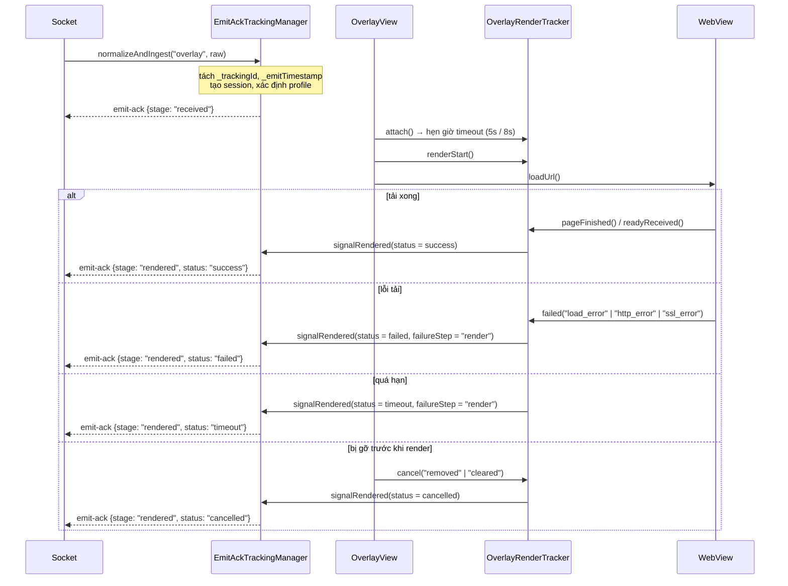
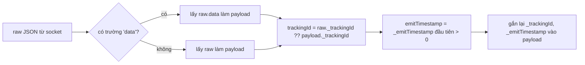

# 05 — Tracking emit-ack (đo lường vòng đời overlay)

[← Về mục lục](README.md)

Cơ chế này trả lời câu hỏi của phía vận hành: *“Overlay server đẩy đi có thực sự tới máy người dùng,
có render được, và người dùng có trả lời không?”* — đo bằng chính client, gửi ngược về server qua
sự kiện socket `emit-ack`.

> Bật/tắt bằng cờ build `FEATURE_TRACKING_ACK_OVERLAY` trong
> [interactive/build.gradle](../interactive/build.gradle) (hiện đang `true`).
> Toàn bộ lớp tracking là `internal` — app không tương tác trực tiếp.

---

## 1. Các mốc (stage)



| Stage | Ý nghĩa | Kết thúc phiên? |
|---|---|---|
| `received` | Payload hợp lệ đã vào SDK | Không |
| `rendered` | Chốt kết quả hiển thị, kèm `status` | Có, nếu `status != success` |
| `answer` | Bắt đầu gửi câu trả lời | Không |
| `answer-succeeded` | API trả `success = true` | Có |
| `answer-failed` | API lỗi / từ chối / lỗi mạng | Có |

`status` của `rendered`: `success` | `failed` | `timeout` | `cancelled`.

Mỗi stage chỉ được gửi **một lần** cho mỗi `trackingId` (`emittedStages` là `Set`); nếu `emit` ném
lỗi thì stage được gỡ khỏi set để có thể thử lại ở lần kích hoạt sau.

---

## 2. Cấu trúc payload gửi lên server

```jsonc
// emit("emit-ack", payload)
{
  "trackingId": "<_trackingId lấy từ payload overlay>",
  "event": "overlay",
  "stage": "received | rendered | answer | answer-succeeded | answer-failed",
  "deviceId": "<android-id>",
  "clientContext": { /* xem bên dưới */ }
}
```

### `clientContext` — phần chung

| Trường | Nguồn |
|---|---|
| `profile` | `overlay.legacyIframe` hoặc `overlay.wsInteractive` |
| `transportMode` | `legacyIframe` / `wsInteractive` |
| `overlayType` | `metadata.type` → `typeTimeline` → `type` |
| `duration` | `duration` của overlay (giây) |
| `sdkVersion` | `versionName.versionCode` (ví dụ `1.2.18`) |
| `platform` | `tv` nếu `DEVICE_TYPE` chứa "tv", ngược lại `android` |
| `os` | `"Android <release>"` |
| `deviceClass` | `tv` / `tablet` / `mobile_large` / `mobile` / `mobile_small` |
| `viewportWidth`, `viewportHeight` | `displayMetrics` |

### Theo từng stage

| Stage | Trường bổ sung |
|---|---|
| `received` | `emitTimestamp`, `receiveTimestamp`, `receiveLatencyMs`, `ackLatencyMs`, `timeline{received, ackSent}` |
| `rendered` | `status`, `receiveLatencyMs`, `renderLatencyMs`, `ackLatencyMs`, `timeline{attached, renderStart, loadComplete, readyReceived, ackSent}`, `failureReason?`, `failureStep?`, `custom.cancelReason?` |
| `answer*` | `actionType` (`answer_submit`), `actionResult` (`attempted`/`success`/`failure`), `actionLatencyMs`, `occurrenceId` (= `timelineId`), `failureReason?`, `failureStep?`, `custom{timelineId, typeTimeline, mediaId, apiMessage?, apiDescription?, error?}` |

---

## 3. Hai hồ sơ (profile) và ngưỡng timeout

`EmitAckTrackingManager.resolveProfile()` xét URL `src` của overlay:

| Điều kiện | Profile | Timeout render | Mốc chốt `rendered` |
|---|---|---|---|
| `src` chứa `?ws=1` hoặc `&ws=1` | `overlay.wsInteractive` | **8000 ms** | Chỉ khi web gửi `LOADED_OVERLAY` (`readyReceived`) |
| còn lại | `overlay.legacyIframe` | **5000 ms** | `onPageFinished` **hoặc** `LOADED_OVERLAY`, cái nào đến trước |

Nghĩa là template kiểu mới (`ws=1`) phải chủ động báo sẵn sàng, còn template cũ chỉ cần tải xong trang.

---

## 4. Luồng đo trên một overlay



`OverlayRenderTracker` chạy trên `Handler(Looper.getMainLooper())`, dùng cờ `terminalSent` để đảm bảo
chỉ phát **một** tín hiệu kết thúc, kể cả khi timeout và `pageFinished` xảy ra gần nhau.

---

## 5. Bảng lý do huỷ (`cancelReason`)

Đây là danh sách đầy đủ các điểm SDK **cố ý không hiển thị** overlay — rất hữu ích khi điều tra
“vì sao overlay không hiện”:

| `cancelReason` | Nơi phát sinh | Nguyên nhân |
|---|---|---|
| `invalid_payload` | Socket / OverlayManager | Thiếu `mediaContentId`/`timelineId`, hoặc JSON không parse được thành `Overlay` |
| `short_duration` | Socket (`ex-overlay`) | `duration <= 10` giây |
| `login_required` | OverlayManager | Tenant `vtvlive`, chưa đăng nhập, overlay không `allowAnonymous` |
| `socket_not_connected` | OverlayManager | Socket đã rớt tại thời điểm xử lý |
| `missing_timeline_id` | OverlayManager | `timelineId` rỗng |
| `duplicate_overlay` | OverlayManager | Trùng `timelineId` với overlay/predict/lucky/headline đang hiển thị |
| `already_answered` | OverlayManager | Pref `ex_<userId\|deviceId>` đã ghi `timelineId` này |
| `target_mismatch` | WebViewManagement | `targets` không chứa `all` và không chứa nền tảng hiện tại |
| `invalid_layout` | WebViewManagement / OverlayView | Không suy được `alignment` từ `metadata.pos` |
| `expired_duration` | WebViewManagement | `duration - (now - missTime) <= 0` |
| `superseded_cache` | WebViewManagement | Overlay cũ trong cache bị overlay mới thay thế khi mở khoá |
| `removed`, `cleared` | OverlayView | WebView bị gỡ / xoá toàn bộ |
| `socket_disconnected`, `sdk_disconnect`, `leave_room`, `clear_all`, `destroy` | Socket / Manager | Kết thúc phiên |

---

## 6. Quản lý bộ nhớ phiên tracking

| Tham số | Giá trị |
|---|---|
| Số phiên tối đa | **256** (vượt thì loại phiên cũ nhất — `LinkedHashMap` truy cập-gần-nhất) |
| TTL mỗi phiên | **30 phút** |
| Chu kỳ dọn nền | **5 phút** (thread daemon `EmitAckTrackingCleanup`) |

Phiên bị xoá ngay khi: `rendered` với status khác `success`, `answer-succeeded`, `answer-failed`,
hoặc `finish()`/`cancelAll()` khi rời phòng / ngắt socket.

---

## 7. Chuẩn hoá payload (`TrackingPayloadNormalizer`)



Nhờ bước này, phần còn lại của SDK luôn làm việc với payload đã "mở gói", đồng thời giữ được metadata
tracking.

---

## 8. Ảnh hưởng tới app tích hợp

- Tracking **không** thêm quyền, không gọi API riêng — dùng chính socket đang mở.
- Ở chế độ **VOD không có tracking** (không có socket để emit).
- Nếu app muốn tắt hoàn toàn: sửa `FEATURE_TRACKING_ACK_OVERLAY` thành `false` và build lại AAR.

---

[← API Reference](04-api-reference.md) · [Về mục lục](README.md) · [Tiếp: Lỗi thường gặp →](06-loi-thuong-gap.md)
