# 03 — Luồng hoạt động chi tiết

[← Về mục lục](README.md)

Tài liệu này mô tả **từng luồng nghiệp vụ** của SDK, kèm sơ đồ tuần tự và điều kiện rẽ nhánh đúng
như mã nguồn hiện tại.

## Danh sách luồng

1. [Khởi tạo SDK](#1-khởi-tạo-sdk)
2. [Đăng nhập / đăng xuất](#2-đăng-nhập--đăng-xuất)
3. [Vào phòng LIVE](#3-vào-phòng-live)
4. [Nhận và định tuyến overlay (LIVE)](#4-nhận-và-định-tuyến-overlay-live)
5. [Render overlay lên màn hình](#5-render-overlay-lên-màn-hình)
6. [Vòng đời một WebView overlay](#6-vòng-đời-một-webview-overlay)
7. [Trả lời câu hỏi (mini game)](#7-trả-lời-câu-hỏi-mini-game)
8. [Dự đoán — Predict (`typeTimeline = 3`)](#8-dự-đoán--predict-typetimeline--3)
9. [Vòng quay may mắn — Lucky (`typeTimeline = 5`)](#9-vòng-quay-may-mắn--lucky-typetimeline--5)
10. [Headline (`typeTimeline = 4`)](#10-headline-typetimeline--4)
11. [Thu hồi overlay — overlay-recall](#11-thu-hồi-overlay--overlay-recall)
12. [Các sự kiện phụ trợ: liveviews, fan-club, ckst](#12-các-sự-kiện-phụ-trợ-liveviews-fan-club-ckst)
13. [Luồng VOD](#13-luồng-vod)
14. [Mất kết nối và khôi phục](#14-mất-kết-nối-và-khôi-phục)
15. [Giải phóng tài nguyên](#15-giải-phóng-tài-nguyên)

---

## 1. Khởi tạo SDK

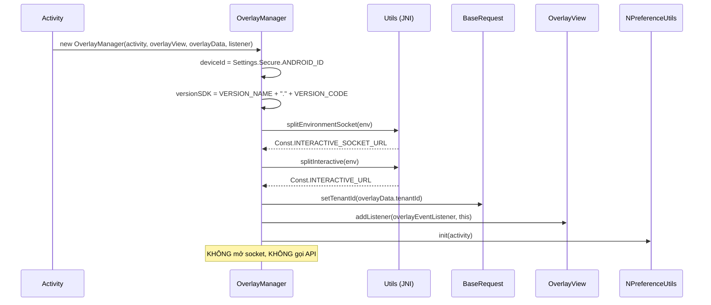

Sau bước này SDK ở trạng thái **Idle**: đã biết môi trường, tenant, có chỗ để render — nhưng chưa
gắn với nội dung nào.

---

## 2. Đăng nhập / đăng xuất

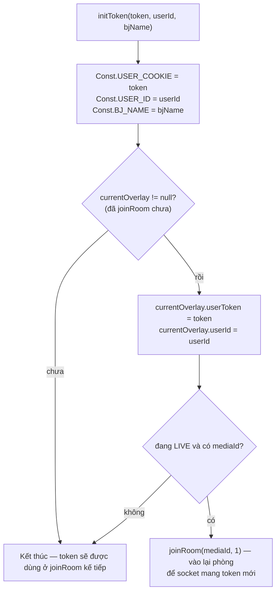

Ý nghĩa thực tế:

- **Đăng nhập giữa lúc đang xem Live** → SDK tự kết nối lại; overlay đang hiển thị sẽ bị dọn
  (`cleanUp()` bên trong `joinRoom`).
- **Đăng xuất** = `initToken("", "")`; nếu đang Live cũng sẽ vào lại phòng ở trạng thái ẩn danh.
- Header `Authorization`: token bắt đầu `"ey"` (JWT) → `"Bearer <token>"`, ngược lại gửi nguyên văn.

---

## 3. Vào phòng LIVE

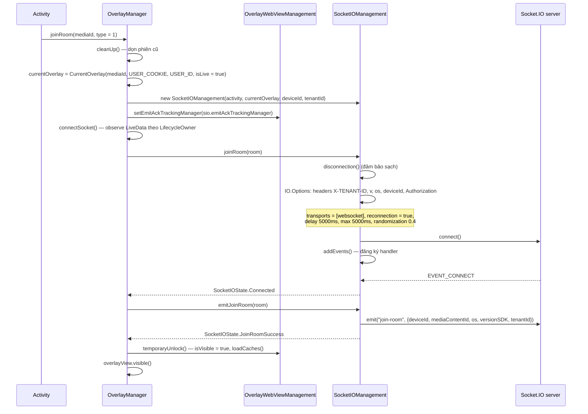

Điểm cần nhớ:

- Lệnh `emit("join-room")` **chỉ xảy ra sau khi socket connect thành công**, không phải ngay khi gọi
  `joinRoom()`.
- Trước khi `Connected`, `OverlayWebViewManagement.isVisible = false` → mọi overlay đến sớm được
  **đưa vào cache** thay vì hiển thị.
- `overlayView` chỉ được `visible()` ở `temporaryUnlock()`.

---

## 4. Nhận và định tuyến overlay (LIVE)

### 4.1. Tầng socket lọc trước

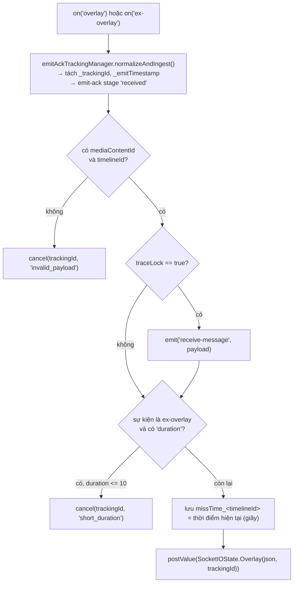

### 4.2. Tầng `OverlayManager` kiểm tra nghiệp vụ

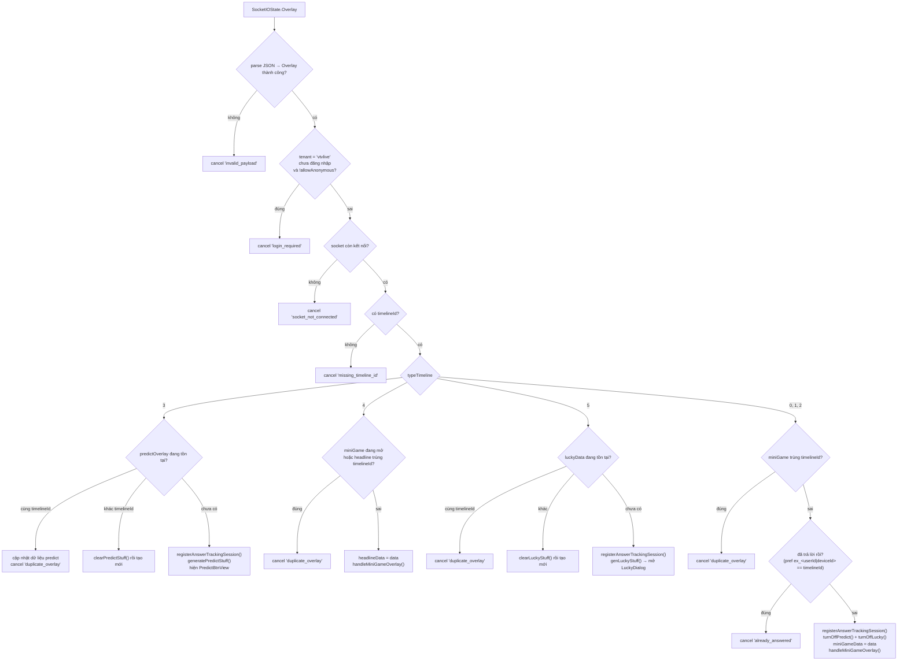

> Khoá `ex_...` dùng `userId` khi đã đăng nhập; nếu chưa đăng nhập nhưng overlay cho phép ẩn danh
> thì dùng `deviceId`.

---

## 5. Render overlay lên màn hình

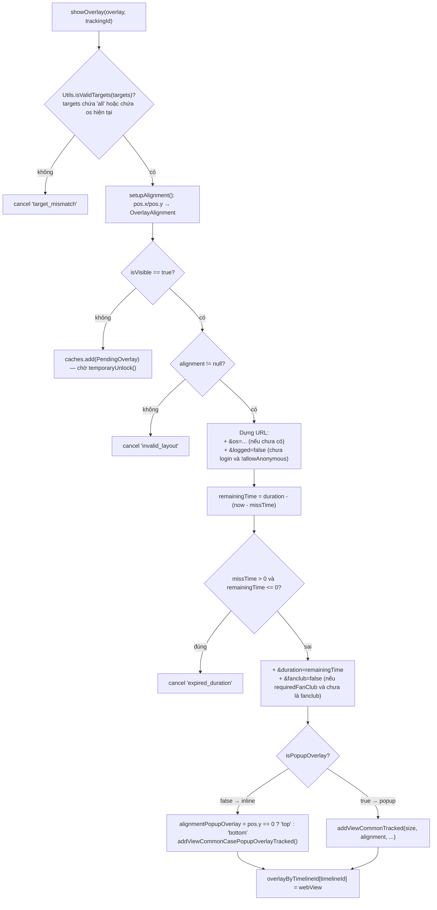

**Ràng buộc hình học** trong `OverlayView`:

- `addViewCommonTracked`: chiều rộng/cao theo phần trăm (`constrainPercentWidth/Height`) và neo theo
  9 vị trí (`LeftTop` … `RightBottom`) suy từ `metadata.pos`.
- `addViewCommonCasePopupOverlayTracked`: rộng `WRAP_CONTENT`, cao theo phần trăm, neo trên/dưới/
  trái/phải theo `alignmentPopupOverlay`.
- Cả hai đều gọi `clearViews()` trước khi thêm → **tại một thời điểm chỉ có một overlay WebView**.

---

## 6. Vòng đời một WebView overlay

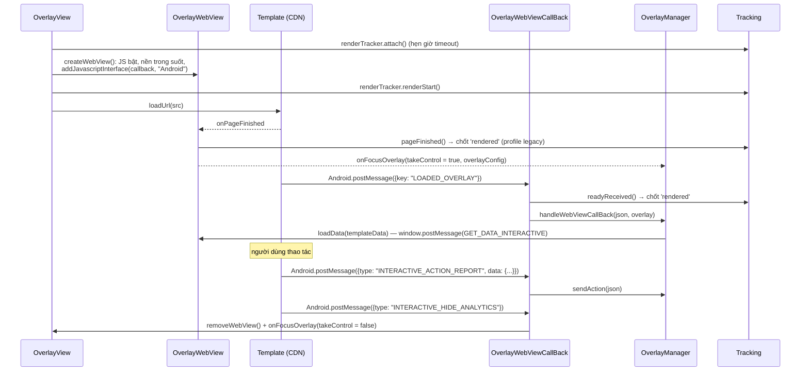

Các lỗi tải trang (`onReceivedError`, `onReceivedHttpError`, `onReceivedSslError`) đều:
`renderTracker.failed(...)` → ẩn WebView → `onFocusOverlay(webViewError = true)`.

---

## 7. Trả lời câu hỏi (mini game)

Đây là luồng phức tạp nhất, có 4 lớp kiểm tra trước khi gửi API.

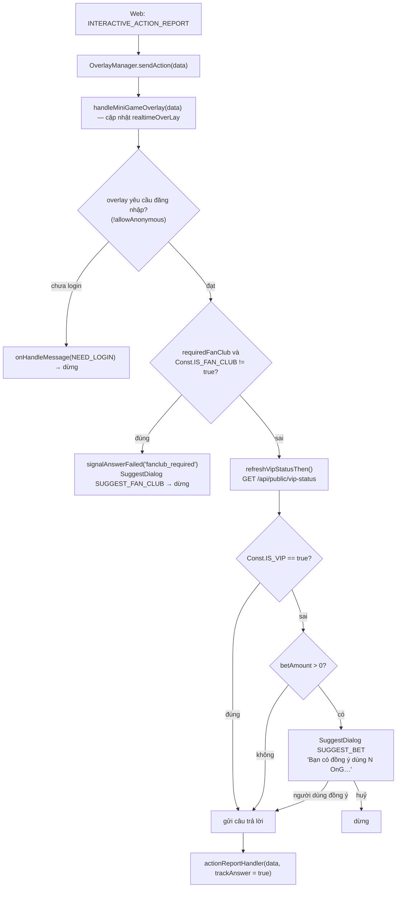

### 7.1. `actionReportHandler` — gửi API

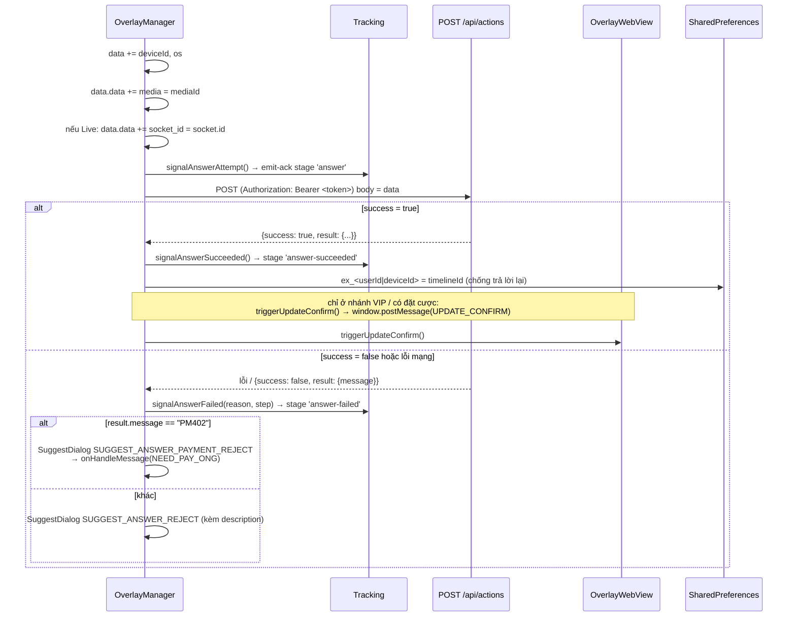

Ánh xạ mã lỗi → `failureReason` trong tracking (`AnswerTrackingMapper`):

| `result.message` | `failureReason` | `failureStep` |
|---|---|---|
| `EX400` | `api_EX400` | `api_response` |
| `TL404` | `api_TL404` | `api_response` |
| `PM402` | `api_PM402` | `api_response` |
| khác, `success = false` | `api_false` | `api_response` |
| lỗi mạng | `network_error` | `network` |
| body rỗng / không parse được | `unknown_response` | `unknown_response` |

### 7.2. Các loại `type` khác trong `sendAction`

| `type` | Hành vi |
|---|---|
| `INTERACTIVE_SHOW_ANALYTICS` | `onShowITR(true)` + ghi nhận hành vi qua `/api/actions` |
| `INTERACTIVE_HIDE_ANALYTICS` | Ghi nhận, xoá `overlay`/`miniGameData`, **bật lại** predict và lucky |
| `INTERACTIVE_OPEN_ANALYTICS` | `onShowITR(true)` + ghi nhận (predict/lucky) |
| `INTERACTIVE_CLOSE_ANALYTICS` | Ghi nhận (predict/lucky) |
| `action = CLICK_ADS` + có `url` | Không gọi API, mở trình duyệt ngoài qua `onClickAdsOverlay(url)` |

---

## 8. Dự đoán — Predict (`typeTimeline = 3`)

```mermaid
sequenceDiagram
    participant WS as Socket
    participant OM as OverlayManager
    participant BTN as PredictBtnView
    participant DLG as PredictDialog
    participant API as /api/actions

    WS-->>OM: overlay (typeTimeline = 3)
    OM->>BTN: tạo nút nổi (ảnh normal/power từ payload,<br/>fallback ảnh mặc định trên CDN)
    OM->>DLG: PredictDialog.getInstance(payload)
    OM->>BTN: onAttach() — hiện nút, sau 5s giảm alpha còn 0.5

    Note over WS,OM: sự kiện điều khiển realtime "predict-timeline"
    WS-->>OM: {type: "ACTIVE"} → activePredict() → hiện nút
    WS-->>OM: {type: "INACTIVE"} → inactivePredict() → ẩn nút, đóng dialog
    WS-->>OM: {type: "POWER"} → nút đổi sang ảnh power 5 giây
    WS-->>OM: {type: "END"} → SuggestDialog "Dự đoán đã kết thúc" + dọn toàn bộ

    BTN->>OM: người dùng bấm nút
    alt chưa đăng nhập
        OM-->>OM: onHandleMessage(NEED_LOGIN), hiện lại nút
    else đã đăng nhập
        OM->>DLG: show() (toàn màn hình, nền trong suốt)
        DLG->>DLG: WebView nạp src + &u=<userId> (+ &logged=false nếu chưa login)
        DLG-->>OM: LOADED_OVERLAY → loadData()
        DLG->>OM: INTERACTIVE_ACTION_REPORT → luồng trả lời (mục 7)
        OM->>API: POST /api/actions
        API-->>OM: success → updateConfirm(); thất bại → SuggestDialog
    end

    WS-->>OM: "predict-result" → cập nhật answer1/answer2 → DLG.updateResult()
```

Cờ trạng thái điều khiển hiển thị nút:

| Cờ | Ý nghĩa | Ai đổi |
|---|---|---|
| `isPredictOn` | Có được phép hiện không (bị tắt khi mini game chiếm màn hình) | `turnOnPredict()` / `turnOffPredict()` |
| `isPredictActive` | Server cho phép tương tác không | Sự kiện `ACTIVE` / `INACTIVE` |
| `isPredictDialogOn` | Dialog đang mở | `showPredictDialog()` / `hidePredictDialog()` |

Nút chỉ hiện khi `isPredictOn && isPredictActive`.

---

## 9. Vòng quay may mắn — Lucky (`typeTimeline = 5`)

Cấu trúc giống Predict (`LuckyBtnView` + `LuckyDialog`, sự kiện socket `lucky-event` với
`ACTIVE/INACTIVE/POWER/END`), **khác một điểm quan trọng**:

```kotlin
// OverlayManager.genLuckyStuff() — dòng cuối
showLuckyDialog()
```

→ Overlay lucky **tự mở dialog ngay khi nhận được**, không chờ người dùng bấm nút.

Kết quả trả về từ API được đẩy xuống web bằng `UPDATE_NUMBER_LUCKY`:

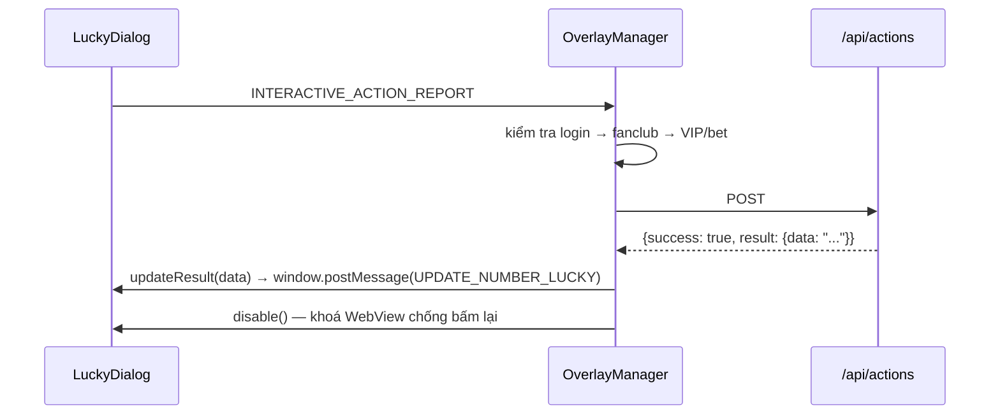

---

## 10. Headline (`typeTimeline = 4`)

- Dùng chung đường render với mini game (`handleMiniGameOverlay`).
- Bị bỏ qua nếu **đang có mini game mở** (`miniGameData != null`) hoặc trùng `timelineId` với
  headline hiện tại.
- Chỉ nhận hai `type` hành vi: `INTERACTIVE_SHOW_ANALYTICS` và `INTERACTIVE_HIDE_ANALYTICS`
  (không có luồng trả lời).

---

## 11. Thu hồi overlay — overlay-recall

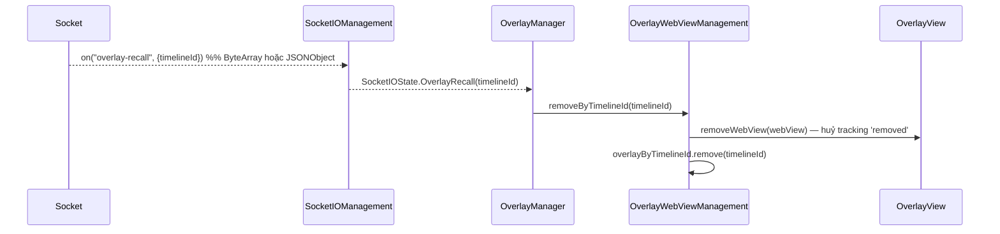

Dùng khi biên tập viên gỡ một overlay đang phát trên toàn hệ thống.

---

## 12. Các sự kiện phụ trợ: liveviews, fan-club, ckst

| Sự kiện socket | Xử lý |
|---|---|
| `liveviews` | Parse `OverlayLiveViews.count`, **cộng thêm 230**, gọi `onHandleLiveViews(count)` |
| `data` (fan-club) | Nếu `mediaId` khớp media đang xem (so sánh phần trước dấu `_`) → cập nhật `Const.IS_FAN_CLUB`; ngược lại đặt `false` |
| `ckst` | Server hỏi trạng thái player → SDK emit lại `ckst` với `{action: "CHECK_PLAYER_STATUS", sessionId, data: {deviceId, os, mediaContentId, playerStatus}}` |
| `update-result` | `OverlayWebView.updateResult(data)` → `window.postMessage(UPDATE_DATA_INTERACTIVE)` |
| `predict-result` | Cập nhật `answer1`/`answer2` vào `predictOverlay`, gọi `PredictDialog.updateResult()` |

> `liveViews` cộng 230 là hành vi cố ý trong mã hiện tại
> ([OverlayManager.kt:435](../interactive/src/main/java/vn/interactive/OverlayManager.kt:435)) —
> nếu app cần con số thô, phải trừ lại phía app.

`playerStatus` chỉ khác rỗng khi app đã `addPlayerListener(...)`.

---

## 13. Luồng VOD

```mermaid
sequenceDiagram
    participant APP as Activity
    participant OM as OverlayManager
    participant API as GET /api/ctc/scenario/v2/vod/{mediaId}/{os}
    participant WVM as OverlayWebViewManagement
    participant OV as OverlayView

    APP->>OM: joinRoom(mediaId, type = 2)
    OM->>OM: cleanUp(); isLive = false
    OM->>WVM: isVisible = true
    OM->>API: GetScenarioRequest(token = USER_COOKIE, mediaId, os)
    API-->>OM: ScenarioDTO {data.timelines[]}
    OM->>WVM: parseTimeLineListForVOD(timelines)
    WVM->>WVM: mỗi Timeline.interactive → Overlay:<br/>src + ?timelineId&tenantId&deviceType&os<br/>startTimeShowOverlay = time("mm:ss") → giây

    loop mỗi giây (app tự chạy)
        APP->>OM: receiveTrackingTime(seconds)
        OM->>WVM: checkShowQuestion(seconds, userToken)
        WVM->>WVM: tìm overlay có startTimeShowOverlay nhỏ nhất còn >= seconds
        alt startTimeShowOverlay == seconds
            WVM->>WVM: nếu !allowAnonymous và chưa login → bỏ qua
            WVM->>WVM: lưu missTime_<timelineId>
            WVM->>OV: showOverlay() trên Main thread
            WVM->>WVM: xoá các overlay cùng mốc khỏi danh sách
        end
    end
```

Khác biệt so với LIVE:

| | LIVE | VOD |
|---|---|---|
| Nguồn overlay | Socket.IO đẩy | REST tải trước toàn bộ kịch bản |
| Kích hoạt hiển thị | Sự kiện realtime | `receiveTrackingTime(giây)` do app bơm |
| `socketIOManagement` | Có | **null** (mọi lời gọi socket bị bỏ qua an toàn) |
| `socket_id` trong action | Có | Không |
| Tracking emit-ack | Có | Không (không có socket để emit) |
| Predict / Lucky / liveviews | Có | Không |

---

## 14. Mất kết nối và khôi phục

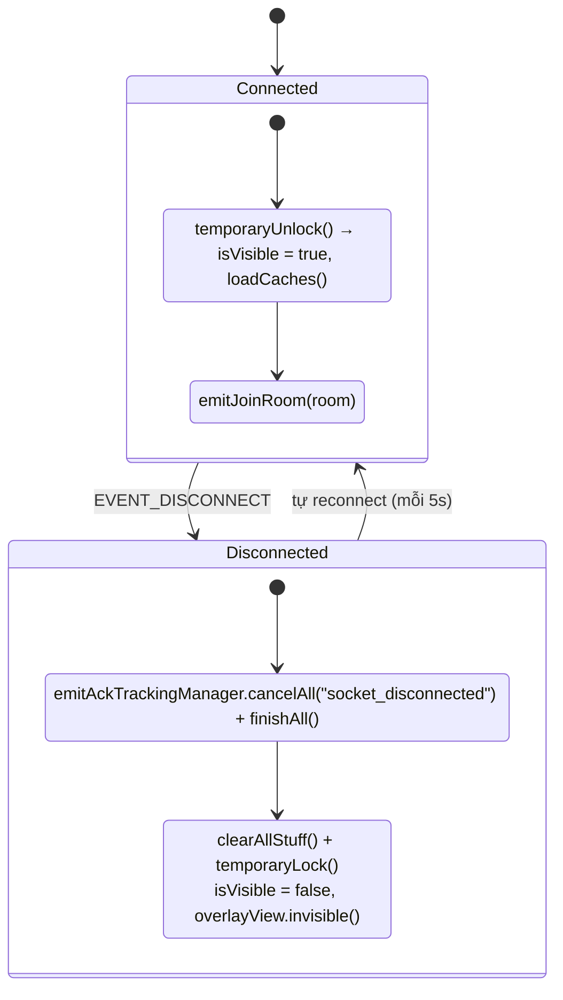

- **Cache overlay**: khi `isVisible = false`, overlay mới đi vào `caches`. Lúc mở khoá,
  `loadCaches()` chỉ hiển thị **phần tử cuối cùng**, các phần tử trước bị huỷ tracking với lý do
  `superseded_cache`.
- **`missTime`**: nhờ mốc thời gian đã lưu, overlay hiện lại sau khi mất kết nối sẽ có `duration` bị
  trừ đi phần đã trôi qua; nếu hết hạn thì bị bỏ (`expired_duration`).
- Sự kiện `EVENT_CONNECT_ERROR` → `SocketIOState.Error` → `clearAllStuff()`.

---

## 15. Giải phóng tài nguyên

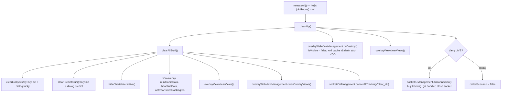

Gọi `releaseAll()` ở:

- `onDestroy()` của Activity chứa player,
- khi người dùng thoát khỏi nội dung (đóng player, quay lại danh sách),
- trước khi chuyển sang một `mediaId` khác **nếu** không dùng ngay `joinRoom()` (vì `joinRoom` đã tự
  dọn).

---

[← Cài đặt & Tích hợp](02-cai-dat-va-tich-hop.md) · [Về mục lục](README.md) · [Tiếp: API Reference →](04-api-reference.md)
