# 03 — Luồng hoạt động chi tiết

[← Về mục lục](README.md)

Tài liệu này mô tả **từng luồng nghiệp vụ** của SDK iOS, kèm sơ đồ tuần tự và điều kiện rẽ nhánh
đúng như mã nguồn hiện tại (`InteractiveControllerView.swift`, `OverlayManagementImpl.swift`,
`PredictManagementImpl.swift`, `SocketIOManagementImpl.swift`).

## Danh sách luồng

1. [Khởi tạo & cấu hình](#1-khởi-tạo--cấu-hình)
2. [Đăng nhập / đăng xuất](#2-đăng-nhập--đăng-xuất)
3. [Vào phòng LIVE](#3-vào-phòng-live)
4. [Nhận và định tuyến overlay (LIVE)](#4-nhận-và-định-tuyến-overlay-live)
5. [Render overlay minigame](#5-render-overlay-minigame)
6. [Trả lời câu hỏi minigame (login → fanclub → VIP/bet)](#6-trả-lời-câu-hỏi-minigame)
7. [Predict — Đấu trí (`typeTimeline = 3`)](#7-predict--đấu-trí-typetimeline--3)
8. [Lucky — Số may mắn (`typeTimeline = 5`)](#8-lucky--số-may-mắn-typetimeline--5)
9. [Thu hồi overlay — overlay-recall](#9-thu-hồi-overlay--overlay-recall)
10. [Sự kiện phụ trợ: liveviews, fanclub, ckst, update-result](#10-sự-kiện-phụ-trợ)
11. [Luồng VOD](#11-luồng-vod)
12. [Mất kết nối và khôi phục](#12-mất-kết-nối-và-khôi-phục)
13. [Giải phóng tài nguyên](#13-giải-phóng-tài-nguyên)

---

## 1. Khởi tạo & cấu hình

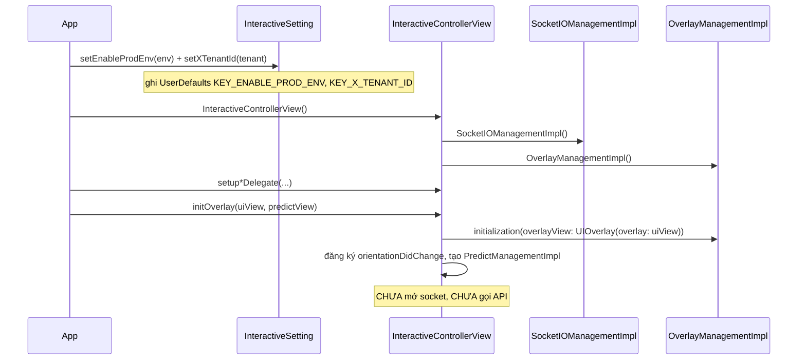

Sau bước này SDK **sẵn sàng**: biết môi trường, tenant, có 2 view để render — nhưng chưa gắn nội dung.

---

## 2. Đăng nhập / đăng xuất

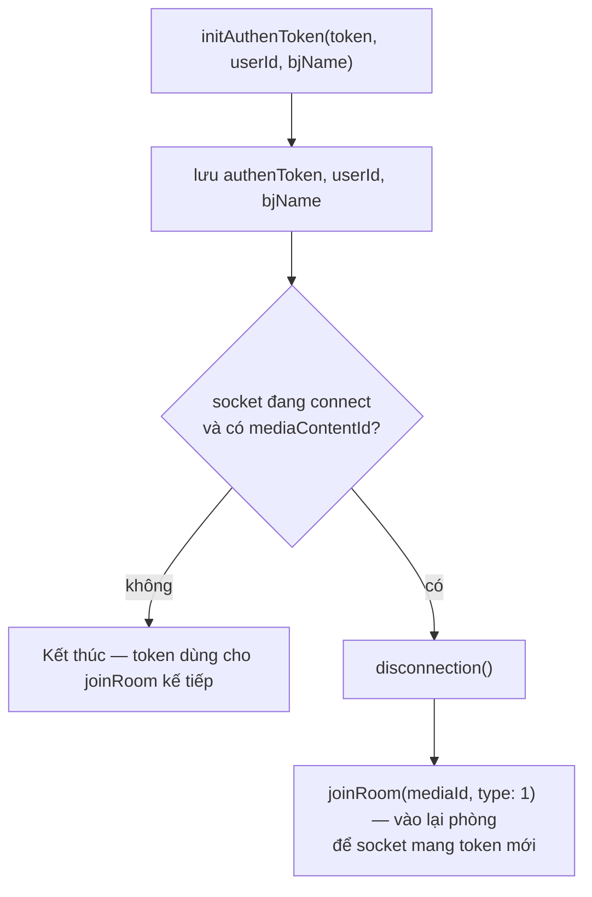

Ý nghĩa:

- **Đăng nhập giữa lúc đang xem Live** → SDK tự ngắt và vào lại phòng; overlay đang hiển thị bị dọn.
- **Đăng xuất** = `initAuthenToken("", "", "")`.
- Token vào header socket `Authorization` **nguyên văn**; với REST, JWT (bắt đầu `"ey"`) được thêm
  tiền tố `Bearer `.

---

## 3. Vào phòng LIVE

```mermaid
sequenceDiagram
    participant APP as App
    participant ICV as InteractiveControllerView
    participant SIO as SocketIOManagementImpl
    participant WS as Socket.IO server

    APP->>ICV: joinRoom(mediaId, type: 1)
    ICV->>ICV: nếu media khác → leaveRoom() phòng cũ
    ICV->>SIO: nếu đang connect → disconnection()
    ICV->>ICV: removeAllView(); mediaContentId = mediaId
    ICV->>ICV: handleEventsSocket() — gắn callback TRƯỚC khi connect
    ICV->>SIO: connectSocket() → connection(url, authenToken)
    SIO->>SIO: buildSocket() — guard tenantId & env (không rỗng)
    Note over SIO: headers x-tenant-id, v, os=iphone, deviceId, Authorization<br/>forceWebsockets, reconnectWait 5, randomization 0.4
    SIO->>SIO: addEvents() (đăng ký handler)
    SIO->>WS: socket.connect()
    WS-->>SIO: clientEvent .connect
    SIO-->>ICV: callback CONNECTED
    ICV->>SIO: joinRoom(JoinRoomData(mediaContentId))
    SIO->>WS: emit("join-room", {deviceId, mediaContentId, os, tenantId, versionSDK})
```

Điểm cần nhớ:

- `emit("join-room")` **chỉ xảy ra sau khi socket connect thành công** (trong nhánh
  `SocketEvents.CONNECTED`), không phải ngay khi gọi `joinRoom()`.
- `handleEventsSocket()` được gọi **trước** `connectSocket()` để không bỏ lỡ sự kiện `CONNECTED`.
- `buildSocket()` sẽ **dừng** nếu `KEY_X_TENANT_ID` rỗng; `connectSocket()` dừng nếu env hoặc tenant
  rỗng.

---

## 4. Nhận và định tuyến overlay (LIVE)

### 4.1. Tầng socket lọc trước (`SocketIOManagementImpl`)

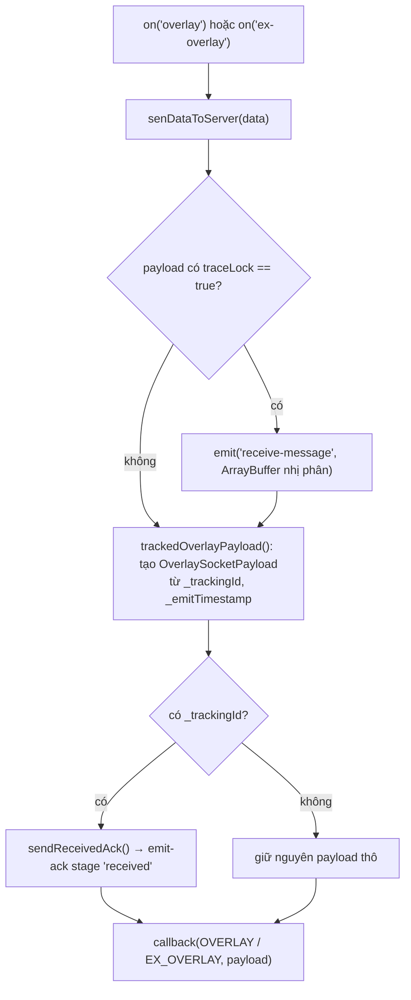

### 4.2. Tầng `InteractiveControllerView` (`startShowLiveOverlayWithDataReceived`)

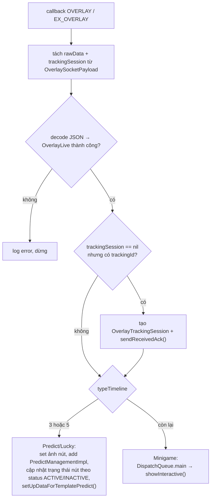

Trong `showInteractive()`:

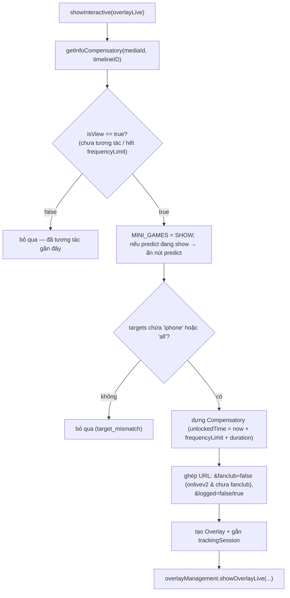

> `getInfoCompensatory` đọc `UserDefaults(suiteName: INTERACTIVE_<userId|DEFAULT>)` theo `mediaId`:
> nếu mốc đã tương tác và còn trong `frequencyLimit` thì trả `false` (không hiện lại).

---

## 5. Render overlay minigame

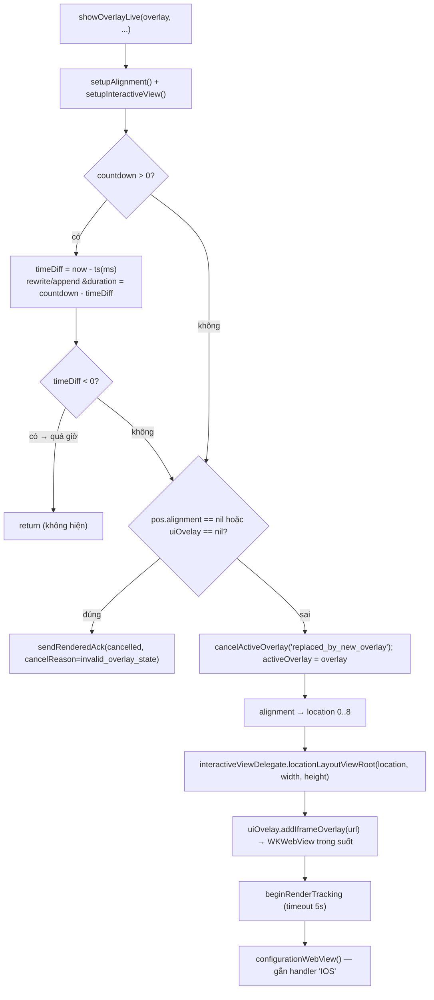

**Ràng buộc hình học**: `location` (0..8) suy từ `OverlayPosition.pos.x`/`pos.y` (mỗi trục 0/1/2),
map sang 9 vị trí (`LeftTop`…`RightBottom`). Kích thước `size.w/size.h` là **tỉ lệ** so với khung.
Việc canh vị trí thực tế do app xử lý trong `locationLayoutViewRoot(location:width:height:)`; WebView
được đặt phủ khung root.

**Một thời điểm chỉ có một overlay minigame**: `showOverlayLive` gọi `cancelActiveOverlay` +
`uiOvelay?.onStop()` trước khi thêm overlay mới.

---

## 6. Trả lời câu hỏi minigame

Kích hoạt khi WebView gửi `IOS.postMessage({type: INTERACTIVE_ACTION_REPORT, data})`.
Có nhánh **Live** (`handleWebViewCallBack`) và **VOD** (`handleWebViewCallBackVod`).

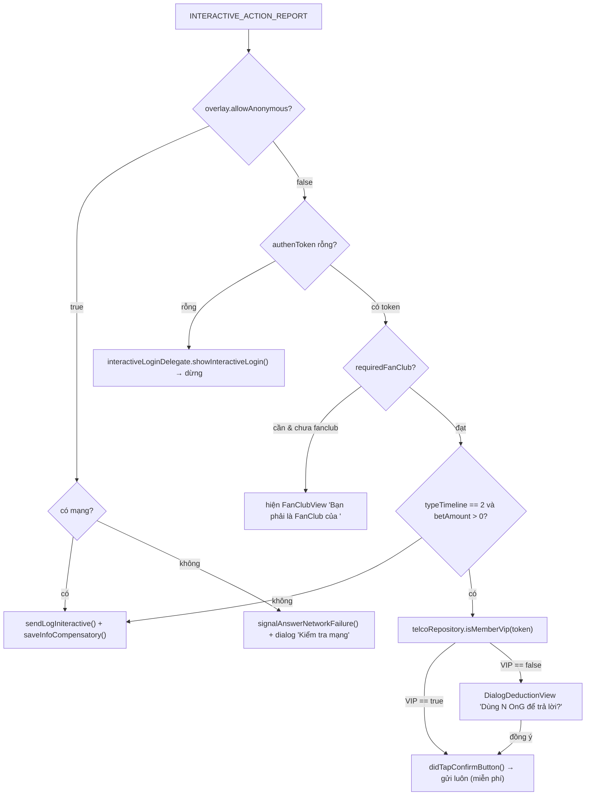

### 6.1. `sendLogIniteractive` — gọi API `/api/actions`

```mermaid
sequenceDiagram
    participant OMI as OverlayManagementImpl
    participant TRK as OverlayTrackingSession
    participant API as POST /api/actions
    participant WV as WKWebView

    OMI->>OMI: nếu action == CLICK_ADS → mở urlLinkAds bằng Safari, KHÔNG gọi API
    OMI->>OMI: data += media, socket_id, versionSDK; params += deviceId, type, os=iphone
    OMI->>TRK: sendAnswerAttempt() → emit-ack stage 'answer'
    OMI->>API: POST (Authorization Bearer nếu token bắt đầu 'ey', X-TENANT-ID)
    alt success == true
        API-->>OMI: {success: true, result}
        OMI->>TRK: sendAnswerSucceeded() → stage 'answer-succeeded'
        Note over OMI,WV: nhánh isReturnData (bet/VIP): postMessage UPDATE_CONFIRM
        OMI->>OMI: saveInfoCompensatory()
    else success == false / lỗi
        API-->>OMI: {success: false, result{message, description}} hoặc lỗi mạng
        OMI->>TRK: sendAnswerFailed(reason, step) → stage 'answer-failed'
        OMI->>OMI: showDialogDedution theo result.message
    end
```

Ánh xạ mã lỗi → `failureReason` (`OverlayTrackingFailure.answerFailureReason`):

| `result.message` | `failureReason` | `failureStep` |
|---|---|---|
| `EX400` | `api_EX400` | `api_response` |
| `TL404` | `api_TL404` | `api_response` |
| `PM402` | `api_PM402` | `api_response` |
| khác, `success == false` | `api_false` | `api_response` |
| lỗi mạng | `network_error` | `network` |
| body không parse được | `unknown_response` | `unknown_response` |

Dialog gợi ý (`showDialogDedution`) theo `result.message`:

| `message` | Nội dung |
|---|---|
| `PM402` | "Vui lòng nạp OnG" → bật `showSubscibeView` / `NEED_PAY` |
| `EX400` | "Bạn đã trả lời câu hỏi này" |
| `answerSuccess` | "Bạn đã trả lời câu hỏi thành công" |
| khác | "Trả lời câu hỏi không thành công" |

---

## 7. Predict — Đấu trí (`typeTimeline = 3`)

```mermaid
sequenceDiagram
    participant WS as Socket
    participant ICV as InteractiveControllerView
    participant PMI as PredictManagementImpl
    participant DLG as DialogLuckyNumberView (dùng chung)
    participant API as /api/actions

    WS-->>ICV: overlay (typeTimeline = 3)
    ICV->>PMI: set ảnh nút (idle/power từ payload, fallback CDN_PREDICT_*)
    ICV->>PMI: addSubview nút; cập nhật trạng thái theo status
    ICV->>PMI: setUpDataForTemplatePredict() → setUrlWebView + setDataForPredict

    Note over WS,ICV: sự kiện realtime 'predict-timeline' (DataButtonPredict)
    WS-->>ICV: {type: ACTIVE} → hiện nút, PREDICT = SHOW
    WS-->>ICV: {type: INACTIVE} → ẩn nút, gỡ dialog, PREDICT = HIDE_CMS
    WS-->>ICV: {type: POWER} → nút đổi ảnh power, alpha 1 → 0.5 sau 5s
    WS-->>ICV: {type: END} → xoá cache kết quả, ẩn nút, hideLayoutViewPredictRoot, PREDICT = END

    PMI->>PMI: người dùng bấm nút (didButtonClick)
    alt authenToken rỗng
        PMI->>PMI: DialogConfirmView → showInteractiveLogin()
    else có token
        PMI->>DLG: embededInteractiveContentView() → load URL, handler 'IOS'
        DLG->>PMI: INTERACTIVE_ACTION_REPORT → luồng trả lời (login/fanclub/VIP)
        PMI->>API: POST /api/actions (isReturnData = true)
        API-->>PMI: success → UPDATE_CONFIRM; fail → showDialogDedution
    end

    WS-->>ICV: 'predict-result' → answer1/answer2 → UPDATE_COUTER (postMessage)
```

Cờ trạng thái điều khiển nút (lưu `UserDefaults`, hằng `TypeInteractive`):

| Khoá | Ý nghĩa |
|---|---|
| `MINI_GAMES` | Có minigame đang chiếm màn hình không (`SHOW`/`HIDE`) |
| `PREDICT` | Trạng thái nút predict (`SHOW`/`HIDE`/`HIDE_CMS`/`END`) |
| `POPUP_PREDICT` | Dialog predict đang mở không (`SHOW`/`HIDE`) |
| `INTERACTIVE_TYPE_TIMELINE` | `3` predict, `5` lucky, `0` không có |

Ảnh nút: predict dùng **GIF động** (`CDN_PREDICT_IDLE/POWER`), lucky dùng **PNG tĩnh**
(`CDN_LUCKY_IDLE/POWER`); phân biệt bằng đuôi `.gif`.

> ⚠️ Toàn bộ luồng `predict-timeline` / `lucky-event` **bị bỏ qua** cho tenant `vtvlive`,
> `onlivetv`, `VTVprime` (return sớm trong `receiveDataActionButtonPredict`).

---

## 8. Lucky — Số may mắn (`typeTimeline = 5`)

Cấu trúc giống Predict (dùng chung `DialogLuckyNumberView`), khác các điểm:

- URL được ghép thêm `&u=<userId>` (chỉ lucky).
- Ảnh mặc định là `CDN_LUCKY_IDLE/POWER` (PNG).
- Kết quả trả về từ API đẩy xuống web bằng **`UPDATE_NUMBER_LUCKY`**:

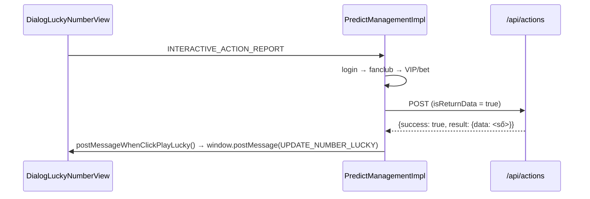

---

## 9. Thu hồi overlay — overlay-recall

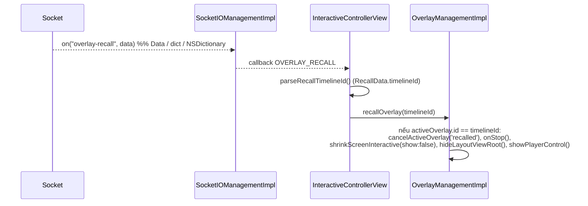

Dùng khi biên tập viên gỡ một overlay đang phát trên toàn hệ thống. Chỉ gỡ nếu `timelineId` khớp
overlay đang hiển thị.

---

## 10. Sự kiện phụ trợ

| Sự kiện socket | Xử lý |
|---|---|
| `liveviews` | Parse `LiveViewDto.count`, gọi `showLiveView(liveView: 230 + count)` (**cộng thêm 230**) |
| `data` (fanclub) | Decode `FanClub`; nếu `mediaId` khớp phần trước dấu `_` của media đang xem và `isFanClub` → set `KEY_FAN_CLUB = true`, ngược lại `false` |
| `ckst` | Decode `CkstResponse`; lấy `getPlayerState()` từ delegate → emit lại `ckst` với `CkstData(action: "CHECK_PLAYER_STATUS", sessionId, data: Ckst{deviceId, os, mediaContentId, playerStatus, tenantId})` |
| `update-result` | `sendMessageResultinteractive()` → `window.postMessage(UPDATE_DATA_INTERACTIVE)` |
| `predict-result` | Cập nhật `answer1`/`answer2`, cache vào `DATA_RESULT_PREDICT`, đẩy `UPDATE_COUTER` |
| `branching` | Decode `Branching`; theo `action` (`START/PLAY_MINIGAME/END_VIDEO_BRANCHING`) gọi `BranchingSocketIODelegate` (preload / show / end video nhánh) |

> `liveViews + 230` là hành vi cố ý trong mã hiện tại (`showCCU`). Nếu cần số thô, app tự trừ lại.
>
> Trong payload `ckst` emit lên, trường `data` được ánh xạ **JSON key `"os"`** (theo `CodingKeys` của
> `CkstData`) — cần lưu ý khi đối chiếu với backend.

---

## 11. Luồng VOD

```mermaid
sequenceDiagram
    participant APP as App
    participant ICV as InteractiveControllerView
    participant API as GET /api/ctc/scenario/v2/vod/{mediaId}/{os}
    participant OMI as OverlayManagementImpl

    APP->>ICV: joinRoom(mediaId, type: 2)
    ICV->>ICV: nếu đang connect → disconnection(); removeAllView()
    ICV->>API: callApiScenarioForVod(header X-TENANT-ID)
    API-->>ICV: VODOverlayData {data.timelines[]}
    ICV->>ICV: convertVodInteractive(): lọc showStatus == ACTIVE,<br/>sắp theo timeShow (giây)

    loop mỗi giây (app tự bơm)
        APP->>ICV: getTimeVideo(time: giây)
        ICV->>ICV: tìm timeline có timeShow == Int(time)
        alt khớp đúng giây
            ICV->>ICV: showInteractiveVod(): check allowAnonymous/token
            ICV->>ICV: ghép URL (timelineId, tenantId, deviceType=IOS)
            ICV->>OMI: showOverlayVod(overlay, token, mediaId)
            ICV->>ICV: xoá timeline khỏi list (không hiện lại)
        end
    end
```

Khác biệt so với LIVE:

| | LIVE | VOD |
|---|---|---|
| Nguồn overlay | Socket.IO đẩy | REST tải trước toàn bộ kịch bản |
| Kích hoạt hiển thị | Sự kiện realtime | `getTimeVideo(giây)` do app bơm |
| `socketIO` | Có kết nối | Ngắt (mọi lời gọi socket bỏ qua an toàn) |
| `socket_id` trong action | Có | Không |
| Tracking emit-ack | Có | **Không** (`showOverlayVod` không `beginRenderTracking`) |
| Predict / Lucky / liveviews / ckst | Có | Không |
| Điều kiện hiện | login/fanclub/VIP đầy đủ | chỉ `allowAnonymous` hoặc có token |

---

## 12. Mất kết nối và khôi phục

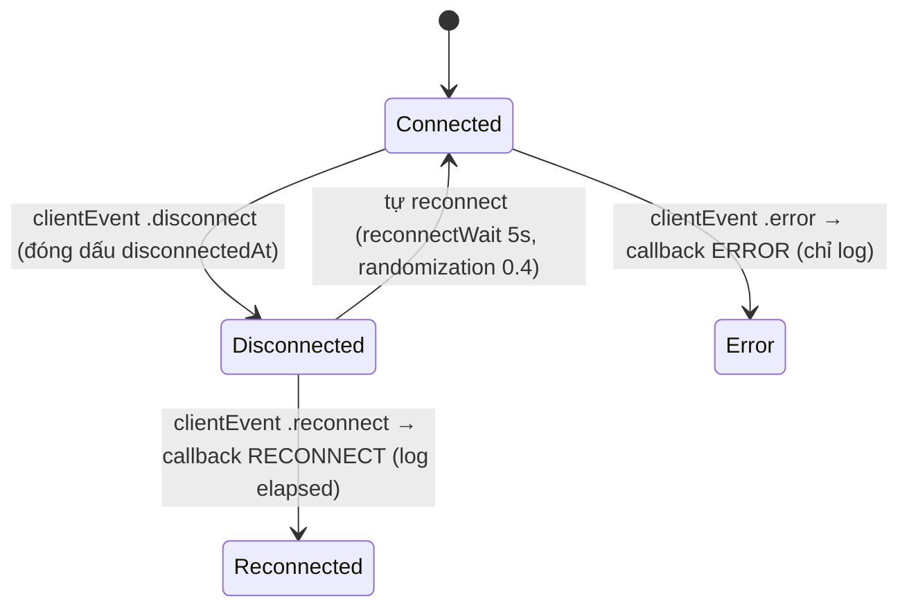

- Socket.IO client tự reconnect (`.reconnects(true)`, `reconnectWait 5`). Khi `.connect` lại,
  callback `CONNECTED` chạy → nếu có `mediaContentId` sẽ **emit `join-room`** lần nữa.
- `isConnected()` trả `true` cả khi `status == .connecting` hoặc `reconnects == true` — nên coi là
  "đang/sẽ kết nối", không chỉ "đã kết nối".
- `disconnection()` gỡ **tất cả** handler client + app, `disconnect()`, đặt `socketManager = nil`.

---

## 13. Giải phóng tài nguyên

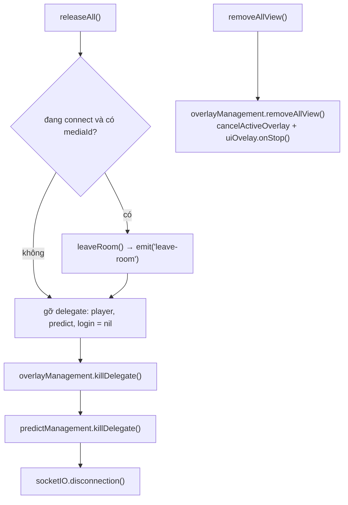

Gọi `releaseAll()` khi:

- Thoát màn hình player (`viewWillDisappear`/`deinit`),
- Người dùng rời nội dung,
- Trước khi chuyển sang một `mediaId` khác **nếu** không gọi ngay `joinRoom()` (vì `joinRoom` đã tự
  `removeAllView()` và xử lý socket).

---

[← Cài đặt & Tích hợp](02-cai-dat-va-tich-hop.md) · [Về mục lục](README.md) · [Tiếp: API Reference →](04-api-reference.md)