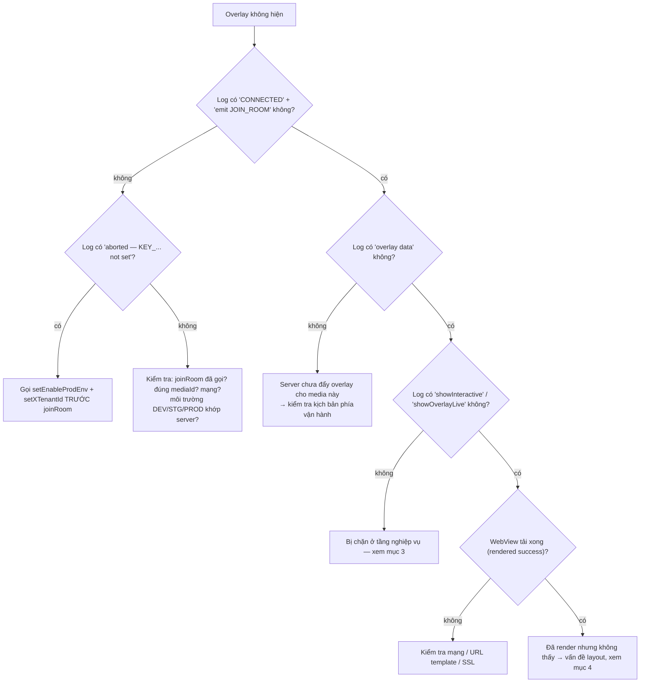

# 06 — Lỗi thường gặp & cách chẩn đoán

[← Về mục lục](README.md)

---

## 1. Bật log của SDK

SDK ghi log qua hàm `logLine(...)` (`Const/PrintLog.swift`) — luôn `print` với tiền tố
**`Interactive:`**. Xem trong Xcode Console hoặc lọc:

```bash
# Khi chạy qua Console.app / log stream
log stream --predicate 'eventMessage CONTAINS "Interactive:"'
```

Các chuỗi log đáng chú ý (tiền tố `Interactive:`):

| Log | Ý nghĩa |
|---|---|
| `[Socket] connectSocket() — env: ...` | Bắt đầu chuẩn bị kết nối |
| `[Socket] ❌ connectSocket() aborted — KEY_X_TENANT_ID not set` | Chưa gọi `setXTenantId` |
| `[Socket] ❌ connectSocket() aborted — KEY_ENABLE_PROD_ENV not set` | Chưa gọi `setEnableProdEnv` |
| `[Socket] ✅ CONNECTED — sid: ...` | Socket đã kết nối |
| `[Socket] emit JOIN_ROOM — mediaContentId: ...` | Đã vào phòng |
| `Interactive-socket overlay data` | Có overlay từ server |
| `startShowLiveOverlayWithDataReceived` | Bắt đầu xử lý overlay |
| `1 showInteractive isView : false` | Overlay bị chặn do `Compensatory` (đã tương tác) |
| `quá giờ trả lời` | Overlay hết `duration` tính từ `ts` |
| `[Socket] 🔌 DISCONNECTED` / `🔄 RECONNECT` | Mất/khôi phục kết nối |

---

## 2. Overlay không hiển thị — cây chẩn đoán



---

## 3. Bị chặn ở tầng nghiệp vụ

| Triệu chứng | Nguyên nhân | Cách xử lý |
|---|---|---|
| `showInteractive isView : false` | `Compensatory` — mốc đã tương tác, còn trong `frequencyLimit` | Đúng thiết kế. Để test lại: xoá suite `INTERACTIVE_<userId>` / `INTERACTIVE_DEFAULT` |
| `quá giờ trả lời` | Overlay hết `duration` tính từ `ts` | Đúng thiết kế |
| Overlay không hiện, `targets` không khớp | `targets` không chứa `iphone` cũng không chứa `all` | Sửa kịch bản để `targets` gồm `iphone`/`all` |
| Nút predict/lucky không hiện với OnPlus/OnLiveTV/SeeNow | `receiveDataActionButtonPredict` return sớm cho tenant `vtvlive`/`onlivetv`/`VTVprime` | Đúng thiết kế hiện tại; nếu muốn bật, sửa điều kiện tenant trong SDK |
| User bấm trả lời mà không có gì xảy ra | `!allowAnonymous` và chưa đăng nhập | Đảm bảo implement `InteractiveLoginDelegate.showInteractiveLogin()` và gọi `initAuthenToken` sau khi login |
| Hiện dialog "Bạn phải là FanClub của …" | `requiredFanClub` và `KEY_FAN_CLUB == false` | Đúng thiết kế; cần vào fanclub (đợi sự kiện socket `data` cập nhật) |
| Hiện dialog "Dùng N OnG để trả lời?" | `typeTimeline == 2`, `betAmount > 0`, không phải VIP | Đúng thiết kế (luồng telco VIP) |

---

## 4. Overlay render nhưng không nhìn thấy / sai vị trí

| Nguyên nhân | Dấu hiệu | Xử lý |
|---|---|---|
| `uiView` (overlay container) kích thước 0 | Log render bình thường, màn hình trống | Ràng buộc `uiView` phủ đúng khung video trước khi `initOverlay` |
| `uiView` bị player vẽ đè | Overlay "nhấp nháy" rồi mất | Thêm `uiView` **sau** player (thứ tự subview), hoặc tăng `zPosition` |
| `predictView` sai vị trí | Nút predict/lucky lệch | Cập nhật frame `predictView` trong `showLayoutViewPredictRoot()` (xem demo `updateLayoutPredict`) |
| Không gọi `resizeVideoView` khi đổi khung | Overlay không co giãn theo player fullscreen | Gọi `interactive.resizeVideoView(width:height:)` khi khung video đổi |
| `locationLayoutViewRoot` chưa xử lý | Overlay luôn nằm 1 chỗ | Implement `InteractiveViewDelegate.locationLayoutViewRoot(location:width:height:)` để canh theo `location` 0..8 |

WebView overlay là `WKWebView` **trong suốt** (`isOpaque = false`, nền `.clear`, không cuộn). Nếu
thấy nền đen/trắng che video, kiểm tra template web có nền trong suốt không.

---

## 5. Socket không kết nối được

Danh sách kiểm tra:

1. **Chưa cấu hình**: log `aborted — KEY_X_TENANT_ID not set` / `KEY_ENABLE_PROD_ENV not set`.
   → Gọi `InteractiveSetting().setXTenantId(...)` và `setEnableProdEnv(...)` khi khởi động.
2. **Sai môi trường**: `Enviroment` phải khớp hệ thống server (DEV/STG/PROD) — URL suy từ env.
3. **Sai tenant**: server có thể từ chối phòng.
4. **Token**: header socket `Authorization` gửi **nguyên văn** (không tự thêm `Bearer`). Nếu backend
   yêu cầu `Bearer` cho socket, phải truyền chuỗi đã có sẵn tiền tố vào `initAuthenToken`.
5. **`isConnected()` trả `true` nhưng thực chất đang connecting**: hàm trả `true` cả khi
   `.connecting`/`reconnects` — đừng dựa hoàn toàn vào nó để khẳng định đã online.

---

## 6. Crash sau khi tích hợp

| Lỗi | Nguyên nhân | Xử lý |
|---|---|---|
| Crash `Unexpectedly found nil` ngay khi joinRoom / gọi API | Force-unwrap `UserDefaults.string(forKey: KEY_X_TENANT_ID)!` / `KEY_ENABLE_PROD_ENV!` khi chưa cấu hình | **Luôn** gọi `setEnableProdEnv` + `setXTenantId` trước (đây là nguyên nhân của commit `[fixbug] crash`) |
| Thiếu symbol lúc link (Alamofire / SocketIO / SwiftyJSON) | XCFramework tĩnh không mang phụ thuộc | Khai báo lại pod trong target app |
| Thiếu symbol RxSwift/RxCocoa | Chưa nhúng các Rx `*.xcframework` | Nhúng `RxSwift/RxCocoa/RxRelay.xcframework` (Embed & Sign) |
| WebView không nhận callback | Template gọi sai tên interface | Interface phải là **`IOS`** (`window.webkit.messageHandlers.IOS.postMessage(...)`) |

---

## 7. VOD: overlay không xuất hiện đúng mốc

| Nguyên nhân | Xử lý |
|---|---|
| App không gọi `getTimeVideo()` | Thêm vòng lặp/observer 1 giây sau `joinRoom(type: 2)` |
| Bơm sai đơn vị (mili-giây thay vì giây) | `getTimeVideo` nhận **giây** (khớp `timeShow`) |
| Người dùng tua qua mốc | SDK so khớp **đúng giây** (`timeShow == Int(time)`); mốc bị bỏ qua — giới hạn hiện tại |
| Chưa đăng nhập, overlay không `allowAnonymous` | `showInteractiveVod` bỏ qua; đăng nhập rồi `joinRoom` lại |
| Kịch bản trả về rỗng | Kiểm tra `callApiScenarioForVod` (env, `X-TENANT-ID`, `mediaId`); `convertVodInteractive` chỉ lấy `showStatus == "ACTIVE"` |

---

## 8. Ghi chú kỹ thuật cần biết khi bảo trì

Những điểm trong mã hiện tại dễ gây nhầm, nên ghi lại:

- **`liveViews + 230`**: `showCCU` cộng cứng 230 vào số người xem trước khi gọi `showLiveView`. Nếu
  cần số thô, app tự trừ.
- **`CkstData.data` map JSON key `"os"`**: payload `ckst` emit lên có trường lồng tên `os` (không phải
  `data`). Đối chiếu với backend nếu sai lệch.
- **`UPDATE_COUTER`** (thiếu chữ N) và **`PredictResult.timlineId`** (thiếu chữ e) là **nguyên văn**
  trong mã — template web phải khớp đúng chính tả này.
- **`DialogLuckyNumberView` dùng chung cho cả predict và lucky** ở runtime; `DialogPredictView` gần
  như không được dùng.
- **`LiveCompensatoryShotImpl.loadScenarioLive`** trả về **đồng bộ** trước khi request Alamofire hoàn
  tất → gần như luôn trả `nil`. Chỉ `fetchOverlayStatus` (dùng cho `fetchInteractiveStatus`) hoạt động
  đúng. Cẩn thận nếu tái sử dụng hàm này.
- **Header tenant hai kiểu chữ**: socket dùng `x-tenant-id` (thường), REST dùng `X-TENANT-ID` (hoa).
- **Sentry đã bị vô hiệu**: `SentryInteractor` và `InteractiveSetting.startSentry` đều bị comment.
- **`addCallback` một khe duy nhất**: gọi lần sau ghi đè callback trước — không gắn nhiều listener.

---

## 9. Câu hỏi thường gặp

**SDK có tự bám vòng đời `UIViewController` không?**
Không. App phải tự gọi `releaseAll()` khi thoát màn hình. SDK chỉ tự lắng nghe `orientationDidChange`
để canh lại nút predict.

**Có thể hiện nhiều overlay minigame cùng lúc không?**
Không. `showOverlayLive` gọi `cancelActiveOverlay` + `onStop()` trước khi thêm → luôn chỉ một overlay
minigame. Nút predict/lucky là view riêng nên tồn tại song song (SDK tự ẩn nút khi minigame chiếm màn
hình).

**Đổi tài khoản giữa chừng thì sao?**
Gọi `initAuthenToken(tokenMới, userIdMới, "")`. Nếu đang Live, SDK tự vào lại phòng với token mới.

**Có cần `releaseAll()` trước mỗi `joinRoom()` không?**
Không — `joinRoom()` đã tự `removeAllView()` và xử lý socket. Chỉ gọi `releaseAll()` khi thực sự thoát.

**Xoay màn hình có mất overlay không?**
Overlay minigame do server điều khiển sẽ được đẩy lại nếu còn hiệu lực; nút predict được canh lại qua
`orientationDidChange`. Layout do app kiểm soát qua `InteractiveViewDelegate`.

**SDK dùng WebView nào?**
`WKWebView` (một số dialog dùng `NoZoomWKWebView` chặn pinch-zoom). Bật JavaScript, nền trong suốt,
tắt cuộn.

---

[← Tracking emit-ack](05-tracking-emit-ack.md) · [Về mục lục](README.md)
