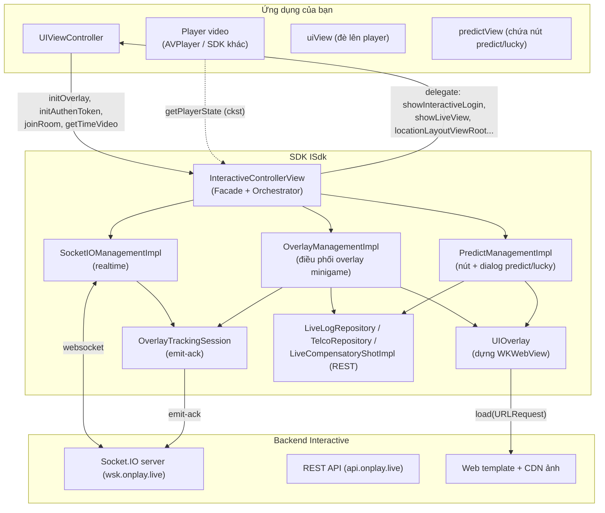
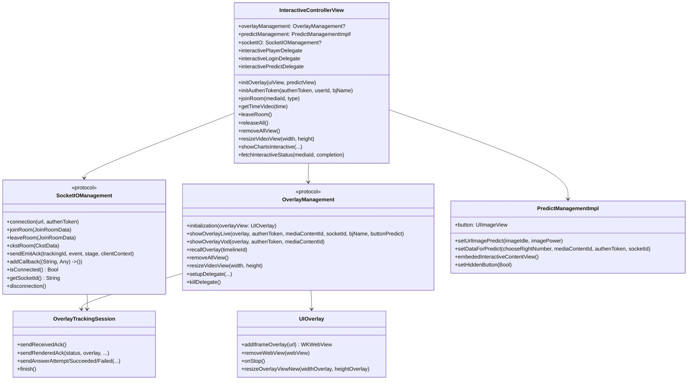
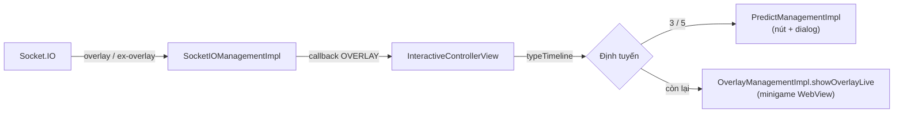
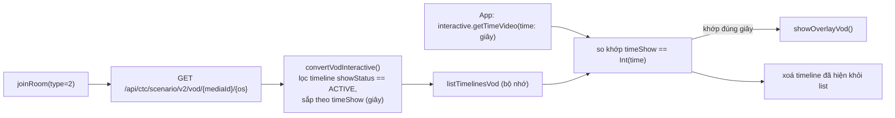
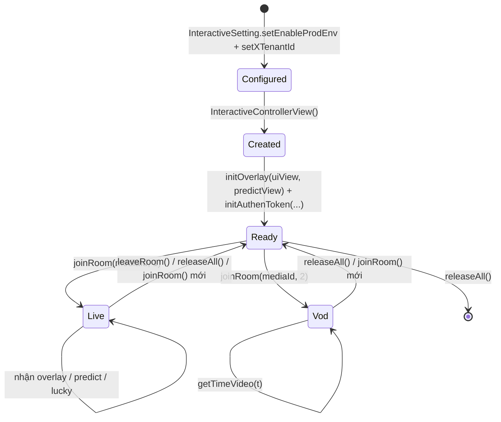
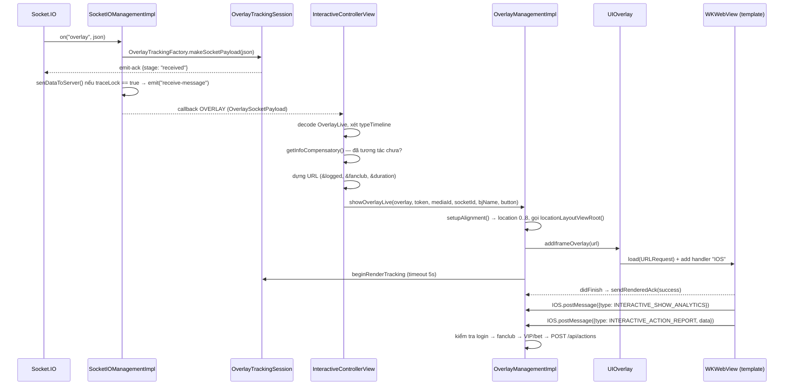
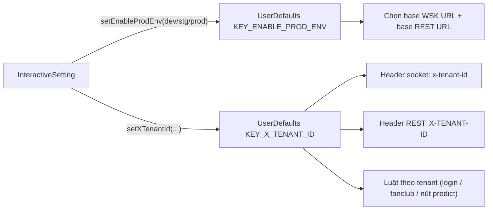

# Kiến trúc SDK Interactive (iOS)

## 1. Góc nhìn tổng thể

SDK là một **thư viện iOS (XCFramework `ISdk`)** đóng gói 3 trách nhiệm chính:

1. **Kết nối realtime** với server Interactive qua Socket.IO (kịch bản Live).
2. **Điều phối hiển thị** nội dung tương tác (viết bằng web) trong các `WKWebView` trong suốt.
3. **Chuyển tiếp hành động** của người dùng về server qua REST và **gọi ngược** app qua các delegate.

---

## 2. Phân lớp và trách nhiệm

| Lớp | Thành phần (file) | Trách nhiệm |
|---|---|---|
| **Facade / Orchestrator** | `InteractiveControllerView` | Điểm vào duy nhất của app. Nhận lệnh (`joinRoom`, `initAuthenToken`, `getTimeVideo`, `releaseAll`…), lắng nghe sự kiện socket, quyết định loại overlay (minigame / predict / lucky), điều phối các manager |
| **Cấu hình** | `InteractiveSetting` | Ghi môi trường (`KEY_ENABLE_PROD_ENV`) và tenant (`KEY_X_TENANT_ID`) vào `UserDefaults` |
| **Transport realtime** | `SocketIOManagementImpl` (`SocketIOManagement`) | Tạo/huỷ socket, đăng ký sự kiện, chuẩn hoá payload, gửi emit-ack |
| **Điều phối overlay** | `OverlayManagementImpl` (`OverlayManagement`) | Dựng overlay minigame, xử lý luồng trả lời (login → fanclub → VIP/bet → gọi API), tracking |
| **Điều phối predict/lucky** | `PredictManagementImpl` | Nút nổi GIF, dialog dự đoán/số may mắn, luồng trả lời riêng |
| **Presentation WebView** | `UIOverlay`, `ConfigureWebView` (`NoZoomWKWebView`) | Tạo `WKWebView` trong suốt, gắn/gỡ theo vòng đời overlay |
| **Presentation phụ** | `DialogLuckyNumberView`, `DialogPredictView`, `DialogConfirmView`, `DialogDeductionView`, `FanClubView`, `LeaderboardView` | Dialog toàn màn hình / nút nổi / bảng xếp hạng |
| **Bridge** | `OverlayWebViewCallBack`, `PredictWebViewCallBack` | Cầu nối JavaScript ⇄ Swift (`WKScriptMessageHandler`, tên interface `IOS`) |
| **REST** | `LiveLogRepository` (`/api/actions`), `TelcoRepository` (`/api/public/vip-status`), `LiveCompensatoryShotImpl` (`interactive-status`), lớp `OverlayVod*` (VOD) | Gọi API qua Alamofire |
| **Observability** | `OverlayTracking.swift` (`OverlayTrackingSession`, `OverlayTrackingFactory`) | Đo vòng đời overlay và gửi `emit-ack` |
| **Hạ tầng** | `ApiConst`, `TypeInteractive`, `SocketEvents`, `Utils`, `PrintLog`, các model `Codable` | Hằng số, tiện ích, model dữ liệu |

### Nguyên tắc thiết kế thể hiện trong mã

- **Một facade cho app**: app chủ yếu chạm `InteractiveControllerView` + `InteractiveSetting` + các
  `protocol` delegate. Các manager con vẫn `public` nhưng thường không cần gọi trực tiếp.
- **Sự kiện đi qua một callback duy nhất**: socket đẩy về SDK bằng closure `(String, Any) -> ()` gắn
  qua `addCallback` (single-slot); `InteractiveControllerView.handleEventsSocket()` `switch` theo tên
  sự kiện.
- **Nội dung tương tác là web**: SDK không vẽ giao diện câu hỏi, chỉ nạp URL template vào `WKWebView`
  và trao đổi bằng `postMessage`. Đổi giao diện tương tác không cần build lại app.
- **Cấu hình nằm ở `UserDefaults`**: môi trường và tenant được đọc lại ở khắp nơi (socket header,
  chọn base URL REST…). Đây cũng là nguồn của một số **crash do force-unwrap** khi chưa cấu hình.

---

## 3. Sơ đồ lớp rút gọn

---

## 4. Hai chế độ hoạt động

### 4.1. LIVE (`type = 1`, `ApiConst.TYPE_LIVE`) — điều khiển bởi server

Server chủ động đẩy overlay qua Socket.IO. Điều kiện hiển thị/trả lời (đăng nhập, fanclub, VIP/bet,
đã trả lời chưa) được kiểm tra ngay tại client.

### 4.2. VOD (`type = 2`, `ApiConst.TYPE_VOD`) — điều khiển bởi tiến độ phát

Không có socket. SDK tải trước toàn bộ kịch bản qua REST, sau đó **app phải bơm thời gian phát**:

> `timeShow` được suy ra từ `Timelines.time` (dạng `"SS"`, `"MM:SS"` hoặc `"HH:MM:SS"`, hàm
> `parseTimeToSeconds`), nên đơn vị bơm vào `getTimeVideo` là **giây**.

---

## 5. Mô hình luồng (threading)

| Việc | Thread | Ghi chú |
|---|---|---|
| Sự kiện Socket.IO | Thread của Socket.IO client | Chuyển vào closure `addCallback` |
| Dựng/huỷ WebView | **Main thread** | `showInteractive`/`setUpDataForTemplatePredict` gọi trong `DispatchQueue.main.async` |
| Gọi REST | Thread của Alamofire, callback về main | `AF.request(...).response*` |
| Tracking emit-ack | Đồng bộ trong `OverlayTrackingSession` (cờ `emittedStages`, `finished`) | Timer render dùng `Timer` trên main |
| Nút predict đổi ảnh/alpha | Main (`Timer.scheduledTimer`) | Fade alpha về 0.5 sau **5 giây** |

> Khác với bản Android, iOS **không** có `QueuedMutableLiveData` — sự kiện overlay được xử lý tuần tự
> ngay trong callback. `addCallback` là **một khe duy nhất**, gọi lần sau ghi đè lần trước.

---

## 6. Vòng đời đối tượng

Điểm quan trọng trong mã:

- **Constructor `InteractiveControllerView()` chỉ tạo `SocketIOManagementImpl` và
  `OverlayManagementImpl`** — chưa mở kết nối, chưa gọi API.
- **`joinRoom(type: 1)`** rời phòng cũ (nếu khác media), ngắt socket cũ, `removeAllView()`, gắn lại
  callback socket rồi `connectSocket()`. `emit("join-room")` chỉ xảy ra **sau khi socket connect
  thành công** (trong nhánh `SocketEvents.CONNECTED`).
- **`joinRoom(type: 2)`** ngắt socket (nếu đang mở), `removeAllView()`, gọi REST tải kịch bản VOD.
- **`initAuthenToken()` khi đang connect và có media** → ngắt socket và `joinRoom(type: 1)` lại để
  socket mang token mới.
- **`releaseAll()`** gọi `leaveRoom()` (nếu đang connect), gỡ toàn bộ delegate và `disconnection()`.

---

## 7. Luồng dữ liệu của một overlay minigame (Live)

Chi tiết từng nhánh (bao gồm các điểm bị chặn) xem [03 — Luồng hoạt động](03-luong-hoat-dong.md).

---

## 8. Giao thức cầu nối WebView

SDK gắn `WKScriptMessageHandler` tên **`IOS`** (`userContentController.add(callBack, name: "IOS")`).

**Web → SDK** (`window.webkit.messageHandlers.IOS.postMessage(jsonString)`) — decode thành
`OverlayDataCallback { data, type }`:

| `type` (hằng `TypeInteractive`) | Ý nghĩa |
|---|---|
| `INTERACTIVE_SHOW_ANALYTICS` | Overlay đã hiển thị → `showLayoutViewRoot()`, ẩn control player |
| `INTERACTIVE_HIDE_ANALYTICS` | Overlay đóng → gỡ WebView, dọn tracking, hiện lại control player |
| `INTERACTIVE_ACTION_REPORT` | Người dùng trả lời / bấm quảng cáo (`action = CLICK_ADS`) |
| `INTERACTIVE_OPEN_ANALYTICS` / `INTERACTIVE_CLOSE_ANALYTICS` | Mở/đóng dialog predict/lucky (xử lý trong `PredictManagementImpl`) |
| `INTERACTIVE_PING_ANALYTICS` | Chỉ dùng để lọc, không ghi log |

**SDK → Web** (`webView.evaluateJavaScript("window.postMessage('<json>', '*')")`):

| `key` | Khi nào | Nơi phát |
|---|---|---|
| `UPDATE_DATA_INTERACTIVE` | Socket `update-result` | `sendMessageResultinteractive()` |
| `UPDATE_COUTER` *(nguyên văn, thiếu chữ N)* | Socket `predict-result` → `answer1/answer2` | `receiveDataResultPredict()` + khi mở lại dialog |
| `UPDATE_NUMBER_LUCKY` | API trả kết quả lucky | `postMessageWhenClickPlayLucky()` |
| `UPDATE_CONFIRM` | Trả lời thành công (nhánh bet/VIP) | `postMessageWhenAnswerSuccess()` |

> ⚠️ Khác bản Android: iOS **không** dùng khoá `LOADED_OVERLAY` / `GET_DATA_INTERACTIVE`. Template
> iOS được nạp thẳng bằng URL đã gắn sẵn tham số; dữ liệu bổ sung (kết quả) mới đẩy xuống qua các key
> ở trên.

---

## 9. Cấu hình môi trường & tenant

- `Enviroment` = `DEV` (`"dev"`) / `STG` (`"stg"`) / `PROD` (`"prod"`) — chọn cả URL socket
  (`*.onplay.live` WSK) lẫn URL REST và URL bảng xếp hạng.
- `TenantIdType`: `vtvlive` (OnPlus), `onlivev2` = `onliveLiveStream` (SOOP), `onlivetv` = `onliveTV`
  (OnLive TV), `VTVprime` (SeeNow). Một số luật đặc thù trong mã hiện tại:
  - **Nút predict/lucky bị bỏ qua** cho tenant `vtvlive`, `onlivetv`, `VTVprime`
    (`receiveDataActionButtonPredict` return sớm).
  - **Chỉ tenant `onlivev2`** áp tham số `&fanclub=false` khi người dùng chưa là fanclub.
- `ApiConst.OS = "iphone"` đi vào header socket `os`, trường `os` của body `/api/actions`, tham số
  `os` của URL kịch bản VOD và điều kiện lọc `targets` của overlay (`targets.contains("iphone")` hoặc
  `"all"`).

---

## 10. Lưu trữ cục bộ (`UserDefaults`)

| Khoá / suite | Mục đích |
|---|---|
| `KEY_ENABLE_PROD_ENV`, `KEY_X_TENANT_ID` | Môi trường + tenant (bắt buộc cấu hình trước) |
| `KEY_MEDIA_CONTENT_ID` | Media gần nhất đã join |
| `MINI_GAMES`, `PREDICT`, `POPUP_PREDICT`, `INTERACTIVE_TYPE_TIMELINE` | Máy trạng thái hiển thị (`SHOW`/`HIDE`/`HIDE_CMS`/`END`) |
| `KEY_FAN_CLUB` | Người dùng có thuộc fanclub của media đang xem không |
| suite `INTERACTIVE_<userId>` / `INTERACTIVE_DEFAULT`, key = `mediaId` | `Compensatory` — chống hiển thị/trả lời lại một mốc |
| suite `DATA_RESULT_PREDICT`, key = `timelineId` | Cache kết quả predict (`answer1`/`answer2`) để đẩy lại khi mở dialog |

---

[← Về mục lục](README.md) · [Tiếp: Cài đặt & Tích hợp →](02-cai-dat-va-tich-hop.md)
