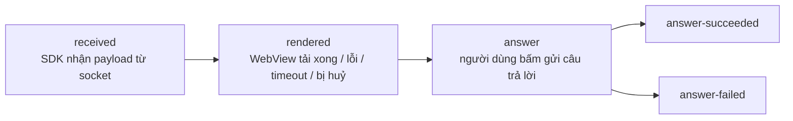
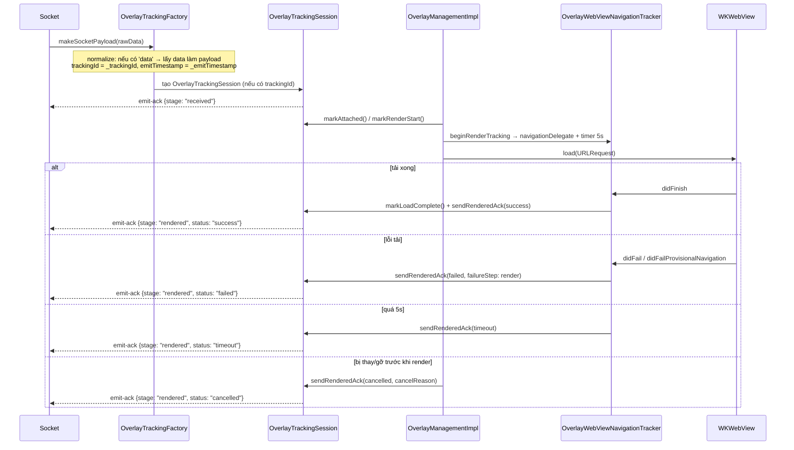
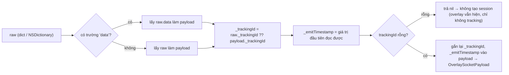

# 05 — Tracking emit-ack (đo lường vòng đời overlay)

[← Về mục lục](README.md)

Cơ chế này trả lời câu hỏi của phía vận hành: *"Overlay server đẩy đi có thực sự tới máy người dùng,
có render được, và người dùng có trả lời không?"* — đo bằng chính client, gửi ngược server qua sự
kiện socket **`emit-ack`**.

> Toàn bộ lớp tracking nằm trong `Libraries/Overlay/Tracking/OverlayTracking.swift`. App **không**
> tương tác trực tiếp — SDK tự đo và tự gửi qua socket đang mở.
>
> ⚠️ Tracking **chỉ chạy ở chế độ LIVE**. `showOverlayVod` không gọi `beginRenderTracking`, và VOD
> không có socket để emit.

---

## 1. Các mốc (stage)



| Stage (`OverlayTrackingStage`) | Ý nghĩa | Kết thúc phiên? |
|---|---|---|
| `received` | Payload hợp lệ đã vào SDK | Không |
| `rendered` | Chốt kết quả hiển thị kèm `status` | Có, nếu `status != success` |
| `answer` | Bắt đầu gửi câu trả lời | Không |
| `answer-succeeded` | API trả `success == true` | Có |
| `answer-failed` | API lỗi / từ chối / lỗi mạng | Có |

`status` của `rendered` (`OverlayTrackingStatus`): `success` | `failed` | `timeout` | `cancelled`.

Mỗi stage chỉ gửi **một lần** cho mỗi phiên (`emittedStages` là `Set`). Sau khi phiên `finish()` thì
mọi `emitStage` tiếp theo bị bỏ qua.

---

## 2. Cấu trúc payload gửi lên server

```jsonc
// socket.emit("emit-ack", payload)
{
  "trackingId": "<_trackingId lấy từ payload overlay>",
  "event": "overlay",
  "stage": "received | rendered | answer | answer-succeeded | answer-failed",
  "deviceId": "<identifierForVendor>",
  "clientContext": { /* xem bên dưới */ }
}
```

### `clientContext` — phần chung

| Trường | Nguồn |
|---|---|
| `profile` | `"overlay.legacyIframe"` (hằng cố định, iOS chỉ có 1 profile) |
| `transportMode` | `"legacyIframe"` |
| `sdkVersion` | `ApiConst.VERSION_SDK` (`"2025-05-25"`) |
| `platform` | `"ios"` |
| `os` | `UIDevice.systemName + " " + systemVersion` (ví dụ `"iOS 17.5"`) |
| `deviceClass` | `"tablet"` nếu iPad, ngược lại `"mobile"` |
| `viewportWidth`, `viewportHeight` | `UIScreen.main.bounds` |

### Theo từng stage

| Stage | Trường bổ sung |
|---|---|
| `received` | `emitTimestamp`, `receiveTimestamp`, `receiveLatencyMs`, `ackLatencyMs`, `timeline{received, ackSent}` |
| `rendered` | `status`, `receiveLatencyMs`, `renderLatencyMs`, `ackLatencyMs`, `timeline{attached, renderStart, loadComplete, readyReceived, ackSent}`, `duration?`, `overlayType?`, `failureReason?`, `failureStep?`, `custom.cancelReason?` |
| `answer*` | `actionType` (`answer_submit`), `actionResult` (`attempted`/`success`/`failure`), `actionLatencyMs`, `occurrenceId` (= `timelineId`), `overlayType?`, `failureReason?`, `failureStep?`, `custom{…}`, `timeline` |

> Khác bản Android: iOS **chỉ có một profile** `overlay.legacyIframe` với **timeout render cố định
> 5000 ms** (`OverlayTrackingConstants.renderTimeoutMs = 5.0`). Không có nhánh `ws=1` / `wsInteractive`,
> và `readyReceived` trong timeline luôn là `NSNull()` (iOS chốt `rendered` theo `didFinish` của
> WebView, không chờ template báo `LOADED_OVERLAY`).

---

## 3. Luồng đo trên một overlay (Live)



`OverlayTrackingSession` dùng cờ `renderedAckSent` để đảm bảo `rendered` chỉ phát **một** lần dù
timeout và `didFinish` xảy ra sát nhau.

---

## 4. Chuẩn hoá payload (`OverlayTrackingFactory`)



Nhờ bước này, phần còn lại của SDK làm việc với payload đã "mở gói" (`data`), đồng thời giữ được
metadata tracking (`_trackingId`, `_emitTimestamp`).

Có **hai đường tạo session**:
1. Trong `SocketIOManagementImpl.trackedOverlayPayload()` — khi nhận `overlay`/`ex-overlay`, tạo
   session và gửi `received` ngay.
2. Dự phòng trong `InteractiveControllerView.startShowLiveOverlayWithDataReceived()` — nếu payload
   chưa kèm session nhưng `OverlayLive.trackingId` không rỗng, tạo session mới và gửi `received`.

---

## 5. Các lý do huỷ (`cancelReason` / `failureReason`)

Danh sách các điểm SDK **cố ý không hiển thị / huỷ tracking** overlay — hữu ích khi điều tra "vì sao
overlay không hiện":

| Giá trị | Nơi phát sinh | Nguyên nhân |
|---|---|---|
| `invalid_overlay_state` | `showOverlayLive` | `pos.alignment == nil` hoặc `uiOvelay == nil` |
| `replaced_by_new_overlay` | `showOverlayLive` | Overlay mới thay overlay đang hiển thị |
| `recalled` | `recallOverlay` | Server thu hồi overlay theo `timelineId` |
| `remove_all_view` | `removeAllView` | Dọn toàn bộ view (join lại / rời phòng) |
| `interactive_hide` | `INTERACTIVE_HIDE_ANALYTICS` | Web báo đóng overlay |
| `load_error` / `render` | Navigation delegate | WebView tải lỗi |
| `timeout` | Timer 5s | WebView không tải xong trong 5 giây |
| `api_EX400` / `api_TL404` / `api_PM402` / `api_false` | API `/api/actions` | Server từ chối câu trả lời |
| `network_error` (`network`) | Không có mạng khi trả lời | `Connectivity.isConnectedToInternet == false` |
| `unknown_response` | Không parse được response | Body API lỗi định dạng |

---

## 6. Độ trễ (latency) được tính

`OverlayTrackingSession` dùng mốc thời gian mili-giây (`Date().timeIntervalSince1970 * 1000`):

- `receiveLatencyMs = receiveTimestamp - emitTimestamp` — độ trễ mạng server→client.
- `renderLatencyMs = loadComplete - receiveTimestamp` — thời gian render WebView.
- `ackLatencyMs` — độ trễ gửi ack.
- `actionLatencyMs = actionTimestamp - (readyReceived ?? loadComplete ?? renderStart ?? receive)` —
  thời gian từ lúc render tới lúc người dùng trả lời.

---

## 7. Ảnh hưởng tới app tích hợp

- Tracking **không** thêm quyền, không gọi API riêng — dùng chính socket đang mở.
- Ở chế độ **VOD không có tracking**.
- Nếu overlay không có `_trackingId` (server không gắn), overlay vẫn hiển thị bình thường nhưng
  **không** phát emit-ack.
- App không cần làm gì; đây là công cụ quan trắc cho đội vận hành/backend.

---

[← API Reference](04-api-reference.md) · [Về mục lục](README.md) · [Tiếp: Lỗi thường gặp →](06-loi-thuong-gap.md)
