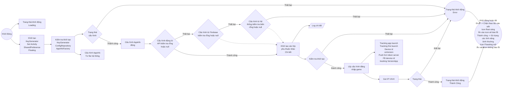
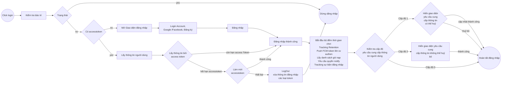
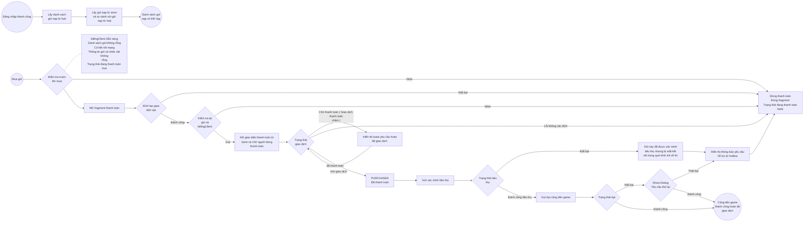
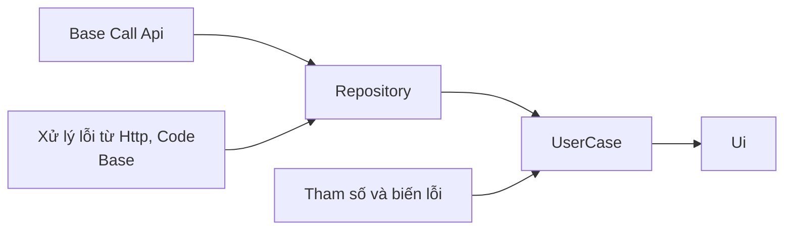
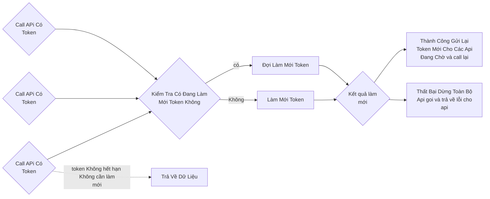
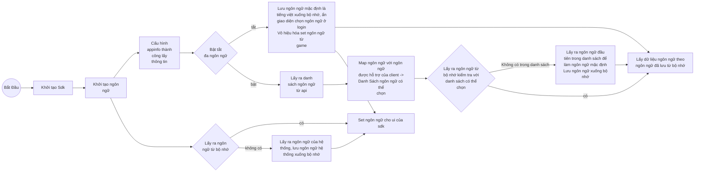
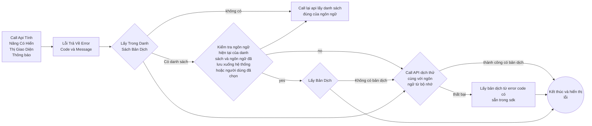
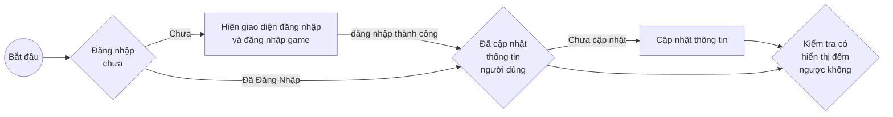

# Tính năng SDK

# I\. Tổng quan

VLiveSDK cung cấp các nhóm tính năng chính sau:


```markmap
# VLiveSDK
## OIDC v2
### Login
#### Vlive account
- username/password
#### SNS
- Facebook
- Google
- Apple
- Zalo
#### Quick login
#### VLive OpenID
### Logout
### Registration
### Forget password
### Profile
- user name
- birthday
- sex
- avatar
### Link user accounts
### Deactive account
## Floating button
- Drag/drop
- Show/hide
- Dimming (reduce opacity)
## Permission Manager
- Nomal permissions
- Runtime permissions
## Log Manager
- Intergration log
## Push notification
- Firebase Messaging
## Tracking
- Appflyer
- Facebook
- Firebase
## Payment
- other payment methods (Momo, Zalopay,...)
### In-App Purchase
- List Product
## Configuration
### Environment configs
- dev
- staging
- prod
### general configs
### UI configs
- enable
- disable
### configs tracking
- press 10 times on logo to show all configs
```

## 1\. Thư viện sử dụng

| Library | Verison | Inventory |
| --- | --- | --- |
| retrofit2 | 2.9.0 | |
| billingclient | 8.0.0 | |
| play-services-base | 18.5.0 | |
| play-services-auth | 21.3.0 | |
| firebase-bom | 33.0.0 | |
| game-tracking | 1.0.5 | |
| app-update | 2.1.0 | |
| glide | 4.15.1 | |
| browser | 1.8.0 | |
| facebook-android-sdk | 17.0.0 | |
| af-android-sdk | 6.16.0 | |
| installreferrer | 2.2 | |
| play:review | 2.0.2 | |
| okhttp3:logging-interceptor | 4.11.0 | |
| recaptcha:recaptcha | 18.6.0 | |
| tiktok-business-android-sdk | 1.5.0 | |
| lifecycle-process | 2.3.1 | |
| browser | 1.8.0 | |

## 2\. Ghi chú phiên bản

| Version | CommitID | Release date | Change logs |
| --- | --- | --- | --- |
| 1.0.10 | 4e39208430a7d7d59857cf66602fc4e445504ec1 | 11-May | Phát hành phiên bản đầu tiên |
| 1.0.11 | 5dfedc2c5b9e4c83898071c928c147d3add73266 | 13/11 | thêm tracking có tham số |
| 1.0.12 | ed667303992bfc75a906f89bc819535d98a0141c | 26/11 | Thay đổi môi trường mặc định về prod |
| 1.1.0 | f06324243f69940a8165db8930b28f1e91c95e80 | 1111/12 | Chức năng đếm ngược, kiểm tra phiên bản trdcs khi build |
| 1.1.1 | afaccbcfeea2925aad3cc791d65e0f415c39260c | 23/12 | Bổ sung tự động đổi ngôn ngữ mặc định nếu set từ game mà s... |
| 1.2.0 | 01edfe4996597c5a0d0aa582e48234740ab0a828 | 24/12 | Tính năng cập nhật thông tin nhận quà |
| 1.2.1 | 2eb3a17e14ace99c395fafa4c9b984c0258bd7ce | 6/1 | thêm vtvlive là account tự động tắt đếm ngược |
| 1.2.2 | 9836e819580880028532d537dca9f4e4f9aeb714 | 8/1 | Fix crash khi tắt game gỡ lắng nghe mạng |
| 1.2.3 | 66bd2071d8a803539d40cda09bac8504381c5338 | 9/1 | Nâng tracking sdk lên 1.0.6 |
| 1.3.0 | | 12/1 | Thêm nút chơi ngay cấu hình bằng appler |
| 1.3.1 | | 5/2 | Sửa lỗi đăng nhập google bị ẩn |
| 1.3.2 | | 6/2 | Nâng sdk tracking 1.0.8 fix crash |
| 1.3.3 | | 9/4 | Sửa lỗi back từ đăng ký |
| 1.3.4 | | 10/4 | Có tỷ lệ thấp crash khi xoay màn hình |
| 1.3.5 | | 13/4 | Cập nhật luồng và sự kiện theo dõi mới |
| 1.3.8 | | 9.5 | Sửa lỗi back từ màn đăng ký, thử nghiệm sự kiện mới |

# II\. Chi tiết tính năng

Android Refactor Sdk Game

| Tính năng | Tính năng nhỏ | Trạng thái | Ghi chú |
| --- | --- | --- | --- |
| Kiểm tra quá trình khởi động. | Cấu hình khởi động game bao gồm cấu hình động, cấu hình ban đầu, các domain từ domain động. KHông thể đăng nhập khi chưa cấu hình xog. Báo lỗi khi cấu hình thất bại hoặc đang cấu hình | Đã làm | |
| Cấu hình động | | Đã làm | |
| authen khi đăng nhập | | Đã làm | |
| Câu hính ban đầu của game | | Đã làm | |
| Review Google Play | | Đã làm | |
| Thanh toán | | Đã làm | |
| Đăng nhập | Tài khoản Vlive | Đã làm | |
| | Google | Đã làm | |
| | Facebook | Đã làm | |
| | check đăng nhập | Đã làm | |
| Đăng Ký | | Đã làm | |
| Quên mật khẩu | | Đã làm | |
| Đăng xuất | | Đã làm | |
| Cập nhật thông tin theo cấp độ | | Đã làm | |
| Floating | Kéo thả và click | Đã làm | |
| | Trạng thái khởi động của sdk | Đã làm | |
| Tracking Event | Lần đầu cài game | Đã làm | |
| | Khởi động game | Đã làm | |
| | Sau khi đăng nhập thành công | Đã làm | |
| | Nhấn đăng nhập, đóng, đăng kí, quên mật khẩu, đăng nhập bằng google facebook | Đã làm | |
| | Thời gian chơi | Đã làm | |
| Dashboard | Profile | Đã làm | |
| | Thay đổi mật khẩu | Đã làm | |
| | Thay đổi email | Đã làm | |
| | thay đổi ngày sinh | Đã làm | |
| | xóa tài khoản | Đã làm | |
| | Đăng xuất | Đã làm | |
| Notificaiton | Nhận thông báo | Đã làm | |
| | Tracking noti khi ẩn | Đã làm | |
| Tính năng nhà phát triển | Bật tính năng nhà phát triển trên môi trường prod khi cần. Cần thực hiện 5 thao tác ẩn 1. ẩn 10 lần vào icon pass word chỗ nhập mật khẩu 2. Ấn 10 Lần vào check box nhớ mật khẩu 3. Ấn 10 lần lần vào check box policy 4 Ấn vào 10 vào text nhớ mật khẩu 5. điền vtvlive vào user name ẩn đăng nhập Thông báo bật tính năng nhà phát triển | Đã làm | |
| Tracking Tittok | | Đã làm | |
| Đa Ngôn Ngữ | | Đã làm | |
| Tracking Vlive | | Đã làm | |
| Event Count Down | | Đã làm | |
| Hiển thị floting button động | | Đã làm | |

# III\. Kiểm tra và thử nghiệm 

| Tính năng chính | So Sánh Tính Năng | Check Code với cũ | Thiết bị thật Android 13 trở lên | Thiết bị thật Android 10 -> 12 | Giả lập Ldplayer 9 |
| --- | --- | --- | --- | --- | --- |
| Khởi động và Cấu hình Sdk | Mới | OK | OK | OK | OK |
| Đăng nhập | Cũ | OK | OK | OK | OK |
| Đăng ký | Cũ | OK | OK | OK | OK |
| Quên mật khẩu | Cũ | OK | OK | OK | OK |
| Thay đổi mật khẩu | Cũ | OK | OK | OK | OK |
| Thay đổi email | Cũ | OK | OK | OK | OK |
| thay đổi ngày sinh | Cũ | OK | OK | OK | OK |
| xóa tài khoản | Cũ | OK | OK | OK | OK |
| Đăng xuất | Cũ | OK | OK | OK | OK |
| thanh toán | Cũ | OK | OK | OK | OK |
| Thay đổi tài khoản | Cũ | OK | OK | OK | OK |
| Tracking Notificaition | Mới | OK | OK | OK | OK |
| Tính năng nhà phát triển | Mới | OK | OK | OK | OK |
| Tracking Tiktok | Cũ | OK | OK | OK | OK |
| Tracking Vlive | Mới | OK | OK | OK | OK |

# IV\. Sơ đồ luồng

1. Khởi động và cấu hình



Log chi tiết (khởi tạo các lớp phụ thuộc):


2. Đăng nhập



C\. Thanh toán



D\. Cấu Trúc Api



E\. Cấu Trúc Call API có token



F\. Đa Ngôn Ngữ 





G\. Hiện thì thông báo đếm ngược mở game

