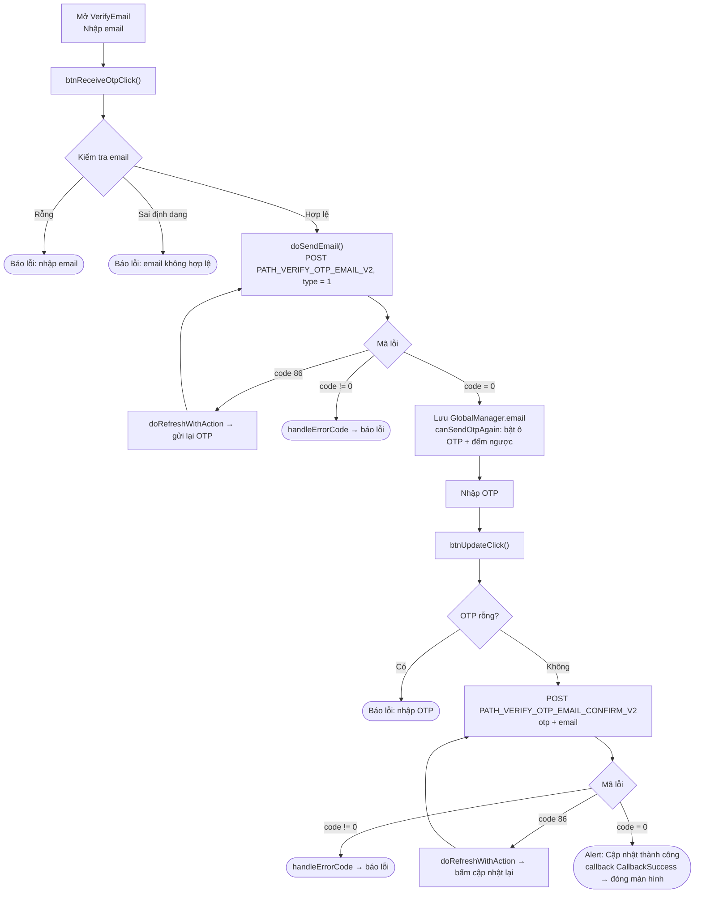
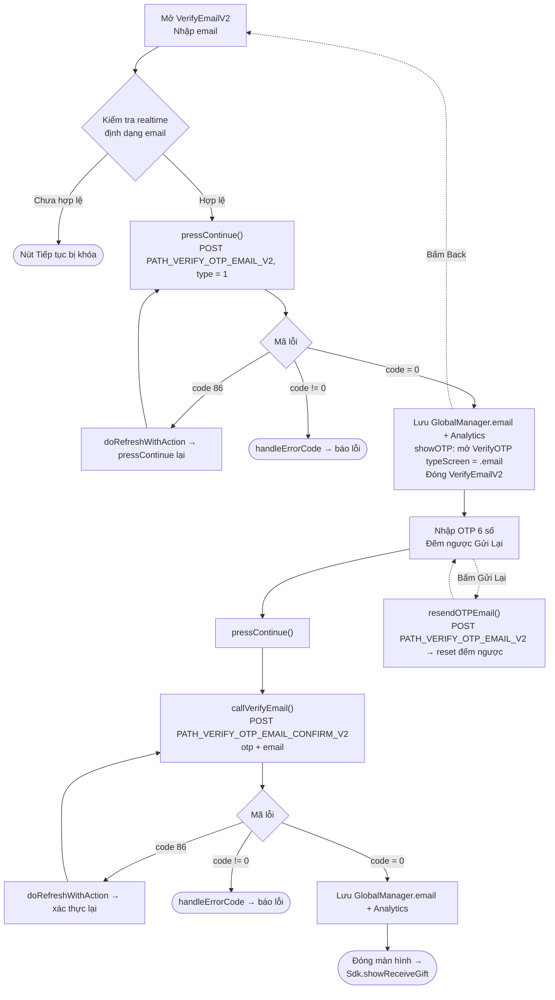

# Luồng cập nhật email – iTapSdk (sdk-game-ios-v3)

Tài liệu mô tả luồng cập nhật / xác thực email của SDK, dựng từ code thực tế.
Tương tự luồng số điện thoại, project có **hai biến thể** màn hình:

- **Cách 1 – `VerifyEmail`** (một màn hình gộp cả nhập email và nhập OTP; tiêu đề *"CẬP NHẬT EMAIL"*). Kết thúc bằng `callback(CallbackSuccess)`.
- **Cách 2 – `VerifyEmailV2` → `VerifyOTP`** (bản mới, tách hai màn; tiêu đề *"Thêm email"*, gắn với luồng nhận quà `showReceiveGift`).

Cả hai dùng chung 2 endpoint: `PATH_VERIFY_OTP_EMAIL_V2` (gửi OTP, `type = 1`) và
`PATH_VERIFY_OTP_EMAIL_CONFIRM_V2` (xác thực OTP). Mọi request đính kèm Bearer accessToken.

## Cách 1 – Màn hình `VerifyEmail`

### Mô tả – Cách 1

1. **Nhập email & gửi OTP** – `btnReceiveOtpClick()` kiểm tra email không rỗng và đúng
   định dạng (regex email), sau đó `doSendEmail()` gọi `PATH_VERIFY_OTP_EMAIL_V2` (`type = 1`).
   - `code = 0`: lưu `GlobalManager.shared.email`, bật ô nhập OTP và chạy đếm ngược gửi lại.
   - `code = 86` (token hết hạn): `doRefreshWithAction` làm mới token rồi tự bấm gửi lại.
   - lỗi khác: `handleErrorCode`.
2. **Nhập OTP & xác nhận** – `btnUpdateClick()` kiểm tra OTP không rỗng, gọi
   `PATH_VERIFY_OTP_EMAIL_CONFIRM_V2` (`otp`, `email`).
   - `code = 0`: hiện alert "Cập nhật thành công", phát `callback(CallbackSuccess)` rồi đóng màn hình.
   - `code = 86`: refresh token rồi thử lại.
   - lỗi khác: `handleErrorCode`.
3. **Gửi lại OTP** – khi bộ đếm về 0, nút "Gửi mã" bật lại để gọi lại `PATH_VERIFY_OTP_EMAIL_V2`.

## Cách 2 – `VerifyEmailV2` → `VerifyOTP`

### Mô tả – Cách 2

1. **`VerifyEmailV2`** – ô nhập email được kiểm tra realtime; hợp lệ thì bật nút
   "Tiếp tục". `pressContinue()` gọi `PATH_VERIFY_OTP_EMAIL_V2` (`type = 1`).
   - `code = 0`: lưu `GlobalManager.shared.email` + Analytics, rồi `showOTP()` mở
     màn hình `VerifyOTP` (`typeScreen = .email`, truyền `email`, `serverId`, `characterId`)
     và đóng màn hình hiện tại.
   - `code = 86`: refresh token rồi gọi lại.
   - lỗi khác: `handleErrorCode`.
2. **`VerifyOTP`** – nhập OTP 6 số, hiển thị email dạng che (`maskedEmailFrom`) và bộ
   đếm ngược để "Gửi Lại". `pressContinue()` → `callVerifyEmail()` gọi
   `PATH_VERIFY_OTP_EMAIL_CONFIRM_V2` (`otp`, `email`).
   - `code = 0`: lưu `GlobalManager.shared.email`, ghi Analytics, đóng màn hình và
     gọi `Sdk.showReceiveGift()`.
   - `code = 86`: refresh token rồi thử lại.
   - lỗi khác: `handleErrorCode`.
   - **Gửi lại OTP**: `resendOTPEmail()` gọi lại `PATH_VERIFY_OTP_EMAIL_V2` và khởi động lại đếm ngược.
   - **Back**: quay lại màn hình `VerifyEmailV2`.

## Các endpoint sử dụng

- `PATH_VERIFY_OTP_EMAIL_V2` – gửi OTP về email (POST, `type = 1`)
- `PATH_VERIFY_OTP_EMAIL_CONFIRM_V2` – xác thực OTP và cập nhật email (POST)

## Ghi chú

- Tham số `type = 1` nghĩa là *Verify Mail* (khác với `type = 0` của luồng số điện thoại).
- Mọi request đính kèm `accessToken` (Bearer). Khi gặp `code = 86` (token hết hạn),
  SDK tự `doRefreshWithAction` để làm mới token rồi lặp lại đúng thao tác đang dở.
- Cập nhật thành công đều ghi `GlobalManager.shared.email` và gọi
  `Analytics.initiateOnDeviceConversionMeasurement(emailAddress:)`.
- Khác biệt kết thúc: Cách 1 phát `callback(CallbackSuccess)` cho nơi mở màn hình;
  Cách 2 chuyển tiếp sang `Sdk.showReceiveGift()`.
- Điểm khác biệt endpoint so với luồng SĐT: email dùng cặp `PATH_VERIFY_OTP_EMAIL_V2`
  (gửi/gửi lại) và `PATH_VERIFY_OTP_EMAIL_CONFIRM_V2` (xác thực); còn SĐT dùng
  `PATH_OTP_PHONE_V2` và `PATH_VERIFY_OTP_PHONE_V2`.
