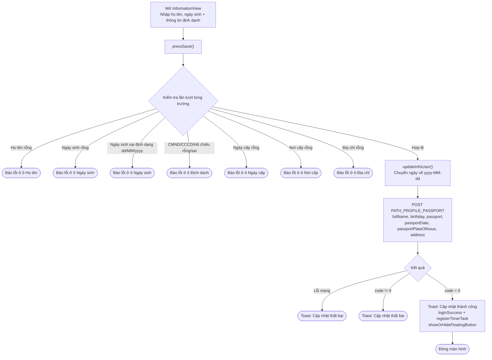
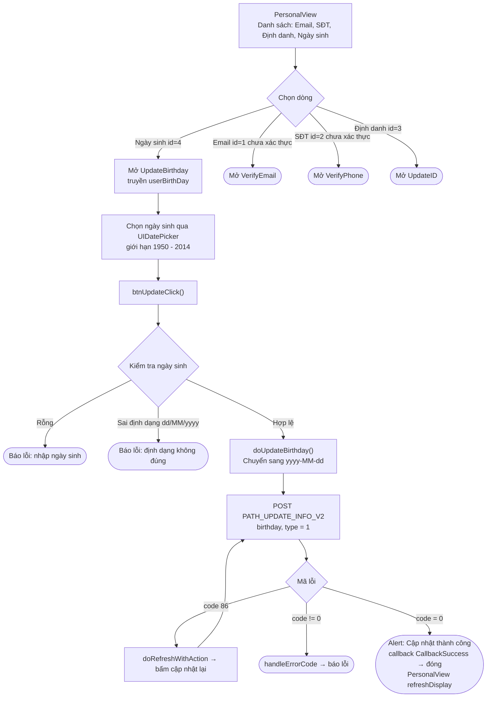

# Luồng cập nhật họ tên & ngày sinh – iTapSdk (sdk-game-ios-v3)

Tài liệu mô tả luồng cập nhật họ tên và ngày tháng năm sinh của SDK, dựng từ code thực tế.
Trong project có **hai màn hình** liên quan:

- **`InformationView`** – cập nhật **họ tên + ngày sinh** cùng một lúc (kèm thông tin định
  danh: CMND/CCCD/hộ chiếu, ngày cấp, nơi cấp, địa chỉ) qua endpoint `PATH_PROFILE_PASSPORT`.
  Đây là màn hoàn thiện thông tin tài khoản / định danh (`requireSecurityLevel`).
- **`UpdateBirthday`** – cập nhật **riêng ngày sinh** qua endpoint `PATH_UPDATE_INFO_V2`.
  Được mở từ màn thông tin cá nhân `PersonalView` (không có ô sửa họ tên riêng ở đây;
  họ tên chỉ hiển thị làm tiêu đề).

Cả hai đều đính kèm Bearer accessToken và tự refresh token khi gặp `code = 86`.

## Cách 1 – `InformationView` (họ tên + ngày sinh cùng lúc)

### Mô tả – Cách 1

Người dùng nhập họ tên (`tfName`), ngày sinh (`tfBirthDay`, chọn qua UIDatePicker) và các
trường định danh. Khi bấm lưu, `pressSave()` kiểm tra lần lượt:

- Họ tên không được để trống.
- Ngày sinh không được để trống và đúng định dạng `dd/MM/yyyy`.
- CMND/CCCD/hộ chiếu không rỗng và hợp lệ (`^[0-9]{9,12}$` hoặc hộ chiếu `^[A-Z][0-9]{8}$`).
- Ngày cấp, nơi cấp, địa chỉ không được để trống.

Hợp lệ → `updateInfoUser()` chuyển ngày sinh (và ngày cấp) sang `yyyy-MM-dd` rồi gọi
`PATH_PROFILE_PASSPORT` (POST) với `fullName`, `birthday`, `passport`, `passportDate`,
`passportPlateOfIssue`, `address` (kèm `deviceId`, `os`, `osVersion`, `ip`).

- `code = 0`: hiện toast "Cập nhật thông tin thành công", gọi `loginSuccess()` (phát delegate
  `loginSuccess` + `registerTimerTask`), `showOrHideFloatingButton()` rồi đóng màn hình.
- Lỗi mạng hoặc `code != 0`: hiện toast "Cập nhật thông tin tài khoản thất bại!".

> Lưu ý: màn này cập nhật **họ tên và ngày sinh cùng nhau** trong một request, nhưng bắt buộc
> điền đầy đủ cả thông tin định danh mới lưu được.

## Cách 2 – `UpdateBirthday` (chỉ ngày sinh, mở từ `PersonalView`)

### Mô tả – Cách 2

`PersonalView` là màn hình thông tin cá nhân dạng danh sách (Email, Số điện thoại, Định danh,
Ngày sinh, Đăng xuất). Họ tên tài khoản chỉ hiển thị ở tiêu đề, không sửa tại đây. Chọn dòng
**Ngày sinh** (`id = 4`, loại `.edit`) sẽ mở `UpdateBirthday` (truyền ngày sinh hiện tại).

Trong `UpdateBirthday`, người dùng chọn ngày qua `UIDatePicker` (giới hạn từ 01/01/1950 đến
01/01/2014). `btnUpdateClick()` kiểm tra ngày sinh không rỗng và đúng định dạng `dd/MM/yyyy`,
rồi `doUpdateBirthday()` chuyển sang `yyyy-MM-dd` và gọi `PATH_UPDATE_INFO_V2` (POST) với
`birthday`, `type = 1`.

- `code = 0`: hiện alert "Cập nhật thành công", phát `callback(CallbackSuccess)` → đóng màn hình;
  `PersonalView` nhận callback và `refreshDisplay()` để cập nhật lại danh sách.
- `code = 86` (token hết hạn): `doRefreshWithAction` làm mới token rồi tự bấm cập nhật lại.
- lỗi khác: `handleErrorCode`.

## Các endpoint sử dụng

- `PATH_PROFILE_PASSPORT` – cập nhật họ tên + ngày sinh + thông tin định danh (POST) – dùng ở `InformationView`
- `PATH_UPDATE_INFO_V2` – cập nhật ngày sinh (POST, `birthday`, `type = 1`) – dùng ở `UpdateBirthday`

## Ghi chú

- Ngày sinh luôn nhập/hiển thị theo `dd/MM/yyyy` ở UI, nhưng gửi lên server theo `yyyy-MM-dd`.
- `InformationView` là màn cập nhật gộp (yêu cầu đủ cả định danh) và gắn với luồng hoàn thiện
  bảo mật (`requireSecurityLevel`); thành công thì tiếp tục đăng nhập qua `loginSuccess()`.
- `UpdateBirthday` chỉ đổi ngày sinh, tự refresh token khi gặp `code = 86` và trả kết quả về
  `PersonalView` qua callback để làm mới hiển thị.
- Trong SDK hiện tại **không có màn hình sửa riêng "họ tên"**; họ tên chỉ được cập nhật kèm
  trong `InformationView`.
