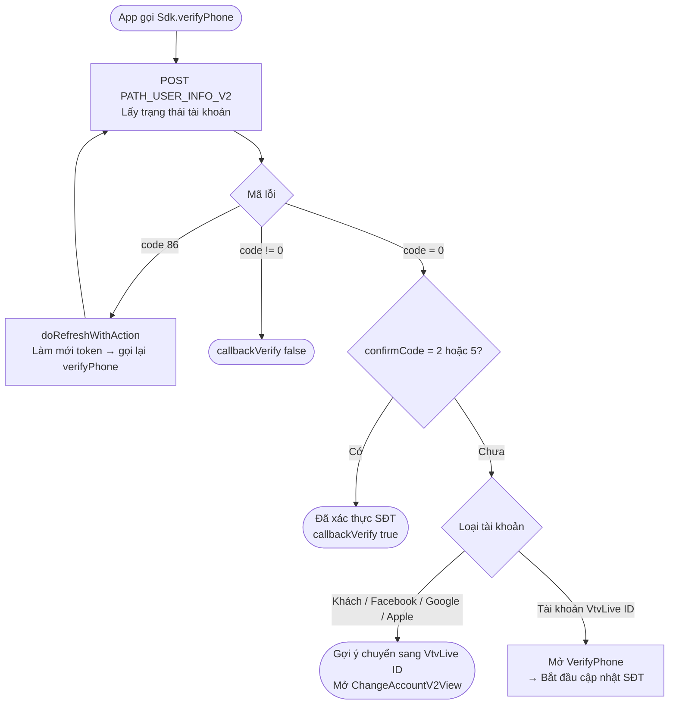
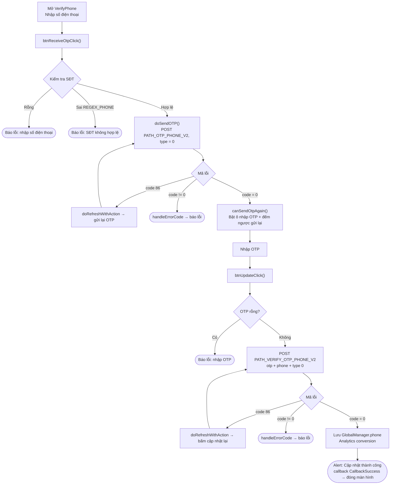
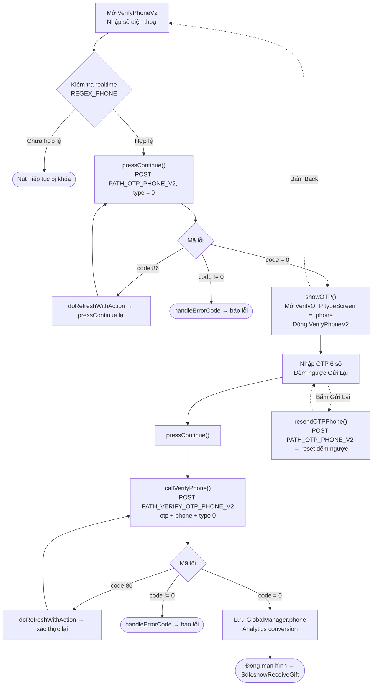

# Luồng cập nhật số điện thoại – iTapSdk (sdk-game-ios-v3)

Tài liệu mô tả luồng cập nhật / xác thực số điện thoại của SDK, dựng từ code thực tế.
Trong project hiện có **hai biến thể** màn hình:

- **Cách 1 – `VerifyPhone`** (một màn hình gộp cả nhập SĐT và nhập OTP; tiêu đề *"CẬP NHẬT SỐ ĐIỆN THOẠI"*). Được gọi qua `Sdk.verifyPhone(...)`.
- **Cách 2 – `VerifyPhoneV2` → `VerifyOTP`** (bản mới, tách hai màn hình; tiêu đề *"Thêm số điện thoại"*, gắn với luồng nhận quà `showReceiveGift`).

Cả hai dùng chung 2 endpoint: `PATH_OTP_PHONE_V2` (gửi OTP) và `PATH_VERIFY_OTP_PHONE_V2` (xác thực OTP), với tham số `type = 0` (Verify Phone) và header kèm Bearer accessToken.

## Điều kiện vào luồng – `Sdk.verifyPhone()`

Chỉ tài khoản VtvLive ID chưa xác thực SĐT (`confirmCode` khác 2 và 5) mới được mở màn
hình cập nhật số điện thoại; tài khoản khách/mạng xã hội sẽ được gợi ý chuyển đổi tài khoản trước.

## Cách 1 – Màn hình `VerifyPhone`

### Mô tả – Cách 1

1. **Nhập SĐT & gửi OTP** – `btnReceiveOtpClick()` kiểm tra SĐT không rỗng và khớp
   `REGEX_PHONE`, sau đó `doSendOTP()` gọi `PATH_OTP_PHONE_V2` (`type = 0`, kèm Bearer token).
   - `code = 0`: bật ô nhập OTP và chạy đếm ngược gửi lại (`Constants.timeOutOtpAgain`).
   - `code = 86` (token hết hạn): `doRefreshWithAction` làm mới token rồi tự bấm gửi lại.
   - lỗi khác: `handleErrorCode`.
2. **Nhập OTP & cập nhật** – `btnUpdateClick()` kiểm tra OTP không rỗng, gọi
   `PATH_VERIFY_OTP_PHONE_V2` (`otp`, `phone`, `type = 0`).
   - `code = 0`: lưu `GlobalManager.shared.phone`, ghi nhận Analytics, hiện alert
     "Cập nhật thành công", phát `callback(CallbackSuccess)` rồi đóng màn hình.
   - `code = 86`: refresh token rồi thử lại.
   - lỗi khác: `handleErrorCode`.
3. **Gửi lại OTP** – khi bộ đếm về 0, nút "Gửi mã" bật lại để gọi lại `PATH_OTP_PHONE_V2`.

## Cách 2 – `VerifyPhoneV2` → `VerifyOTP`

### Mô tả – Cách 2

1. **`VerifyPhoneV2`** – ô nhập SĐT được kiểm tra realtime theo `REGEX_PHONE`; hợp lệ
   thì bật nút "Tiếp tục". `pressContinue()` gọi `PATH_OTP_PHONE_V2` (`type = 0`).
   - `code = 0`: `showOTP()` mở màn hình `VerifyOTP` (`typeScreen = .phone`, truyền
     `phone`, `serverId`, `characterId`) và đóng màn hình hiện tại.
   - `code = 86`: refresh token rồi gọi lại.
   - lỗi khác: `handleErrorCode`.
2. **`VerifyOTP`** – nhập OTP 6 số, hiển thị SĐT dạng che (`maskedPhoneFrom`) và bộ đếm
   ngược để "Gửi Lại". `pressContinue()` → `callVerifyPhone()` gọi
   `PATH_VERIFY_OTP_PHONE_V2` (`otp`, `phone`, `type = 0`).
   - `code = 0`: lưu `GlobalManager.shared.phone`, ghi Analytics, đóng màn hình và
     gọi `Sdk.showReceiveGift()` (tiếp tục luồng nhận quà).
   - `code = 86`: refresh token rồi thử lại.
   - lỗi khác: `handleErrorCode`.
   - **Gửi lại OTP**: `resendOTPPhone()` gọi lại `PATH_OTP_PHONE_V2` và khởi động lại đếm ngược.
   - **Back**: quay lại màn hình `VerifyPhoneV2`.

## Các endpoint sử dụng

- `PATH_USER_INFO_V2` – lấy trạng thái xác thực tài khoản (ở bước điều kiện `verifyPhone`)
- `PATH_OTP_PHONE_V2` – gửi OTP về số điện thoại (POST, `type = 0`)
- `PATH_VERIFY_OTP_PHONE_V2` – xác thực OTP và cập nhật SĐT (POST, `type = 0`)

## Ghi chú

- Tham số `type = 0` nghĩa là *Verify Phone*. Các giá trị khác dùng cho email và các
  loại xác thực khác (1 = mail, 2/3 = one-time authen, 4/5 = one-time transaction).
- Mọi request đều đính kèm `accessToken` (Bearer). Khi gặp `code = 86` (token hết hạn),
  SDK tự `doRefreshWithAction` để làm mới token rồi lặp lại đúng thao tác đang dở.
- Cập nhật thành công đều ghi `GlobalManager.shared.phone` và gọi
  `Analytics.initiateOnDeviceConversionMeasurement(phoneNumber:)`.
- Khác biệt kết thúc: Cách 1 phát `callback(CallbackSuccess)` cho nơi mở màn hình;
  Cách 2 chuyển tiếp sang `Sdk.showReceiveGift()`.
