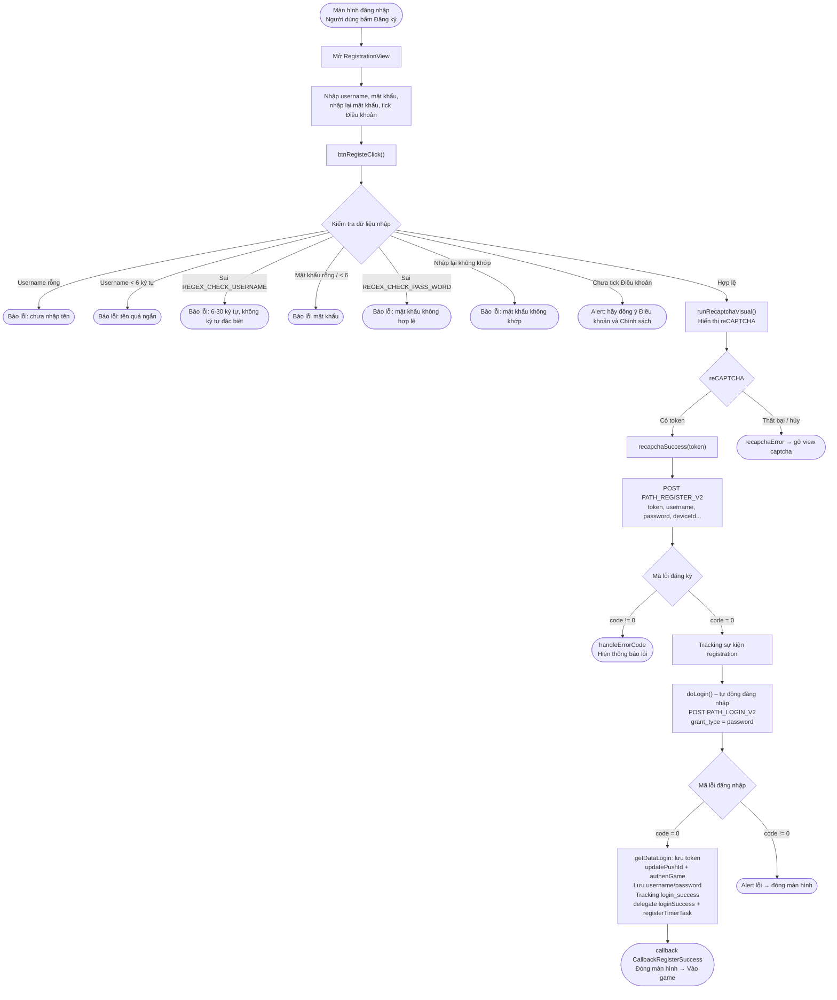

# Luồng đăng ký – iTapSdk (sdk-game-ios-v3)

Tài liệu mô tả luồng đăng ký tài khoản của SDK, dựng từ code thực tế:
`RegistrationView.swift` (và `LoginViewNew.swift` là nơi mở màn hình đăng ký).

## Sơ đồ tổng quan

## Mô tả chi tiết

### 1. Mở màn hình đăng ký

Từ màn hình đăng nhập (`LoginViewNew`), người dùng bấm **Đăng ký** →
mở `RegistrationView`. Màn hình gồm ô nhập **tên đăng nhập**, **mật khẩu**,
**nhập lại mật khẩu** và checkbox đồng ý **Điều khoản & Chính sách**.

### 2. Kiểm tra dữ liệu nhập – `btnRegisteClick()`

Trước khi gọi API, SDK kiểm tra tuần tự (gặp lỗi nào thì báo và dừng ngay):

- Tên đăng nhập không được để trống.
- Mật khẩu không được để trống.
- Tên đăng nhập tối thiểu 6 ký tự.
- Mật khẩu tối thiểu 6 ký tự.
- Tên đăng nhập khớp `REGEX_CHECK_USERNAME` (6–30 ký tự, không ký tự đặc biệt).
- Mật khẩu khớp `REGEX_CHECK_PASS_WORD`.
- Ô nhập lại mật khẩu không được để trống.
- Mật khẩu và nhập lại mật khẩu phải trùng nhau.
- Phải tick đồng ý Điều khoản & Chính sách (`isCheck`).

Tất cả hợp lệ → gọi `runRecaptchaVisual()`.

### 3. Xác thực reCAPTCHA – `runRecaptchaVisual()`

Hiển thị `RecaptchaVisual` với `apiKeyRecapcha` và `baseWebId`.
Nếu lấy được token → gọi `recapchaSuccess(token)`; nếu lỗi/hủy →
`recapchaError()` gỡ bỏ view captcha.

### 4. Gọi API đăng ký – `recapchaSuccess()`

Gọi `PATH_REGISTER_V2` (POST) với các tham số:
`reCaptChaVer = ios-v2`, `token`, `username`, `password`, `rePassword`,
`deviceId`, `os`, `osVersion`, và `ip` (nếu có).

- `code = 0`: tracking sự kiện `registration` (TikTok) → gọi `doLogin()` để **tự động đăng nhập**.
- `code != 0`: `handleErrorCode` hiển thị thông báo lỗi.

### 5. Tự động đăng nhập sau đăng ký – `doLogin()`

Gọi `PATH_LOGIN_V2` (POST) với `grant_type = password`, dùng chính username/password
vừa đăng ký.

- `code = 0`:
  - `getDataLogin()` lưu `accessToken` / `refreshToken`.
  - `updatePushId()`, `authenGame()`, `Utils.sayHi()`.
  - Lưu username/password vào bộ nhớ (`KeyUserName`, `KeyPassword`).
  - Tracking `login_success` (loại `Username`), tracking TikTok `login`.
  - Gọi delegate `loginSuccess(userInfo, accessToken, refreshToken)` và `registerTimerTask()`.
  - Gọi `callback(CallbackRegisterSuccess)` rồi đóng màn hình → vào game.
- `code != 0`: hiện alert lỗi rồi đóng màn hình.

## Các endpoint sử dụng

- `PATH_REGISTER_V2` – đăng ký tài khoản (POST)
- `PATH_LOGIN_V2` – tự động đăng nhập sau đăng ký (POST, `grant_type = password`)
- `PATH_GAME_AUTH` – xác thực game sau khi đăng nhập (`authenGame`)

## Ghi chú

- Sau khi đăng ký thành công, SDK **không bắt người dùng đăng nhập lại** mà tự
  đăng nhập bằng thông tin vừa tạo, sau đó phát callback `CallbackRegisterSuccess`.
- Toàn bộ điều kiện hợp lệ của tên đăng nhập/mật khẩu được kiểm ở client trước,
  reCAPTCHA là bước bắt buộc trước khi gọi API đăng ký.
