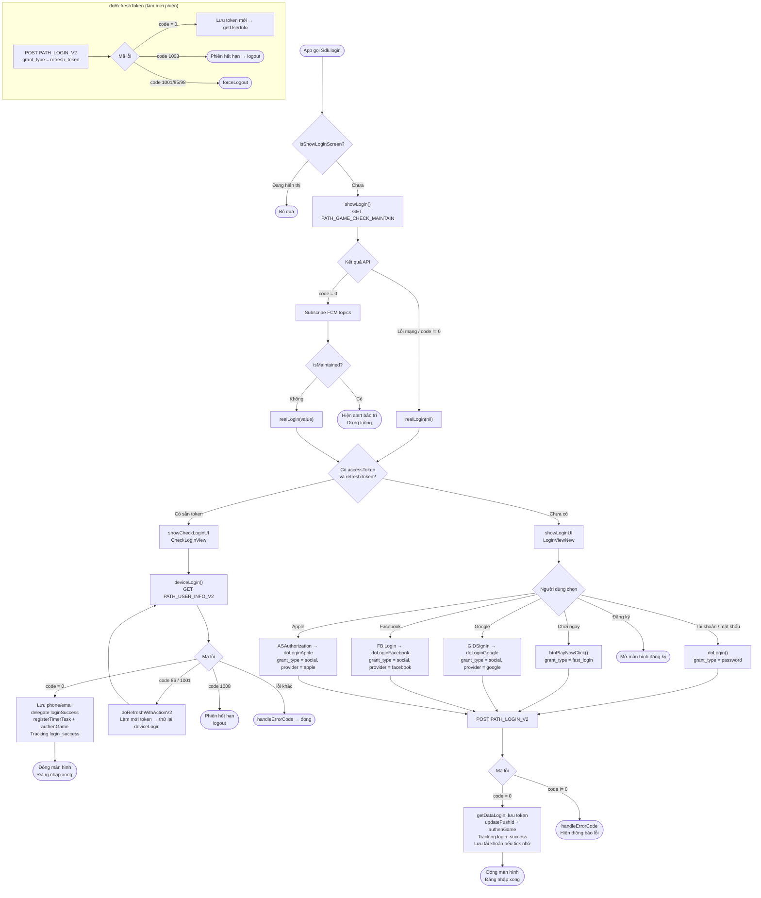

# Luồng đăng nhập – iTapSdk (sdk-game-ios-v3)

Tài liệu mô tả luồng đăng nhập của SDK, dựng từ code thực tế:
`Sdk+Authentication.swift`, `CheckLoginView.swift`, `LoginViewNew.swift`, `LoginWrapper.swift`.

## Sơ đồ tổng quan

## Mô tả chi tiết

### 1. Điểm vào – `login()` / `showLogin()`

Khi app gọi `Sdk.login()`, SDK kiểm tra cờ `isShowLoginScreen` để tránh mở
trùng màn hình. Nếu chưa hiển thị, `showLogin()` gọi API kiểm tra bảo trì
`PATH_GAME_CHECK_MAINTAIN` (GET) với `packageId`, `channel`, `version`.

- Nếu API **lỗi** hoặc trả về `code != 0` → gọi thẳng `realLogin(nil)`.
- Nếu `code = 0` → subscribe các FCM topic trả về, rồi kiểm tra `isMaintained`:
  - `isMaintained = true` → hiện alert thông báo bảo trì và **dừng** luồng.
  - `isMaintained = false` → gọi `realLogin(value)`.

### 2. Phân nhánh – `realLogin()`

Dựa trên việc thiết bị đã lưu sẵn token hay chưa:

- **Đã có `accessToken` và `refreshToken`** → `showCheckLoginUI()` (mở `CheckLoginView`),
  đăng nhập lại tự động, không cần thao tác người dùng.
- **Chưa có token** → `showLoginUI()` (mở `LoginViewNew`) để người dùng chọn cách đăng nhập.

### 3. Đăng nhập lại tự động – `CheckLoginView.deviceLogin()`

Gọi `PATH_USER_INFO_V2` (GET) kèm Bearer accessToken:

- `code = 0`: lưu `phone`/`email`, gọi delegate `loginSuccess(userInfo, accessToken, refreshToken)`,
  chạy `registerTimerTask()`, `authenGame()`, `updatePushId()` và tracking `login_success` (loại `Refresh`).
- `code = 86` hoặc `1001`: gọi `doRefreshWithActionV2` để làm mới token rồi **thử lại** `deviceLogin()`.
- `code = 1008`: phiên hết hạn → `Sdk.logout()`.
- Lỗi khác: `handleErrorCode` hiển thị thông báo rồi đóng màn hình.

### 4. Màn hình đăng nhập – `LoginViewNew`

Người dùng chọn một trong các phương thức, tất cả gọi chung endpoint `PATH_LOGIN_V2` (POST):

| Phương thức | Hàm xử lý | `grant_type` | Ghi chú |
|---|---|---|---|
| Tài khoản / mật khẩu | `doLogin()` | `password` | Có tùy chọn nhớ tài khoản (mật khẩu mã hóa AES-256) |
| Chơi ngay | `btnPlayNowClick()` | `fast_login` | Có thêm `nonce` ngẫu nhiên |
| Google | `doLoginGoogle()` | `social` | `provider = google`, token lấy từ `GIDSignIn` |
| Facebook | `doLoginFacebook()` | `social` | `provider = facebook` / `facebook_limited` |
| Apple | `doLoginApple()` | `social` | `provider = apple`, qua `ASAuthorization` |
| Đăng ký | `btnRegisterClick()` | – | Mở màn hình đăng ký |

Nút social Apple / Facebook / Google chỉ hiện khi được bật trong cấu hình
(`enableAppleLogin`, `enableFacebookLogin`, `enableGoogleLogin`), và thứ tự nút
được sắp lại theo phương thức đăng nhập gần nhất của người dùng.

Khi `PATH_LOGIN_V2` trả về:

- `code = 0`: `getDataLogin()` lưu token, gọi `updatePushId()`, `authenGame()`,
  tracking `login_success`, lưu tài khoản nếu người dùng tick "nhớ", rồi đóng màn hình.
- `code != 0`: `handleErrorCode` hiển thị thông báo lỗi tương ứng.

### 5. Làm mới phiên – `doRefreshToken()`

Dùng chung khi token hết hạn: gọi `PATH_LOGIN_V2` với `grant_type = refresh_token`.

- `code = 0`: lưu bộ token mới rồi gọi `getUserInfo()`.
- `code = 1008`: hiện thông báo phiên hết hạn → `logout()`.
- `code = 1001 / 85 / 98`: `forceLogout()`.

## Các endpoint sử dụng

- `PATH_GAME_CHECK_MAINTAIN` – kiểm tra bảo trì (GET)
- `PATH_LOGIN_V2` – đăng nhập / làm mới token (POST, phân biệt bằng `grant_type`)
- `PATH_USER_INFO_V2` – lấy thông tin người dùng (GET)
- `PATH_GAME_AUTH` – xác thực game sau khi đăng nhập (`authenGame`)
- `PATH_LOGOUT` – đăng xuất

## Các mã lỗi quan trọng

- `CODE_0` – thành công
- `CODE_86`, `CODE_1001` – token cần làm mới (thử refresh rồi lặp lại)
- `CODE_1008` – phiên đăng nhập hết hạn → logout
- `CODE_1001 / 85 / 98` – buộc đăng xuất (`forceLogout`)
