# Luồng đăng xuất – iTapSdk (sdk-game-ios-v3)

Tài liệu mô tả luồng đăng xuất của SDK, dựng từ code thực tế trong
`Sdk+Authentication.swift`. Có **hai hàm**:

- **`logout()`** – đăng xuất chủ động (người dùng bấm đăng xuất). Có gọi API `PATH_LOGOUT`
  để thu hồi refresh token trên server.
- **`forceLogout()`** – đăng xuất bắt buộc do phiên bị vô hiệu (mã lỗi `1001 / 85 / 98`,
  hoặc `1008` – phiên hết hạn). **Không** gọi API `PATH_LOGOUT`, chỉ dọn dữ liệu cục bộ.

Cả hai đều đưa người dùng về trạng thái chưa đăng nhập và phát delegate `logout`.

## Điểm gọi đăng xuất

`logout()` thường được gọi từ:
- `PersonalView` → `showSignOut()` (hộp thoại xác nhận) → `doSignOut()` → `Sdk.logout()`.
- `CheckLoginView` → `doSignOut()` khi cần đăng xuất.
- Khi phiên hết hạn (`code = 1008`) ở `doRefreshToken` / `getUserInfo` → hiện thông báo → `logout()`.

`forceLogout()` được gọi khi refresh token trả về `code = 1001 / 85 / 98` (tài khoản bị
khóa / phiên bị thu hồi ở nơi khác).

## Sơ đồ tổng quan

```mermaid
flowchart LR
    A([Yêu cầu đăng xuất]) --> B{Loại đăng xuất}

    B -- "Chủ động: logout()" --> C["POST PATH_LOGOUT<br/>token = refreshToken<br/>token_type_hint = refresh_token<br/>client_id + client_secret"]
    B -- "Bắt buộc: forceLogout()" --> D["Bỏ qua gọi PATH_LOGOUT"]

    C --> E
    D --> E["Ẩn nút nổi nếu đang hiện<br/>showOrHideFloatingButton"]

    E --> F["Đăng xuất mạng xã hội<br/>Facebook: LoginManager.logOut nếu token còn hạn<br/>Google: GIDSignIn.signOut nếu đã đăng nhập"]

    F --> G["Giải mã idToken (JWT)<br/>Lấy accountID + accountName → dựng User"]

    G --> H["Xóa dữ liệu cục bộ:<br/>email, phone = rỗng<br/>GlobalManager.clearData()"]

    H --> I["Reset tracking:<br/>EVENT_LOGOUT_SUCCESS<br/>Trackier setAccountId 0<br/>AppsFlyer customerUserID = nil<br/>TikTok logout nếu có TIKTOK_APP_ID"]

    I --> J["delegate?.sdk logout: userInfo<br/>resetTimer()"]

    J --> K([Về trạng thái chưa đăng nhập])
```

## Mô tả chi tiết

### Khác biệt giữa `logout()` và `forceLogout()`

Điểm khác biệt **duy nhất về nghiệp vụ**: `logout()` gọi API `PATH_LOGOUT` (POST) để thu
hồi `refreshToken` trên server (fire-and-forget), còn `forceLogout()` bỏ qua bước này vì
phiên đã bị vô hiệu phía server rồi. Các bước dọn dẹp còn lại giống nhau.

Body của `PATH_LOGOUT`:
`token = refreshToken`, `token_type_hint = "refresh_token"`, `client_id`, `client_secret`;
header `ServiceProcessor.createHeaderFieldType1()`.

### Các bước dọn dẹp chung

1. **Ẩn nút nổi (floating button)** – nếu đang hiển thị thì gọi `showOrHideFloatingButton()`.
2. **Đăng xuất mạng xã hội**:
   - Facebook: nếu `AccessToken.current` còn hạn → `LoginManager().logOut()`.
   - Google: nếu `GIDSignIn.hasPreviousSignIn()` → `GIDSignIn.sharedInstance.signOut()`.
3. **Dựng thông tin người dùng để trả về** – giải mã `idToken` (JWT), lấy `accountID` và
   `accountName` từ payload để tạo đối tượng `User` (dùng cho delegate).
4. **Xóa dữ liệu cục bộ** – đặt `email`, `phone` về rỗng và gọi `GlobalManager.shared.clearData()`
   (xóa token và trạng thái đăng nhập).
5. **Reset tracking / analytics**:
   - Gửi sự kiện `EVENT_LOGOUT_SUCCESS`.
   - `TrackierSdk.setAccountId(0, withAccountName: "")`.
   - `AppsFlyerLib.shared().customerUserID = nil`.
   - `TikTokBusiness.logout()` nếu có cấu hình `TIKTOK_APP_ID`.
6. **Thông báo cho app & reset timer**:
   - Gọi delegate `delegate?.sdk?(self, logout: userInfo)` để app biết đã đăng xuất.
   - `resetTimer()` dừng bộ đếm phiên.

Sau các bước trên, SDK ở trạng thái chưa đăng nhập; lần sau gọi `Sdk.login()` sẽ hiện lại
màn hình đăng nhập.

## Endpoint sử dụng

- `PATH_LOGOUT` – thu hồi refresh token trên server (POST, chỉ dùng ở `logout()`)

## Ghi chú

- `forceLogout()` dùng `getAccountNameInPayloadV2` để lấy tên tài khoản (khác `logout()`
  dùng `getAccountNameInPayload`), nhưng phần dọn dẹp và delegate là như nhau.
- Việc gọi `PATH_LOGOUT` là fire-and-forget: SDK không chờ kết quả server mà vẫn dọn dữ
  liệu cục bộ ngay, đảm bảo người dùng luôn được đăng xuất ở phía client.
- Đăng xuất luôn phát delegate `logout` kèm `User` (accountID, accountName) để app đồng bộ
  trạng thái và xử lý UI tương ứng.
