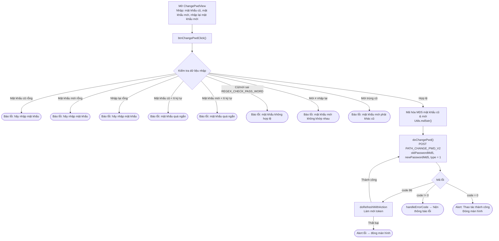

# Luồng đổi mật khẩu – iTapSdk (sdk-game-ios-v3)

Tài liệu mô tả luồng đổi mật khẩu (khi người dùng **đã đăng nhập**) của SDK, dựng từ
code thực tế: `ChangePwdView.swift` (tiêu đề *"ĐỔI MẬT KHẨU"*).

> Phân biệt: đây là **đổi mật khẩu** (biết mật khẩu cũ, đang đăng nhập) — khác với
> **quên mật khẩu** (lấy lại qua OTP email/SĐT).

## Sơ đồ tổng quan

## Mô tả chi tiết

### 1. Nhập & kiểm tra dữ liệu – `btnChangePwdClick()`

Màn hình có 3 ô: **mật khẩu cũ** (`txtPwd`), **mật khẩu mới** (`txtNewPwd`),
**nhập lại mật khẩu mới** (`txtConfirmNewPwd`). Khi bấm "ĐỔI MẬT KHẨU", SDK kiểm tra
lần lượt (gặp lỗi nào thì tô đỏ ô tương ứng và dừng):

- Mật khẩu cũ, mật khẩu mới, nhập lại đều không được để trống.
- Mật khẩu cũ và mật khẩu mới tối thiểu 6 ký tự.
- Mật khẩu cũ và mật khẩu mới phải khớp `REGEX_CHECK_PASS_WORD`.
- Mật khẩu mới và nhập lại phải trùng nhau.
- Mật khẩu mới phải khác mật khẩu cũ.

### 2. Mã hóa & gọi API – `doChangePwd()`

Hợp lệ → mật khẩu cũ và mới được **băm MD5** (`Utils.md5str`) trước khi gửi. Gọi
`PATH_CHANGE_PWD_V2` (POST) với `oldPasswordMd5`, `newPasswordMd5`, `type = 1`
(kèm `deviceId`, `os`, `osVersion`, `ip`) và header Bearer accessToken.

- `code = 0`: hiện alert "Thao tác thành công" → đóng màn hình.
- `code = 86` (token hết hạn): `doRefreshWithAction` làm mới token; thành công thì
  **tự gọi lại** `doChangePwd()`, thất bại thì hiện alert lỗi rồi đóng màn hình.
- lỗi khác: `handleErrorCode` hiển thị thông báo lỗi.

## Endpoint sử dụng

- `PATH_CHANGE_PWD_V2` – đổi mật khẩu khi đang đăng nhập (POST, `type = 1`)

## Ghi chú

- Mật khẩu **không gửi dạng plaintext**: cả mật khẩu cũ và mới đều được băm MD5 ở client
  (`oldPasswordMd5`, `newPasswordMd5`) trước khi gửi lên server.
- Toàn bộ thao tác cần `accessToken` (Bearer). Khi gặp `code = 86`, SDK tự refresh token
  rồi lặp lại đúng request đổi mật khẩu đang dở.
- Đổi mật khẩu thành công **không bắt đăng nhập lại** trong màn này — chỉ hiện thông báo
  thành công và đóng màn hình.
