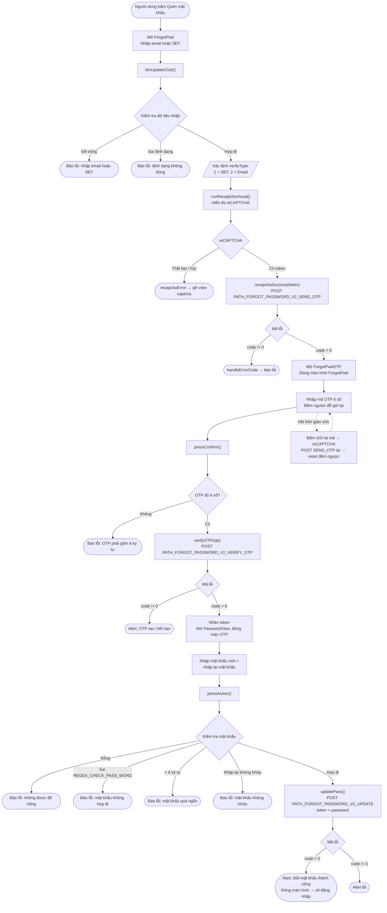

# Luồng quên mật khẩu – iTapSdk (sdk-game-ios-v3)

Tài liệu mô tả luồng lấy lại / đặt lại mật khẩu của SDK, dựng từ code thực tế:
`ForgotPwd.swift` (nhập email/SĐT) → `ForgotPwdOTP.swift` (xác thực OTP) →
`PasswordView.swift` (đặt mật khẩu mới).

## Sơ đồ tổng quan

## Mô tả chi tiết

### Bước 1 – Nhập email/SĐT (`ForgotPwd`)

Người dùng nhập email hoặc số điện thoại. `btnUpdateClick()` kiểm tra:

- Không được để trống.
- Đúng định dạng qua `isValidPhoneOrEmail()`:
  - Khớp `REGEX_PHONE` (SĐT Việt Nam) → `verifyType = 1`.
  - Khớp regex email → `verifyType = 2`.
  - Không khớp cả hai → báo lỗi định dạng.

Hợp lệ → gọi `runRecaptchaVisual()` để hiện reCAPTCHA. Khi có token,
`recapchaSuccess()` gọi `PATH_FORGOT_PASSWORD_V2_SEND_OTP` (POST) với
`reCaptChaVer`, `reCaptChaToken`, `verifyInfo`, `clientId`, `deviceId`, `os`, `osVersion`, `ip`.

- `code = 0`: mở màn hình `ForgotPwdOTP` (truyền `verifyInfo`, `verifyType`) và đóng màn hình hiện tại.
- `code != 0`: `handleErrorCode(99)` hiển thị thông báo lỗi.

### Bước 2 – Xác thực OTP (`ForgotPwdOTP`)

Màn hình hiển thị ô nhập OTP 6 số và bộ đếm ngược để gửi lại (`Constants.timeOutOtpAgain`).

Khi bấm xác nhận, `pressConfirm()` kiểm tra OTP đủ 6 ký tự; nếu đủ gọi `verifyOTP()`
→ `PATH_FORGOT_PASSWORD_V2_VERIFY_OTP` (POST) với `verifyInfo`, `otp`, `clientId`, `deviceId`...

- `code = 0`: lấy `token` từ response (`ForgotPwdOTPJsonWrapper`), mở `PasswordView`
  (truyền `token`) và đóng màn hình OTP.
- `code != 0`: hiện alert (OTP sai hoặc hết hạn).

**Gửi lại mã:** khi bộ đếm về 0, nhãn đổi thành "Gửi lại mã". Bấm vào sẽ chạy lại
reCAPTCHA rồi gọi lại `PATH_FORGOT_PASSWORD_V2_SEND_OTP`; thành công thì khởi động lại
bộ đếm ngược, thất bại thì hiển thị lỗi.

### Bước 3 – Đặt mật khẩu mới (`PasswordView`)

Người dùng nhập mật khẩu mới và nhập lại. `pressAction()` kiểm tra:

- Không được để trống.
- Khớp `REGEX_CHECK_PASS_WORD`.
- Tối thiểu 6 ký tự.
- Nhập lại phải trùng khớp.

Hợp lệ → `updatePass()` gọi `PATH_FORGOT_PASSWORD_V2_UPDATE` (POST) với
`token` (nhận từ bước OTP), `password`, `clientId`, `deviceId`, `os`, `osVersion`, `ip`.

- `code = 0`: alert "Đổi mật khẩu thành công" → đóng màn hình, người dùng quay lại đăng nhập bằng mật khẩu mới.
- `code != 0`: hiện alert lỗi.

## Các endpoint sử dụng

- `PATH_FORGOT_PASSWORD_V2_SEND_OTP` – gửi OTP về email/SĐT (POST, có reCAPTCHA)
- `PATH_FORGOT_PASSWORD_V2_VERIFY_OTP` – xác thực OTP, trả về `token` (POST)
- `PATH_FORGOT_PASSWORD_V2_UPDATE` – đặt mật khẩu mới bằng `token` (POST)

## Ghi chú

- reCAPTCHA là bước bắt buộc mỗi khi gửi OTP (cả lần đầu lẫn khi gửi lại).
- `token` nhận được sau khi xác thực OTP mới là thứ cho phép đổi mật khẩu ở bước cuối;
  không có OTP hợp lệ thì không lấy được token.
- Sau khi đổi mật khẩu thành công, luồng **không tự đăng nhập** mà đưa người dùng
  về màn hình đăng nhập để đăng nhập lại bằng mật khẩu mới.
