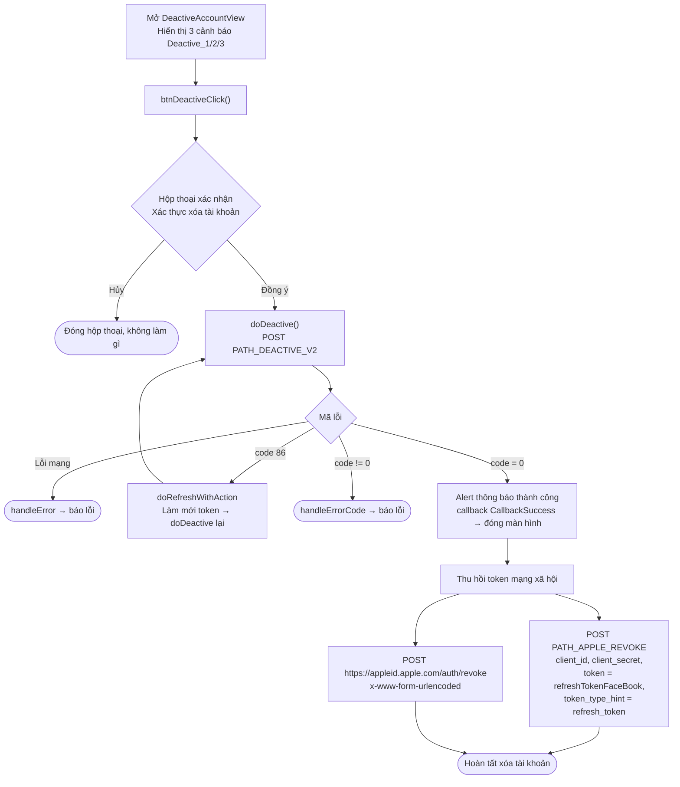

# Luồng xóa tài khoản – iTapSdk (sdk-game-ios-v3)

Tài liệu mô tả luồng xóa (vô hiệu hóa) tài khoản của SDK, dựng từ code thực tế:
`DeactiveAccountView.swift`.

## Sơ đồ tổng quan

## Mô tả chi tiết

### 1. Màn hình cảnh báo & xác nhận

`DeactiveAccountView` hiển thị 3 dòng cảnh báo (`Deactive_1`, `Deactive_2`, `Deactive_3`)
về hậu quả của việc xóa tài khoản. Khi bấm nút xóa, `btnDeactiveClick()` mở hộp thoại
xác nhận 2 nút ("Xác thực xóa tài khoản"):

- **Hủy**: đóng hộp thoại, không thực hiện gì.
- **Đồng ý**: gọi `doDeactive()`.

### 2. Gọi API xóa tài khoản – `doDeactive()`

Gọi `PATH_DEACTIVE_V2` (POST) với `deviceId`, `os`, `osVersion`, `ip` và header Bearer
accessToken.

- `code = 0`: hiển thị alert (dùng `message` từ server, mặc định "Cập nhật thành công"),
  phát `callback(CallbackSuccess)` rồi đóng màn hình. Sau đó thực hiện **thu hồi token
  mạng xã hội** (xem mục 3).
- `code = 86` (token hết hạn): `doRefreshWithAction` làm mới token rồi **tự gọi lại** `doDeactive()`.
- lỗi khác: `handleErrorCode` hiển thị thông báo lỗi.
- lỗi mạng: `handleError`.

### 3. Thu hồi token Facebook / Apple

Ngay sau khi xóa tài khoản thành công, SDK thu hồi refresh token social đang lưu
(`GlobalManager.shared.refreshTokenFaceBook`) qua hai lời gọi:

1. `PATH_APPLE_REVOKE` (POST, qua `appleApiService`) với `client_id`, `client_secret`,
   `token = refreshTokenFaceBook`, `token_type_hint = "refresh_token"`.
2. Gọi trực tiếp `https://appleid.apple.com/auth/revoke` (POST,
   `application/x-www-form-urlencoded`) với `client_id`, `client_secret`, `token`,
   `token_type_hint = "KeyRefreshToken"`.

Cả hai đều fire-and-forget (không chặn luồng chính).

## Các endpoint sử dụng

- `PATH_DEACTIVE_V2` – xóa / vô hiệu hóa tài khoản (POST, kèm Bearer accessToken)
- `PATH_APPLE_REVOKE` – thu hồi refresh token social phía backend (POST)
- `https://appleid.apple.com/auth/revoke` – thu hồi token trực tiếp với Apple (POST)

## Ghi chú

- Xóa tài khoản có **bước xác nhận bắt buộc** (hộp thoại 2 nút) trước khi gọi API.
- Sau khi thành công, ngoài việc xóa tài khoản còn thu hồi token mạng xã hội để đảm bảo
  không còn phiên đăng nhập social nào tồn tại.
- Khi gặp `code = 86`, SDK tự refresh token rồi lặp lại thao tác xóa đang dở.
- Màn hình này thường được mở từ phần cài đặt/thông tin tài khoản (ví dụ `PersonalView`).
