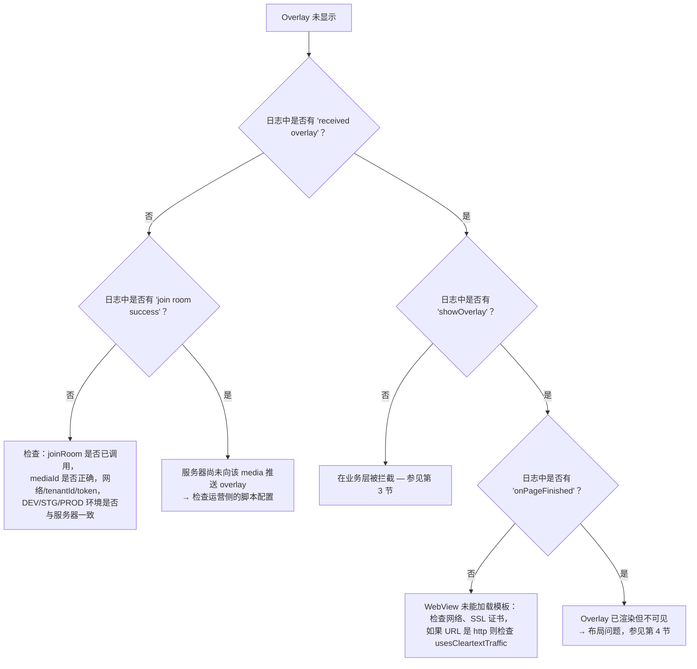

# 06 — 常见错误与诊断方法

[← 返回目录](README.md)

---

## 1. 开启 SDK 日志

SDK 通过 `logcat {}` 函数记录日志 — 仅在 **AAR 以 buildType `debug` 构建时**生效
（模块 `:interactive` 的 `BuildConfig.DEBUG = true`）。默认 Tag：`Interactive`。

```bash
adb logcat -s System.out | grep Interactive
```

需要注意的日志字符串：

| 日志 | 含义 |
|---|---|
| `overlay manager: Khởi tạo mới Innteractive`（这是 SDK 实际打印的越南语日志原文，保持不变；意为“重新初始化 Interactive”） | 构造函数执行 |
| `socket io management initialization: socketUrl = ...` | 准备建立连接 |
| `overlay manager socket: connected socket` / `join room success` | 成功进入房间 |
| `socket io management addEvents: received overlay` | 收到服务器推送的 overlay |
| `<-- check point: showOverlay -->` | 开始构建 WebView |
| `VLive: Website onPageFinished url: ...` | 模板加载完成 |
| `overlay web view manager: add caches` | 因 `isVisible = false` 而暂缓显示 overlay |
| `socket io management prevent ex-overlay: user answered` | 因已作答而被拦截 |

---

## 2. Overlay 不显示 — 诊断决策树



---

## 3. 在业务层被拦截

将日志与原因表对照（详见 [05 — Tracking](05-tracking-emit-ack.md#5-bảng-lý-do-huỷ-cancelreason)）：

| 现象 | 原因 | 处理方法 |
|---|---|---|
| `user haven't logged in yet` | 租户 `vtvlive`，尚未 `initToken`，overlay 不允许匿名 | 登录后调用 `initToken()` |
| `timelineId not found` | Payload 中缺少 `timelineId` | 反馈给服务端 |
| `socket is not connect` | 处理过程中 socket 断开 | 检查网络；SDK 会在 5 秒后自动重连 |
| `duplicate predict overlay` / `duplicate miniGame overlay` | `timelineId` 与正在显示的 overlay 重复 | 属于设计上的正常行为 |
| `prevent ex-overlay: user answered` | 该时间点已作答（pref `ex_*`） | 若要重新测试，需清除 App 数据 |
| `ex-overlay duration < 10s` | 补偿性 overlay 时长过短 | 属于设计上的正常行为 |
| Cancel `target_mismatch` | `targets` 与 `DEVICE_TYPE` 不匹配 | 构建正确的变体（`androidmobile` / `androidtv`）或修改脚本配置 |
| Cancel `expired_duration` | 从 `missTime` 起算，overlay 已超出时长 | 属于设计上的正常行为 |
| 出现 `add caches` 但未显示 | `isVisible = false`（尚未 `Connected`） | socket 连接后 overlay 会显示；若始终未连接 → 参见第 5 节 |

---

## 4. Overlay 已渲染但看不见 / 位置错误

| 原因 | 现象 | 处理方法 |
|---|---|---|
| `OverlayView` 尺寸为 `0` | 渲染日志正常，屏幕空白 | 明确设置 `layout_width/height` 约束；可临时设置 `setBackgroundColor(Color.YELLOW)` 进行排查 |
| `OverlayView` 被播放器覆盖绘制 | Overlay 会“闪一下”然后消失 | 在布局中将 `OverlayView` 声明在播放器**之后**，或提高 `elevation`/`translationZ` |
| `OverlayView` 比视频画面大 | Overlay 超出视频区域 | 将 `OverlayView` 的约束设置为与播放器 16:9 画面完全重合 |
| `OverlayView` 处于 `INVISIBLE` 状态 | 连接断开之后 | SDK 在断开连接时会调用 `temporaryLock()`；重新连接后会再次 `visible()` |
| Overlay 被播放器的 `SurfaceView` 遮挡 WebView | 仅在部分播放器上出现 | 播放器改用 `TextureView`，或将 `OverlayView` 放在单独的 ViewGroup 中置于其上 |

---

## 5. Socket 无法连接

检查清单：

1. **环境**：`EnvInteractive` 必须与服务器系统环境一致（DEV/STG/PROD）— URL 取自 native 层，App 侧无法修改。
2. **`tenantId`**：租户错误 → 服务器会拒绝进入房间。
3. **权限**：缺少 `INTERNET` 权限 → 不会有明确的错误日志，只会看到 `connect error`。
4. **Token 过期**：`Authorization` 头错误 → 根据服务器配置可能被拒绝。
5. **`liboverlay.so` 被剔除**：如果 App 使用 `abiFilters` 或 split ABI 但缺少对应架构，`Utils` 会在初始化时立即抛出 `UnsatisfiedLinkError` → `INTERACTIVE_SOCKET_URL` 为空。
   可用 `unzip -l app-release.apk | grep liboverlay` 检查。

日志 `socket io management initialization: url value uninitialized` 正是第 5 种情况的标志。

---

## 6. 集成 AAR 后的编译 / 运行错误

| 错误 | 原因 | 处理方法 |
|---|---|---|
| `NoClassDefFoundError: io/socket/client/IO` | 缺少传递依赖 | 按 [02 §3](02-cai-dat-va-tich-hop.md#3-khai-báo-phụ-thuộc) 声明齐全所需的库 |
| 打开对话框时出现 `ClassCastException` / 崩溃 | Activity 不是 `FragmentActivity` | 改用 `AppCompatActivity` |
| 对话框未打开，日志出现 `showPredictDialog error` | `activity as? FragmentActivity` 返回 `null` | 同上 |
| 开启 R8 后 WebView 收不到回调 | JS interface 被混淆 | 按 [02 §14](02-cai-dat-va-tich-hop.md#14-proguard--r8) 添加 `@JavascriptInterface` 规则 |
| Overlay 收不到数据（`GET_DATA_INTERACTIVE`） | 模板尚未发送 `LOADED_OVERLAY` | 与 Web 模板团队协调 |
| `UnsatisfiedLinkError: liboverlay.so` | 缺少 ABI | 检查 `ndk.abiFilters`，不要剔除 native 库 |

---

## 7. VOD：Overlay 未在正确的时间点出现

| 原因 | 处理方法 |
|---|---|
| App 未调用 `receiveTrackingTime()` | 在 `joinRoom(type = 2)` 之后添加 1 秒的循环调用 |
| 时间单位传错（用了毫秒而非秒） | 将 `player.currentPosition` 除以 1000 |
| 用户快进跳过了时间点 | SDK 按**精确秒数**匹配；该时间点的 overlay 会被跳过 — 这是当前的限制 |
| 未登录，且 overlay 不 `allowAnonymous` | `checkShowQuestion` 会跳过；登录后重新 `joinRoom` |
| 脚本配置返回为空 | 检查日志 `response vod failed`，确认 `mediaId` 和 token |

---

## 8. 常见问题

**SDK 会自动绑定 Activity 生命周期吗？**
不会。`LifecycleOverlay` 目前为空实现。App 必须自行调用 `releaseAll()`。但 socket 的 LiveData
是按 `LifecycleOwner` observe 的，因此 Activity 不处于 active 状态时会自动停止发送。

**能否同时显示多个 overlay？**
不能。`OverlayView.addViewCommon*` 在添加之前会调用 `clearViews()` → 始终只有一个 WebView overlay。
Predict/Lucky 按钮是独立的 view，因此可以与 overlay 并存（当 mini game 出现时 SDK 会主动关闭它们）。

**中途切换账号会怎样？**
调用 `initToken(新token, 新userId)`。如果正在直播中，SDK 会自动用新 token 重新进入房间。

**观看人数是准确的吗？**
`onHandleLiveViews` 返回的是 `count + 230`（当前代码中额外加上的常数）。如需原始数字，App 需自行减去。

**每次 `joinRoom()` 前都需要调用 `releaseAll()` 吗？**
不需要 — `joinRoom()` 内部已自动调用 `cleanUp()`。

**旋转屏幕会丢失 overlay 吗？**
不会，前提是 Activity 声明了 `configChanges="orientation|screenSize"`。如果 Activity 被重建，
则必须重新构建 `OverlayManager` 并重新 `joinRoom()`。

**SDK 使用的是系统自带的 WebView 吗？**
是的 — `OverlayWebView` 继承自 `android.webkit.WebView`，启用了 JavaScript 和 DOM storage，
背景透明，`cacheMode = LOAD_NO_CACHE`，并拦截外部导航（`shouldOverrideUrlLoading` 返回 `true`）。

---

[← Tracking emit-ack（追踪 emit-ack）](05-tracking-emit-ack.md) · [返回目录](README.md)
