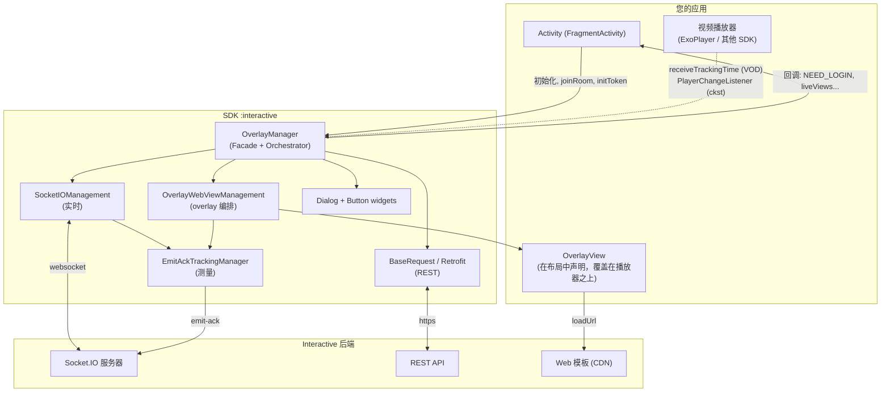
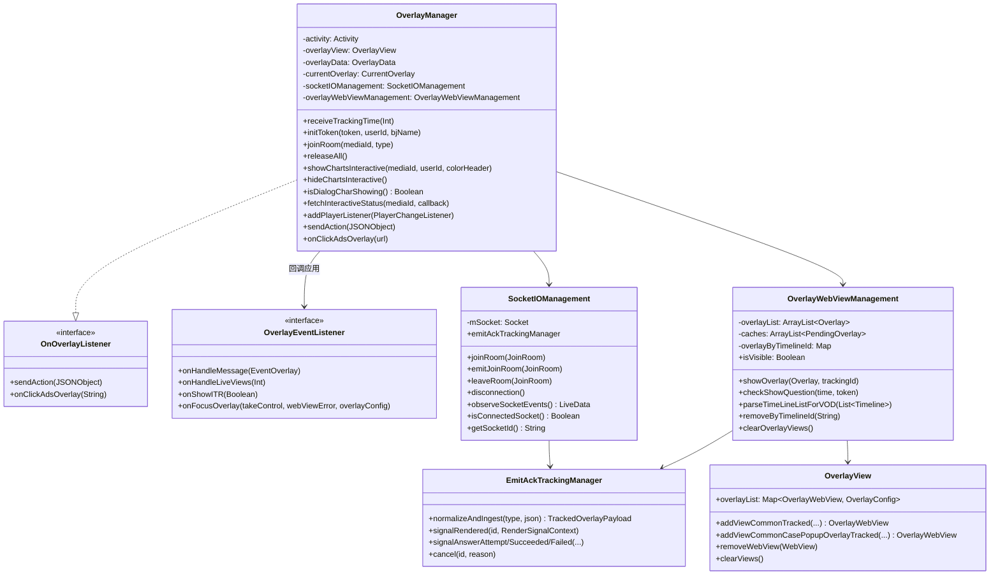
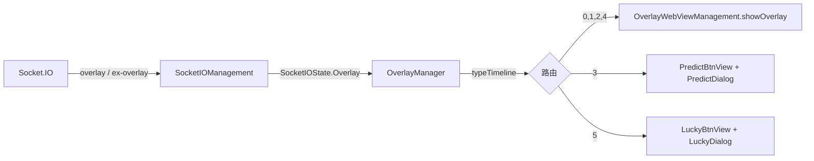
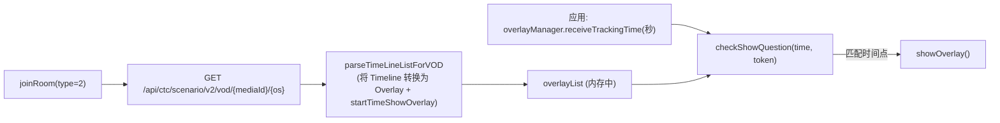
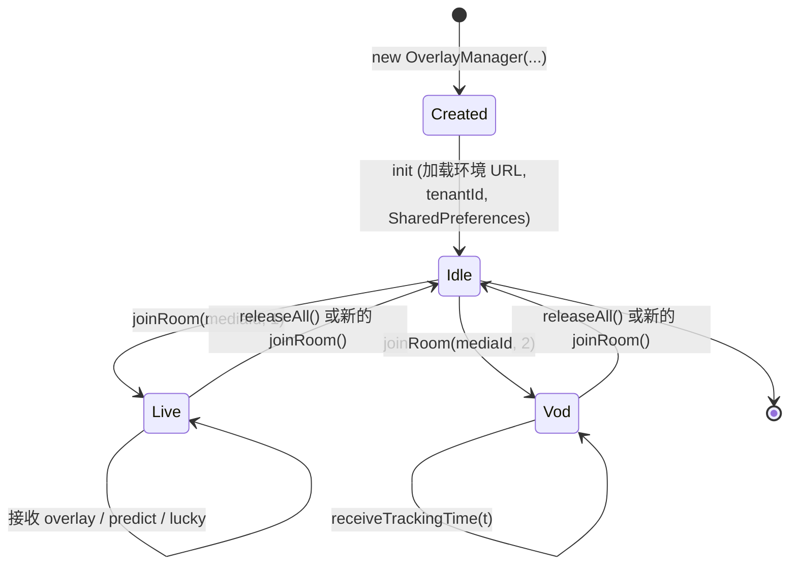
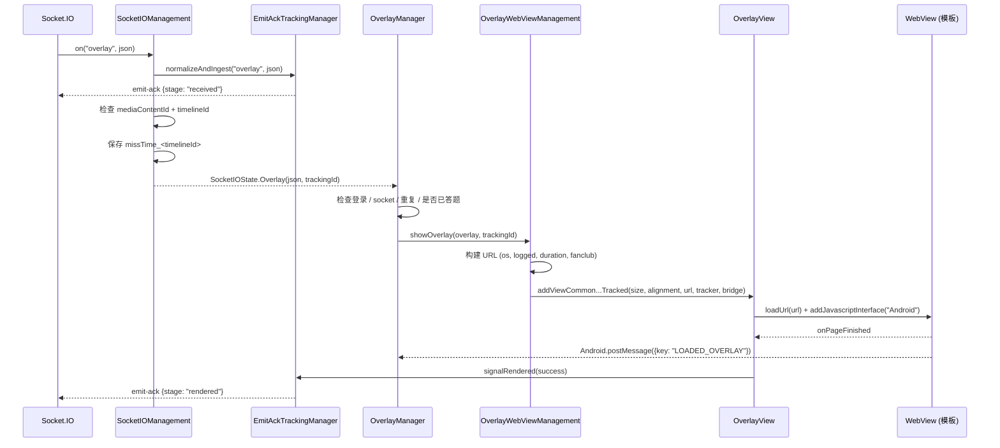
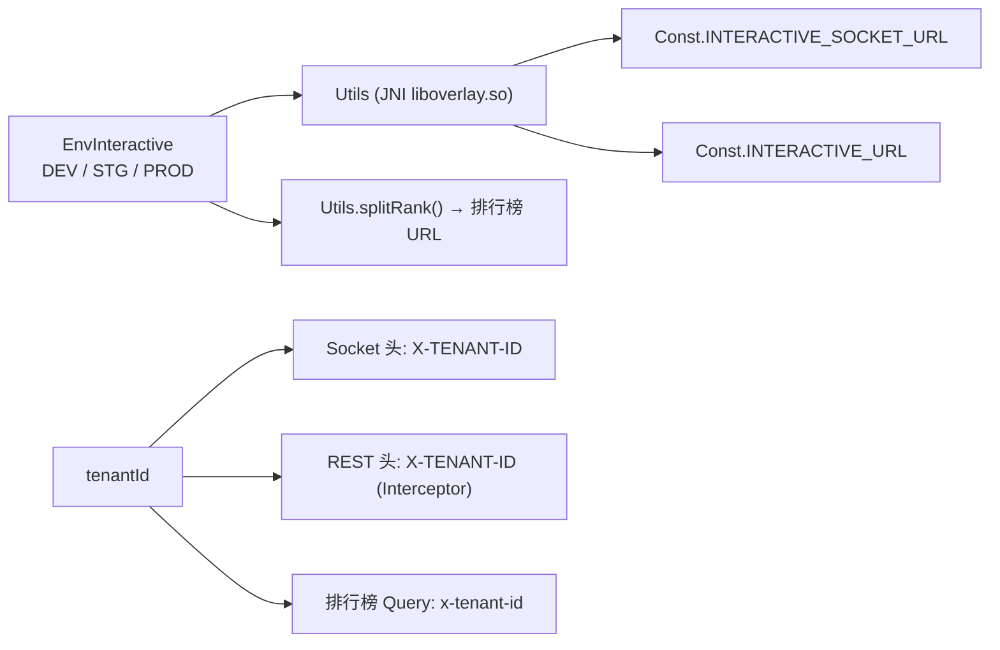

# SDK Interactive Overlay 架构

[← 返回目录](README.md)

---

## 1. 整体视角

SDK 是一个封装了 3 大主要职责的 **Android 库（AAR）**：

1. 通过 Socket.IO 与 Interactive 服务器进行**实时连接**（Live 场景）。
2. 在透明的 `WebView` 中**编排显示**交互内容（以 web 方式编写）。
3. 通过 REST 将用户的操作**转发**给服务器，并将事件回调给应用。

---

## 2. 分层与职责

| 层 | 组件 | 职责 |
|---|---|---|
| **Facade** | `OverlayManager` | 应用的唯一入口。接收命令（`joinRoom`、`initToken`、`releaseAll`…），监听 socket 状态，决定 overlay 类型，处理应答流程 |
| **实时传输** | `SocketIOManagement` | 创建/销毁 socket，注册事件，规范化 payload，通过 LiveData 发出 `SocketIOState` |
| **REST 传输** | `BaseRequest` + 各 `*Request` + `OverlayService` | Retrofit 客户端，附加 `X-TENANT-ID` 头，调用 scenario/action/vip/interactive-status API |
| **展示层** | `OverlayWebViewManagement`、`OverlayView`、`OverlayWebView` | 构建 overlay URL，创建 WebView，根据 `metadata` 绑定位置/尺寸，清理视图 |
| **辅助展示** | `PredictDialog`、`LuckyDialog`、`SuggestDialog`、`DialogChartsInteractive`、`PredictBtnView`、`LuckyBtnView` | 特定 UI 形式（全屏对话框、浮动按钮） |
| **桥接** | `OverlayWebViewCallBack`、`PostMessageListener` | JavaScript ⇄ Kotlin 桥接（`@JavascriptInterface postMessage`） |
| **可观测性** | `tracking/*` | 度量 overlay 生命周期并向服务器发送 `emit-ack` |
| **基础设施** | `Const`、`WSK`、`Utils`、`Ext`、`NPreferenceUtils`、`QueuedMutableLiveData` | 常量、通过 JNI 获取环境 URL、扩展函数、本地存储 |

### 代码中体现的设计原则

- **单一 facade，不泄漏内部实现**：应用只接触 `OverlayManager`、`OverlayView`、`OverlayData`、
  `EnvInteractive`、`OverlayEventListener`。所有 tracking 相关类都是 `internal`。
- **状态驱动**：socket 不直接调用 UI，而是通过 `QueuedMutableLiveData` 发出 `SocketIOState`
  （sealed class）；`OverlayManager` 按 Activity 生命周期进行观察。
- **交互内容即 web**：SDK 本身不绘制题目界面，只加载模板 URL，并通过 `postMessage` 进行交互。
  因此更改交互界面不需要重新构建应用。
- **环境 URL 隐藏在 native 层**：`Utils` 通过 `System.loadLibrary("overlay")` 调用
  JNI 函数 `socketDEV/STG/PRD`、`interactiveDEV/STG/PRD` —— URL 不会以字符串形式出现在 Kotlin/DEX 中。

---

## 3. 简化类图

---

## 4. 两种运行模式

### 4.1. LIVE（`type = 1`）—— 由服务器驱动

服务器主动实时推送 overlay。显示条件（剩余时长、是否已答题、是否在 fanclub 中……）会在客户端立即检查。

### 4.2. VOD（`type = 2`）—— 由播放进度驱动

没有 socket。SDK 预先加载整个脚本，之后**应用必须每秒向 SDK 注入播放时间**：

> `startTimeShowOverlay` 由 `Timeline.time`（格式为 `"mm:ss"`，函数 `String.toSecond()`）推导而来，
> 因此注入 `receiveTrackingTime` 的单位是**秒**。

---

## 5. 线程模型

| 事项 | 线程 | 备注 |
|---|---|---|
| Socket.IO 事件 | Socket 客户端的线程 | 推入 `QueuedMutableLiveData.postValue` |
| 观察 `SocketIOState` | **主线程** | 通过 `LiveData.observe(LifecycleOwner)` |
| 构建/销毁 WebView | **主线程** | `showOverlayForVod` 包裹在 `GlobalScope.launch(Dispatchers.Main)` 中 |
| 解析 VOD 脚本 | `Dispatchers.IO` | `parseTimeLineListForVOD` 内的 `GlobalScope.launch(Dispatchers.IO)` |
| 调用 REST | OkHttp 的线程，回调到主线程 | 使用 `Call.enqueue` |
| Emit-ack 跟踪 | `EmitAckTrackingManager` 上的 `@Synchronized` | 渲染计时器运行在 `Handler(Looper.getMainLooper())` 上 |
| 清理 tracking session | 守护线程 `EmitAckTrackingCleanup` | `ScheduledExecutorService`，周期 5 分钟 |

值得注意的是 `QueuedMutableLiveData`：它会**排队**保存状态，而不是让 `postValue` 相互覆盖 ——
因为两个 overlay 事件可能几乎同时到达，且都不能丢失。

---

## 6. 对象生命周期

代码中的重点：

- **构造函数不会打开连接。** `init {}` 只根据环境加载 URL，为 Retrofit 设置 `tenantId`，
  为 `OverlayView` 绑定监听器，初始化 `NPreferenceUtils`。
- **`joinRoom()` 总是先调用 `cleanUp()`** → 关闭旧的 socket，移除 WebView，取消未完成的 tracking。
  因此连续调用 `joinRoom` 是安全的。
- **每个 Live 会话都会创建新的 `SocketIOManagement`**，不会重用。
- **在观看 Live 时调用 `initToken()` 会自动重新 `joinRoom()`**，以便 socket 携带新的 token。

---

## 7. 一次 overlay 的数据流（Live）

各分支的详细信息（包括被阻塞的点）请参见 [03 — 运行流程](03-luong-hoat-dong.md)。

---

## 8. WebView 桥接协议

SDK 附加了名为 **`Android`** 的 JS interface（`Const.JS_INTERFACE_NAME`）。

**Web → SDK**（`Android.postMessage(jsonString)`）：

| 字段 | 值 | 含义 |
|---|---|---|
| `key` | `LOADED_OVERLAY` | 模板已就绪 → SDK 推送数据，同时标记 `rendered` |
| `type` | `INTERACTIVE_SHOW_ANALYTICS` | Overlay 已显示（记录行为日志） |
| `type` | `INTERACTIVE_HIDE_ANALYTICS` | Overlay 关闭 → SDK 移除 WebView，重新开启 predict/lucky |
| `type` | `INTERACTIVE_ACTION_REPORT` | 用户答题 / 点击广告 |
| `type` | `INTERACTIVE_OPEN_ANALYTICS` | 打开 predict/lucky 对话框 |
| `type` | `INTERACTIVE_CLOSE_ANALYTICS` | 关闭 predict/lucky 对话框 |

**SDK → Web**（通过 `evaluateJavascript` 的 `window.postMessage(...)`）：

| `key` | 何时 | 函数 |
|---|---|---|
| `GET_DATA_INTERACTIVE` | `LOADED_OVERLAY` 之后 | `OverlayWebView.loadData()` / `*Dialog.loadData()` |
| `UPDATE_DATA_INTERACTIVE` | Socket `update-result` | `OverlayWebView.updateResult()` |
| `UPDATE_CONFIRM` | 答题成功（小游戏/predict） | `updateConfirm()` |
| `UPDATE_COUTER` | Socket `predict-result` | `PredictDialog.updateResult()` |
| `UPDATE_NUMBER_LUCKY` | API 返回 lucky 结果 | `LuckyDialog.updateResult(data)` |

---

## 9. 环境与租户配置

- `EnvInteractive.DEV | STG | PROD` 决定 socket URL 和 REST URL。
- `tenantId` 用于区分产品（例如 `vtvlive`、`VTVprime`、`onlive`……）。特别是 `vtvlive` 租户
  有特殊规则：**未登录用户会跳过没有 `allowAnonymous` 的 overlay**。
- `BuildConfig.DEVICE_TYPE`（`androidmobile` / `androidtv`）会进入 `os` 头、模板 URL 的
  `os=` query 参数以及 `targets` 过滤条件。

---

## 10. 本地存储

SharedPreferences 分布在两个不同的文件中（当前代码的有意设计）：

| Key | 文件 | 用途 |
|---|---|---|
| `missTime_<timelineId>` | `interactive_vlive` | 接收 overlay 的时间点，用于在延迟显示时计算剩余 `duration` |
| `ex_<userId 或 deviceId>` | `INTERACTIVE` | 记录已回答的小游戏 `timelineId`，避免再次显示 |
| `timelineId`、`currentTime` | `interactive_vlive` | 最近一次被接受的 overlay 的痕迹 |

---

[← 返回目录](README.md) · [下一篇：安装与集成 →](02-cai-dat-va-tich-hop.md)
