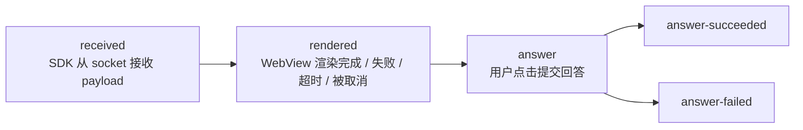
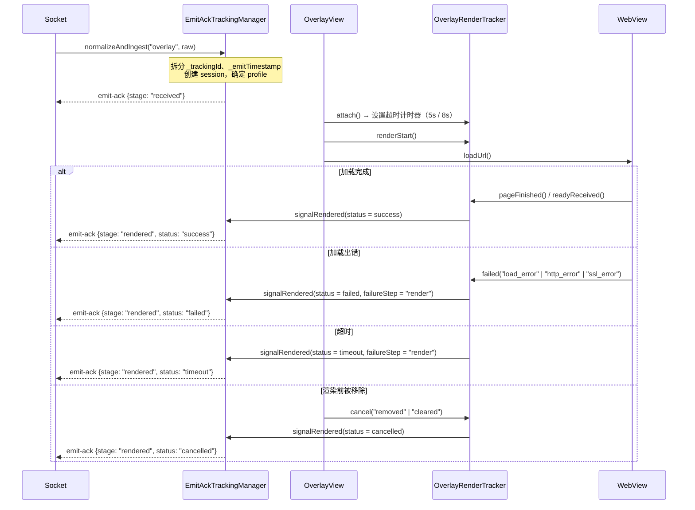
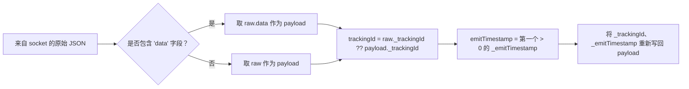

# 05 — Tracking emit-ack（覆盖层生命周期度量）

[← 返回目录](README.md)

该机制回答运营方的问题：*"Overlay 服务器推送的内容是否真的到达了用户设备，
是否成功渲染，用户是否作出了回答？"* —— 由客户端自行度量，通过
socket 事件 `emit-ack` 回传给服务器。

> 通过 [interactive/build.gradle](../interactive/build.gradle) 中的构建开关
> `FEATURE_TRACKING_ACK_OVERLAY` 开启/关闭（当前为 `true`）。
> 整个 tracking 层都是 `internal` 的 —— app 不会直接与其交互。

---

## 1. 各阶段（stage）



| Stage | 含义 | 是否结束会话？ |
|---|---|---|
| `received` | 合法 payload 已进入 SDK | 否 |
| `rendered` | 确定展示结果，并附带 `status` | 是，如果 `status != success` |
| `answer` | 开始提交回答 | 否 |
| `answer-succeeded` | API 返回 `success = true` | 是 |
| `answer-failed` | API 出错 / 被拒绝 / 网络错误 | 是 |

`rendered` 的 `status`：`success` | `failed` | `timeout` | `cancelled`。

每个 `trackingId` 对应的每个 stage 只会被发送**一次**（`emittedStages` 是一个
`Set`）；如果 `emit` 抛出异常，则该 stage 会从 set 中移除，以便下次触发时重试。

---

## 2. 发送到服务器的 payload 结构

```jsonc
// emit("emit-ack", payload)
{
  "trackingId": "<从 overlay payload 中获取的 _trackingId>",
  "event": "overlay",
  "stage": "received | rendered | answer | answer-succeeded | answer-failed",
  "deviceId": "<android-id>",
  "clientContext": { /* 见下方 */ }
}
```

### `clientContext` —— 公共部分

| 字段 | 来源 |
|---|---|
| `profile` | `overlay.legacyIframe` 或 `overlay.wsInteractive` |
| `transportMode` | `legacyIframe` / `wsInteractive` |
| `overlayType` | `metadata.type` → `typeTimeline` → `type` |
| `duration` | overlay 的 `duration`（秒） |
| `sdkVersion` | `versionName.versionCode`（例如 `1.2.18`） |
| `platform` | 若 `DEVICE_TYPE` 包含 "tv" 则为 `tv`，否则为 `android` |
| `os` | `"Android <release>"` |
| `deviceClass` | `tv` / `tablet` / `mobile_large` / `mobile` / `mobile_small` |
| `viewportWidth`、`viewportHeight` | `displayMetrics` |

### 按各 stage 划分

| Stage | 附加字段 |
|---|---|
| `received` | `emitTimestamp`、`receiveTimestamp`、`receiveLatencyMs`、`ackLatencyMs`、`timeline{received, ackSent}` |
| `rendered` | `status`、`receiveLatencyMs`、`renderLatencyMs`、`ackLatencyMs`、`timeline{attached, renderStart, loadComplete, readyReceived, ackSent}`、`failureReason?`、`failureStep?`、`custom.cancelReason?` |
| `answer*` | `actionType`（`answer_submit`）、`actionResult`（`attempted`/`success`/`failure`）、`actionLatencyMs`、`occurrenceId`（= `timelineId`）、`failureReason?`、`failureStep?`、`custom{timelineId, typeTimeline, mediaId, apiMessage?, apiDescription?, error?}` |

---

## 3. 两种档案（profile）与超时阈值

`EmitAckTrackingManager.resolveProfile()` 会检查 overlay 的 `src` URL：

| 条件 | Profile | 渲染超时 | `rendered` 确定时机 |
|---|---|---|---|
| `src` 包含 `?ws=1` 或 `&ws=1` | `overlay.wsInteractive` | **8000 ms** | 仅当 web 发送 `LOADED_OVERLAY`（`readyReceived`）时 |
| 其余情况 | `overlay.legacyIframe` | **5000 ms** | `onPageFinished` **或** `LOADED_OVERLAY`，以先到者为准 |

也就是说，新版模板（`ws=1`）必须主动上报就绪，而旧版模板只需页面加载完成即可。

---

## 4. 单个 overlay 的度量流程



`OverlayRenderTracker` 运行在 `Handler(Looper.getMainLooper())` 上，使用
`terminalSent` 标志确保只发出**一个**终止信号，即便超时与 `pageFinished`
几乎同时发生。

---

## 5. 取消原因表（`cancelReason`）

以下是 SDK **有意不展示** overlay 的全部情形列表，在排查
"为什么 overlay 没有显示" 时非常有用：

| `cancelReason` | 触发位置 | 原因 |
|---|---|---|
| `invalid_payload` | Socket / OverlayManager | 缺少 `mediaContentId`/`timelineId`，或 JSON 无法解析为 `Overlay` |
| `short_duration` | Socket（`ex-overlay`） | `duration <= 10` 秒 |
| `login_required` | OverlayManager | 租户为 `vtvlive`，未登录，且 overlay 未设置 `allowAnonymous` |
| `socket_not_connected` | OverlayManager | 处理时 socket 已断开 |
| `missing_timeline_id` | OverlayManager | `timelineId` 为空 |
| `duplicate_overlay` | OverlayManager | 与当前正在展示的 overlay/predict/lucky/headline 的 `timelineId` 重复 |
| `already_answered` | OverlayManager | Pref `ex_<userId\|deviceId>` 已记录该 `timelineId` |
| `target_mismatch` | WebViewManagement | `targets` 不包含 `all` 也不包含当前平台 |
| `invalid_layout` | WebViewManagement / OverlayView | 无法从 `metadata.pos` 推断出 `alignment` |
| `expired_duration` | WebViewManagement | `duration - (now - missTime) <= 0` |
| `superseded_cache` | WebViewManagement | 解锁时缓存中的旧 overlay 被新 overlay 替换 |
| `removed`、`cleared` | OverlayView | WebView 被移除 / 整体清空 |
| `socket_disconnected`、`sdk_disconnect`、`leave_room`、`clear_all`、`destroy` | Socket / Manager | 会话结束 |

---

## 6. Tracking 会话的内存管理

| 参数 | 值 |
|---|---|
| 最大会话数 | **256**（超出则淘汰最旧会话 —— `LinkedHashMap` 按最近访问顺序） |
| 每个会话的 TTL | **30 分钟** |
| 后台清理周期 | **5 分钟**（守护线程 `EmitAckTrackingCleanup`） |

以下情况会立即删除会话：`rendered` 且 status 非 `success`、`answer-succeeded`、
`answer-failed`，或离开房间 / 断开 socket 时调用 `finish()`/`cancelAll()`。

---

## 7. Payload 规范化（`TrackingPayloadNormalizer`）



经过这一步之后，SDK 的其余部分始终处理"已解包"的 payload，同时保留了
tracking 所需的元数据。

---

## 8. 对接入 app 的影响

- Tracking **不会**增加权限，也不会调用独立的 API —— 使用的是当前已打开的 socket。
- 在 **VOD 模式下没有 tracking**（没有可用于 emit 的 socket）。
- 如果 app 想完全关闭：将 `FEATURE_TRACKING_ACK_OVERLAY` 改为 `false` 并重新构建 AAR。

---

[← API 参考](04-api-reference.md) · [返回目录](README.md) · [下一篇：常见问题 →](06-loi-thuong-gap.md)
