# 03 — 详细工作流程

[← 返回目录](README.md)

本文档描述 SDK 的**每一个业务流程**，并附有时序图与分支条件，与当前源代码保持一致。

## 流程列表

1. [初始化 SDK](#1-初始化-sdk)
2. [登录 / 登出](#2-登录--登出)
3. [进入 LIVE 房间](#3-进入-live-房间)
4. [接收并路由 overlay（LIVE）](#4-接收并路由-overlay-live)
5. [在屏幕上渲染 overlay](#5-在屏幕上渲染-overlay)
6. [一个 WebView overlay 的生命周期](#6-一个-webview-overlay-的生命周期)
7. [回答问题（小游戏）](#7-回答问题-小游戏)
8. [预测 — Predict（`typeTimeline = 3`）](#8-预测--predict-typetimeline--3)
9. [幸运转盘 — Lucky（`typeTimeline = 5`）](#9-幸运转盘--lucky-typetimeline--5)
10. [Headline（`typeTimeline = 4`）](#10-headline-typetimeline--4)
11. [撤回 overlay — overlay-recall](#11-撤回-overlay--overlay-recall)
12. [辅助事件：liveviews、fan-club、ckst](#12-辅助事件-liveviews-fan-club-ckst)
13. [VOD 流程](#13-vod-流程)
14. [断线与恢复](#14-断线与恢复)
15. [释放资源](#15-释放资源)

---

## 1. 初始化 SDK

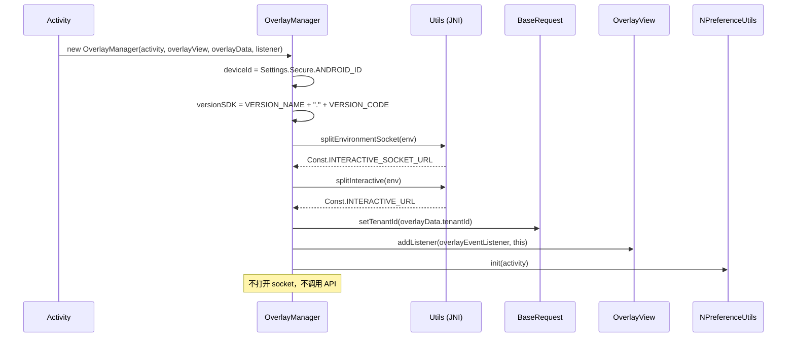

完成此步骤后，SDK 处于 **Idle**（空闲）状态：已知晓环境、租户，并有渲染的容器——但尚未关联任何内容。

---

## 2. 登录 / 登出

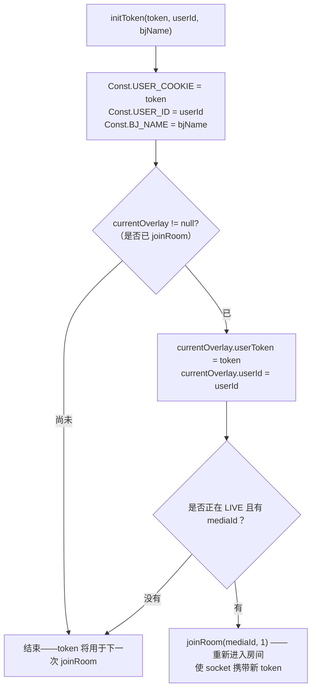

实际含义：

- **在观看 Live 过程中登录** → SDK 会自动重新连接；正在显示的 overlay 会被清理
  （`joinRoom` 内部的 `cleanUp()`）。
- **登出** = `initToken("", "")`；若正在 Live，也会以匿名状态重新进入房间。
- `Authorization` 头：若 token 以 `"ey"` 开头（JWT）→ `"Bearer <token>"`，否则原样发送。

---

## 3. 进入 LIVE 房间

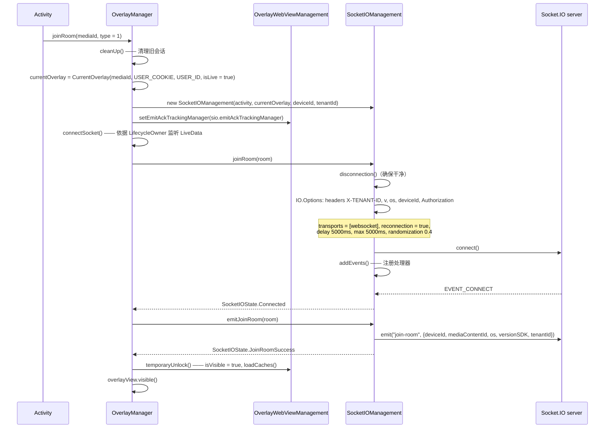

需要记住的要点：

- `emit("join-room")` **只有在 socket 连接成功之后**才会发生，而不是在调用 `joinRoom()` 时立即触发。
- 在 `Connected` 之前，`OverlayWebViewManagement.isVisible = false` → 所有提前到达的 overlay
  都会被**放入缓存**而不是直接显示。
- `overlayView` 只有在 `temporaryUnlock()` 中才会被设为 `visible()`。

---

## 4. 接收并路由 overlay（LIVE）

### 4.1. Socket 前置过滤层

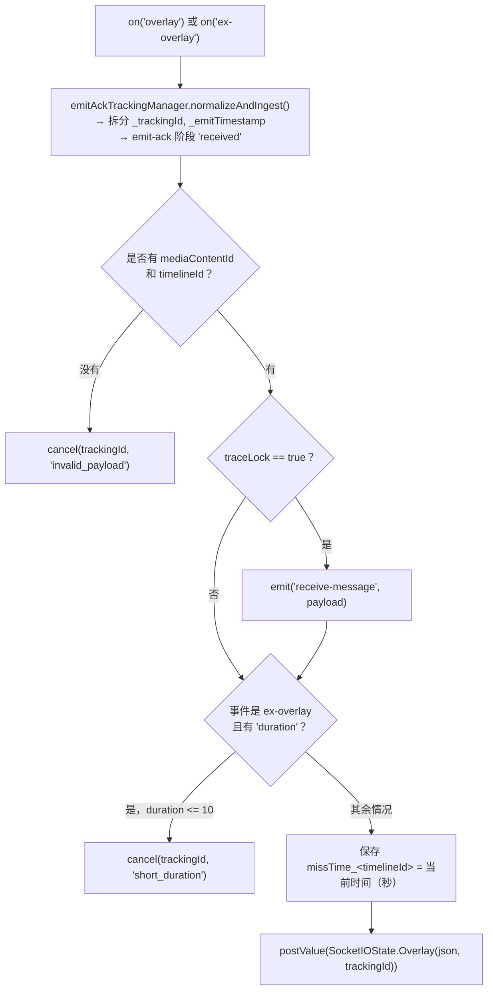

### 4.2. `OverlayManager` 业务检查层

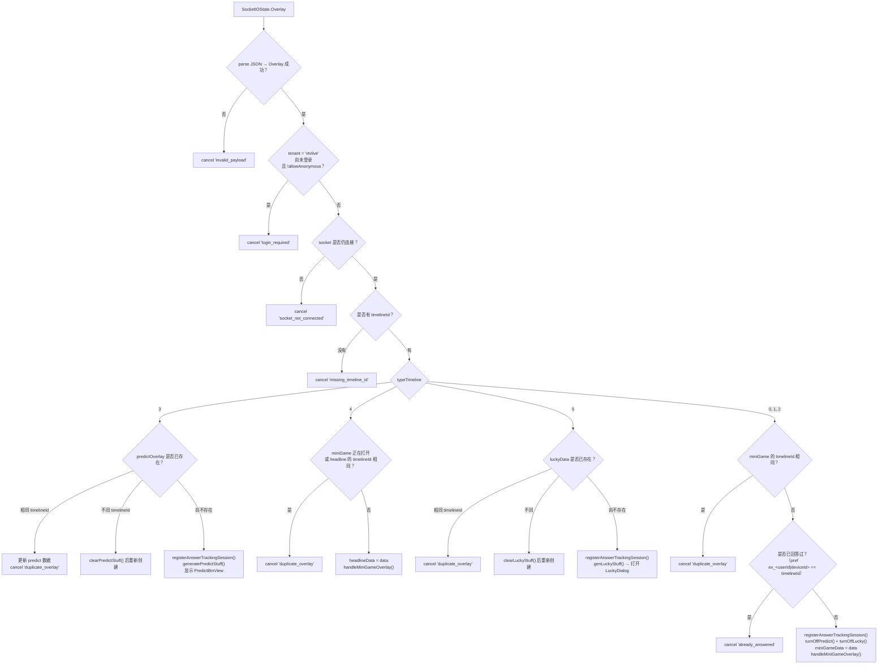

> `ex_...` 键在已登录时使用 `userId`；若尚未登录但 overlay 允许匿名，则使用 `deviceId`。

---

## 5. 在屏幕上渲染 overlay

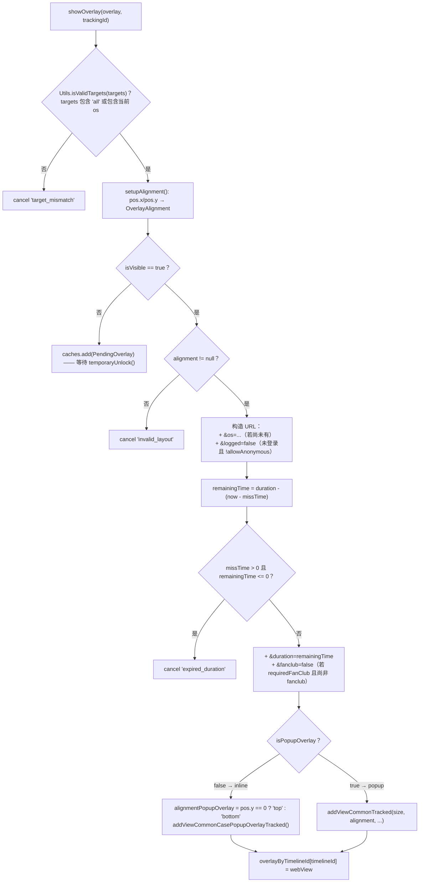

`OverlayView` 中的**几何约束**：

- `addViewCommonTracked`：宽/高按百分比（`constrainPercentWidth/Height`），并根据
  `metadata.pos` 推导出的 9 个锚点位置（`LeftTop` … `RightBottom`）来定位。
- `addViewCommonCasePopupOverlayTracked`：宽度为 `WRAP_CONTENT`，高度按百分比，根据
  `alignmentPopupOverlay` 锚定在上/下/左/右。
- 两者在添加视图之前都会调用 `clearViews()` → **同一时刻只存在一个 overlay WebView**。

---

## 6. 一个 WebView overlay 的生命周期

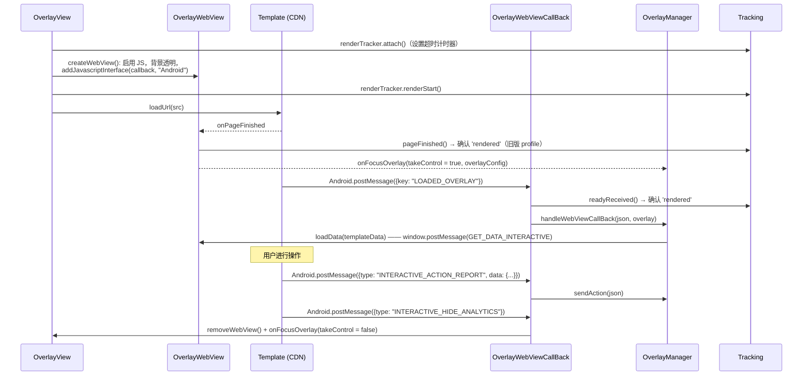

页面加载错误（`onReceivedError`、`onReceivedHttpError`、`onReceivedSslError`）均会：
`renderTracker.failed(...)` → 隐藏 WebView → `onFocusOverlay(webViewError = true)`。

---

## 7. 回答问题（小游戏）

这是最复杂的流程，在调用 API 之前有 4 层检查。

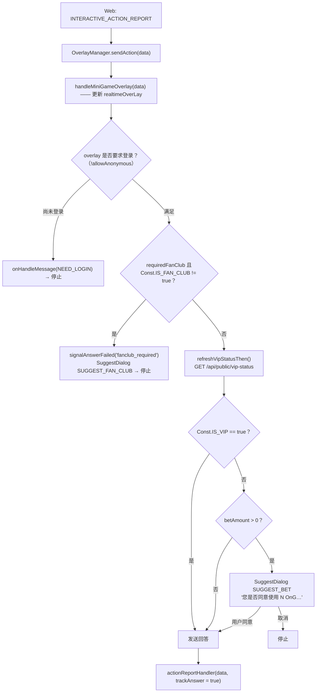

### 7.1. `actionReportHandler` —— 调用 API

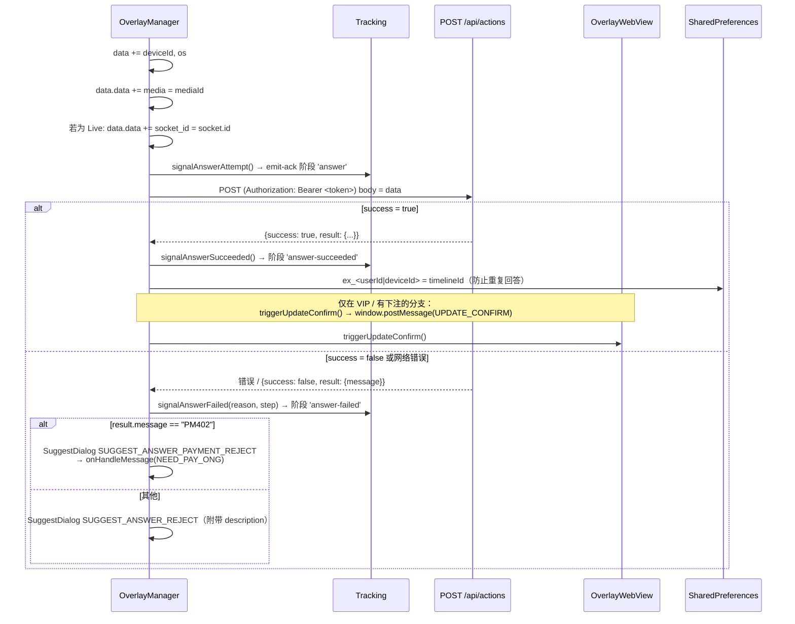

错误码 → tracking 中 `failureReason` 的映射（`AnswerTrackingMapper`）：

| `result.message` | `failureReason` | `failureStep` |
|---|---|---|
| `EX400` | `api_EX400` | `api_response` |
| `TL404` | `api_TL404` | `api_response` |
| `PM402` | `api_PM402` | `api_response` |
| 其他，`success = false` | `api_false` | `api_response` |
| 网络错误 | `network_error` | `network` |
| body 为空 / 无法解析 | `unknown_response` | `unknown_response` |

### 7.2. `sendAction` 中的其他 `type` 类型

| `type` | 行为 |
|---|---|
| `INTERACTIVE_SHOW_ANALYTICS` | `onShowITR(true)` + 通过 `/api/actions` 记录行为 |
| `INTERACTIVE_HIDE_ANALYTICS` | 记录，清除 `overlay`/`miniGameData`，**重新开启** predict 和 lucky |
| `INTERACTIVE_OPEN_ANALYTICS` | `onShowITR(true)` + 记录（predict/lucky） |
| `INTERACTIVE_CLOSE_ANALYTICS` | 记录（predict/lucky） |
| `action = CLICK_ADS` + 带 `url` | 不调用 API，通过 `onClickAdsOverlay(url)` 打开外部浏览器 |

---

## 8. 预测 — Predict（`typeTimeline = 3`）

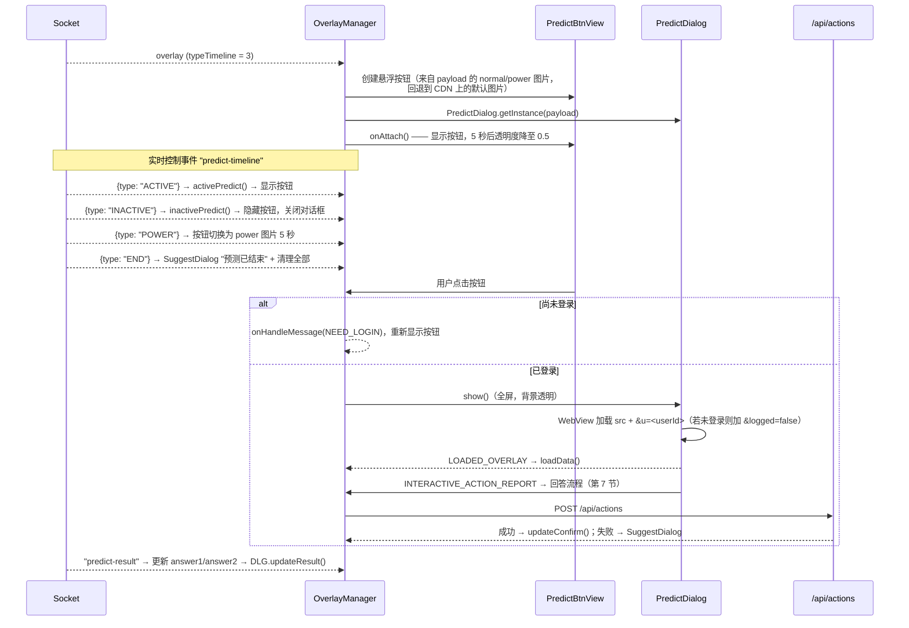

控制按钮显示的状态标志：

| 标志 | 含义 | 由谁改变 |
|---|---|---|
| `isPredictOn` | 是否允许显示（当小游戏占用屏幕时会被关闭） | `turnOnPredict()` / `turnOffPredict()` |
| `isPredictActive` | 服务器是否允许交互 | `ACTIVE` / `INACTIVE` 事件 |
| `isPredictDialogOn` | 对话框是否处于打开状态 | `showPredictDialog()` / `hidePredictDialog()` |

只有当 `isPredictOn && isPredictActive` 时按钮才会显示。

---

## 9. 幸运转盘 — Lucky（`typeTimeline = 5`）

结构与 Predict 相似（`LuckyBtnView` + `LuckyDialog`，socket 事件 `lucky-event`，带
`ACTIVE/INACTIVE/POWER/END`），**有一点关键不同**：

```kotlin
// OverlayManager.genLuckyStuff() — 最后一行
showLuckyDialog()
```

→ Lucky overlay 在收到后会**自动打开对话框**，无需等待用户点击按钮。

API 返回的结果通过 `UPDATE_NUMBER_LUCKY` 推送到 web 端：

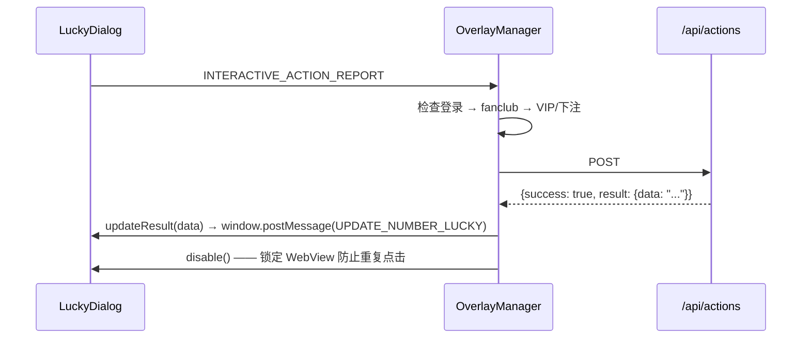

---

## 10. Headline（`typeTimeline = 4`）

- 与小游戏共用渲染路径（`handleMiniGameOverlay`）。
- 若**当前有小游戏正在打开**（`miniGameData != null`）或与当前 headline 的 `timelineId` 相同，
  则会被忽略。
- 只接受两种行为 `type`：`INTERACTIVE_SHOW_ANALYTICS` 和 `INTERACTIVE_HIDE_ANALYTICS`
  （没有回答流程）。

---

## 11. 撤回 overlay — overlay-recall

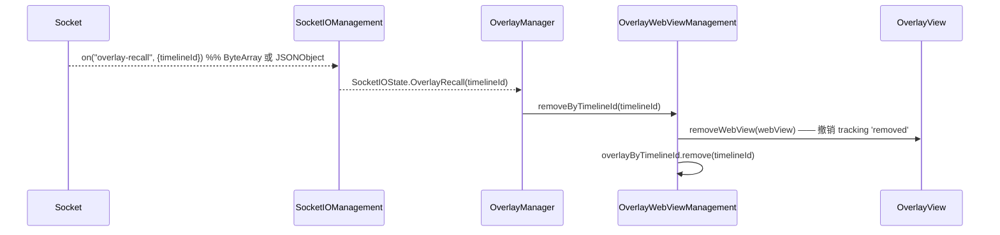

用于编辑人员在全系统范围内下架某个正在播放的 overlay。

---

## 12. 辅助事件：liveviews、fan-club、ckst

| Socket 事件 | 处理方式 |
|---|---|
| `liveviews` | 解析 `OverlayLiveViews.count`，**再加上 230**，调用 `onHandleLiveViews(count)` |
| `data`（fan-club） | 若 `mediaId` 与当前观看的 media 匹配（比较 `_` 前面的部分）→ 更新 `Const.IS_FAN_CLUB`；否则设为 `false` |
| `ckst` | 服务器询问播放器状态 → SDK 重新 emit `ckst`，带 `{action: "CHECK_PLAYER_STATUS", sessionId, data: {deviceId, os, mediaContentId, playerStatus}}` |
| `update-result` | `OverlayWebView.updateResult(data)` → `window.postMessage(UPDATE_DATA_INTERACTIVE)` |
| `predict-result` | 将 `answer1`/`answer2` 更新到 `predictOverlay`，调用 `PredictDialog.updateResult()` |

> `liveViews` 加 230 是当前代码中的既定行为
> ([OverlayManager.kt:435](../interactive/src/main/java/vn/interactive/OverlayManager.kt:435))——
> 若应用需要原始数字，需自行在应用侧减去。

`playerStatus` 只有在应用已调用 `addPlayerListener(...)` 时才不为空。

---

## 13. VOD 流程

```mermaid
sequenceDiagram
    participant APP as Activity
    participant OM as OverlayManager
    participant API as GET /api/ctc/scenario/v2/vod/{mediaId}/{os}
    participant WVM as OverlayWebViewManagement
    participant OV as OverlayView

    APP->>OM: joinRoom(mediaId, type = 2)
    OM->>OM: cleanUp(); isLive = false
    OM->>WVM: isVisible = true
    OM->>API: GetScenarioRequest(token = USER_COOKIE, mediaId, os)
    API-->>OM: ScenarioDTO {data.timelines[]}
    OM->>WVM: parseTimeLineListForVOD(timelines)
    WVM->>WVM: 每个 Timeline.interactive → Overlay：<br/>src + ?timelineId&tenantId&deviceType&os<br/>startTimeShowOverlay = time("mm:ss") → 秒

    loop 每秒（由应用自行驱动）
        APP->>OM: receiveTrackingTime(seconds)
        OM->>WVM: checkShowQuestion(seconds, userToken)
        WVM->>WVM: 查找 startTimeShowOverlay 最小且仍 >= seconds 的 overlay
        alt startTimeShowOverlay == seconds
            WVM->>WVM: 若 !allowAnonymous 且未登录 → 跳过
            WVM->>WVM: 保存 missTime_<timelineId>
            WVM->>OV: 在主线程执行 showOverlay()
            WVM->>WVM: 从列表中删除同一时间点的其他 overlay
        end
    end
```

与 LIVE 的差异：

| | LIVE | VOD |
|---|---|---|
| overlay 来源 | Socket.IO 推送 | REST 预先加载整套剧本 |
| 触发显示 | 实时事件 | 由应用注入的 `receiveTrackingTime(秒)` |
| `socketIOManagement` | 存在 | **为 null**（所有 socket 调用都被安全忽略） |
| action 中的 `socket_id` | 有 | 无 |
| emit-ack 追踪 | 有 | 无（没有 socket 可以 emit） |
| Predict / Lucky / liveviews | 有 | 无 |

---

## 14. 断线与恢复

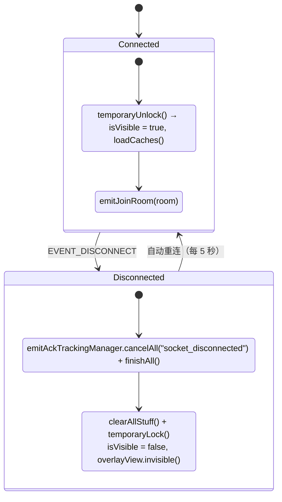

- **overlay 缓存**：当 `isVisible = false` 时，新的 overlay 会进入 `caches`。解锁时，
  `loadCaches()` 只会显示**最后一个元素**，之前的元素会以 `superseded_cache` 的理由被撤销 tracking。
- **`missTime`**：借助已保存的时间点，断线后重新出现的 overlay 会从 `duration` 中扣除已经流逝的
  部分；若已过期则被丢弃（`expired_duration`）。
- `EVENT_CONNECT_ERROR` 事件 → `SocketIOState.Error` → `clearAllStuff()`。

---

## 15. 释放资源

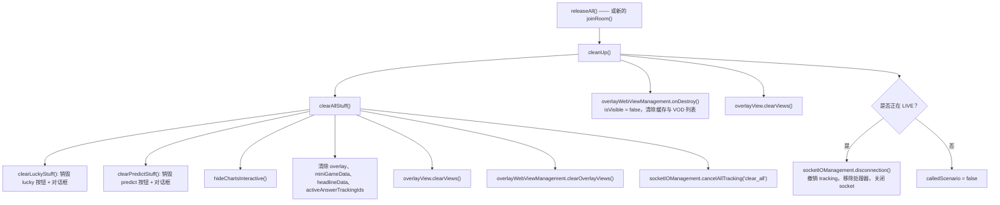

调用 `releaseAll()` 的时机：

- 承载播放器的 Activity 的 `onDestroy()`，
- 用户退出内容时（关闭播放器，返回列表），
- 在切换到另一个 `mediaId` 之前，**若**不立即调用 `joinRoom()`（因为 `joinRoom` 已自动
  清理）。

---

[← 安装与集成](02-cai-dat-va-tich-hop.md) · [返回目录](README.md) · [下一节：API Reference →](04-api-reference.md)
