# 03 — 详细工作流程

[← 返回目录](README.md)

本文档描述 iOS SDK 的**每一个业务流程**，并附有时序图与分支条件，与当前源代码
（`InteractiveControllerView.swift`、`OverlayManagementImpl.swift`、
`PredictManagementImpl.swift`、`SocketIOManagementImpl.swift`）保持一致。

## 流程列表

1. [初始化与配置](#1-初始化与配置)
2. [登录 / 登出](#2-登录--登出)
3. [进入 LIVE 房间](#3-进入-live-房间)
4. [接收并路由 overlay（LIVE）](#4-接收并路由-overlay-live)
5. [渲染小游戏 overlay](#5-渲染小游戏-overlay)
6. [回答小游戏问题（登录 → fanclub → VIP/下注）](#6-回答小游戏问题)
7. [Predict — 竞猜（`typeTimeline = 3`）](#7-predict--竞猜-typetimeline--3)
8. [Lucky — 幸运数字（`typeTimeline = 5`）](#8-lucky--幸运数字-typetimeline--5)
9. [撤回 overlay — overlay-recall](#9-撤回-overlay--overlay-recall)
10. [辅助事件：liveviews、fanclub、ckst、update-result](#10-辅助事件)
11. [VOD 流程](#11-vod-流程)
12. [断线与恢复](#12-断线与恢复)
13. [释放资源](#13-释放资源)

---

## 1. 初始化与配置

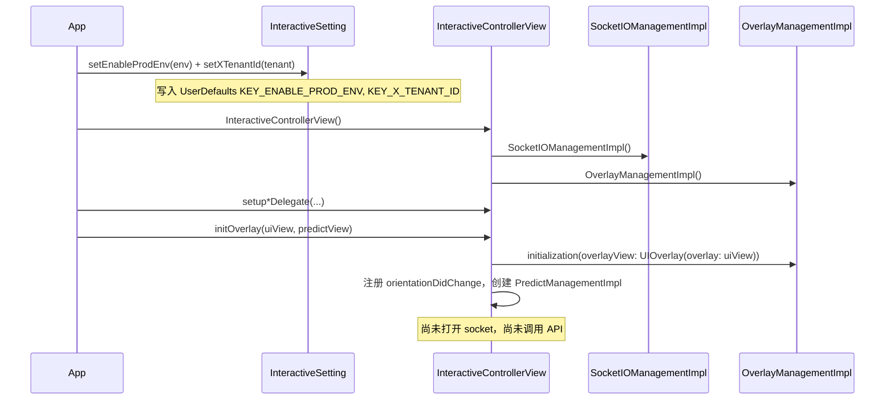

完成此步骤后，SDK **已就绪**：已知晓环境、租户，并有两个 view 用于渲染——但尚未关联任何内容。

---

## 2. 登录 / 登出

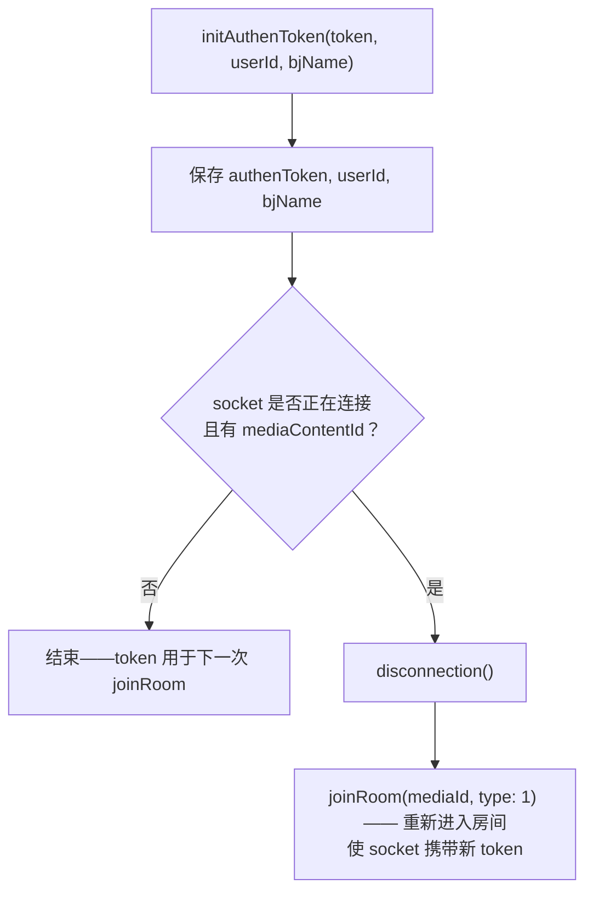

含义：

- **在观看 Live 过程中登录** → SDK 会自动断开并重新进入房间；正在显示的 overlay 会被清理。
- **登出** = `initAuthenToken("", "", "")`。
- Token 会**原样**放入 socket 的 `Authorization` 头；对于 REST，若为 JWT（以 `"ey"` 开头）
  则会加上 `Bearer ` 前缀。

---

## 3. 进入 LIVE 房间

```mermaid
sequenceDiagram
    participant APP as App
    participant ICV as InteractiveControllerView
    participant SIO as SocketIOManagementImpl
    participant WS as Socket.IO server

    APP->>ICV: joinRoom(mediaId, type: 1)
    ICV->>ICV: 若 media 不同 → leaveRoom() 离开旧房间
    ICV->>SIO: 若正在连接 → disconnection()
    ICV->>ICV: removeAllView(); mediaContentId = mediaId
    ICV->>ICV: handleEventsSocket() —— 在 connect 之前先绑定回调
    ICV->>SIO: connectSocket() → connection(url, authenToken)
    SIO->>SIO: buildSocket() —— 校验 tenantId 与 env（不能为空）
    Note over SIO: headers x-tenant-id, v, os=iphone, deviceId, Authorization<br/>forceWebsockets, reconnectWait 5, randomization 0.4
    SIO->>SIO: addEvents()（注册处理器）
    SIO->>WS: socket.connect()
    WS-->>SIO: clientEvent .connect
    SIO-->>ICV: callback CONNECTED
    ICV->>SIO: joinRoom(JoinRoomData(mediaContentId))
    SIO->>WS: emit("join-room", {deviceId, mediaContentId, os, tenantId, versionSDK})
```

需要记住的要点：

- `emit("join-room")` **只有在 socket 连接成功之后**才会发生（在 `SocketEvents.CONNECTED`
  分支中），而不是在调用 `joinRoom()` 时立即触发。
- `handleEventsSocket()` 在 `connectSocket()` **之前**被调用，以避免错过 `CONNECTED` 事件。
- 若 `KEY_X_TENANT_ID` 为空，`buildSocket()` 将**停止**；若 env 或 tenant 为空，
  `connectSocket()` 将停止。

---

## 4. 接收并路由 overlay（LIVE）

### 4.1. Socket 前置过滤层（`SocketIOManagementImpl`）

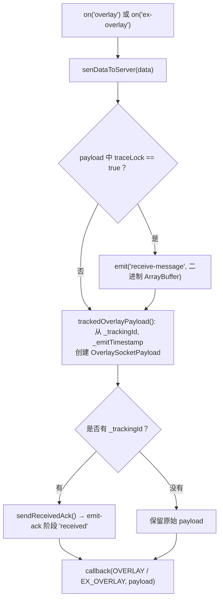

### 4.2. `InteractiveControllerView` 层（`startShowLiveOverlayWithDataReceived`）

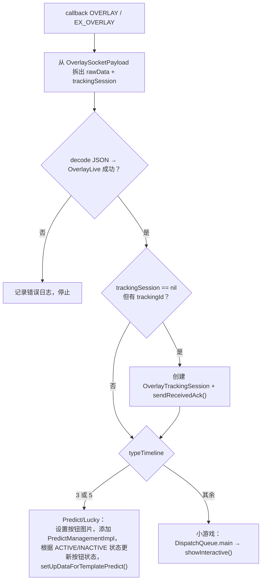

在 `showInteractive()` 内部：

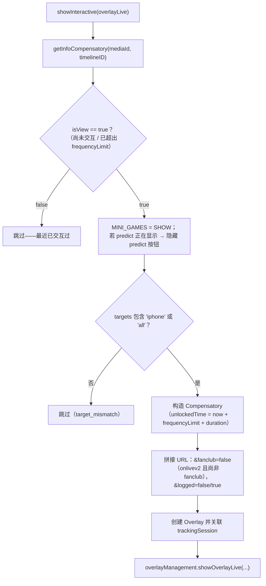

> `getInfoCompensatory` 按 `mediaId` 读取 `UserDefaults(suiteName: INTERACTIVE_<userId|DEFAULT>)`：
> 若该时间点已交互过且仍在 `frequencyLimit` 内，则返回 `false`（不再显示）。

---

## 5. 渲染小游戏 overlay

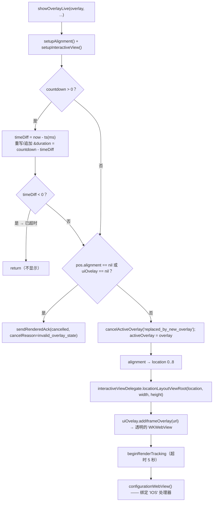

**几何约束**：`location`（0..8）由 `OverlayPosition.pos.x`/`pos.y`（每个轴 0/1/2）推导，
映射到 9 个位置（`LeftTop`…`RightBottom`）。尺寸 `size.w/size.h` 是相对于容器的**比例**。
实际位置的排布由应用在 `locationLayoutViewRoot(location:width:height:)` 中处理；WebView
会被放置在覆盖根容器之上。

**同一时刻只有一个小游戏 overlay**：`showOverlayLive` 在添加新 overlay 之前会先调用
`cancelActiveOverlay` 和 `uiOvelay?.onStop()`。

---

## 6. 回答小游戏问题

当 WebView 发送 `IOS.postMessage({type: INTERACTIVE_ACTION_REPORT, data})` 时触发。
分为 **Live** 分支（`handleWebViewCallBack`）和 **VOD** 分支（`handleWebViewCallBackVod`）。

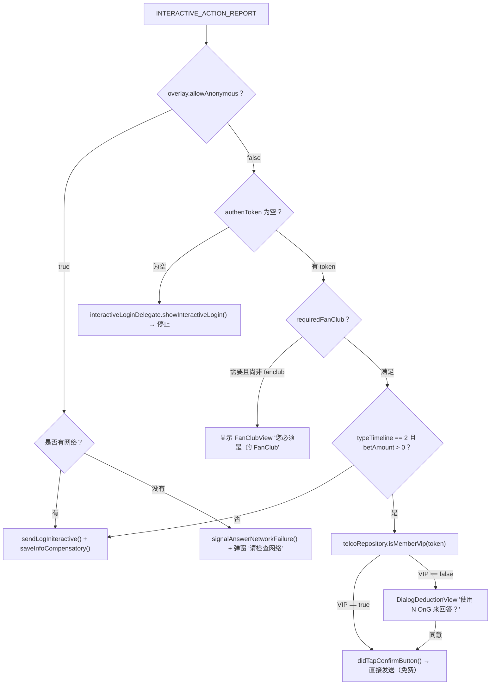

### 6.1. `sendLogIniteractive` —— 调用 API `/api/actions`

```mermaid
sequenceDiagram
    participant OMI as OverlayManagementImpl
    participant TRK as OverlayTrackingSession
    participant API as POST /api/actions
    participant WV as WKWebView

    OMI->>OMI: 若 action == CLICK_ADS → 用 Safari 打开 urlLinkAds，不调用 API
    OMI->>OMI: data += media, socket_id, versionSDK; params += deviceId, type, os=iphone
    OMI->>TRK: sendAnswerAttempt() → emit-ack 阶段 'answer'
    OMI->>API: POST（若 token 以 'ey' 开头则加 Authorization Bearer，X-TENANT-ID）
    alt success == true
        API-->>OMI: {success: true, result}
        OMI->>TRK: sendAnswerSucceeded() → 阶段 'answer-succeeded'
        Note over OMI,WV: isReturnData 分支（下注/VIP）：postMessage UPDATE_CONFIRM
        OMI->>OMI: saveInfoCompensatory()
    else success == false / 错误
        API-->>OMI: {success: false, result{message, description}} 或网络错误
        OMI->>TRK: sendAnswerFailed(reason, step) → 阶段 'answer-failed'
        OMI->>OMI: 根据 result.message 调用 showDialogDedution
    end
```

错误码 → `failureReason` 的映射（`OverlayTrackingFailure.answerFailureReason`）：

| `result.message` | `failureReason` | `failureStep` |
|---|---|---|
| `EX400` | `api_EX400` | `api_response` |
| `TL404` | `api_TL404` | `api_response` |
| `PM402` | `api_PM402` | `api_response` |
| 其他，`success == false` | `api_false` | `api_response` |
| 网络错误 | `network_error` | `network` |
| body 无法解析 | `unknown_response` | `unknown_response` |

提示对话框（`showDialogDedution`）根据 `result.message`：

| `message` | 内容 |
|---|---|
| `PM402` | "请充值 OnG" → 触发 `showSubscibeView` / `NEED_PAY` |
| `EX400` | "您已回答过此问题" |
| `answerSuccess` | "您已成功回答此问题" |
| 其他 | "回答问题失败" |

---

## 7. Predict — 竞猜（`typeTimeline = 3`）

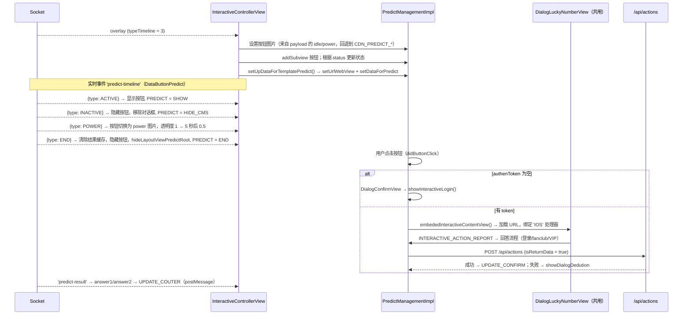

控制按钮状态的标志（保存于 `UserDefaults`，常量 `TypeInteractive`）：

| 键 | 含义 |
|---|---|
| `MINI_GAMES` | 是否有小游戏正在占用屏幕（`SHOW`/`HIDE`） |
| `PREDICT` | predict 按钮的状态（`SHOW`/`HIDE`/`HIDE_CMS`/`END`） |
| `POPUP_PREDICT` | predict 对话框是否打开（`SHOW`/`HIDE`） |
| `INTERACTIVE_TYPE_TIMELINE` | `3` 为 predict，`5` 为 lucky，`0` 表示没有 |

按钮图片：predict 使用**动态 GIF**（`CDN_PREDICT_IDLE/POWER`），lucky 使用**静态 PNG**
（`CDN_LUCKY_IDLE/POWER`）；通过 `.gif` 后缀区分。

> ⚠️ 对于租户 `vtvlive`、`onlivetv`、`VTVprime`，整个 `predict-timeline` / `lucky-event`
> 流程都会**被跳过**（在 `receiveDataActionButtonPredict` 中提前 return）。

---

## 8. Lucky — 幸运数字（`typeTimeline = 5`）

结构与 Predict 相似（共用 `DialogLuckyNumberView`），区别在于：

- URL 会额外拼接 `&u=<userId>`（仅 lucky）。
- 默认图片为 `CDN_LUCKY_IDLE/POWER`（PNG）。
- API 返回的结果通过 **`UPDATE_NUMBER_LUCKY`** 推送到 web 端：

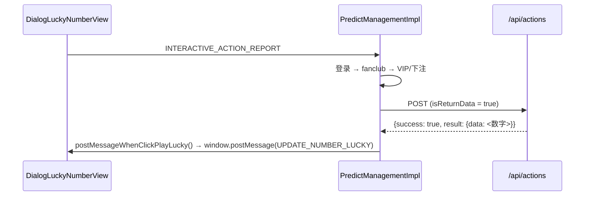

---

## 9. 撤回 overlay — overlay-recall

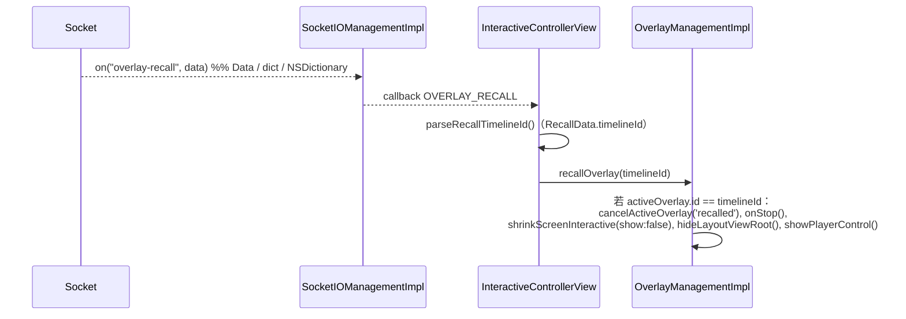

用于编辑人员在全系统范围内下架某个正在播放的 overlay。只有当 `timelineId` 与当前显示的
overlay 匹配时才会被移除。

---

## 10. 辅助事件

| Socket 事件 | 处理方式 |
|---|---|
| `liveviews` | 解析 `LiveViewDto.count`，调用 `showLiveView(liveView: 230 + count)`（**再加上 230**） |
| `data`（fanclub） | 解码 `FanClub`；若 `mediaId` 与当前观看 media 的 `_` 前面部分匹配且 `isFanClub` → 设置 `KEY_FAN_CLUB = true`，否则为 `false` |
| `ckst` | 解码 `CkstResponse`；从 delegate 获取 `getPlayerState()` → 重新 emit `ckst`，带 `CkstData(action: "CHECK_PLAYER_STATUS", sessionId, data: Ckst{deviceId, os, mediaContentId, playerStatus, tenantId})` |
| `update-result` | `sendMessageResultinteractive()` → `window.postMessage(UPDATE_DATA_INTERACTIVE)` |
| `predict-result` | 更新 `answer1`/`answer2`，缓存到 `DATA_RESULT_PREDICT`，推送 `UPDATE_COUTER` |
| `branching` | 解码 `Branching`；根据 `action`（`START/PLAY_MINIGAME/END_VIDEO_BRANCHING`）调用 `BranchingSocketIODelegate`（预加载 / 显示 / 结束分支视频） |

> `liveViews + 230` 是当前代码中的既定行为（`showCCU`）。若需要原始数字，应用需自行减去。
>
> 在向上 emit 的 `ckst` payload 中，`data` 字段被映射为 **JSON key `"os"`**（依据
> `CkstData` 的 `CodingKeys`）——与后端对照时需要留意这一点。

---

## 11. VOD 流程

```mermaid
sequenceDiagram
    participant APP as App
    participant ICV as InteractiveControllerView
    participant API as GET /api/ctc/scenario/v2/vod/{mediaId}/{os}
    participant OMI as OverlayManagementImpl

    APP->>ICV: joinRoom(mediaId, type: 2)
    ICV->>ICV: 若正在连接 → disconnection(); removeAllView()
    ICV->>API: callApiScenarioForVod(header X-TENANT-ID)
    API-->>ICV: VODOverlayData {data.timelines[]}
    ICV->>ICV: convertVodInteractive()：筛选 showStatus == ACTIVE，<br/>按 timeShow（秒）排序

    loop 每秒（由应用自行注入）
        APP->>ICV: getTimeVideo(time: 秒)
        ICV->>ICV: 查找 timeShow == Int(time) 的 timeline
        alt 恰好匹配该秒
            ICV->>ICV: showInteractiveVod()：检查 allowAnonymous/token
            ICV->>ICV: 拼接 URL（timelineId, tenantId, deviceType=IOS）
            ICV->>OMI: showOverlayVod(overlay, token, mediaId)
            ICV->>ICV: 从列表中删除该 timeline（不再显示）
        end
    end
```

与 LIVE 的差异：

| | LIVE | VOD |
|---|---|---|
| overlay 来源 | Socket.IO 推送 | REST 预先加载整套剧本 |
| 触发显示 | 实时事件 | 由应用注入的 `getTimeVideo(秒)` |
| `socketIO` | 已连接 | 已断开（所有 socket 调用都被安全忽略） |
| action 中的 `socket_id` | 有 | 无 |
| emit-ack 追踪 | 有 | **无**（`showOverlayVod` 不调用 `beginRenderTracking`） |
| Predict / Lucky / liveviews / ckst | 有 | 无 |
| 显示条件 | 完整的 login/fanclub/VIP | 只需 `allowAnonymous` 或有 token |

---

## 12. 断线与恢复

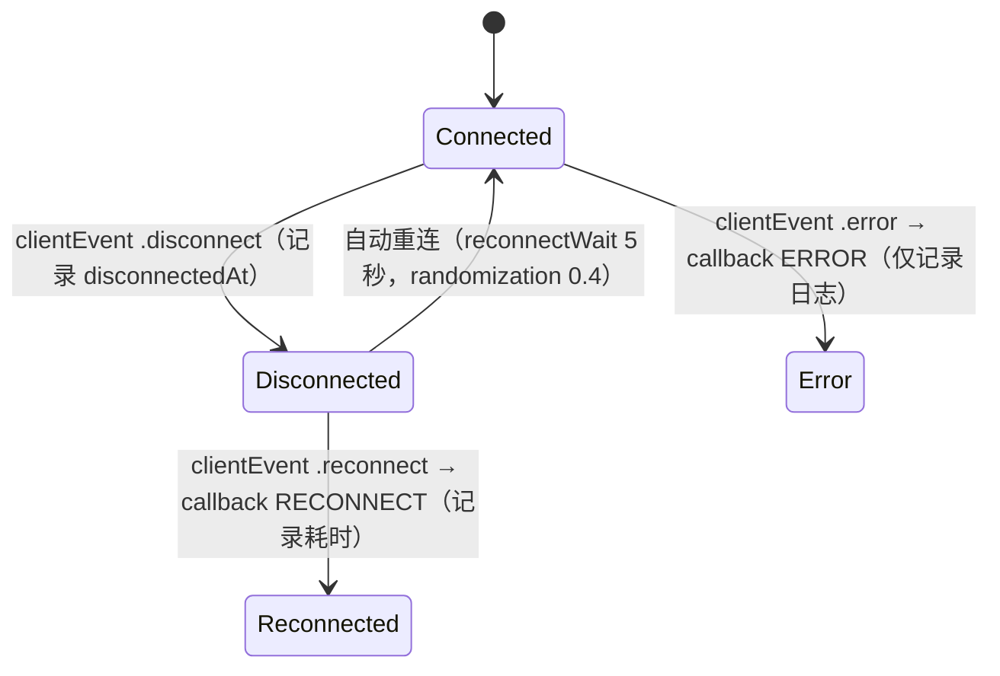

- Socket.IO 客户端会自动重连（`.reconnects(true)`，`reconnectWait 5`）。当再次 `.connect`
  时，`CONNECTED` 回调会执行 → 若存在 `mediaContentId`，将再次 **emit `join-room`**。
- `isConnected()` 在 `status == .connecting` 或 `reconnects == true` 时也会返回 `true`——
  应将其理解为"正在/将要连接"，而不仅仅是"已连接"。
- `disconnection()` 会移除**所有**客户端 + 应用处理器，调用 `disconnect()`，并将
  `socketManager` 置为 `nil`。

---

## 13. 释放资源

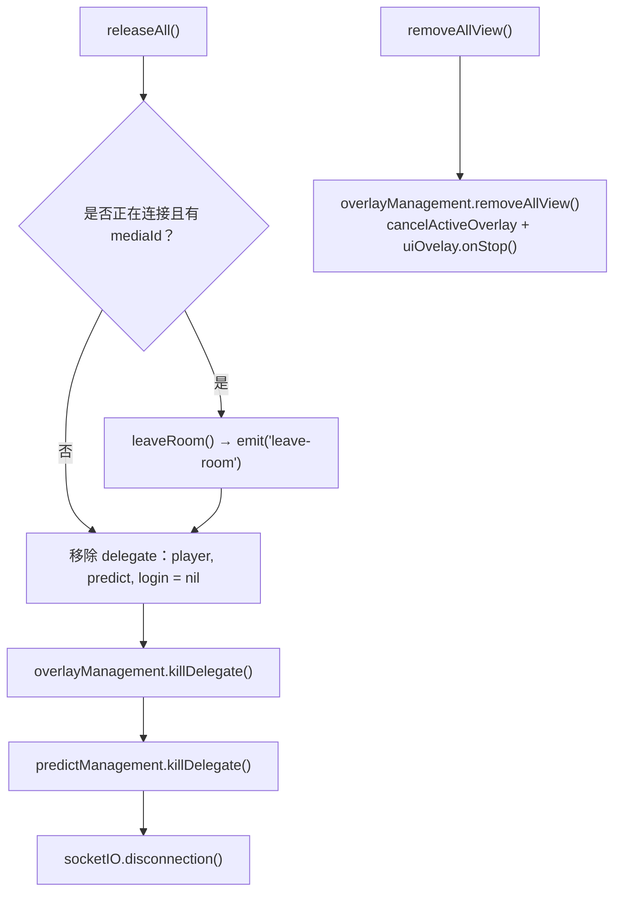

调用 `releaseAll()` 的时机：

- 退出播放器画面（`viewWillDisappear`/`deinit`）时，
- 用户离开内容时，
- 在切换到另一个 `mediaId` 之前，**若**不立即调用 `joinRoom()`（因为 `joinRoom` 已自动
  执行 `removeAllView()` 并处理 socket）。

---

[← 安装与集成](02-cai-dat-va-tich-hop.md) · [返回目录](README.md) · [下一节：API Reference →](04-api-reference.md)
