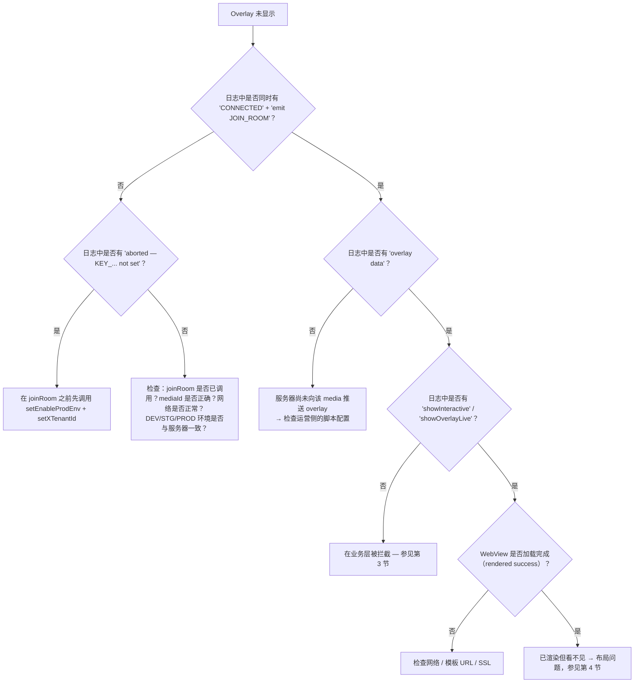

# 06 — 常见错误与诊断方法

[← 返回目录](README.md)

---

## 1. 开启 SDK 日志

SDK 通过 `logLine(...)` 函数记录日志（`Const/PrintLog.swift`）— 始终以
**`Interactive:`** 前缀 `print` 输出。可在 Xcode Console 中查看，或按如下方式过滤：

```bash
# 通过 Console.app / log stream 运行时
log stream --predicate 'eventMessage CONTAINS "Interactive:"'
```

需要注意的日志字符串（前缀 `Interactive:`）：

| 日志 | 含义 |
|---|---|
| `[Socket] connectSocket() — env: ...` | 开始准备建立连接 |
| `[Socket] ❌ connectSocket() aborted — KEY_X_TENANT_ID not set` | 尚未调用 `setXTenantId` |
| `[Socket] ❌ connectSocket() aborted — KEY_ENABLE_PROD_ENV not set` | 尚未调用 `setEnableProdEnv` |
| `[Socket] ✅ CONNECTED — sid: ...` | Socket 已连接 |
| `[Socket] emit JOIN_ROOM — mediaContentId: ...` | 已进入房间 |
| `Interactive-socket overlay data` | 收到服务器推送的 overlay |
| `startShowLiveOverlayWithDataReceived` | 开始处理 overlay |
| `1 showInteractive isView : false` | 因 `Compensatory`（已交互过）而被拦截 |
| `quá giờ trả lời`（这是 SDK 实际打印的越南语日志原文，保持不变；意为“已超过作答时间”） | Overlay 从 `ts` 起算的 `duration` 已过期 |
| `[Socket] 🔌 DISCONNECTED` / `🔄 RECONNECT` | 连接断开 / 恢复 |

---

## 2. Overlay 不显示 — 诊断决策树



---

## 3. 在业务层被拦截

| 现象 | 原因 | 处理方法 |
|---|---|---|
| `showInteractive isView : false` | `Compensatory` — 该时间点已交互过，仍在 `frequencyLimit` 内 | 属于设计上的正常行为。若要重新测试：删除 suite `INTERACTIVE_<userId>` / `INTERACTIVE_DEFAULT` |
| `quá giờ trả lời` | Overlay 从 `ts` 起算的 `duration` 已过期 | 属于设计上的正常行为 |
| Overlay 不显示，`targets` 不匹配 | `targets` 既不包含 `iphone` 也不包含 `all` | 修改脚本配置，使 `targets` 包含 `iphone`/`all` |
| OnPlus/OnLiveTV/SeeNow 的 predict/lucky 按钮不显示 | 对于租户 `vtvlive`/`onlivetv`/`VTVprime`，`receiveDataActionButtonPredict` 会提前 return | 属于当前设计上的正常行为；如需开启，需修改 SDK 中的租户判断条件 |
| 用户点击作答但没有任何反应 | `!allowAnonymous` 且尚未登录 | 确保实现 `InteractiveLoginDelegate.showInteractiveLogin()`，并在登录后调用 `initAuthenToken` |
| 弹出「您必须是……的 FanClub 成员」对话框 | `requiredFanClub` 且 `KEY_FAN_CLUB == false` | 属于设计上的正常行为；需要加入 fanclub（等待 socket `data` 事件更新） |
| 弹出「使用 N 个 OnG 来作答？」对话框 | `typeTimeline == 2`、`betAmount > 0`、非 VIP | 属于设计上的正常行为（telco VIP 流程） |

---

## 4. Overlay 已渲染但看不见 / 位置错误

| 原因 | 现象 | 处理方法 |
|---|---|---|
| `uiView`（overlay 容器）尺寸为 0 | 渲染日志正常，屏幕空白 | 在 `initOverlay` 之前，先将 `uiView` 的约束设置为准确覆盖视频画面 |
| `uiView` 被播放器覆盖绘制 | Overlay 会“闪一下”然后消失 | 将 `uiView` 添加在播放器**之后**（subview 顺序），或提高 `zPosition` |
| `predictView` 位置错误 | Predict/lucky 按钮位置偏移 | 在 `showLayoutViewPredictRoot()` 中更新 `predictView` 的 frame（参见 demo 中的 `updateLayoutPredict`） |
| 画面切换时未调用 `resizeVideoView` | Overlay 不能随播放器全屏而伸缩 | 视频画面变化时调用 `interactive.resizeVideoView(width:height:)` |
| 未处理 `locationLayoutViewRoot` | Overlay 始终停留在同一位置 | 实现 `InteractiveViewDelegate.locationLayoutViewRoot(location:width:height:)`，根据 `location`（0..8）进行定位 |

Overlay 的 WebView 是**透明**的 `WKWebView`（`isOpaque = false`，背景 `.clear`，不可滚动）。若
发现有黑色/白色背景遮挡视频，请检查 Web 模板的背景是否为透明。

---

## 5. Socket 无法连接

检查清单：

1. **尚未配置**：日志出现 `aborted — KEY_X_TENANT_ID not set` / `KEY_ENABLE_PROD_ENV not set`。
   → 在启动时调用 `InteractiveSetting().setXTenantId(...)` 和 `setEnableProdEnv(...)`。
2. **环境错误**：`Enviroment` 必须与服务器系统环境一致（DEV/STG/PROD）— URL 由 env 推导而来。
3. **租户错误**：服务器可能会拒绝进入房间。
4. **Token**：socket 的 `Authorization` 头会**原样**发送（不会自动添加 `Bearer`）。如果后端
   要求 socket 携带 `Bearer`，则需要将已带前缀的字符串传给 `initAuthenToken`。
5. **`isConnected()` 返回 `true` 但实际仍在连接中**：即使处于
   `.connecting`/重连状态，该函数也会返回 `true` — 不要完全依赖它来判断是否已在线。

---

## 6. 集成后的崩溃问题

| 错误 | 原因 | 处理方法 |
|---|---|---|
| 一 joinRoom / 调用 API 就崩溃，报 `Unexpectedly found nil` | 尚未配置时强制解包 `UserDefaults.string(forKey: KEY_X_TENANT_ID)!` / `KEY_ENABLE_PROD_ENV!` | **务必**先调用 `setEnableProdEnv` + `setXTenantId`（这正是 commit `[fixbug] crash` 所修复的原因） |
| 链接时缺少符号（Alamofire / SocketIO / SwiftyJSON） | 静态 XCFramework 不携带依赖 | 在 App target 中重新声明相应 pod |
| 缺少 RxSwift/RxCocoa 符号 | 未嵌入相应的 Rx `*.xcframework` | 嵌入 `RxSwift/RxCocoa/RxRelay.xcframework`（Embed & Sign） |
| WebView 收不到回调 | 模板调用的 interface 名称错误 | Interface 必须是 **`IOS`**（`window.webkit.messageHandlers.IOS.postMessage(...)`） |

---

## 7. VOD：Overlay 未在正确的时间点出现

| 原因 | 处理方法 |
|---|---|
| App 未调用 `getTimeVideo()` | 在 `joinRoom(type: 2)` 之后添加 1 秒的循环调用 / observer |
| 时间单位传错（用了毫秒而非秒） | `getTimeVideo` 接收的是**秒**（与 `timeShow` 对应） |
| 用户快进跳过了时间点 | SDK 按**精确秒数**匹配（`timeShow == Int(time)`）；该时间点会被跳过 — 这是当前的限制 |
| 未登录，且 overlay 不 `allowAnonymous` | `showInteractiveVod` 会跳过；登录后重新 `joinRoom` |
| 脚本配置返回为空 | 检查 `callApiScenarioForVod`（env、`X-TENANT-ID`、`mediaId`）；`convertVodInteractive` 只取 `showStatus == "ACTIVE"` 的数据 |

---

## 8. 维护时需要了解的技术注意事项

以下是当前代码中容易造成混淆的地方，特此记录：

- **`liveViews + 230`**：`showCCU` 在调用 `showLiveView` 之前会给观看人数硬性加上 230。若
  需要原始数字，App 需自行减去。
- **`CkstData.data` 映射 JSON key `"os"`**：emit 上报的 `ckst` payload 中有一个名为 `os` 的嵌套字段（而不是
  `data`）。若发现数值对不上，请与后端核对。
- **`UPDATE_COUTER`**（少了一个字母 N）和 **`PredictResult.timlineId`**（少了一个字母 e）是代码中的**原文写法**
  ——Web 模板必须与这个拼写完全一致。
- **`DialogLuckyNumberView` 在运行时同时用于 predict 和 lucky**；`DialogPredictView` 几乎
  不再被使用。
- **`LiveCompensatoryShotImpl.loadScenarioLive`** 会在 Alamofire 请求完成**之前**就同步返回结果
  → 几乎总是返回 `nil`。只有 `fetchOverlayStatus`（用于 `fetchInteractiveStatus`）能正常
  工作。如果要复用这个函数需要格外小心。
- **租户 header 大小写不一致**：socket 使用 `x-tenant-id`（小写），REST 使用 `X-TENANT-ID`（大写）。
- **Sentry 已被禁用**：`SentryInteractor` 和 `InteractiveSetting.startSentry` 均已被注释掉。
- **`addCallback` 只有一个槽位**：后调用会覆盖前一个 callback — 不支持挂载多个 listener。

---

## 9. 常见问题

**SDK 会自动绑定 `UIViewController` 的生命周期吗？**
不会。App 必须在离开该屏幕时自行调用 `releaseAll()`。SDK 只会自动监听 `orientationDidChange`
以重新定位 predict 按钮。

**能否同时显示多个 minigame overlay？**
不能。`showOverlayLive` 在添加之前会调用 `cancelActiveOverlay` + `onStop()` → 始终只有一个 minigame
overlay。Predict/lucky 按钮是独立的 view，因此可以并存（当 minigame 占据屏幕时 SDK 会自动隐藏
这些按钮）。

**中途切换账号会怎样？**
调用 `initAuthenToken(新token, 新userId, "")`。如果正在直播中，SDK 会自动用新 token 重新进入房间。

**每次 `joinRoom()` 前都需要调用 `releaseAll()` 吗？**
不需要 — `joinRoom()` 内部已自动调用 `removeAllView()` 并处理 socket。只有在真正退出时才需要调用
`releaseAll()`。

**旋转屏幕会丢失 overlay 吗？**
由服务器控制的 minigame overlay，如果仍在有效期内会被重新推送；predict 按钮会通过
`orientationDidChange` 重新定位。由 App 控制的布局则通过 `InteractiveViewDelegate` 处理。

**SDK 使用的是哪种 WebView？**
`WKWebView`（部分对话框使用 `NoZoomWKWebView` 来阻止双指缩放）。启用 JavaScript，背景透明，
禁止滚动。

---

[← Tracking emit-ack（追踪 emit-ack）](05-tracking-emit-ack.md) · [返回目录](README.md)
