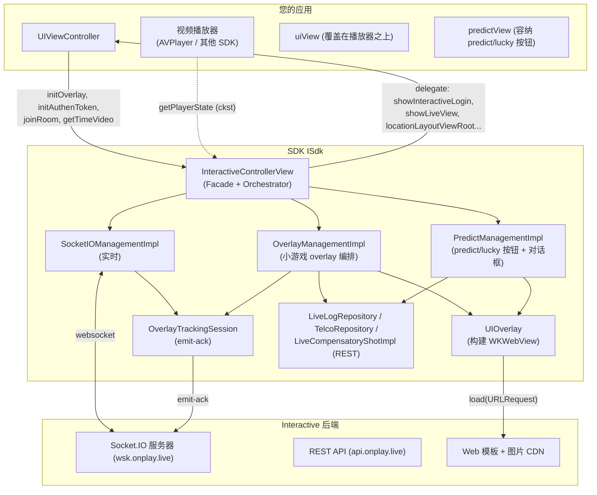
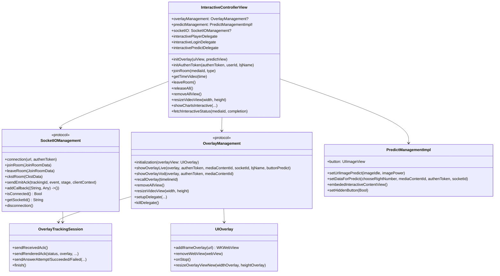
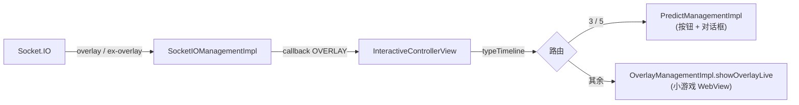
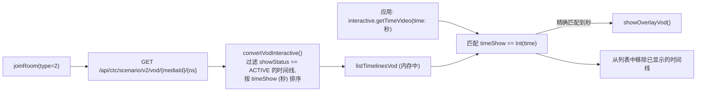
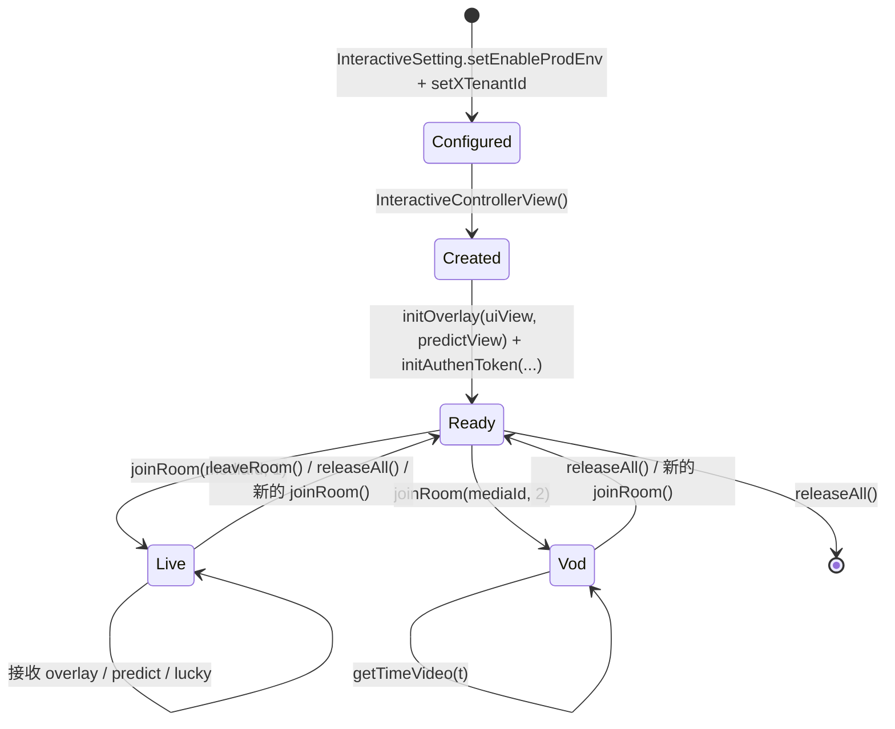
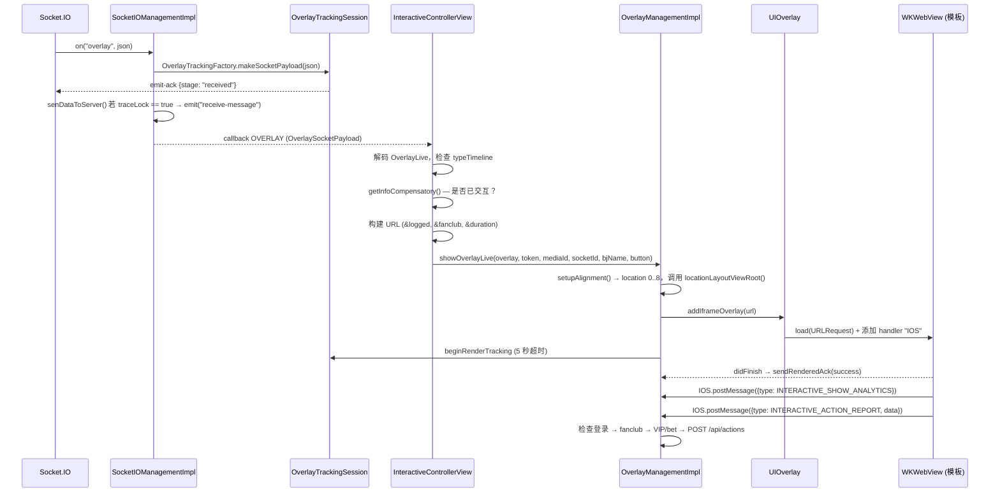
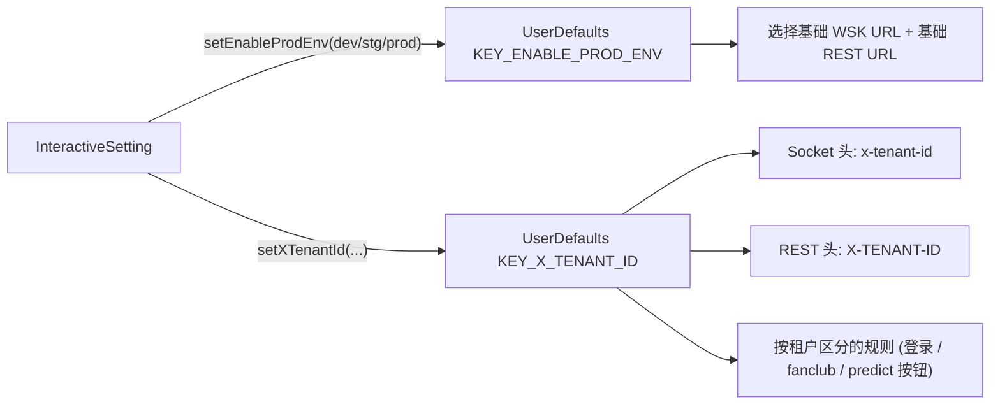

# Interactive SDK 架构（iOS）

[← 返回目录](README.md)

---

## 1. 整体视角

SDK 是一个封装了 3 大主要职责的 **iOS 库（XCFramework `ISdk`）**：

1. 通过 Socket.IO 与 Interactive 服务器进行**实时连接**（Live 场景）。
2. 在透明的 `WKWebView` 中**编排显示**交互内容（以 web 方式编写）。
3. 通过 REST 将用户的操作**转发**给服务器，并通过各种 delegate **回调**应用。

---

## 2. 分层与职责

| 层 | 组件（文件） | 职责 |
|---|---|---|
| **Facade / Orchestrator** | `InteractiveControllerView` | 应用的唯一入口。接收命令（`joinRoom`、`initAuthenToken`、`getTimeVideo`、`releaseAll`…），监听 socket 事件，决定 overlay 类型（minigame / predict / lucky），协调各个 manager |
| **配置** | `InteractiveSetting` | 将环境（`KEY_ENABLE_PROD_ENV`）和租户（`KEY_X_TENANT_ID`）写入 `UserDefaults` |
| **实时传输** | `SocketIOManagementImpl`（`SocketIOManagement`） | 创建/销毁 socket，注册事件，规范化 payload，发送 emit-ack |
| **Overlay 编排** | `OverlayManagementImpl`（`OverlayManagement`） | 构建小游戏 overlay，处理应答流程（登录 → fanclub → VIP/bet → 调用 API），tracking |
| **Predict/lucky 编排** | `PredictManagementImpl` | 浮动 GIF 按钮，预测/幸运数字对话框，独立的应答流程 |
| **WebView 展示** | `UIOverlay`、`ConfigureWebView`（`NoZoomWKWebView`） | 创建透明的 `WKWebView`，根据 overlay 生命周期挂载/移除 |
| **辅助展示** | `DialogLuckyNumberView`、`DialogPredictView`、`DialogConfirmView`、`DialogDeductionView`、`FanClubView`、`LeaderboardView` | 全屏对话框 / 浮动按钮 / 排行榜 |
| **桥接** | `OverlayWebViewCallBack`、`PredictWebViewCallBack` | JavaScript ⇄ Swift 桥接（`WKScriptMessageHandler`，接口名 `IOS`） |
| **REST** | `LiveLogRepository`（`/api/actions`）、`TelcoRepository`（`/api/public/vip-status`）、`LiveCompensatoryShotImpl`（`interactive-status`）、`OverlayVod*` 类（VOD） | 通过 Alamofire 调用 API |
| **可观测性** | `OverlayTracking.swift`（`OverlayTrackingSession`、`OverlayTrackingFactory`） | 度量 overlay 生命周期并发送 `emit-ack` |
| **基础设施** | `ApiConst`、`TypeInteractive`、`SocketEvents`、`Utils`、`PrintLog`、各种 `Codable` 模型 | 常量、工具函数、数据模型 |

### 代码中体现的设计原则

- **应用只面对单一 facade**：应用主要接触 `InteractiveControllerView` + `InteractiveSetting` +
  各个 delegate `protocol`。各个子 manager 虽然是 `public`，但通常不需要直接调用。
- **事件通过单一回调传递**：socket 通过闭包 `(String, Any) -> ()` 推送到 SDK，
  经由 `addCallback` 挂载（单槽位）；`InteractiveControllerView.handleEventsSocket()`
  按事件名进行 `switch`。
- **交互内容即 web**：SDK 本身不绘制题目界面，只将模板 URL 加载到 `WKWebView` 中，
  并通过 `postMessage` 进行交互。更改交互界面不需要重新构建应用。
- **配置保存在 `UserDefaults`**：环境和租户会在多处被重新读取（socket 头、选择 REST 基础
  URL……）。这也是若干**未配置时导致的强制解包（force-unwrap）崩溃**的来源。

---

## 3. 简化类图

---

## 4. 两种运行模式

### 4.1. LIVE（`type = 1`，`ApiConst.TYPE_LIVE`）—— 由服务器驱动

服务器通过 Socket.IO 主动推送 overlay。显示/应答条件（登录、fanclub、VIP/bet、是否已答题）会
在客户端立即检查。

### 4.2. VOD（`type = 2`，`ApiConst.TYPE_VOD`）—— 由播放进度驱动

没有 socket。SDK 通过 REST 预先加载整个脚本，之后**应用必须注入播放时间**：

> `timeShow` 由 `Timelines.time`（格式为 `"SS"`、`"MM:SS"` 或 `"HH:MM:SS"`，函数
> `parseTimeToSeconds`）推导而来，因此注入 `getTimeVideo` 的单位是**秒**。

---

## 5. 线程模型

| 事项 | 线程 | 备注 |
|---|---|---|
| Socket.IO 事件 | Socket.IO 客户端的线程 | 传入 `addCallback` 闭包 |
| 构建/销毁 WebView | **主线程** | `showInteractive`/`setUpDataForTemplatePredict` 在 `DispatchQueue.main.async` 中调用 |
| 调用 REST | Alamofire 的线程，回调到主线程 | `AF.request(...).response*` |
| Emit-ack 跟踪 | 在 `OverlayTrackingSession` 内同步（`emittedStages`、`finished` 标志） | 渲染计时器在主线程使用 `Timer` |
| Predict 按钮图片/透明度变化 | 主线程（`Timer.scheduledTimer`） | **5 秒**后将 alpha 渐变到 0.5 |

> 与 Android 版本不同，iOS **没有** `QueuedMutableLiveData` —— overlay 事件在回调内直接
> 顺序处理。`addCallback` 是**单一槽位**，后调用会覆盖前一次。

---

## 6. 对象生命周期

代码中的重点：

- **`InteractiveControllerView()` 构造函数只创建 `SocketIOManagementImpl` 和
  `OverlayManagementImpl`** —— 尚未打开连接，也尚未调用 API。
- **`joinRoom(type: 1)`** 离开旧房间（如果是不同的媒体），断开旧的 socket，调用
  `removeAllView()`，重新挂载 socket 回调，然后 `connectSocket()`。`emit("join-room")`
  只会在**socket 连接成功之后**发生（在 `SocketEvents.CONNECTED` 分支中）。
- **`joinRoom(type: 2)`** 断开 socket（如果已打开），调用 `removeAllView()`，调用 REST
  加载 VOD 脚本。
- **在已连接且存在媒体时调用 `initAuthenToken()`** → 断开 socket 并重新调用
  `joinRoom(type: 1)`，以便 socket 携带新的 token。
- **`releaseAll()`** 调用 `leaveRoom()`（如果已连接），移除所有 delegate 并调用
  `disconnection()`。

---

## 7. 一次小游戏 overlay 的数据流（Live）

各分支的详细信息（包括被阻塞的点）请参见 [03 — 运行流程](03-luong-hoat-dong.md)。

---

## 8. WebView 桥接协议

SDK 附加了名为 **`IOS`** 的 `WKScriptMessageHandler`（`userContentController.add(callBack, name: "IOS")`）。

**Web → SDK**（`window.webkit.messageHandlers.IOS.postMessage(jsonString)`）—— 解码为
`OverlayDataCallback { data, type }`：

| `type`（`TypeInteractive` 常量） | 含义 |
|---|---|
| `INTERACTIVE_SHOW_ANALYTICS` | Overlay 已显示 → `showLayoutViewRoot()`，隐藏播放器控件 |
| `INTERACTIVE_HIDE_ANALYTICS` | Overlay 关闭 → 移除 WebView，清理 tracking，重新显示播放器控件 |
| `INTERACTIVE_ACTION_REPORT` | 用户答题 / 点击广告（`action = CLICK_ADS`） |
| `INTERACTIVE_OPEN_ANALYTICS` / `INTERACTIVE_CLOSE_ANALYTICS` | 打开/关闭 predict/lucky 对话框（在 `PredictManagementImpl` 中处理） |
| `INTERACTIVE_PING_ANALYTICS` | 仅用于过滤，不记录日志 |

**SDK → Web**（`webView.evaluateJavaScript("window.postMessage('<json>', '*')")`）：

| `key` | 何时 | 发出位置 |
|---|---|---|
| `UPDATE_DATA_INTERACTIVE` | Socket `update-result` | `sendMessageResultinteractive()` |
| `UPDATE_COUTER`（*原文如此，缺少一个 N*） | Socket `predict-result` → `answer1/answer2` | `receiveDataResultPredict()` + 重新打开对话框时 |
| `UPDATE_NUMBER_LUCKY` | API 返回 lucky 结果 | `postMessageWhenClickPlayLucky()` |
| `UPDATE_CONFIRM` | 应答成功（bet/VIP 分支） | `postMessageWhenAnswerSuccess()` |

> ⚠️ 与 Android 版本不同，iOS **不使用** `LOADED_OVERLAY` / `GET_DATA_INTERACTIVE` 键。
> iOS 模板会直接以已带好参数的 URL 加载；额外数据（结果）之后才通过上面的键推送下去。

---

## 9. 环境与租户配置

- `Enviroment` = `DEV`（`"dev"`）/ `STG`（`"stg"`）/ `PROD`（`"prod"`）—— 同时决定 socket URL
  （`*.onplay.live` WSK）、REST URL 以及排行榜 URL。
- `TenantIdType`：`vtvlive`（OnPlus）、`onlivev2` = `onliveLiveStream`（SOOP）、
  `onlivetv` = `onliveTV`（OnLive TV）、`VTVprime`（SeeNow）。当前代码中的若干特殊规则：
  - **predict/lucky 按钮会被跳过**，适用于租户 `vtvlive`、`onlivetv`、`VTVprime`
    （`receiveDataActionButtonPredict` 提前返回）。
  - **只有 `onlivev2` 租户**会在用户尚未加入 fanclub 时应用 `&fanclub=false` 参数。
- `ApiConst.OS = "iphone"` 会进入 socket 的 `os` 头、`/api/actions` 请求体的 `os` 字段、
  VOD 脚本 URL 的 `os` 参数，以及 overlay 的 `targets` 过滤条件
  （`targets.contains("iphone")` 或 `"all"`）。

---

## 10. 本地存储（`UserDefaults`）

| Key / suite | 用途 |
|---|---|
| `KEY_ENABLE_PROD_ENV`、`KEY_X_TENANT_ID` | 环境 + 租户（必须提前配置） |
| `KEY_MEDIA_CONTENT_ID` | 最近一次加入的媒体 |
| `MINI_GAMES`、`PREDICT`、`POPUP_PREDICT`、`INTERACTIVE_TYPE_TIMELINE` | 显示状态机（`SHOW`/`HIDE`/`HIDE_CMS`/`END`） |
| `KEY_FAN_CLUB` | 用户是否属于当前观看媒体的 fanclub |
| suite `INTERACTIVE_<userId>` / `INTERACTIVE_DEFAULT`，key = `mediaId` | `Compensatory` —— 防止某个时间点被重复显示/重复应答 |
| suite `DATA_RESULT_PREDICT`，key = `timelineId` | 缓存 predict 结果（`answer1`/`answer2`），在重新打开对话框时再次推送 |

---

[← 返回目录](README.md) · [下一篇：安装与集成 →](02-cai-dat-va-tich-hop.md)
