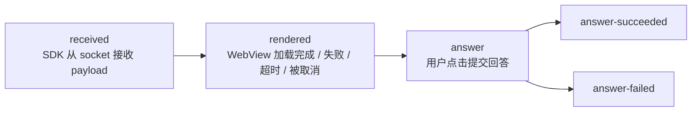
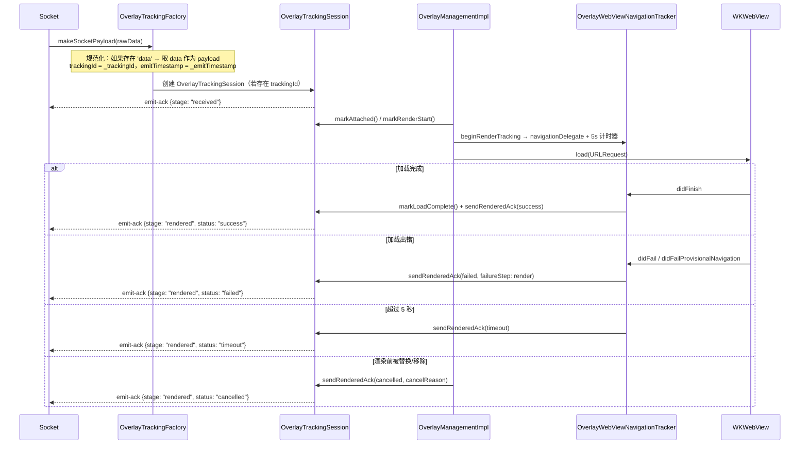
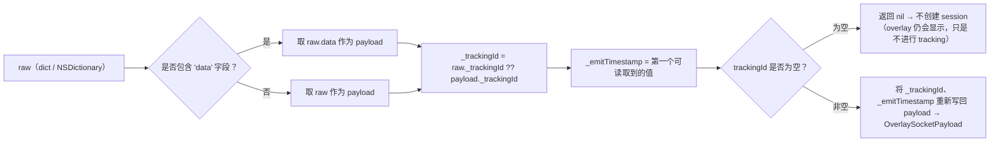

# 05 — Tracking emit-ack（覆盖层生命周期度量）

[← 返回目录](README.md)

该机制回答运营方的问题：*"Overlay 服务器推送的内容是否真的到达了用户设备，
是否成功渲染，用户是否作出了回答？"* —— 由客户端自行度量，通过 socket
事件 **`emit-ack`** 回传给服务器。

> 整个 tracking 层位于 `Libraries/Overlay/Tracking/OverlayTracking.swift`。app **不会**
> 直接与其交互 —— SDK 自行度量并通过当前已打开的 socket 自行发送。
>
> ⚠️ Tracking **仅在 LIVE 模式下运行**。`showOverlayVod` 不会调用 `beginRenderTracking`，
> 且 VOD 没有可用于 emit 的 socket。

---

## 1. 各阶段（stage）



| Stage（`OverlayTrackingStage`） | 含义 | 是否结束会话？ |
|---|---|---|
| `received` | 合法 payload 已进入 SDK | 否 |
| `rendered` | 确定展示结果，并附带 `status` | 是，如果 `status != success` |
| `answer` | 开始提交回答 | 否 |
| `answer-succeeded` | API 返回 `success == true` | 是 |
| `answer-failed` | API 出错 / 被拒绝 / 网络错误 | 是 |

`rendered` 的 `status`（`OverlayTrackingStatus`）：`success` | `failed` | `timeout` | `cancelled`。

每个会话中的每个 stage 只发送**一次**（`emittedStages` 是一个 `Set`）。会话
`finish()` 之后，后续任何 `emitStage` 都会被忽略。

---

## 2. 发送到服务器的 payload 结构

```jsonc
// socket.emit("emit-ack", payload)
{
  "trackingId": "<从 overlay payload 中获取的 _trackingId>",
  "event": "overlay",
  "stage": "received | rendered | answer | answer-succeeded | answer-failed",
  "deviceId": "<identifierForVendor>",
  "clientContext": { /* 见下方 */ }
}
```

### `clientContext` —— 公共部分

| 字段 | 来源 |
|---|---|
| `profile` | `"overlay.legacyIframe"`（固定常量，iOS 只有一个 profile） |
| `transportMode` | `"legacyIframe"` |
| `sdkVersion` | `ApiConst.VERSION_SDK`（`"2025-05-25"`） |
| `platform` | `"ios"` |
| `os` | `UIDevice.systemName + " " + systemVersion`（例如 `"iOS 17.5"`） |
| `deviceClass` | 如果是 iPad 则为 `"tablet"`，否则为 `"mobile"` |
| `viewportWidth`、`viewportHeight` | `UIScreen.main.bounds` |

### 按各 stage 划分

| Stage | 附加字段 |
|---|---|
| `received` | `emitTimestamp`、`receiveTimestamp`、`receiveLatencyMs`、`ackLatencyMs`、`timeline{received, ackSent}` |
| `rendered` | `status`、`receiveLatencyMs`、`renderLatencyMs`、`ackLatencyMs`、`timeline{attached, renderStart, loadComplete, readyReceived, ackSent}`、`duration?`、`overlayType?`、`failureReason?`、`failureStep?`、`custom.cancelReason?` |
| `answer*` | `actionType`（`answer_submit`）、`actionResult`（`attempted`/`success`/`failure`）、`actionLatencyMs`、`occurrenceId`（= `timelineId`）、`overlayType?`、`failureReason?`、`failureStep?`、`custom{…}`、`timeline` |

> 与 Android 版本的区别：iOS **只有一个 profile** `overlay.legacyIframe`，且渲染超时
> **固定为 5000 ms**（`OverlayTrackingConstants.renderTimeoutMs = 5.0`）。没有 `ws=1` /
> `wsInteractive` 分支，timeline 中的 `readyReceived` 始终为 `NSNull()`（iOS 是根据
> WebView 的 `didFinish` 来确定 `rendered`，而不会等待模板上报 `LOADED_OVERLAY`）。

---

## 3. 单个 overlay 的度量流程（Live）



`OverlayTrackingSession` 使用 `renderedAckSent` 标志确保 `rendered` 只发出**一次**，
即便超时与 `didFinish` 几乎同时发生。

---

## 4. Payload 规范化（`OverlayTrackingFactory`）



经过这一步之后，SDK 的其余部分处理的是"已解包"的 payload（`data`），同时保留了
tracking 所需的元数据（`_trackingId`、`_emitTimestamp`）。

创建 session 有**两条路径**：
1. 在 `SocketIOManagementImpl.trackedOverlayPayload()` 中 —— 当收到 `overlay`/`ex-overlay`
   时，创建 session 并立即发送 `received`。
2. 备用路径在 `InteractiveControllerView.startShowLiveOverlayWithDataReceived()` 中 ——
   如果 payload 还未附带 session，但 `OverlayLive.trackingId` 非空，则创建新 session 并
   发送 `received`。

---

## 5. 取消原因（`cancelReason` / `failureReason`）

以下是 SDK **有意不展示 / 取消 tracking** overlay 的全部情形列表，在排查
"为什么 overlay 没有显示" 时非常有用：

| 值 | 触发位置 | 原因 |
|---|---|---|
| `invalid_overlay_state` | `showOverlayLive` | `pos.alignment == nil` 或 `uiOvelay == nil` |
| `replaced_by_new_overlay` | `showOverlayLive` | 新 overlay 替换了正在展示的 overlay |
| `recalled` | `recallOverlay` | 服务器根据 `timelineId` 撤回该 overlay |
| `remove_all_view` | `removeAllView` | 清空全部视图（重新加入房间 / 离开房间） |
| `interactive_hide` | `INTERACTIVE_HIDE_ANALYTICS` | Web 端上报关闭 overlay |
| `load_error` / `render` | Navigation delegate | WebView 加载出错 |
| `timeout` | 5s 计时器 | WebView 未在 5 秒内加载完成 |
| `api_EX400` / `api_TL404` / `api_PM402` / `api_false` | API `/api/actions` | 服务器拒绝了该回答 |
| `network_error`（`network`） | 回答时没有网络 | `Connectivity.isConnectedToInternet == false` |
| `unknown_response` | 无法解析响应 | API 返回体格式错误 |

---

## 6. 延迟（latency）计算方式

`OverlayTrackingSession` 使用毫秒级时间戳（`Date().timeIntervalSince1970 * 1000`）：

- `receiveLatencyMs = receiveTimestamp - emitTimestamp` —— 服务器到客户端的网络延迟。
- `renderLatencyMs = loadComplete - receiveTimestamp` —— WebView 渲染耗时。
- `ackLatencyMs` —— 发送 ack 的延迟。
- `actionLatencyMs = actionTimestamp - (readyReceived ?? loadComplete ?? renderStart ?? receive)` ——
  从渲染完成到用户作出回答之间的耗时。

---

## 7. 对接入 app 的影响

- Tracking **不会**增加权限，也不会调用独立的 API —— 使用的是当前已打开的 socket。
- 在 **VOD 模式下没有 tracking**。
- 如果 overlay 没有 `_trackingId`（服务器未附加），overlay 仍会正常显示，但
  **不会**发出 emit-ack。
- app 不需要做任何事情；这是为运营/后端团队提供的观测工具。

---

[← API 参考](04-api-reference.md) · [返回目录](README.md) · [下一篇：常见问题 →](06-loi-thuong-gap.md)
