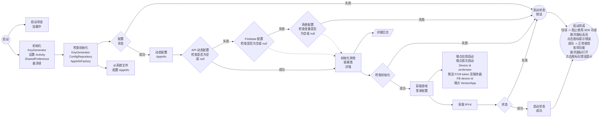
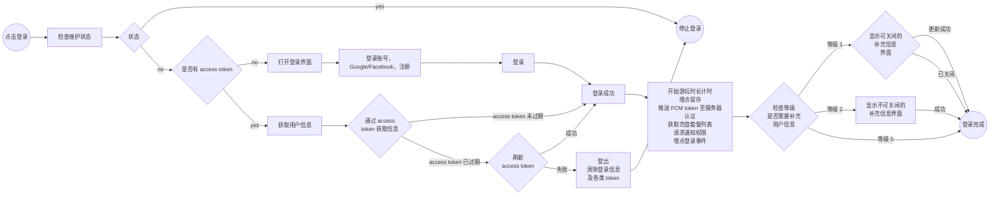
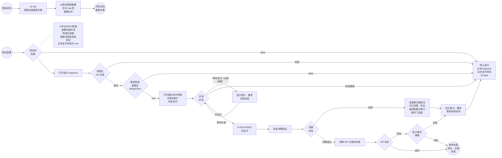
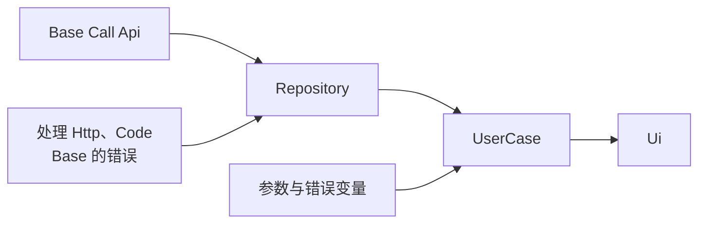
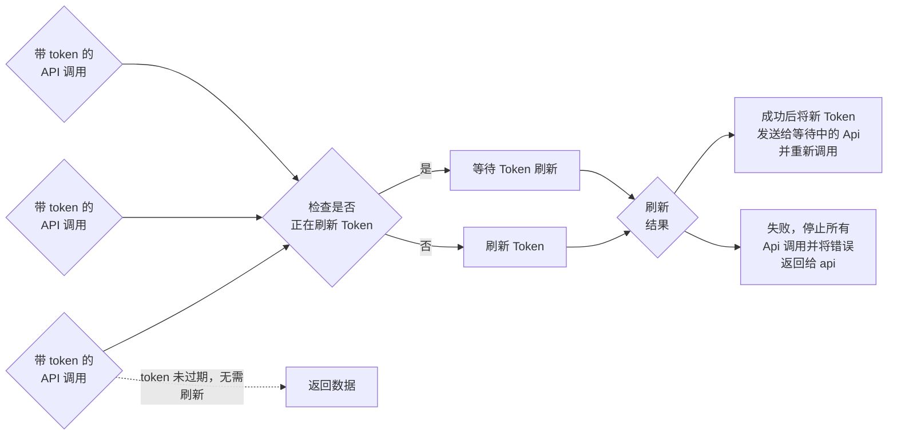
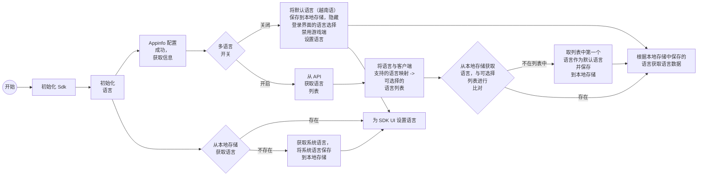
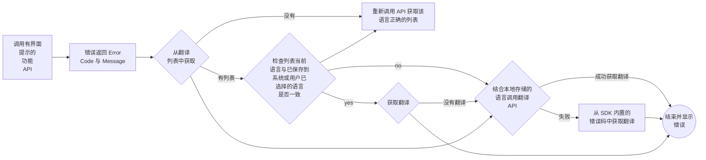
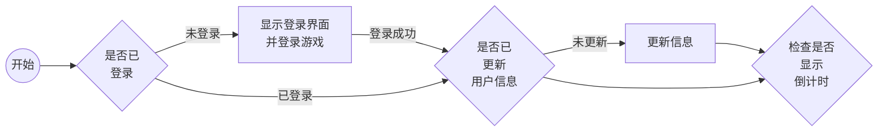

# SDK 功能

# 一、概述

VLiveSDK 提供以下主要功能组：


```markmap
# VLiveSDK
## OIDC v2
### Login
#### Vlive account
- username/password
#### SNS
- Facebook
- Google
- Apple
- Zalo
#### Quick login
#### VLive OpenID
### Logout
### Registration
### Forget password
### Profile
- user name
- birthday
- sex
- avatar
### Link user accounts
### Deactive account
## Floating button
- Drag/drop
- Show/hide
- Dimming (reduce opacity)
## Permission Manager
- Nomal permissions
- Runtime permissions
## Log Manager
- Intergration log
## Push notification
- Firebase Messaging
## Tracking
- Appflyer
- Facebook
- Firebase
## Payment
- other payment methods (Momo, Zalopay,...)
### In-App Purchase
- List Product
## Configuration
### Environment configs
- dev
- staging
- prod
### general configs
### UI configs
- enable
- disable
### configs tracking
- press 10 times on logo to show all configs
```

## 1. 使用的库

| Library | Verison | Inventory |
| --- | --- | --- |
| retrofit2 | 2.9.0 | |
| billingclient | 8.0.0 | |
| play-services-base | 18.5.0 | |
| play-services-auth | 21.3.0 | |
| firebase-bom | 33.0.0 | |
| game-tracking | 1.0.5 | |
| app-update | 2.1.0 | |
| glide | 4.15.1 | |
| browser | 1.8.0 | |
| facebook-android-sdk | 17.0.0 | |
| af-android-sdk | 6.16.0 | |
| installreferrer | 2.2 | |
| play:review | 2.0.2 | |
| okhttp3:logging-interceptor | 4.11.0 | |
| recaptcha:recaptcha | 18.6.0 | |
| tiktok-business-android-sdk | 1.5.0 | |
| lifecycle-process | 2.3.1 | |
| browser | 1.8.0 | |

## 2. 版本说明

| Version | CommitID | Release date | Change logs |
| --- | --- | --- | --- |
| 1.0.10 | 4e39208430a7d7d59857cf66602fc4e445504ec1 | 11-May | 发布首个版本 |
| 1.0.11 | 5dfedc2c5b9e4c83898071c928c147d3add73266 | 13/11 | 新增带参数的埋点 |
| 1.0.12 | ed667303992bfc75a906f89bc819535d98a0141c | 26/11 | 将默认环境改为 prod |
| 1.1.0 | f06324243f69940a8165db8930b28f1e91c95e80 | 1111/12 | 倒计时功能，构建时检查 SDK 版本 |
| 1.1.1 | afaccbcfeea2925aad3cc791d65e0f415c39260c | 23/12 | 新增当游戏设置语言时自动切换默认语言... |
| 1.2.0 | 01edfe4996597c5a0d0aa582e48234740ab0a828 | 24/12 | 更新领取礼物信息的功能 |
| 1.2.1 | 2eb3a17e14ace99c395fafa4c9b984c0258bd7ce | 6/1 | 新增 vtvlive 账号自动关闭倒计时 |
| 1.2.2 | 9836e819580880028532d537dca9f4e4f9aeb714 | 8/1 | 修复关闭游戏移除网络监听时崩溃的问题 |
| 1.2.3 | 66bd2071d8a803539d40cda09bac8504381c5338 | 9/1 | 埋点 SDK 升级至 1.0.6 |
| 1.3.0 | | 12/1 | 新增通过 appler 配置的立即游玩按钮 |
| 1.3.1 | | 5/2 | 修复 Google 登录被隐藏的问题 |
| 1.3.2 | | 6/2 | 埋点 SDK 升级至 1.0.8，修复崩溃问题 |
| 1.3.3 | | 9/4 | 修复注册返回的错误 |
| 1.3.4 | | 10/4 | 屏幕旋转时低概率崩溃 |
| 1.3.5 | | 13/4 | 更新新的埋点流程与事件 |
| 1.3.8 | | 9.5 | 修复注册返回的错误，测试新事件 |

# 二、功能详情

Android Refactor SDK Game

| 功能 | 子功能 | 状态 | 备注 |
| --- | --- | --- | --- |
| 启动流程检查 | 游戏启动配置包括动态配置、初始配置、来自动态域名的域名。配置未完成前无法登录。配置失败或配置进行中时会报错 | 已完成 | |
| 动态配置 | | 已完成 | |
| 登录时认证 | | 已完成 | |
| 游戏初始配置 | | 已完成 | |
| Google Play 评价 | | 已完成 | |
| 支付 | | 已完成 | |
| 登录 | Vlive 账号 | 已完成 | |
| | Google | 已完成 | |
| | Facebook | 已完成 | |
| | 登录检查 | 已完成 | |
| 注册 | | 已完成 | |
| 忘记密码 | | 已完成 | |
| 登出 | | 已完成 | |
| 按等级更新信息 | | 已完成 | |
| 悬浮球 | 拖拽与点击 | 已完成 | |
| | SDK 启动状态 | 已完成 | |
| 埋点事件 | 首次安装游戏 | 已完成 | |
| | 游戏启动 | 已完成 | |
| | 登录成功后 | 已完成 | |
| | 点击登录、关闭、注册、忘记密码、使用 Google/Facebook 登录 | 已完成 | |
| | 游玩时长 | 已完成 | |
| Dashboard | 个人资料 | 已完成 | |
| | 修改密码 | 已完成 | |
| | 修改邮箱 | 已完成 | |
| | 修改生日 | 已完成 | |
| | 删除账号 | 已完成 | |
| | 登出 | 已完成 | |
| 通知 | 接收通知 | 已完成 | |
| | 通知隐藏时的埋点 | 已完成 | |
| 开发者功能 | 需要时在 prod 环境启用开发者功能。需执行 5 个隐藏操作：1. 在密码输入处的密码图标点击 10 次 2. 点击记住密码复选框 10 次 3. 点击政策复选框 10 次 4. 点击记住密码文字 10 次 5. 在隐藏登录的用户名中输入 vtvlive。启用开发者功能后会有提示 | 已完成 | |
| Tiktok 埋点 | | 已完成 | |
| 多语言 | | 已完成 | |
| Vlive 埋点 | | 已完成 | |
| 活动倒计时 | | 已完成 | |
| 动态悬浮球显示 | | 已完成 | |

# 三、测试与验证

| 主要功能 | 功能对比 | 与旧代码对比检查 | Android 13 及以上真机 | Android 10 -> 12 真机 | Ldplayer 9 模拟器 |
| --- | --- | --- | --- | --- | --- |
| SDK 启动与配置 | 新 | OK | OK | OK | OK |
| 登录 | 旧 | OK | OK | OK | OK |
| 注册 | 旧 | OK | OK | OK | OK |
| 忘记密码 | 旧 | OK | OK | OK | OK |
| 修改密码 | 旧 | OK | OK | OK | OK |
| 修改邮箱 | 旧 | OK | OK | OK | OK |
| 修改生日 | 旧 | OK | OK | OK | OK |
| 删除账号 | 旧 | OK | OK | OK | OK |
| 登出 | 旧 | OK | OK | OK | OK |
| 支付 | 旧 | OK | OK | OK | OK |
| 切换账号 | 旧 | OK | OK | OK | OK |
| 通知埋点 | 新 | OK | OK | OK | OK |
| 开发者功能 | 新 | OK | OK | OK | OK |
| Tiktok 埋点 | 旧 | OK | OK | OK | OK |
| Vlive 埋点 | 新 | OK | OK | OK | OK |

# 四、流程图

1. 启动与配置



详细日志（依赖类初始化）：


2. 登录



C. 支付



D. API 结构



E. 带 token 的 API 调用结构



F. 多语言





G. 显示游戏开启倒计时通知


