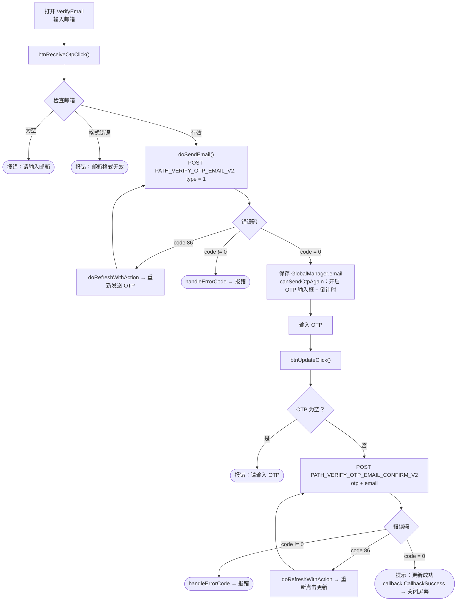
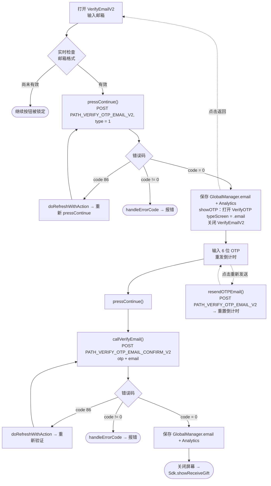

# 邮箱更新流程 – iTapSdk (sdk-game-ios-v3)

本文档描述 SDK 的邮箱更新/验证流程，基于实际代码整理而成。
与手机号流程类似，项目中存在**两种实现方式**：

- **方式一 – `VerifyEmail`**（一个屏幕合并了邮箱输入和 OTP 输入；标题为 *"更新邮箱"*）。以 `callback(CallbackSuccess)` 结束。
- **方式二 – `VerifyEmailV2` → `VerifyOTP`**（新版本，拆分为两个屏幕；标题为 *"添加邮箱"*，与领取礼物流程 `showReceiveGift` 关联）。

两者共用 2 个接口：`PATH_VERIFY_OTP_EMAIL_V2`（发送 OTP，`type = 1`）和
`PATH_VERIFY_OTP_EMAIL_CONFIRM_V2`（验证 OTP）。所有请求都携带 Bearer accessToken。

## 方式一 – `VerifyEmail` 屏幕

### 说明 – 方式一

1. **输入邮箱并发送 OTP** – `btnReceiveOtpClick()` 检查邮箱不为空且符合
   格式（邮箱正则），然后 `doSendEmail()` 调用 `PATH_VERIFY_OTP_EMAIL_V2`（`type = 1`）。
   - `code = 0`：保存 `GlobalManager.shared.email`，开启 OTP 输入框并启动重发倒计时。
   - `code = 86`（令牌过期）：`doRefreshWithAction` 刷新令牌后自动重新点击发送。
   - 其他错误：`handleErrorCode`。
2. **输入 OTP 并确认** – `btnUpdateClick()` 检查 OTP 不为空，调用
   `PATH_VERIFY_OTP_EMAIL_CONFIRM_V2`（`otp`、`email`）。
   - `code = 0`：显示提示"更新成功"，触发 `callback(CallbackSuccess)` 后关闭屏幕。
   - `code = 86`：刷新令牌后重试。
   - 其他错误：`handleErrorCode`。
3. **重新发送 OTP** – 倒计时归零后，"发送验证码"按钮重新启用以再次调用 `PATH_VERIFY_OTP_EMAIL_V2`。

## 方式二 – `VerifyEmailV2` → `VerifyOTP`

### 说明 – 方式二

1. **`VerifyEmailV2`** – 邮箱输入框实时检查；有效时启用
   "继续"按钮。`pressContinue()` 调用 `PATH_VERIFY_OTP_EMAIL_V2`（`type = 1`）。
   - `code = 0`：保存 `GlobalManager.shared.email` + Analytics，然后 `showOTP()` 打开
     `VerifyOTP` 屏幕（`typeScreen = .email`，传入 `email`、`serverId`、`characterId`）
     并关闭当前屏幕。
   - `code = 86`：刷新令牌后重新调用。
   - 其他错误：`handleErrorCode`。
2. **`VerifyOTP`** – 输入 6 位 OTP，显示遮盖后的邮箱（`maskedEmailFrom`）以及
   "重新发送"倒计时。`pressContinue()` → `callVerifyEmail()` 调用
   `PATH_VERIFY_OTP_EMAIL_CONFIRM_V2`（`otp`、`email`）。
   - `code = 0`：保存 `GlobalManager.shared.email`，记录 Analytics，关闭屏幕并
     调用 `Sdk.showReceiveGift()`。
   - `code = 86`：刷新令牌后重试。
   - 其他错误：`handleErrorCode`。
   - **重新发送 OTP**：`resendOTPEmail()` 重新调用 `PATH_VERIFY_OTP_EMAIL_V2` 并重启倒计时。
   - **返回**：回到 `VerifyEmailV2` 屏幕。

## 使用的接口

- `PATH_VERIFY_OTP_EMAIL_V2` – 发送 OTP 到邮箱（POST，`type = 1`）
- `PATH_VERIFY_OTP_EMAIL_CONFIRM_V2` – 验证 OTP 并更新邮箱（POST）

## 备注

- 参数 `type = 1` 表示 *Verify Mail*（与手机号流程的 `type = 0` 不同）。
- 所有请求都携带 `accessToken`（Bearer）。遇到 `code = 86`（令牌过期）时，
  SDK 会自动执行 `doRefreshWithAction` 刷新令牌后重复执行当前未完成的操作。
- 更新成功都会记录 `GlobalManager.shared.email` 并调用
  `Analytics.initiateOnDeviceConversionMeasurement(emailAddress:)`。
- 结束方式的差异：方式一向打开该屏幕的一方触发 `callback(CallbackSuccess)`；
  方式二则转到 `Sdk.showReceiveGift()`。
- 与手机号流程相比的接口差异：邮箱使用 `PATH_VERIFY_OTP_EMAIL_V2`
  （发送/重发）和 `PATH_VERIFY_OTP_EMAIL_CONFIRM_V2`（验证）这一对接口；而手机号使用
  `PATH_OTP_PHONE_V2` 和 `PATH_VERIFY_OTP_PHONE_V2`。
