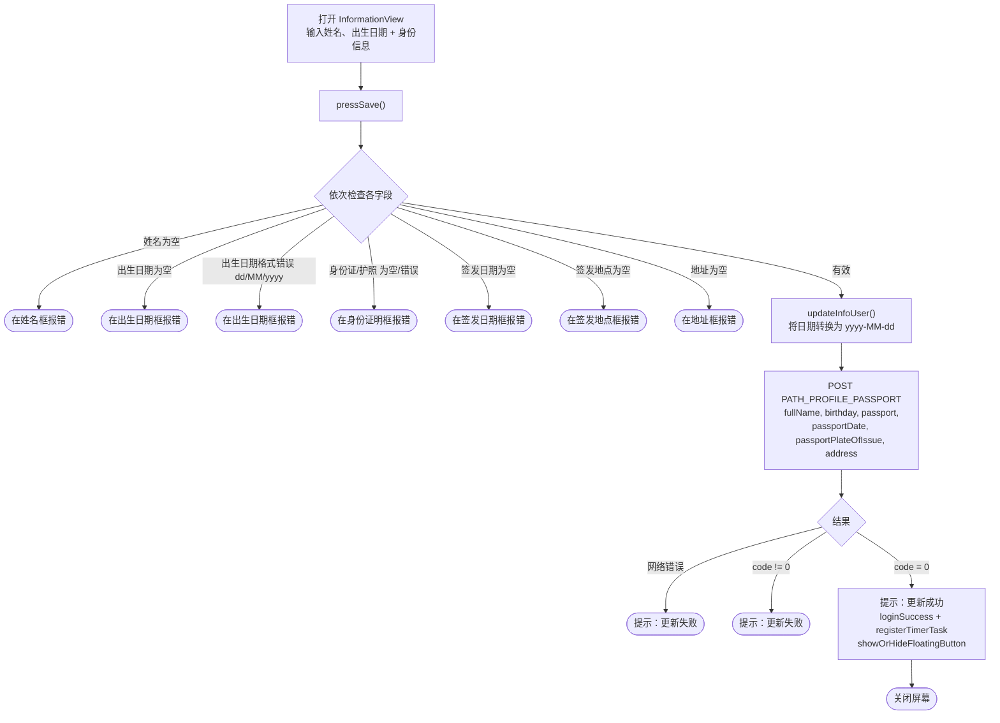
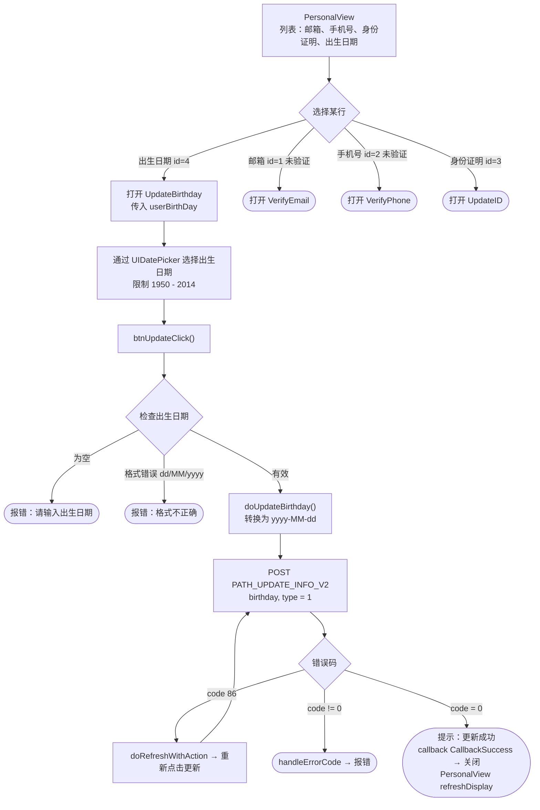

# 姓名与出生日期更新流程 – iTapSdk (sdk-game-ios-v3)

本文档描述 SDK 的姓名和出生日期更新流程，基于实际代码整理而成。
项目中有**两个相关屏幕**：

- **`InformationView`** – 同时更新**姓名 + 出生日期**（连同身份信息：
  身份证/护照号、签发日期、签发地点、地址）通过接口 `PATH_PROFILE_PASSPORT`。
  这是账户信息/身份完善屏幕（`requireSecurityLevel`）。
- **`UpdateBirthday`** – 通过接口 `PATH_UPDATE_INFO_V2` **单独更新出生日期**。
  从个人信息屏幕 `PersonalView` 打开（此处没有单独的姓名编辑框；
  姓名只作为标题显示）。

两者都携带 Bearer accessToken，并在遇到 `code = 86` 时自动刷新令牌。

## 方式一 – `InformationView`（同时更新姓名和出生日期）

### 说明 – 方式一

用户输入姓名（`tfName`）、出生日期（`tfBirthDay`，通过 UIDatePicker 选择）以及各
身份信息字段。点击保存时，`pressSave()` 依次检查：

- 姓名不能为空。
- 出生日期不能为空，且格式必须为 `dd/MM/yyyy`。
- 身份证/护照号不为空且有效（`^[0-9]{9,12}$` 或护照格式 `^[A-Z][0-9]{8}$`）。
- 签发日期、签发地点、地址不能为空。

有效则 → `updateInfoUser()` 将出生日期（以及签发日期）转换为 `yyyy-MM-dd` 后调用
`PATH_PROFILE_PASSPORT`（POST），参数包括 `fullName`、`birthday`、`passport`、`passportDate`、
`passportPlateOfIssue`、`address`（附带 `deviceId`、`os`、`osVersion`、`ip`）。

- `code = 0`：显示提示"账户信息更新成功"，调用 `loginSuccess()`（触发 delegate
  `loginSuccess` + `registerTimerTask`）、`showOrHideFloatingButton()` 后关闭屏幕。
- 网络错误或 `code != 0`：显示提示"账户信息更新失败！"。

> 注意：此屏幕**同时更新姓名和出生日期**在一次请求中，但要求同时填写
> 完整的身份证明信息才能保存。

## 方式二 – `UpdateBirthday`（仅出生日期，从 `PersonalView` 打开）

### 说明 – 方式二

`PersonalView` 是以列表形式展示的个人信息屏幕（邮箱、手机号、身份证明、
出生日期、退出登录）。账户姓名只在标题显示，不能在此处编辑。选择
**出生日期**行（`id = 4`，类型为 `.edit`）会打开 `UpdateBirthday`（传入当前出生日期）。

在 `UpdateBirthday` 中，用户通过 `UIDatePicker` 选择日期（限制在 1950 年 1 月 1 日至
2014 年 1 月 1 日之间）。`btnUpdateClick()` 检查出生日期不为空且格式为 `dd/MM/yyyy`，
然后 `doUpdateBirthday()` 转换为 `yyyy-MM-dd` 并调用 `PATH_UPDATE_INFO_V2`（POST），参数为
`birthday`、`type = 1`。

- `code = 0`：显示提示"更新成功"，触发 `callback(CallbackSuccess)` → 关闭屏幕；
  `PersonalView` 接收回调并调用 `refreshDisplay()` 刷新列表。
- `code = 86`（令牌过期）：`doRefreshWithAction` 刷新令牌后自动重新点击更新。
- 其他错误：`handleErrorCode`。

## 使用的接口

- `PATH_PROFILE_PASSPORT` – 更新姓名 + 出生日期 + 身份信息（POST）– 用于 `InformationView`
- `PATH_UPDATE_INFO_V2` – 更新出生日期（POST，`birthday`、`type = 1`）– 用于 `UpdateBirthday`

## 备注

- 出生日期在界面上始终以 `dd/MM/yyyy` 格式输入/显示，但发送到服务器时使用 `yyyy-MM-dd`。
- `InformationView` 是合并更新屏幕（要求完整身份信息），与安全信息完善流程
  （`requireSecurityLevel`）关联；成功后会通过 `loginSuccess()` 继续登录流程。
- `UpdateBirthday` 只修改出生日期，遇到 `code = 86` 时自动刷新令牌，并通过回调将结果传回
  `PersonalView` 以刷新显示。
- 当前 SDK 中**没有单独的"姓名"编辑屏幕**；姓名只能在 `InformationView` 中一同更新。
