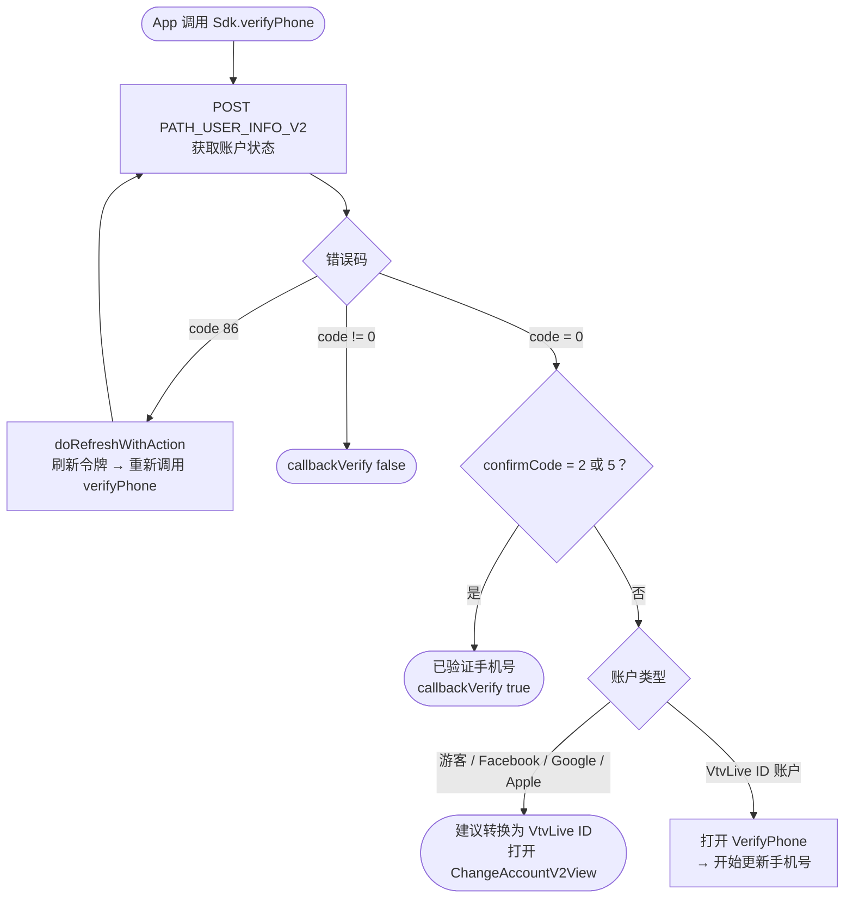
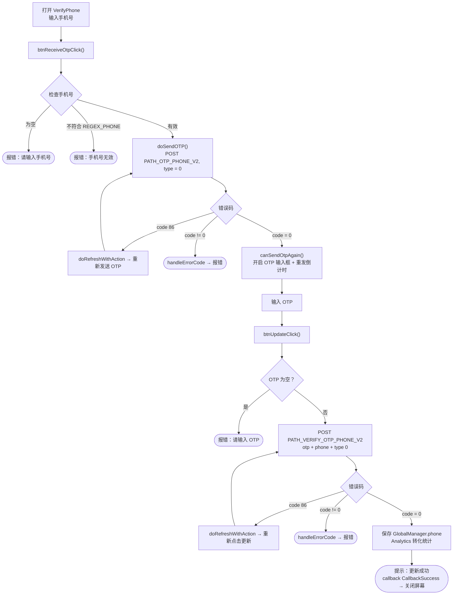
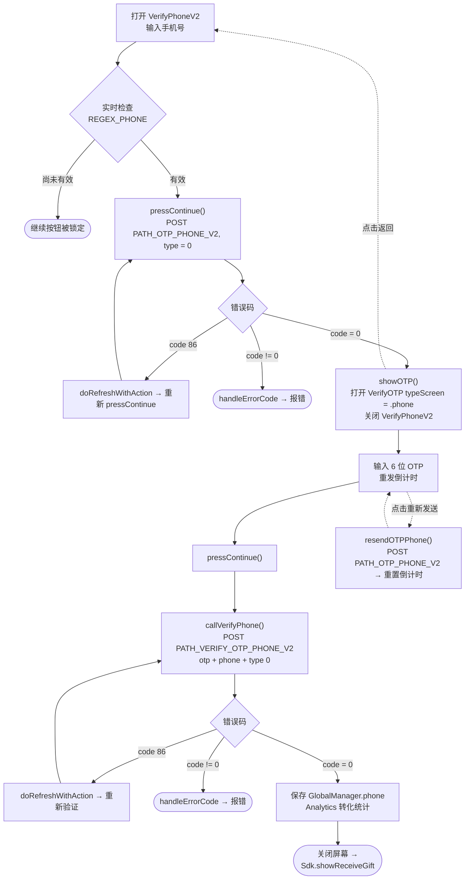

# 手机号更新流程 – iTapSdk (sdk-game-ios-v3)

本文档描述 SDK 的手机号更新/验证流程，基于实际代码整理而成。
项目中目前有**两种实现方式**：

- **方式一 – `VerifyPhone`**（一个屏幕合并了手机号输入和 OTP 输入；标题为 *"更新手机号"*）。通过 `Sdk.verifyPhone(...)` 调用。
- **方式二 – `VerifyPhoneV2` → `VerifyOTP`**（新版本，拆分为两个屏幕；标题为 *"添加手机号"*，与领取礼物流程 `showReceiveGift` 关联）。

两者共用 2 个接口：`PATH_OTP_PHONE_V2`（发送 OTP）和 `PATH_VERIFY_OTP_PHONE_V2`（验证 OTP），参数为 `type = 0`（Verify Phone），并在请求头携带 Bearer accessToken。

## 进入流程的条件 – `Sdk.verifyPhone()`

只有尚未验证手机号（`confirmCode` 不为 2 和 5）的 VtvLive ID 账户才能打开
手机号更新屏幕；游客/社交账户会先被建议转换账户。

## 方式一 – `VerifyPhone` 屏幕

### 说明 – 方式一

1. **输入手机号并发送 OTP** – `btnReceiveOtpClick()` 检查手机号不为空且符合
   `REGEX_PHONE`，然后 `doSendOTP()` 调用 `PATH_OTP_PHONE_V2`（`type = 0`，携带 Bearer 令牌）。
   - `code = 0`：开启 OTP 输入框并启动重发倒计时（`Constants.timeOutOtpAgain`）。
   - `code = 86`（令牌过期）：`doRefreshWithAction` 刷新令牌后自动重新点击发送。
   - 其他错误：`handleErrorCode`。
2. **输入 OTP 并更新** – `btnUpdateClick()` 检查 OTP 不为空，调用
   `PATH_VERIFY_OTP_PHONE_V2`（`otp`、`phone`、`type = 0`）。
   - `code = 0`：保存 `GlobalManager.shared.phone`，记录 Analytics，显示提示
     "更新成功"，触发 `callback(CallbackSuccess)` 后关闭屏幕。
   - `code = 86`：刷新令牌后重试。
   - 其他错误：`handleErrorCode`。
3. **重新发送 OTP** – 倒计时归零后，"发送验证码"按钮重新启用以再次调用 `PATH_OTP_PHONE_V2`。

## 方式二 – `VerifyPhoneV2` → `VerifyOTP`

### 说明 – 方式二

1. **`VerifyPhoneV2`** – 手机号输入框根据 `REGEX_PHONE` 实时检查；有效
   则启用"继续"按钮。`pressContinue()` 调用 `PATH_OTP_PHONE_V2`（`type = 0`）。
   - `code = 0`：`showOTP()` 打开 `VerifyOTP` 屏幕（`typeScreen = .phone`，传入
     `phone`、`serverId`、`characterId`）并关闭当前屏幕。
   - `code = 86`：刷新令牌后重新调用。
   - 其他错误：`handleErrorCode`。
2. **`VerifyOTP`** – 输入 6 位 OTP，显示遮盖后的手机号（`maskedPhoneFrom`）以及
   "重新发送"倒计时。`pressContinue()` → `callVerifyPhone()` 调用
   `PATH_VERIFY_OTP_PHONE_V2`（`otp`、`phone`、`type = 0`）。
   - `code = 0`：保存 `GlobalManager.shared.phone`，记录 Analytics，关闭屏幕并
     调用 `Sdk.showReceiveGift()`（继续领取礼物流程）。
   - `code = 86`：刷新令牌后重试。
   - 其他错误：`handleErrorCode`。
   - **重新发送 OTP**：`resendOTPPhone()` 重新调用 `PATH_OTP_PHONE_V2` 并重启倒计时。
   - **返回**：回到 `VerifyPhoneV2` 屏幕。

## 使用的接口

- `PATH_USER_INFO_V2` – 获取账户验证状态（用于 `verifyPhone` 的条件判断步骤）
- `PATH_OTP_PHONE_V2` – 发送 OTP 到手机号（POST，`type = 0`）
- `PATH_VERIFY_OTP_PHONE_V2` – 验证 OTP 并更新手机号（POST，`type = 0`）

## 备注

- 参数 `type = 0` 表示 *Verify Phone*。其他数值用于邮箱及其他
  验证类型（1 = mail，2/3 = one-time authen，4/5 = one-time transaction）。
- 所有请求都携带 `accessToken`（Bearer）。遇到 `code = 86`（令牌过期）时，
  SDK 会自动执行 `doRefreshWithAction` 刷新令牌后重复执行当前未完成的操作。
- 更新成功都会记录 `GlobalManager.shared.phone` 并调用
  `Analytics.initiateOnDeviceConversionMeasurement(phoneNumber:)`。
- 结束方式的差异：方式一向打开该屏幕的一方触发 `callback(CallbackSuccess)`；
  方式二则转到 `Sdk.showReceiveGift()`。
