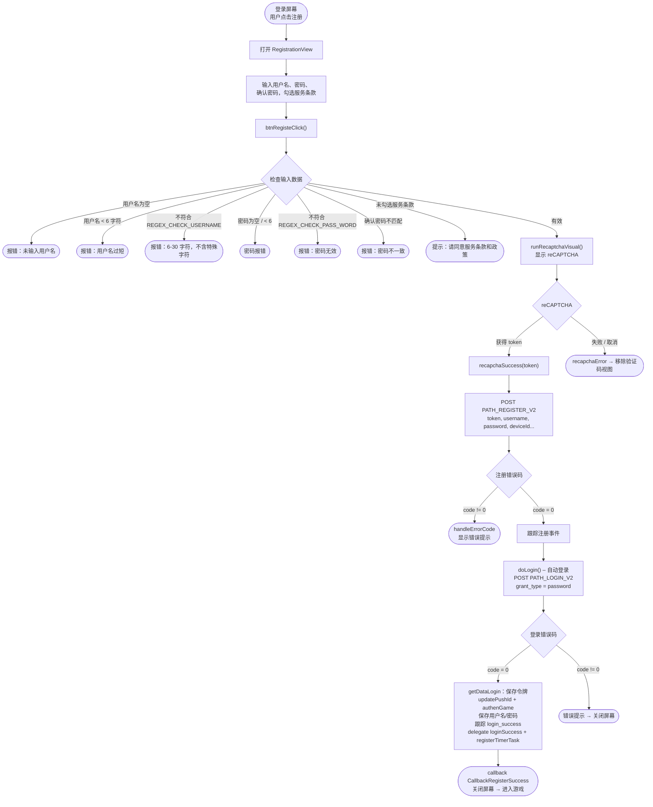

# 注册流程 – iTapSdk (sdk-game-ios-v3)

本文档描述 SDK 的账户注册流程，基于实际代码整理而成：
`RegistrationView.swift`（以及打开注册屏幕的入口 `LoginViewNew.swift`）。

## 总体流程图

## 详细说明

### 1. 打开注册屏幕

从登录屏幕（`LoginViewNew`），用户点击**注册** →
打开 `RegistrationView`。屏幕包含**用户名**、**密码**、
**确认密码**输入框以及同意**服务条款和政策**的复选框。

### 2. 检查输入数据 – `btnRegisteClick()`

调用 API 之前，SDK 依次检查（遇到任何错误则报错并立即停止）：

- 用户名不能为空。
- 密码不能为空。
- 用户名至少 6 个字符。
- 密码至少 6 个字符。
- 用户名符合 `REGEX_CHECK_USERNAME`（6–30 字符，不含特殊字符）。
- 密码符合 `REGEX_CHECK_PASS_WORD`。
- 确认密码输入框不能为空。
- 密码和确认密码必须一致。
- 必须勾选同意服务条款和政策（`isCheck`）。

全部有效 → 调用 `runRecaptchaVisual()`。

### 3. reCAPTCHA 验证 – `runRecaptchaVisual()`

显示 `RecaptchaVisual`，带上 `apiKeyRecapcha` 和 `baseWebId`。
如果获取到 token → 调用 `recapchaSuccess(token)`；如果失败/取消 →
`recapchaError()` 移除验证码视图。

### 4. 调用注册接口 – `recapchaSuccess()`

调用 `PATH_REGISTER_V2`（POST），参数包括：
`reCaptChaVer = ios-v2`、`token`、`username`、`password`、`rePassword`、
`deviceId`、`os`、`osVersion`，以及 `ip`（如有）。

- `code = 0`：跟踪 `registration` 事件（TikTok）→ 调用 `doLogin()` 进行**自动登录**。
- `code != 0`：`handleErrorCode` 显示错误提示。

### 5. 注册后自动登录 – `doLogin()`

调用 `PATH_LOGIN_V2`（POST），参数 `grant_type = password`，使用刚
注册的用户名/密码。

- `code = 0`：
  - `getDataLogin()` 保存 `accessToken` / `refreshToken`。
  - `updatePushId()`、`authenGame()`、`Utils.sayHi()`。
  - 将用户名/密码保存到本地存储（`KeyUserName`、`KeyPassword`）。
  - 跟踪 `login_success`（类型 `Username`），跟踪 TikTok `login`。
  - 调用 delegate `loginSuccess(userInfo, accessToken, refreshToken)` 和 `registerTimerTask()`。
  - 调用 `callback(CallbackRegisterSuccess)` 后关闭屏幕 → 进入游戏。
- `code != 0`：显示错误提示后关闭屏幕。

## 使用的接口

- `PATH_REGISTER_V2` – 注册账户（POST）
- `PATH_LOGIN_V2` – 注册后自动登录（POST，`grant_type = password`）
- `PATH_GAME_AUTH` – 登录后进行游戏验证（`authenGame`）

## 备注

- 注册成功后，SDK **不要求用户重新登录**，而是自动使用刚
  创建的账户信息登录，然后触发回调 `CallbackRegisterSuccess`。
- 用户名/密码的有效性检查全部在客户端进行，
  reCAPTCHA 是调用注册接口前的必要步骤。
