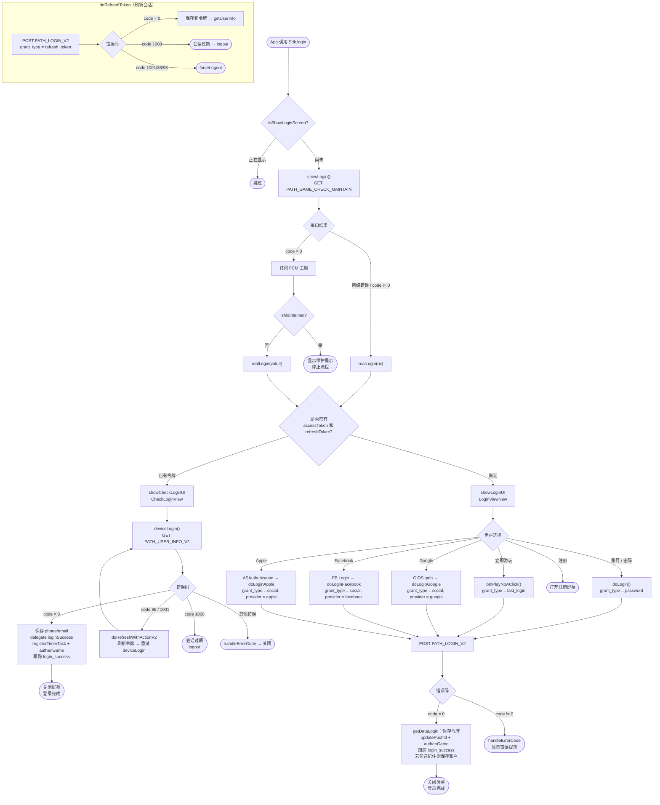

# 登录流程 – iTapSdk (sdk-game-ios-v3)

本文档描述 SDK 的登录流程，基于实际代码整理而成：
`Sdk+Authentication.swift`、`CheckLoginView.swift`、`LoginViewNew.swift`、`LoginWrapper.swift`。

## 总体流程图

## 详细说明

### 1. 入口 – `login()` / `showLogin()`

当 app 调用 `Sdk.login()` 时，SDK 会检查 `isShowLoginScreen` 标志以避免
重复打开屏幕。若尚未显示，`showLogin()` 会调用维护检查接口
`PATH_GAME_CHECK_MAINTAIN`（GET），参数为 `packageId`、`channel`、`version`。

- 若接口**出错**或返回 `code != 0` → 直接调用 `realLogin(nil)`。
- 若 `code = 0` → 订阅返回的 FCM 主题，然后检查 `isMaintained`：
  - `isMaintained = true` → 显示维护提示并**停止**流程。
  - `isMaintained = false` → 调用 `realLogin(value)`。

### 2. 分支处理 – `realLogin()`

根据设备是否已保存令牌来判断：

- **已有 `accessToken` 和 `refreshToken`** → `showCheckLoginUI()`（打开 `CheckLoginView`），
  自动重新登录，无需用户操作。
- **尚无令牌** → `showLoginUI()`（打开 `LoginViewNew`）让用户选择登录方式。

### 3. 自动重新登录 – `CheckLoginView.deviceLogin()`

调用 `PATH_USER_INFO_V2`（GET），携带 Bearer accessToken：

- `code = 0`：保存 `phone`/`email`，调用 delegate `loginSuccess(userInfo, accessToken, refreshToken)`，
  执行 `registerTimerTask()`、`authenGame()`、`updatePushId()` 并跟踪 `login_success`（类型 `Refresh`）。
- `code = 86` 或 `1001`：调用 `doRefreshWithActionV2` 刷新令牌后**重试** `deviceLogin()`。
- `code = 1008`：会话过期 → `Sdk.logout()`。
- 其他错误：`handleErrorCode` 显示提示后关闭屏幕。

### 4. 登录屏幕 – `LoginViewNew`

用户可选择以下方式之一，全部调用同一接口 `PATH_LOGIN_V2`（POST）：

| 方式 | 处理函数 | `grant_type` | 备注 |
|---|---|---|---|
| 账号 / 密码 | `doLogin()` | `password` | 可选记住账户（密码使用 AES-256 加密） |
| 立即游玩 | `btnPlayNowClick()` | `fast_login` | 附带随机 `nonce` |
| Google | `doLoginGoogle()` | `social` | `provider = google`，令牌来自 `GIDSignIn` |
| Facebook | `doLoginFacebook()` | `social` | `provider = facebook` / `facebook_limited` |
| Apple | `doLoginApple()` | `social` | `provider = apple`，通过 `ASAuthorization` |
| 注册 | `btnRegisterClick()` | – | 打开注册屏幕 |

Apple / Facebook / Google 社交登录按钮只在配置中启用时才显示
（`enableAppleLogin`、`enableFacebookLogin`、`enableGoogleLogin`），按钮
顺序会根据用户最近使用的登录方式重新排列。

当 `PATH_LOGIN_V2` 返回：

- `code = 0`：`getDataLogin()` 保存令牌，调用 `updatePushId()`、`authenGame()`，
  跟踪 `login_success`，若用户勾选"记住"则保存账户，然后关闭屏幕。
- `code != 0`：`handleErrorCode` 显示对应的错误提示。

### 5. 刷新会话 – `doRefreshToken()`

在令牌过期时通用调用：调用 `PATH_LOGIN_V2`，参数 `grant_type = refresh_token`。

- `code = 0`：保存新的令牌组后调用 `getUserInfo()`。
- `code = 1008`：显示会话过期提示 → `logout()`。
- `code = 1001 / 85 / 98`：`forceLogout()`。

## 使用的接口

- `PATH_GAME_CHECK_MAINTAIN` – 检查维护状态（GET）
- `PATH_LOGIN_V2` – 登录 / 刷新令牌（POST，通过 `grant_type` 区分）
- `PATH_USER_INFO_V2` – 获取用户信息（GET）
- `PATH_GAME_AUTH` – 登录后进行游戏验证（`authenGame`）
- `PATH_LOGOUT` – 登出

## 重要错误码

- `CODE_0` – 成功
- `CODE_86`、`CODE_1001` – 令牌需要刷新（尝试刷新后重试）
- `CODE_1008` – 登录会话过期 → logout
- `CODE_1001 / 85 / 98` – 强制登出（`forceLogout`）
